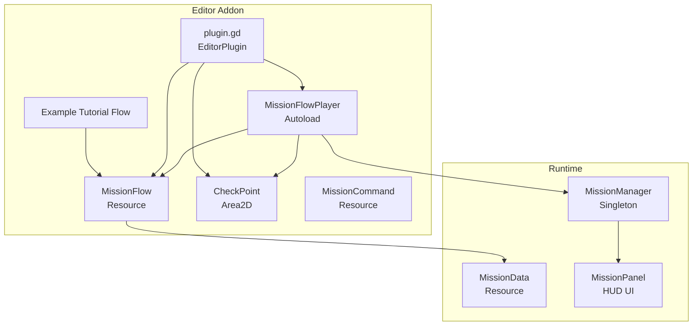
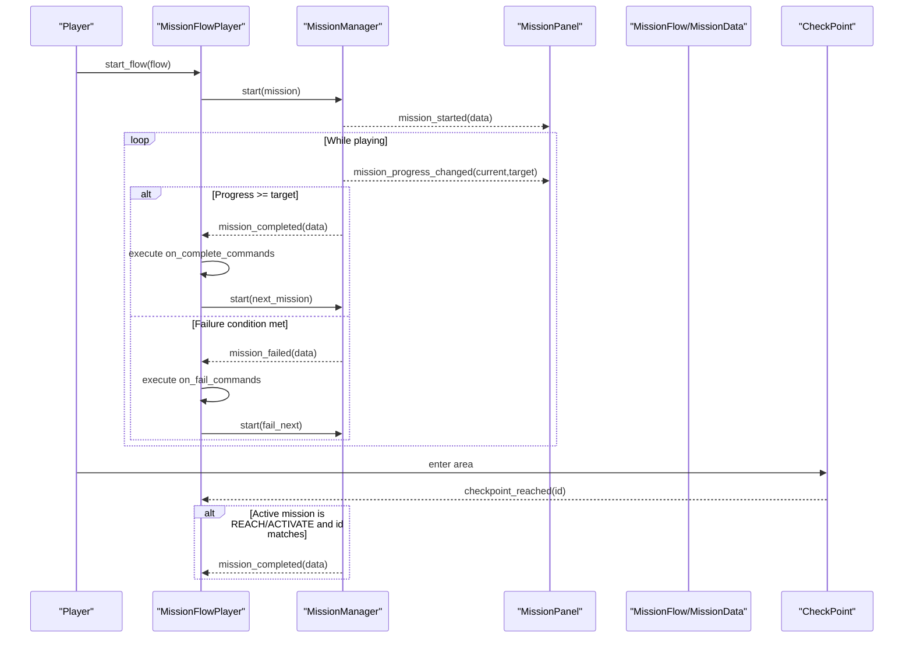
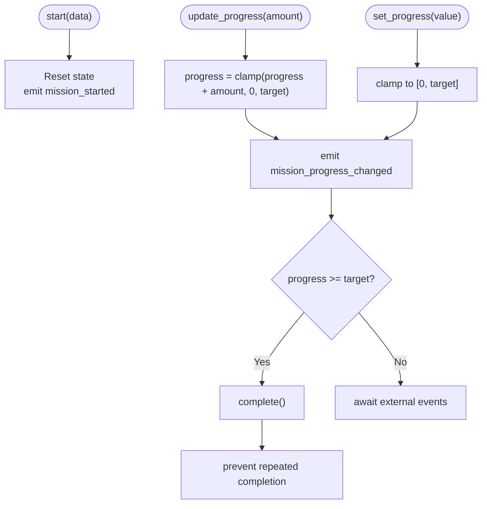
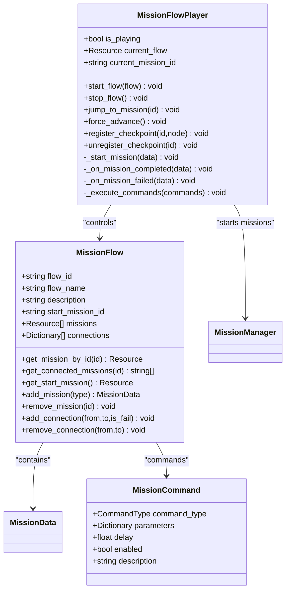
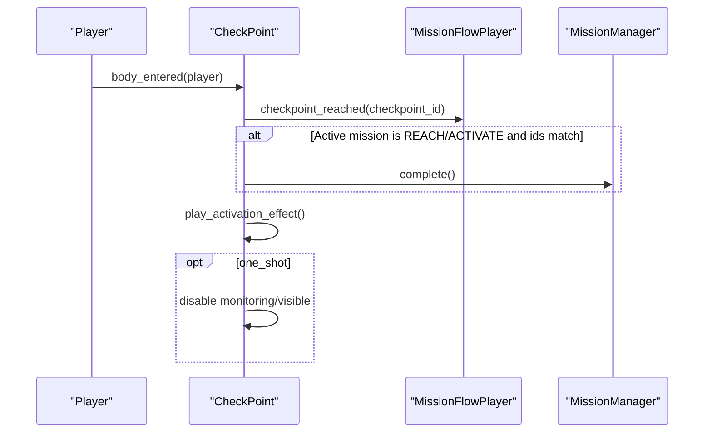
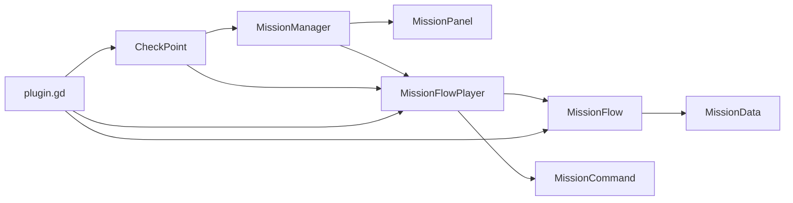

# Mission System

<cite>
**Referenced Files in This Document**
- [mission_manager.gd](file://Scripts/mission_manager.gd)
- [mission_data.gd](file://Scripts/mission_data.gd)
- [mission_panel.gd](file://Scripts/mission_panel.gd)
- [plugin.gd](file://addons/mission_editor/plugin.gd)
- [mission_flow.gd](file://addons/mission_editor/mission_flow.gd)
- [mission_flow_player.gd](file://addons/mission_editor/mission_flow_player.gd)
- [checkpoint.gd](file://addons/mission_editor/checkpoint.gd)
- [mission_command.gd](file://addons/mission_editor/mission_command.gd)
- [example_tutorial_flow.gd](file://addons/mission_editor/examples/example_tutorial_flow.gd)
- [creazionemissioni.md](file://creazionemissioni.md)
- [GUIDA.md](file://addons/mission_editor/GUIDA.md)
- [dev_map_tutorial.gd](file://Scripts/dev_map_tutorial.gd)
</cite>

## Table of Contents
1. [Introduction](#introduction)
2. [Project Structure](#project-structure)
3. [Core Components](#core-components)
4. [Architecture Overview](#architecture-overview)
5. [Detailed Component Analysis](#detailed-component-analysis)
6. [Dependency Analysis](#dependency-analysis)
7. [Performance Considerations](#performance-considerations)
8. [Troubleshooting Guide](#troubleshooting-guide)
9. [Conclusion](#conclusion)
10. [Appendices](#appendices)

## Introduction
This document describes the Mission System in TFA Agents, covering the runtime mission engine, the visual mission flow editor, and the UI panel that displays progress and outcomes. It explains mission data structures, objective types, progression logic, branching, checkpoint management, dynamic objective generation, and integration with gameplay mechanics. It also documents the mission editor addon for visual mission creation and flow scripting, and provides practical examples and best practices.

## Project Structure
The mission system spans three primary areas:
- Runtime engine: MissionManager singleton, MissionData resource, and MissionPanel UI
- Mission flow editor addon: plugin, MissionFlow container, MissionFlowPlayer runtime, CheckPoint nodes, and MissionCommand actions
- Documentation and examples: internal guides and a tutorial flow

**Diagram sources**
- [mission_manager.gd:18-27](file://Scripts/mission_manager.gd#L18-L27)
- [mission_data.gd:4-15](file://Scripts/mission_data.gd#L4-L15)
- [mission_panel.gd:4-15](file://Scripts/mission_panel.gd#L4-L15)
- [plugin.gd:5-47](file://addons/mission_editor/plugin.gd#L5-L47)
- [mission_flow_player.gd:10-23](file://addons/mission_editor/mission_flow_player.gd#L10-L23)
- [mission_flow.gd:5-25](file://addons/mission_editor/mission_flow.gd#L5-L25)
- [checkpoint.gd:6-35](file://addons/mission_editor/checkpoint.gd#L6-L35)
- [mission_command.gd:5-20](file://addons/mission_editor/mission_command.gd#L5-L20)
- [example_tutorial_flow.gd:10-153](file://addons/mission_editor/examples/example_tutorial_flow.gd#L10-L153)

**Section sources**
- [creazionemissioni.md:1-292](file://creazionemissioni.md#L1-L292)
- [GUIDA.md:1-433](file://addons/mission_editor/GUIDA.md#L1-L433)

## Core Components
- MissionManager: Singleton that starts, updates, completes, fails, and clears missions; emits signals consumed by the HUD and flow player.
- MissionData: Resource describing a single mission with type, label, target, branching fields, commands, and optional time limit.
- MissionPanel: HUD component that listens to MissionManager signals and renders progress, status, and animations.
- MissionFlow: Container resource holding a graph of missions, entry point, and explicit connections.
- MissionFlowPlayer: Autoload that runs a MissionFlow, handles branching, executes commands, manages checkpoints, and timers.
- CheckPoint: Area2D node for REACH/ACTIVATE objectives; triggers completion and optional activation effects.
- MissionCommand: Resource representing executable actions on mission completion/failure.
- Example Tutorial Flow: Prebuilt flow demonstrating branching and commands.

**Section sources**
- [mission_manager.gd:18-169](file://Scripts/mission_manager.gd#L18-L169)
- [mission_data.gd:4-66](file://Scripts/mission_data.gd#L4-L66)
- [mission_panel.gd:4-359](file://Scripts/mission_panel.gd#L4-L359)
- [mission_flow.gd:5-134](file://addons/mission_editor/mission_flow.gd#L5-L134)
- [mission_flow_player.gd:10-379](file://addons/mission_editor/mission_flow_player.gd#L10-L379)
- [checkpoint.gd:6-231](file://addons/mission_editor/checkpoint.gd#L6-L231)
- [mission_command.gd:5-98](file://addons/mission_editor/mission_command.gd#L5-L98)
- [example_tutorial_flow.gd:10-153](file://addons/mission_editor/examples/example_tutorial_flow.gd#L10-L153)

## Architecture Overview
The runtime architecture centers on MissionManager and MissionPanel, with MissionFlowPlayer orchestrating flows and integrating with the editor’s MissionData and MissionCommand resources.

**Diagram sources**
- [mission_flow_player.gd:87-194](file://addons/mission_editor/mission_flow_player.gd#L87-L194)
- [mission_manager.gd:50-99](file://Scripts/mission_manager.gd#L50-L99)
- [mission_panel.gd:53-168](file://Scripts/mission_panel.gd#L53-L168)
- [checkpoint.gd:114-149](file://addons/mission_editor/checkpoint.gd#L114-L149)
- [mission_flow.gd:28-54](file://addons/mission_editor/mission_flow.gd#L28-L54)

## Detailed Component Analysis

### MissionManager
Responsibilities:
- Start missions, update/set progress, complete/fail/clear
- Emit signals for HUD and flow player consumption
- Provide factory helpers for common mission types

Key behaviors:
- Enforces a single active mission; starting a new mission replaces the current one
- Auto-completes when progress reaches target for counted missions
- Exposes read-only properties for active mission and progress

**Diagram sources**
- [mission_manager.gd:50-99](file://Scripts/mission_manager.gd#L50-L99)

**Section sources**
- [mission_manager.gd:18-169](file://Scripts/mission_manager.gd#L18-L169)

### MissionData
MissionData defines a single mission with:
- Type enumeration (ELIMINATE, COLLECT, REACH, ACTIVATE, SURVIVE, CUSTOM)
- Label, description, target, mission_id, accent color
- Optional progress bar toggle
- Flow control fields: on_success_next, on_fail_next, on_complete_commands, on_fail_commands, fail_condition, time_limit
- Graph metadata: graph_position, tags

Usage:
- Used directly or via MissionManager factory helpers
- Consumed by MissionFlowPlayer to drive branching and commands

**Section sources**
- [mission_data.gd:4-66](file://Scripts/mission_data.gd#L4-L66)

### MissionPanel
MissionPanel integrates with MissionManager signals to render:
- Mission label and accent color
- Numeric counter or progress bar depending on mission type
- Status messages ("COMPLETED", "FAILED")
- Animated transitions and shader-driven visuals
- Style overrides for active/completed/failed states

Quality-aware animations:
- Slide-in/slide-out
- Completion and failure flash effects
- Shader parameters synchronized per-state

**Section sources**
- [mission_panel.gd:4-359](file://Scripts/mission_panel.gd#L4-L359)

### MissionFlow and MissionFlowPlayer
MissionFlow:
- Holds flow_id, flow_name, description, start_mission_id
- Contains missions array and explicit connections
- Provides helpers to add/remove missions and manage connections

MissionFlowPlayer:
- Starts/stops flows, tracks current mission, and time remaining
- Subscribes to MissionManager completion/failure to branch and execute commands
- Manages checkpoints, enabling/disabling them by id
- Supports jumping to specific missions and forcing advancement

**Diagram sources**
- [mission_flow.gd:5-134](file://addons/mission_editor/mission_flow.gd#L5-L134)
- [mission_flow_player.gd:10-379](file://addons/mission_editor/mission_flow_player.gd#L10-L379)
- [mission_command.gd:5-98](file://addons/mission_editor/mission_command.gd#L5-L98)

**Section sources**
- [mission_flow.gd:5-134](file://addons/mission_editor/mission_flow.gd#L5-L134)
- [mission_flow_player.gd:10-379](file://addons/mission_editor/mission_flow_player.gd#L10-L379)
- [mission_command.gd:5-98](file://addons/mission_editor/mission_command.gd#L5-L98)

### CheckPoint
CheckPoint is a configurable Area2D:
- Exposes checkpoint_id, one_shot, radius, color, auto-complete flags, and optional display label
- Registers itself with MissionFlowPlayer at runtime
- Emits checkpoint_reached signal and optionally auto-completes active REACH/ACTIVATE missions whose ids match
- Provides visual feedback and optional reset

**Diagram sources**
- [checkpoint.gd:114-149](file://addons/mission_editor/checkpoint.gd#L114-L149)
- [mission_flow_player.gd:133-141](file://addons/mission_editor/mission_flow_player.gd#L133-L141)

**Section sources**
- [checkpoint.gd:6-231](file://addons/mission_editor/checkpoint.gd#L6-L231)

### Mission Editor Addon (plugin.gd)
The editor plugin:
- Adds MissionFlowPlayer autoload if missing
- Registers CheckPoint as a custom node type
- Creates and docks the MissionFlowEditor UI
- Provides handlers for saving/loading .tres resources

**Section sources**
- [plugin.gd:5-109](file://addons/mission_editor/plugin.gd#L5-L109)

### Example Tutorial Flow
The example demonstrates:
- Creating a flow programmatically
- Using branching (success/fail)
- Adding commands (sound, dialog, scene change)
- Setting time limits and mission types

**Section sources**
- [example_tutorial_flow.gd:10-153](file://addons/mission_editor/examples/example_tutorial_flow.gd#L10-L153)

## Dependency Analysis
- MissionPanel depends on MissionManager signals and GlobalSettings for quality settings
- MissionFlowPlayer depends on MissionManager for mission lifecycle and on MissionFlow for structure
- CheckPoint depends on MissionFlowPlayer for registration and on MissionManager for completion
- MissionCommand is consumed by MissionFlowPlayer during branching
- Editor plugin depends on MissionFlowPlayer autoload and registers custom node types

**Diagram sources**
- [mission_panel.gd:44-48](file://Scripts/mission_panel.gd#L44-L48)
- [mission_flow_player.gd:53-64](file://addons/mission_editor/mission_flow_player.gd#L53-L64)
- [mission_flow.gd:20-25](file://addons/mission_editor/mission_flow.gd#L20-L25)
- [checkpoint.gd:86-93](file://addons/mission_editor/checkpoint.gd#L86-L93)
- [plugin.gd:15-32](file://addons/mission_editor/plugin.gd#L15-L32)

**Section sources**
- [mission_panel.gd:28-48](file://Scripts/mission_panel.gd#L28-L48)
- [mission_flow_player.gd:53-64](file://addons/mission_editor/mission_flow_player.gd#L53-L64)
- [checkpoint.gd:86-93](file://addons/mission_editor/checkpoint.gd#L86-L93)
- [plugin.gd:15-32](file://addons/mission_editor/plugin.gd#L15-L32)

## Performance Considerations
- Prefer emitting signals only when needed; avoid excessive progress updates for large targets
- Use group-based polling sparingly; cache counts and poll at intervals
- Keep HUD animations at appropriate quality levels to balance visual fidelity and performance
- Limit concurrent audio players spawned by commands
- Use MissionData tags and graph positions to organize flows and reduce lookup overhead

## Troubleshooting Guide
Common issues and resolutions:
- HUD not appearing: ensure MissionPanel is attached to the correct node and connected to MissionManager signals
- Missions not advancing: verify branching fields (on_success_next/on_fail_next) and that MissionManager.complete() is triggered
- CheckPoints not working: confirm checkpoint_id matches active mission and CheckPoint is registered with MissionFlowPlayer
- Commands not executing: check MissionCommand.enabled flag and parameter correctness
- Flow not starting: ensure MissionFlowPlayer is in autoload and start_flow is called with a valid MissionFlow

**Section sources**
- [mission_panel.gd:44-48](file://Scripts/mission_panel.gd#L44-L48)
- [mission_flow_player.gd:87-131](file://addons/mission_editor/mission_flow_player.gd#L87-L131)
- [checkpoint.gd:114-149](file://addons/mission_editor/checkpoint.gd#L114-L149)
- [mission_command.gd:42-45](file://addons/mission_editor/mission_command.gd#L42-L45)

## Conclusion
The Mission System combines a robust runtime engine (MissionManager, MissionData, MissionPanel) with a powerful visual flow editor (MissionFlow, MissionFlowPlayer, CheckPoint, MissionCommand). Together they enable designers and developers to create branching narratives, dynamic objectives, and integrated gameplay mechanics with minimal code, while maintaining flexibility for advanced customization.

## Appendices

### Mission Types and Completion Conditions
- ELIMINATE/COLLECT: progress driven by groups; completion when progress meets target
- REACH/ACTIVATE: boolean completion via CheckPoint or explicit call
- SURVIVE: progress driven by time; completion when progress meets target
- CUSTOM: progress managed externally; completion when progress meets target
- Time limit: causes failure when reached

**Section sources**
- [mission_data.gd:7-15](file://Scripts/mission_data.gd#L7-L15)
- [mission_manager.gd:56-66](file://Scripts/mission_manager.gd#L56-L66)

### Mission Panel UI Elements and Styles
- Nodes: MissionPanelInner, MissionLabel, MissionCounter, MissionProgressBar, MissionStatus, MissionAnim
- Styles: style_active, style_completed, style_failed
- Shader parameters: mission_state, state_time, fill_pct

**Section sources**
- [mission_panel.gd:10-20](file://Scripts/mission_panel.gd#L10-L20)
- [mission_panel.gd:324-358](file://Scripts/mission_panel.gd#L324-L358)

### Example: Tutorial Flow Integration
- Load and start the example flow via MissionFlowPlayer
- Observe branching and command execution
- Customize missions and commands in the editor

**Section sources**
- [example_tutorial_flow.gd:14-153](file://addons/mission_editor/examples/example_tutorial_flow.gd#L14-L153)
- [dev_map_tutorial.gd:60-192](file://Scripts/dev_map_tutorial.gd#L60-L192)