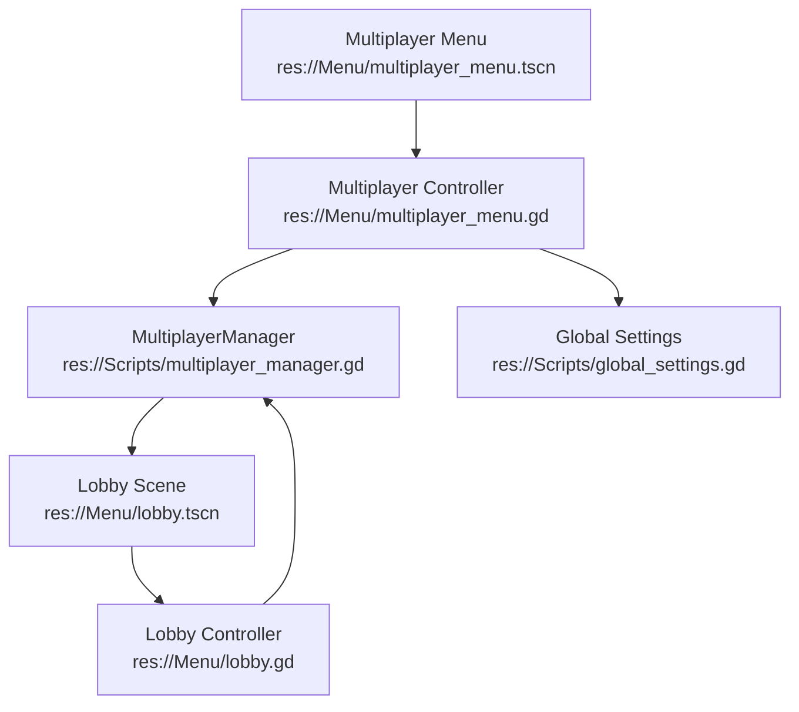
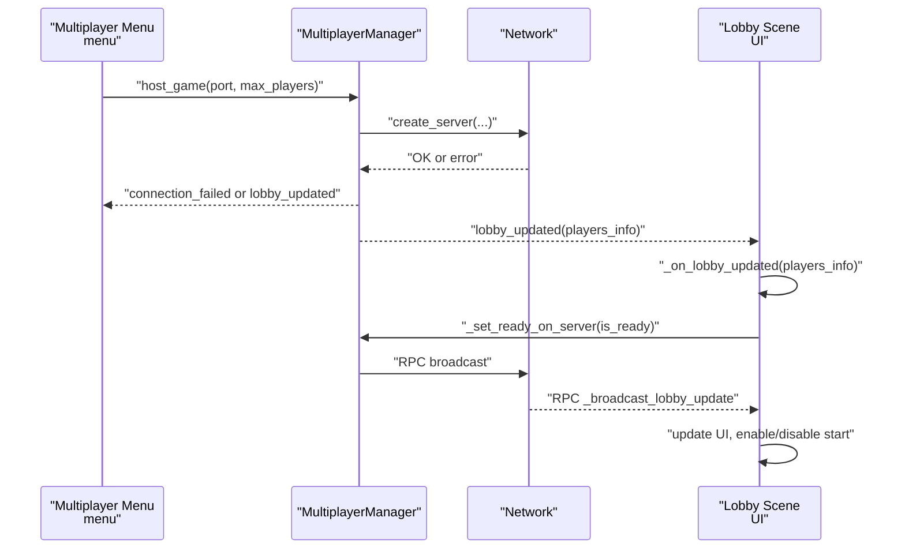
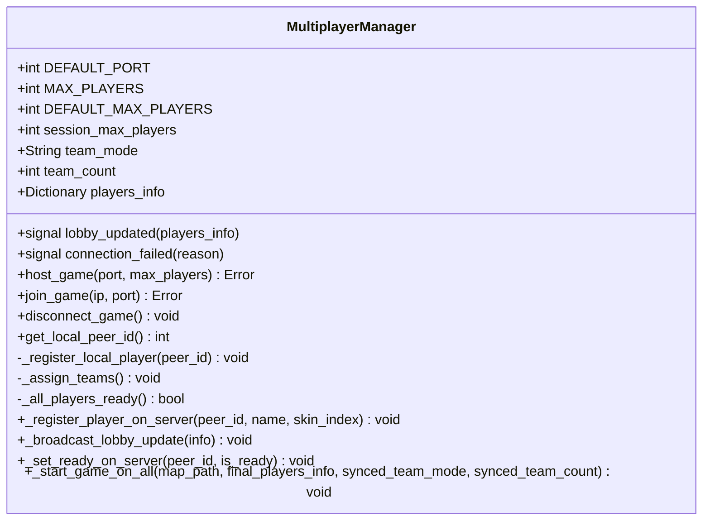
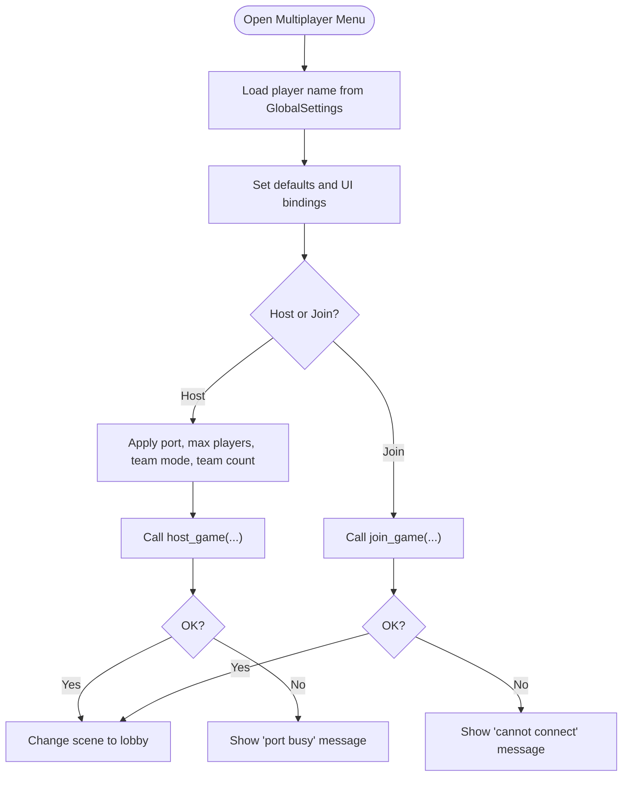
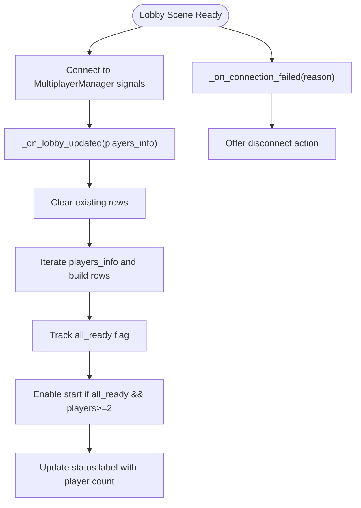
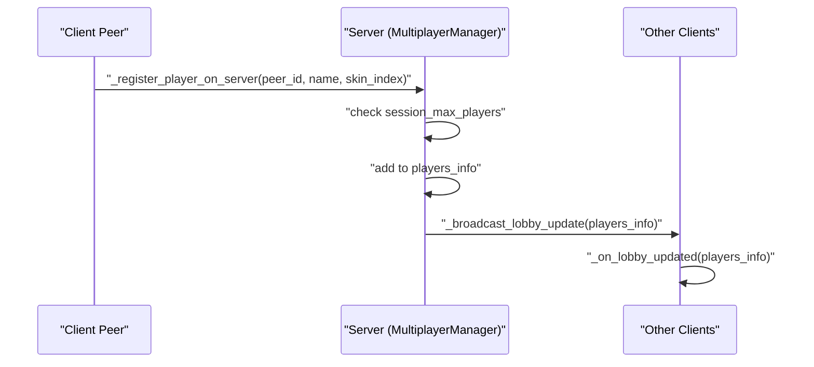
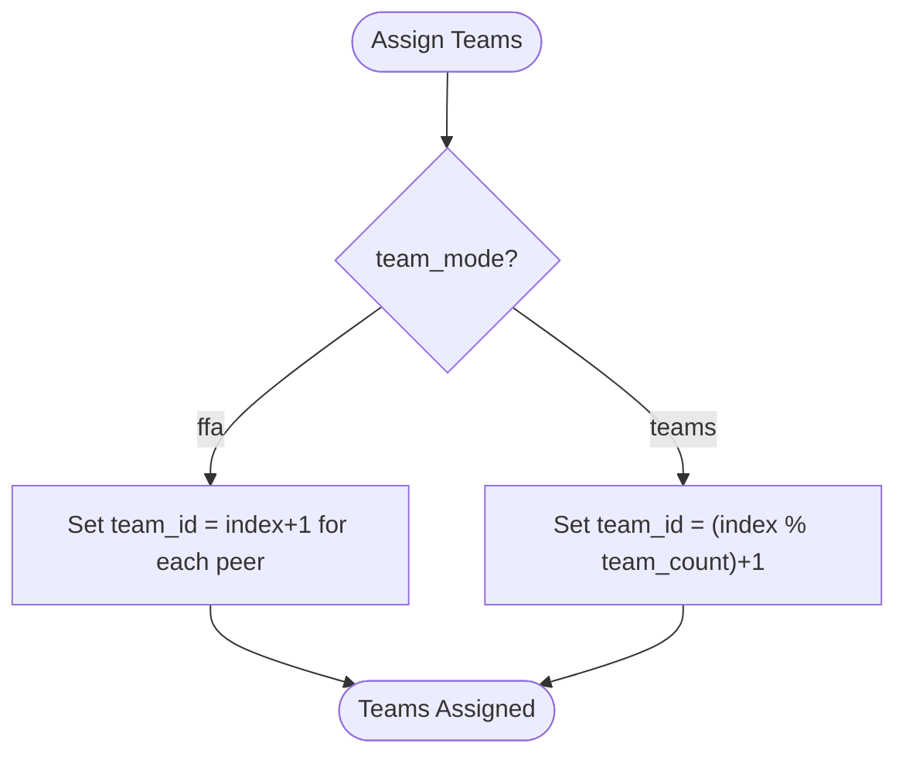
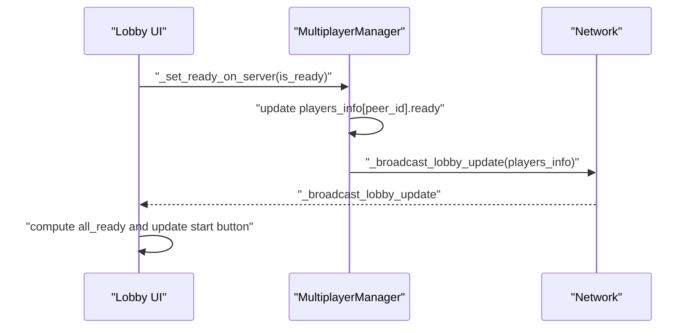
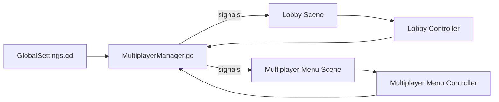

# Lobby Management

<cite>
**Referenced Files in This Document**
- [lobby.gd](file://Menu/lobby.gd)
- [lobby.tscn](file://Menu/lobby.tscn)
- [multiplayer_menu.gd](file://Menu/multiplayer_menu.gd)
- [multiplayer_menu.tscn](file://Menu/multiplayer_menu.tscn)
- [multiplayer_manager.gd](file://Scripts/multiplayer_manager.gd)
- [global_settings.gd](file://Scripts/global_settings.gd)
</cite>

## Table of Contents
1. [Introduction](#introduction)
2. [Project Structure](#project-structure)
3. [Core Components](#core-components)
4. [Architecture Overview](#architecture-overview)
5. [Detailed Component Analysis](#detailed-component-analysis)
6. [Dependency Analysis](#dependency-analysis)
7. [Performance Considerations](#performance-considerations)
8. [Troubleshooting Guide](#troubleshooting-guide)
9. [Conclusion](#conclusion)

## Introduction
This document describes the Lobby Management System used by TFA Agents for organizing multiplayer sessions. It covers how lobbies are created, how players register and join, how rooms are managed, and how lobby state is synchronized across clients. It also documents team assignment, readiness checks, UI components for player lists and lobby controls, configuration options (player limits, host privileges), persistence of player preferences, and error recovery procedures. Debugging tips and common connection issues are included to help diagnose problems.

## Project Structure
The lobby system spans UI scenes and scripts under Menu and Scripts:
- Menu/lobby.tscn and Menu/lobby.gd: Lobby scene and controller
- Menu/multiplayer_menu.tscn and Menu/multiplayer_menu.gd: Multiplayer menu for hosting/joining sessions
- Scripts/multiplayer_manager.gd: Central multiplayer logic, lobby state, and RPCs
- Scripts/global_settings.gd: Persistent storage for player preferences (e.g., player name)

**Diagram sources**
- [multiplayer_manager.gd](file://Scripts/multiplayer_manager.gd)
- [lobby.tscn](file://Menu/lobby.tscn)
- [lobby.gd](file://Menu/lobby.gd)
- [multiplayer_menu.tscn](file://Menu/multiplayer_menu.tscn)
- [multiplayer_menu.gd](file://Menu/multiplayer_menu.gd)
- [global_settings.gd](file://Scripts/global_settings.gd)

**Section sources**
- [multiplayer_menu.gd:1-120](file://Menu/multiplayer_menu.gd#L1-L120)
- [multiplayer_manager.gd:1-120](file://Scripts/multiplayer_manager.gd#L1-L120)
- [lobby.gd:1-80](file://Menu/lobby.gd#L1-L80)
- [multiplayer_menu.tscn:1-160](file://Menu/multiplayer_menu.tscn#L1-L160)
- [lobby.tscn:1-200](file://Menu/lobby.tscn#L1-L200)
- [global_settings.gd:1-120](file://Scripts/global_settings.gd#L1-L120)

## Core Components
- MultiplayerManager: Hosts games, manages session configuration (port, max players, team mode), tracks players, assigns teams, broadcasts lobby updates, and handles readiness and start conditions.
- Multiplayer Menu: Provides UI to configure and launch hosted sessions or join existing ones, including player name persistence.
- Lobby Scene: Displays current players, readiness indicators, and start button; reacts to lobby updates and connection failures.
- Player Registration: Automatically registers peers upon connection and enforces session capacity.
- Team Assignment: Supports “teams” and “FFA” modes with round-robin distribution.
- Readiness Checking: Start button enabled only when all players are ready and minimum player threshold is met.
- Persistence: Player name loaded from GlobalSettings on startup.

**Section sources**
- [multiplayer_manager.gd:1-120](file://Scripts/multiplayer_manager.gd#L1-L120)
- [multiplayer_manager.gd:180-270](file://Scripts/multiplayer_manager.gd#L180-L270)
- [multiplayer_menu.gd:1-120](file://Menu/multiplayer_menu.gd#L1-L120)
- [lobby.gd:1-80](file://Menu/lobby.gd#L1-L80)
- [global_settings.gd:1-120](file://Scripts/global_settings.gd#L1-L120)

## Architecture Overview
The lobby system uses a client-server model with reliable RPCs to synchronize lobby state. The host (server) maintains authoritative session configuration and player state, while clients receive updates and reflect readiness and player counts.

**Diagram sources**
- [multiplayer_menu.gd:60-98](file://Menu/multiplayer_menu.gd#L60-L98)
- [multiplayer_manager.gd:70-110](file://Scripts/multiplayer_manager.gd#L70-L110)
- [multiplayer_manager.gd:220-270](file://Scripts/multiplayer_manager.gd#L220-L270)
- [lobby.gd:1-80](file://Menu/lobby.gd#L1-L80)

## Detailed Component Analysis

### Multiplayer Manager
Responsibilities:
- Host and join games, manage ports and max players
- Track players with name, team_id, ready flag, and skin index
- Assign teams based on selected mode
- Broadcast lobby updates to clients
- Enforce session capacity and readiness thresholds
- Emit signals for UI updates and failure notifications

Key behaviors:
- Session configuration: port, max players, team mode, and team count
- Player registration on connect with capacity check
- Team assignment for “teams” (round-robin) and “ffa”
- Readiness propagation via RPC and centralized check
- Start condition: all players ready and at least two players present

**Diagram sources**
- [multiplayer_manager.gd:1-120](file://Scripts/multiplayer_manager.gd#L1-L120)
- [multiplayer_manager.gd:180-320](file://Scripts/multiplayer_manager.gd#L180-L320)

**Section sources**
- [multiplayer_manager.gd:1-120](file://Scripts/multiplayer_manager.gd#L1-L120)
- [multiplayer_manager.gd:180-320](file://Scripts/multiplayer_manager.gd#L180-L320)

### Multiplayer Menu
Responsibilities:
- Configure lobby parameters (port, max players, team mode, team count)
- Persist player name via GlobalSettings
- Host or join sessions and navigate to lobby scene on success
- Display status messages and handle errors

Configuration highlights:
- Port defaults to MultiplayerManager.DEFAULT_PORT
- Max players slider clamped to MultiplayerManager.MAX_PLAYERS
- Team mode toggles between “teams” and “ffa”; team count spin visible only for “teams”
- Player name loaded from GlobalSettings on ready

**Diagram sources**
- [multiplayer_menu.gd:20-120](file://Menu/multiplayer_menu.gd#L20-L120)
- [multiplayer_menu.tscn:1-160](file://Menu/multiplayer_menu.tscn#L1-L160)
- [global_settings.gd:1-120](file://Scripts/global_settings.gd#L1-L120)

**Section sources**
- [multiplayer_menu.gd:1-120](file://Menu/multiplayer_menu.gd#L1-L120)
- [multiplayer_menu.tscn:1-160](file://Menu/multiplayer_menu.tscn#L1-L160)
- [global_settings.gd:1-120](file://Scripts/global_settings.gd#L1-L120)

### Lobby Scene
Responsibilities:
- Render player rows with readiness status and host privileges
- Enable/disable start button based on readiness and player count
- Reflect current number of connected players
- Handle connection failures and offer disconnect option

UI highlights:
- Player list built dynamically from players_info
- Ready label color-coded per readiness
- Start button disabled until all players ready and minimum threshold met
- Status label shows current player count

**Diagram sources**
- [lobby.gd:1-80](file://Menu/lobby.gd#L1-L80)
- [lobby.tscn:1-200](file://Menu/lobby.tscn#L1-L200)

**Section sources**
- [lobby.gd:1-80](file://Menu/lobby.gd#L1-L80)
- [lobby.tscn:1-200](file://Menu/lobby.tscn#L1-L200)

### Player Registration and Room Management
- On connect, server-side RPC registers new peers with name, initial team_id=0, ready=false, and skin index
- Capacity check prevents exceeding session_max_players
- Host sets authoritative team assignments before start
- All clients receive synchronized players_info via broadcast

**Diagram sources**
- [multiplayer_manager.gd:220-270](file://Scripts/multiplayer_manager.gd#L220-L270)

**Section sources**
- [multiplayer_manager.gd:220-270](file://Scripts/multiplayer_manager.gd#L220-L270)

### Team Assignment Mechanisms
- Mode “ffa”: each player in their own team (1..N)
- Mode “teams”: round-robin assignment across team_count
- Host performs assignment prior to enabling start

**Diagram sources**
- [multiplayer_manager.gd:199-210](file://Scripts/multiplayer_manager.gd#L199-L210)

**Section sources**
- [multiplayer_manager.gd:199-210](file://Scripts/multiplayer_manager.gd#L199-L210)

### Readiness Checking System
- Clients toggle readiness via RPC to server
- Server updates players_info and re-broadcasts
- Local UI computes all_ready and enables/disables start accordingly

**Diagram sources**
- [multiplayer_manager.gd:253-261](file://Scripts/multiplayer_manager.gd#L253-L261)
- [lobby.gd:40-60](file://Menu/lobby.gd#L40-L60)

**Section sources**
- [multiplayer_manager.gd:253-261](file://Scripts/multiplayer_manager.gd#L253-L261)
- [lobby.gd:40-60](file://Menu/lobby.gd#L40-L60)

### Lobby UI Components and Player List Management
- Dynamic player rows built from players_info
- Ready status displayed with color-coded labels
- Host privileges indicated by local peer id comparison
- Start button disabled until readiness and minimum player threshold

**Section sources**
- [lobby.gd:40-80](file://Menu/lobby.gd#L40-L80)

### Examples of Lobby Configuration
- Hosted session configuration:
  - Port: configurable with default from MultiplayerManager
  - Max players: slider bound to system limits
  - Team mode: “teams” or “ffa”
  - Team count: visible only for “teams”
- Player limits enforced server-side during registration
- Host privileges:
  - Host sets team assignments
  - Host triggers start after readiness and thresholds

**Section sources**
- [multiplayer_menu.gd:30-78](file://Menu/multiplayer_menu.gd#L30-L78)
- [multiplayer_manager.gd:70-110](file://Scripts/multiplayer_manager.gd#L70-L110)
- [multiplayer_manager.gd:199-210](file://Scripts/multiplayer_manager.gd#L199-L210)

### Persistence and Session Cleanup
- Player name persistence:
  - Loaded from GlobalSettings on menu ready
  - Used when registering players on connect
- Session cleanup:
  - Disconnect triggers cleanup and navigation to main menu
  - Connection failures emit signals for UI to handle

**Section sources**
- [multiplayer_menu.gd:47-53](file://Menu/multiplayer_menu.gd#L47-L53)
- [multiplayer_manager.gd:109-115](file://Scripts/multiplayer_manager.gd#L109-L115)
- [multiplayer_manager.gd:298-307](file://Scripts/multiplayer_manager.gd#L298-L307)

## Dependency Analysis
- Multiplayer Menu depends on MultiplayerManager for hosting/joining and on GlobalSettings for player name persistence.
- Lobby Scene depends on MultiplayerManager for lobby updates and readiness signals.
- MultiplayerManager encapsulates network logic and RPCs, emitting signals consumed by UI controllers.

**Diagram sources**
- [multiplayer_menu.gd:1-120](file://Menu/multiplayer_menu.gd#L1-L120)
- [multiplayer_manager.gd:1-120](file://Scripts/multiplayer_manager.gd#L1-L120)
- [lobby.gd:1-80](file://Menu/lobby.gd#L1-L80)
- [global_settings.gd:1-120](file://Scripts/global_settings.gd#L1-L120)

**Section sources**
- [multiplayer_menu.gd:1-120](file://Menu/multiplayer_menu.gd#L1-L120)
- [multiplayer_manager.gd:1-120](file://Scripts/multiplayer_manager.gd#L1-L120)
- [lobby.gd:1-80](file://Menu/lobby.gd#L1-L80)
- [global_settings.gd:1-120](file://Scripts/global_settings.gd#L1-L120)

## Performance Considerations
- Minimizing UI rebuilds: The lobby refreshes the entire player list on each update; consider virtualizing long lists if player counts grow large.
- Reliable RPCs: Lobby updates and readiness changes use reliable delivery; keep payload sizes small to reduce bandwidth pressure.
- Readiness checks: Centralized all-ready computation avoids redundant per-client checks.
- Team assignment: Round-robin is O(N); acceptable for typical player counts but monitor if N grows significantly.

## Troubleshooting Guide
Common issues and resolutions:
- Cannot host session:
  - Verify port availability; the system reports “port busy” when the chosen port is occupied.
  - Ensure session_max_players is within supported bounds.
- Cannot join session:
  - Confirm IP and port correctness; invalid entries prevent connection.
  - Check firewall/NAT if connecting across machines.
- Lobby does not update:
  - Ensure MultiplayerManager autoload is present and connected to UI signals.
  - Verify RPCs are reaching clients; network issues can delay updates.
- Start button remains disabled:
  - Requires at least two players and all players marked ready.
  - Check readiness toggles on clients and server broadcast.
- Disconnection:
  - Use disconnect action to return to main menu and clean up state.
  - Repeated connection failures emit a connection_failed signal for UI to handle.

**Section sources**
- [multiplayer_menu.gd:70-98](file://Menu/multiplayer_menu.gd#L70-L98)
- [multiplayer_manager.gd:79-99](file://Scripts/multiplayer_manager.gd#L79-L99)
- [multiplayer_manager.gd:298-307](file://Scripts/multiplayer_manager.gd#L298-L307)
- [lobby.gd:40-60](file://Menu/lobby.gd#L40-L60)

## Conclusion
The Lobby Management System integrates UI controllers with a robust MultiplayerManager that enforces session configuration, synchronizes lobby state across clients, and supports flexible team modes. Players can register automatically, set readiness, and participate in team assignments orchestrated by the host. The system provides clear feedback and error signaling to guide users through common connection issues and misconfigurations.