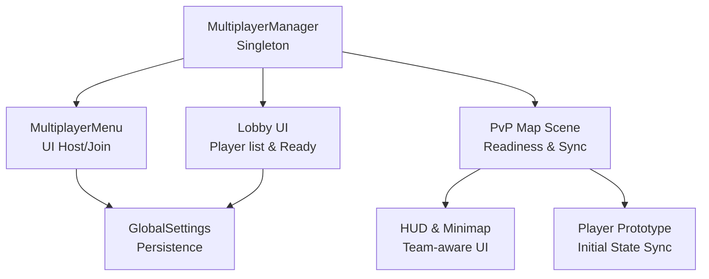
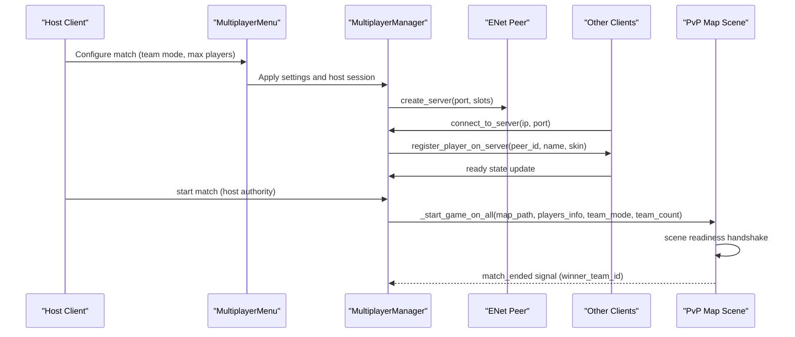
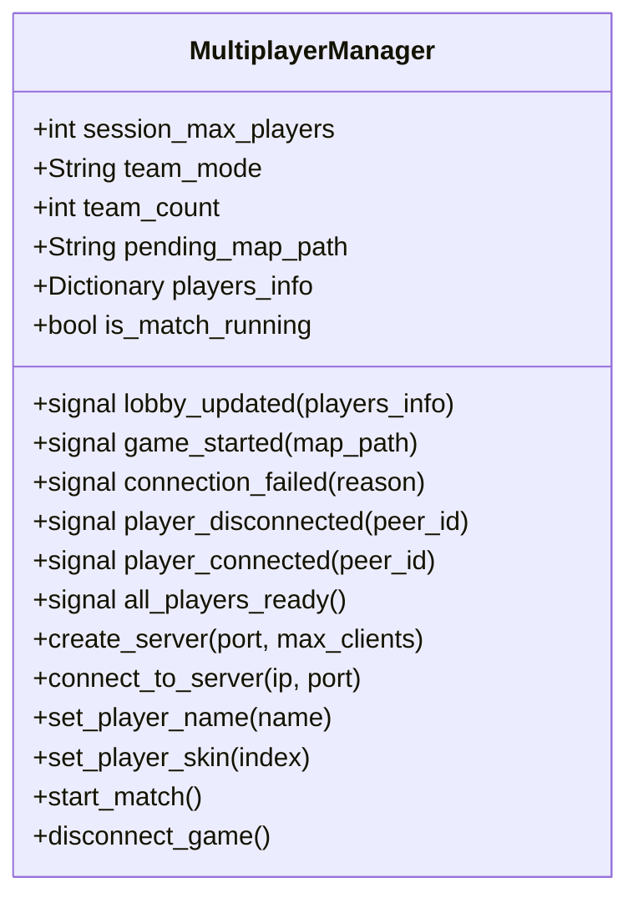
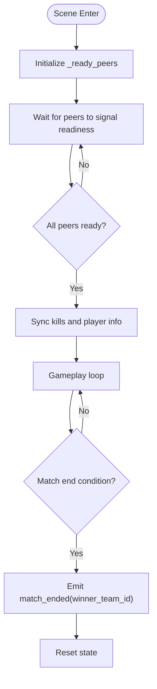
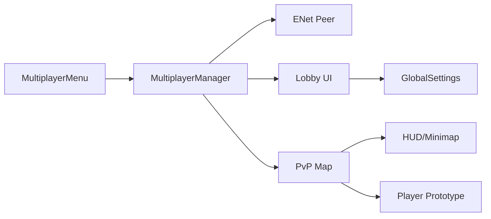

# Matchmaking System

<cite>
**Referenced Files in This Document**
- [multiplayer_manager.gd](file://Scripts/multiplayer_manager.gd)
- [multiplayer_menu.gd](file://Menu/multiplayer_menu.gd)
- [lobby.gd](file://Menu/lobby.gd)
- [pvp_map.gd](file://Scripts/pvp_map.gd)
- [hud_game.gd](file://Menu/HUD/hud_game.gd)
- [minimap.gd](file://Menu/HUD/minimap.gd)
- [player_prototype.gd](file://Scripts/player_prototype.gd)
- [spawn_point.gd](file://Scripts/spawn_point.gd)
- [global_settings.gd](file://Scripts/global_settings.gd)
</cite>

## Table of Contents
1. [Introduction](#introduction)
2. [Project Structure](#project-structure)
3. [Core Components](#core-components)
4. [Architecture Overview](#architecture-overview)
5. [Detailed Component Analysis](#detailed-component-analysis)
6. [Dependency Analysis](#dependency-analysis)
7. [Performance Considerations](#performance-considerations)
8. [Troubleshooting Guide](#troubleshooting-guide)
9. [Conclusion](#conclusion)
10. [Appendices](#appendices)

## Introduction
This document describes the Matchmaking System in TFA Agents, focusing on game session creation, player matching, team balancing, match configuration, map selection, game modes, matchmaking UI, session management, readiness mechanics, persistence and recovery, and operational guidance for debugging, performance, and scalability.

## Project Structure
The matchmaking system spans several subsystems:
- Session and lobby management via MultiplayerManager (singleton)
- UI for host/join flows and lobby controls
- Game scene lifecycle and readiness synchronization
- Team-aware UI and HUD integration
- Player initialization and state sync

**Diagram sources**
- [multiplayer_manager.gd](file://Scripts/multiplayer_manager.gd)
- [multiplayer_menu.gd](file://Menu/multiplayer_menu.gd)
- [lobby.gd](file://Menu/lobby.gd)
- [pvp_map.gd](file://Scripts/pvp_map.gd)
- [hud_game.gd](file://Menu/HUD/hud_game.gd)
- [minimap.gd](file://Menu/HUD/minimap.gd)
- [player_prototype.gd](file://Scripts/player_prototype.gd)
- [global_settings.gd](file://Scripts/global_settings.gd)

**Section sources**
- [multiplayer_manager.gd](file://Scripts/multiplayer_manager.gd)
- [multiplayer_menu.gd](file://Menu/multiplayer_menu.gd)
- [lobby.gd](file://Menu/lobby.gd)
- [pvp_map.gd](file://Scripts/pvp_map.gd)
- [hud_game.gd](file://Menu/HUD/hud_game.gd)
- [minimap.gd](file://Menu/HUD/minimap.gd)
- [player_prototype.gd](file://Scripts/player_prototype.gd)
- [global_settings.gd](file://Scripts/global_settings.gd)

## Core Components
- MultiplayerManager: Central singleton managing peers, lobby state, session configuration, and match lifecycle signals.
- MultiplayerMenu: Host/join UI enabling match configuration (team mode, max players, port) and initiating sessions.
- Lobby UI: Displays player list, readiness, and host controls to start the match.
- PvP Map Scene: Handles scene readiness handshake, synchronization, and match end signaling.
- HUD and Minimap: Team-aware rendering and UI updates synchronized with team_mode.
- Player Prototype: Initial state sync for team, skin, weapon, and name across peers.
- GlobalSettings: Persistent storage for player preferences and UI settings.

**Section sources**
- [multiplayer_manager.gd](file://Scripts/multiplayer_manager.gd)
- [multiplayer_menu.gd](file://Menu/multiplayer_menu.gd)
- [lobby.gd](file://Menu/lobby.gd)
- [pvp_map.gd](file://Scripts/pvp_map.gd)
- [hud_game.gd](file://Menu/HUD/hud_game.gd)
- [minimap.gd](file://Menu/HUD/minimap.gd)
- [player_prototype.gd](file://Scripts/player_prototype.gd)
- [global_settings.gd](file://Scripts/global_settings.gd)

## Architecture Overview
The matchmaking pipeline integrates UI configuration, session hosting, peer registration, readiness synchronization, and scene transitions.

**Diagram sources**
- [multiplayer_menu.gd](file://Menu/multiplayer_menu.gd)
- [multiplayer_manager.gd](file://Scripts/multiplayer_manager.gd)
- [pvp_map.gd](file://Scripts/pvp_map.gd)

## Detailed Component Analysis

### MultiplayerManager: Session, Configuration, and Lifecycle
Responsibilities:
- Host/join sessions via ENet
- Manage lobby state (players_info, ready flags)
- Broadcast lobby updates and start signals
- Persist match configuration (team_mode, team_count, session_max_players)
- Emit lifecycle signals (lobby_updated, game_started, all_players_ready)

Key behaviors:
- Host creation clamps max players within bounds and reserves one slot for the server.
- Player registration stores name, skin index, and assigns initial team_id.
- Start condition triggers authoritative broadcast to clients to change scenes.
- Readiness and disconnect events update lobby state and emit signals.

**Diagram sources**
- [multiplayer_manager.gd](file://Scripts/multiplayer_manager.gd)

**Section sources**
- [multiplayer_manager.gd](file://Scripts/multiplayer_manager.gd)

### MultiplayerMenu: Match Configuration UI
Responsibilities:
- Capture host settings: port, max players, team mode, team count
- Persist player name via GlobalSettings
- Enable host/join actions and handle connection failures
- Switch to lobby upon successful join

Behavior highlights:
- Validates max players against configured bounds.
- Enables/disables team count spin based on selected team mode.
- Applies player name to MultiplayerManager and persists it.

**Section sources**
- [multiplayer_menu.gd](file://Menu/multiplayer_menu.gd)
- [global_settings.gd](file://Scripts/global_settings.gd)

### Lobby UI: Player List, Readiness, and Start Controls
Responsibilities:
- Display players_info and readiness
- Allow host to start the match
- React to lobby_updated and connection_failed signals

Operational notes:
- Host triggers start after all peers are ready.
- Disconnects remove players from lobby state.

**Section sources**
- [lobby.gd](file://Menu/lobby.gd)
- [multiplayer_manager.gd](file://Scripts/multiplayer_manager.gd)

### PvP Map Scene: Readiness Handshake and Match End
Responsibilities:
- Track scene readiness via handshake (_ready_peers)
- Synchronize kills and scoreboards
- Detect match end conditions and emit match_ended
- Auto-detect FFA vs teams based on peer info

Readiness flow:
- On scene enter, peers report readiness.
- Once all expected peers are ready, the match proceeds.

End condition:
- Target kills reached by a team or individual (FFA).
- Emits winner_team_id to end the match.

**Diagram sources**
- [pvp_map.gd](file://Scripts/pvp_map.gd)

**Section sources**
- [pvp_map.gd](file://Scripts/pvp_map.gd)

### HUD and Minimap: Team-Aware UI
Responsibilities:
- Render HUD elements and integrate with GlobalSettings
- Minimap renders teammates differently based on team_mode ("teams" vs "ffa")

Integration:
- Minimap checks team_mode to decide rendering logic for teammates.

**Section sources**
- [hud_game.gd](file://Menu/HUD/hud_game.gd)
- [minimap.gd](file://Menu/HUD/minimap.gd)
- [multiplayer_manager.gd](file://Scripts/multiplayer_manager.gd)

### Player Prototype: Initial State Sync
Responsibilities:
- Synchronize initial state (team_id, skin_index, weapon, player_name) to peers
- Receive authoritative initial state from host

Mechanics:
- Uses RPC to send/receive initial state.
- Normalizes keys for Godot 4 RPC key conversion.

**Section sources**
- [player_prototype.gd](file://Scripts/player_prototype.gd)

### Team Balancing Mechanisms
Observed behavior:
- Balanced teams are indicated by team_mode set to "teams".
- Team count is configurable up to a maximum.
- FFA is auto-detected when each player has a unique team_id.

Recommendation:
- To enforce strict balance, implement explicit team assignment logic in MultiplayerManager before broadcasting lobby updates.

**Section sources**
- [multiplayer_manager.gd](file://Scripts/multiplayer_manager.gd)
- [pvp_map.gd](file://Scripts/pvp_map.gd)

### Match Configuration Options
- Port: defaults applied in UI; configurable by host.
- Max Players: slider constrained by constants; clamped on server creation.
- Team Mode: "teams" or "ffa".
- Team Count: visible and editable when team mode is enabled.
- Pending Map Path: configurable by host; defaults to PvP map.

**Section sources**
- [multiplayer_menu.gd](file://Menu/multiplayer_menu.gd)
- [multiplayer_manager.gd](file://Scripts/multiplayer_manager.gd)

### Map Selection and Game Mode Settings
- Map selection is controlled by pending_map_path and propagated via start signal.
- Game mode is synchronized as team_mode and team_count across clients.

**Section sources**
- [multiplayer_manager.gd](file://Scripts/multiplayer_manager.gd)
- [pvp_map.gd](file://Scripts/pvp_map.gd)

### Player Readiness Systems
- Readiness is tracked per peer in the scene.
- Host waits for all peers to be ready before starting the match.
- Readiness is part of the pre-game synchronization phase.

**Section sources**
- [pvp_map.gd](file://Scripts/pvp_map.gd)
- [multiplayer_manager.gd](file://Scripts/multiplayer_manager.gd)

### Examples and Scenarios
- Custom game creation:
  - Host sets port, max players, team mode, and team count.
  - Host starts the game; clients receive game_started and change scene.
- Player limits:
  - session_max_players enforced during server creation.
- Match start conditions:
  - Host authority triggers _start_game_on_all with synchronized configuration.

**Section sources**
- [multiplayer_menu.gd](file://Menu/multiplayer_menu.gd)
- [multiplayer_manager.gd](file://Scripts/multiplayer_manager.gd)
- [pvp_map.gd](file://Scripts/pvp_map.gd)

### Match Persistence, Session Recovery, and Tournament Management
- Persistence:
  - Player name persisted via GlobalSettings.
  - No explicit match result persistence is present in the codebase.
- Session recovery:
  - No built-in session recovery or reconnection logic is implemented.
- Tournament bracket management:
  - No dedicated bracket system exists in the codebase.

Recommendations:
- Add persistent match records and recovery flows for reconnect scenarios.
- Integrate a bracket manager for competitive play.

**Section sources**
- [global_settings.gd](file://Scripts/global_settings.gd)
- [multiplayer_manager.gd](file://Scripts/multiplayer_manager.gd)

## Dependency Analysis
High-level dependencies:
- MultiplayerMenu depends on MultiplayerManager for configuration and state.
- MultiplayerManager depends on ENet peer for networking.
- PvP Map depends on MultiplayerManager for team_mode and match lifecycle.
- HUD/Minimap depend on MultiplayerManager for team_mode.
- Player Prototype depends on MultiplayerManager for initial state sync.

**Diagram sources**
- [multiplayer_menu.gd](file://Menu/multiplayer_menu.gd)
- [multiplayer_manager.gd](file://Scripts/multiplayer_manager.gd)
- [pvp_map.gd](file://Scripts/pvp_map.gd)
- [hud_game.gd](file://Menu/HUD/hud_game.gd)
- [minimap.gd](file://Menu/HUD/minimap.gd)
- [player_prototype.gd](file://Scripts/player_prototype.gd)
- [global_settings.gd](file://Scripts/global_settings.gd)

**Section sources**
- [multiplayer_manager.gd](file://Scripts/multiplayer_manager.gd)
- [multiplayer_menu.gd](file://Menu/multiplayer_menu.gd)
- [pvp_map.gd](file://Scripts/pvp_map.gd)
- [hud_game.gd](file://Menu/HUD/hud_game.gd)
- [minimap.gd](file://Menu/HUD/minimap.gd)
- [player_prototype.gd](file://Scripts/player_prototype.gd)
- [global_settings.gd](file://Scripts/global_settings.gd)

## Performance Considerations
- Network bandwidth: Reduce RPC payload sizes by sending compact player_info dictionaries and minimal state updates.
- Readiness synchronization: Batch readiness updates to avoid frequent network chatter.
- Scene transitions: Ensure pending_map_path correctness to prevent redundant scene loads.
- UI updates: Debounce HUD updates and minimize repeated minimap scans.
- Server capacity: Respect MAX_PLAYERS and DEFAULT_MAX_PLAYERS to avoid overload.

[No sources needed since this section provides general guidance]

## Troubleshooting Guide
Common issues and remedies:
- Connection failures:
  - Verify port availability and firewall settings.
  - Confirm IP/port inputs in MultiplayerMenu.
- Readiness stalls:
  - Ensure all peers reach scene readiness.
  - Check for missing readiness callbacks in PvP Map.
- Team mode mismatches:
  - Confirm team_mode synchronization across clients.
  - Validate team_count for team mode.
- Player name persistence:
  - Confirm GlobalSettings writes and reads are functioning.

**Section sources**
- [multiplayer_manager.gd](file://Scripts/multiplayer_manager.gd)
- [multiplayer_menu.gd](file://Menu/multiplayer_menu.gd)
- [pvp_map.gd](file://Scripts/pvp_map.gd)
- [global_settings.gd](file://Scripts/global_settings.gd)

## Conclusion
The Matchmaking System centers on MultiplayerManager for session orchestration, UI for configuration and lobby management, and PvP Map for readiness and match lifecycle. Team awareness and UI rendering are integrated via team_mode. While the system supports essential matchmaking flows, enhancements are recommended for persistence, recovery, and tournament management.

[No sources needed since this section summarizes without analyzing specific files]

## Appendices

### Appendix A: Match Start Conditions Checklist
- Host sets port, max players, team mode, team count.
- All peers connect and register.
- All peers signal readiness.
- Host triggers start; clients receive game_started and change scene.

**Section sources**
- [multiplayer_menu.gd](file://Menu/multiplayer_menu.gd)
- [multiplayer_manager.gd](file://Scripts/multiplayer_manager.gd)
- [pvp_map.gd](file://Scripts/pvp_map.gd)