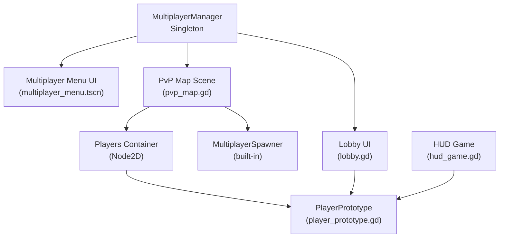
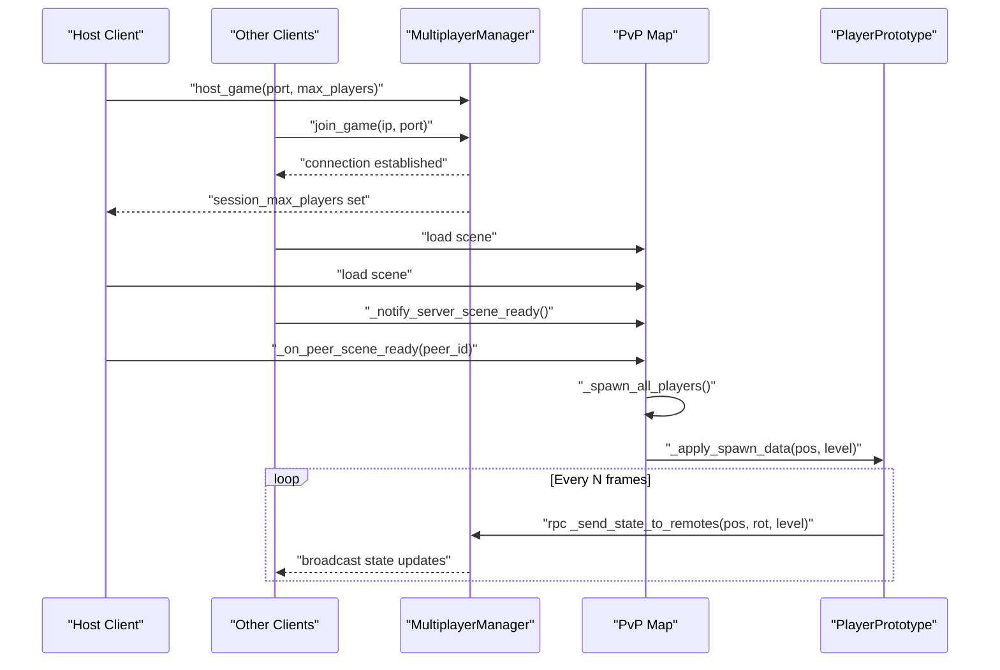
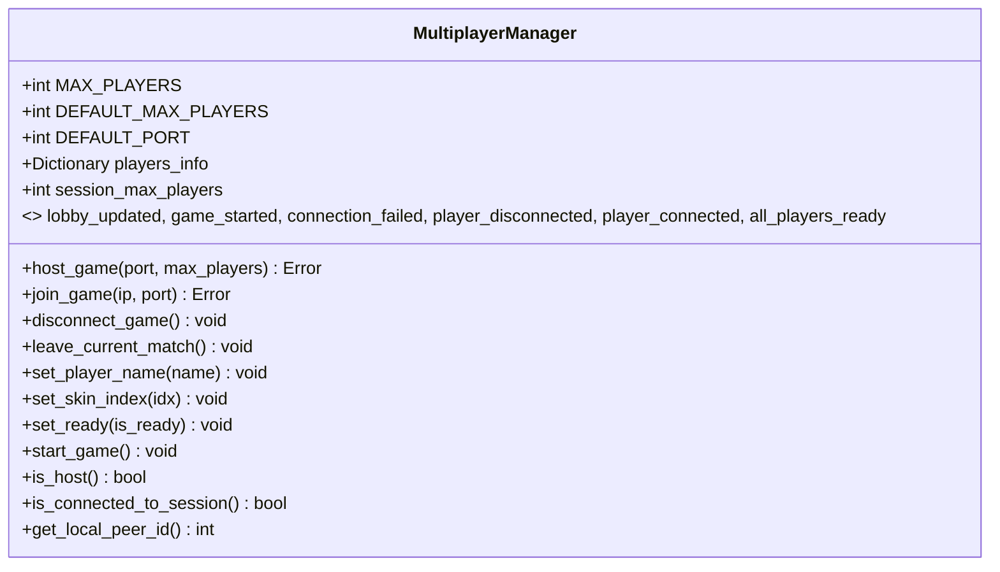
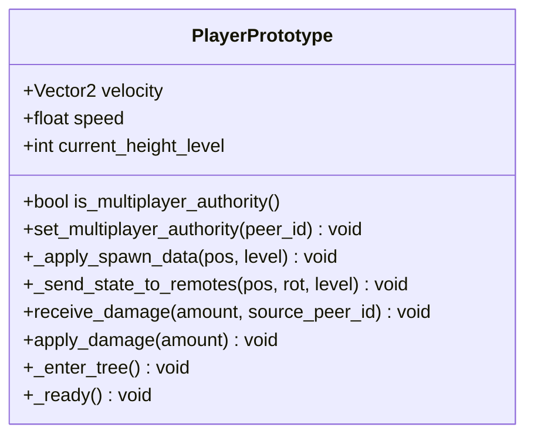
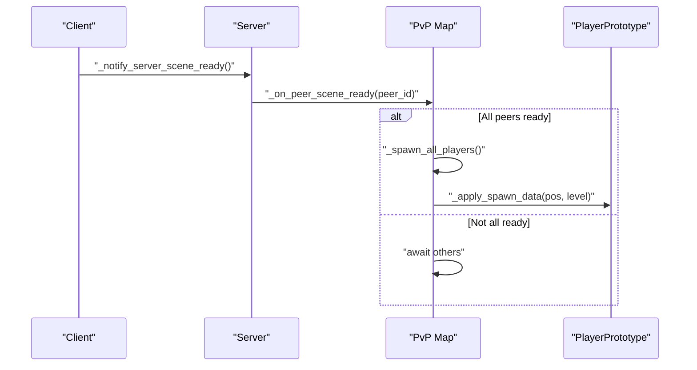
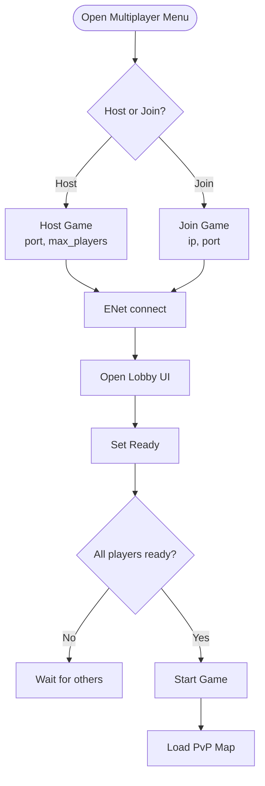
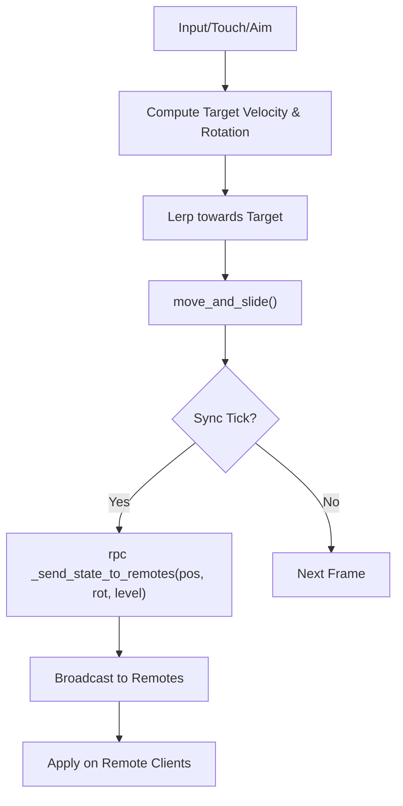
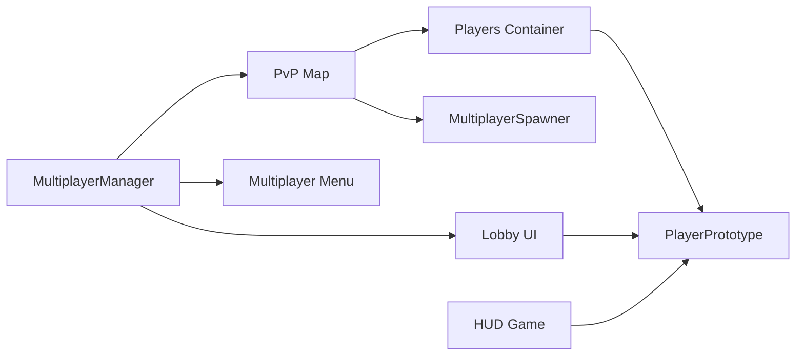

# Multiplayer System

<cite>
**Referenced Files in This Document**
- [multiplayer_manager.gd](file://Scripts/multiplayer_manager.gd)
- [player_prototype.gd](file://Scripts/player_prototype.gd)
- [pvp_map.gd](file://Scripts/pvp_map.gd)
- [lobby.gd](file://Menu/lobby.gd)
- [multiplayer_menu.gd](file://Menu/multiplayer_menu.gd)
- [multiplayer_menu.tscn](file://Menu/multiplayer_menu.tscn)
- [spawn_point.gd](file://Scripts/spawn_point.gd)
- [HUD_Game.tscn](file://Menu/HUD/HUD_Game.tscn)
- [hud_game.gd](file://Menu/HUD/hud_game.gd)
</cite>

## Table of Contents
1. [Introduction](#introduction)
2. [Project Structure](#project-structure)
3. [Core Components](#core-components)
4. [Architecture Overview](#architecture-overview)
5. [Detailed Component Analysis](#detailed-component-analysis)
6. [Dependency Analysis](#dependency-analysis)
7. [Performance Considerations](#performance-considerations)
8. [Troubleshooting Guide](#troubleshooting-guide)
9. [Conclusion](#conclusion)
10. [Appendices](#appendices)

## Introduction
This document describes the Multiplayer System in TFA Agents. It explains the client-server architecture, lobby and matchmaking mechanics, room/session creation, and player state management. It also documents network synchronization protocols, position interpolation, state updates, conflict resolution, latency compensation, connection management, authentication, session persistence, and practical examples such as spectator modes and network debugging.

## Project Structure
The multiplayer system spans several modules:
- Networking and lobby orchestration are handled by a singleton MultiplayerManager.
- Players are represented by a PlayerPrototype scene with authoritative movement and state.
- Matchmaking and room lifecycle are coordinated via lobby UI and map handshake.
- HUD integrates with the multiplayer state for live updates.

**Diagram sources**
- [multiplayer_manager.gd:1-136](file://Scripts/multiplayer_manager.gd#L1-L136)
- [multiplayer_menu.tscn:48-140](file://Menu/multiplayer_menu.tscn#L48-L140)
- [lobby.gd:34-68](file://Menu/lobby.gd#L34-L68)
- [pvp_map.gd:1-169](file://Scripts/pvp_map.gd#L1-L169)
- [player_prototype.gd:57-100](file://Scripts/player_prototype.gd#L57-L100)
- [hud_game.gd](file://Menu/HUD/hud_game.gd)

**Section sources**
- [multiplayer_manager.gd:1-136](file://Scripts/multiplayer_manager.gd#L1-L136)
- [multiplayer_menu.tscn:48-140](file://Menu/multiplayer_menu.tscn#L48-L140)
- [lobby.gd:34-68](file://Menu/lobby.gd#L34-L68)
- [pvp_map.gd:1-169](file://Scripts/pvp_map.gd#L1-L169)
- [player_prototype.gd:57-100](file://Scripts/player_prototype.gd#L57-L100)
- [hud_game.gd](file://Menu/HUD/hud_game.gd)

## Core Components
- MultiplayerManager: Autoload singleton managing ENet connections, lobby state, team assignment, and match lifecycle signals.
- PlayerPrototype: Per-player entity with authority, movement, state synchronization, damage handling, and camera/input routing.
- PvP Map: Scene orchestrating spawn, readiness handshake, and per-peer initialization.
- Lobby UI: Host/join flows, player list, ready state, chat, and navigation.
- HUD: Live updates synchronized from the server and client-side state.

Key responsibilities:
- Connection lifecycle: host/join/disconnect, readiness, and match start.
- Lobby state: player registration, team assignment, skins, and ready flags.
- Match lifecycle: scene readiness handshake, spawn coordination, and end-of-match signaling.
- Player synchronization: position, rotation, height level, and state updates.

**Section sources**
- [multiplayer_manager.gd:1-136](file://Scripts/multiplayer_manager.gd#L1-L136)
- [player_prototype.gd:57-100](file://Scripts/player_prototype.gd#L57-L100)
- [pvp_map.gd:44-169](file://Scripts/pvp_map.gd#L44-L169)
- [lobby.gd:34-68](file://Menu/lobby.gd#L34-L68)
- [hud_game.gd](file://Menu/HUD/hud_game.gd)

## Architecture Overview
TFA Agents uses a client-server model with ENet-backed networking. Authority is granted to the owning peer for each PlayerPrototype instance. Clients send movement/state updates at a fixed cadence; the server relays authoritative state to peers. The lobby coordinates readiness and team assignment before starting the match.

**Diagram sources**
- [multiplayer_manager.gd:71-106](file://Scripts/multiplayer_manager.gd#L71-L106)
- [pvp_map.gd:77-122](file://Scripts/pvp_map.gd#L77-L122)
- [player_prototype.gd:295-301](file://Scripts/player_prototype.gd#L295-L301)

## Detailed Component Analysis

### MultiplayerManager
Responsibilities:
- Connection management: host_game, join_game, disconnect_game, leave_current_match.
- Lobby state: players_info dictionary keyed by peer_id; ready flags; skins; team assignment.
- Match lifecycle: start_game (host-only), signals for lobby updates, game start, connection failures, player disconnect/ready events.
- Utility APIs: is_host, is_connected_to_session, get_local_peer_id.

Implementation highlights:
- Uses ENetMultiplayerPeer for transport.
- Emits lobby_updated and game_started signals to drive UI and scene transitions.
- Provides RPC helpers for ready state, despawn requests, and chat.

**Diagram sources**
- [multiplayer_manager.gd:1-136](file://Scripts/multiplayer_manager.gd#L1-L136)

**Section sources**
- [multiplayer_manager.gd:1-136](file://Scripts/multiplayer_manager.gd#L1-L136)

### PlayerPrototype
Responsibilities:
- Authority: set_multiplayer_authority(peer_id) ensures the server validates actions and clients render locally.
- Movement: smooth acceleration/velocity with lerping and move_and_slide.
- Aiming: mouse or touch-based rotation with angle interpolation.
- Synchronization: sends state to remotes every N frames via rpc.
- Damage: server-originated damage RPC with friendly-fire checks.
- Camera/Input routing: disables camera and input manager on remote instances.

Implementation highlights:
- Uses _apply_spawn_data RPC to set initial position and height level.
- Sends _send_state_to_remotes RPC with position, rotation, and height level.
- Applies damage via receive_damage RPC with source peer validation.

**Diagram sources**
- [player_prototype.gd:57-100](file://Scripts/player_prototype.gd#L57-L100)
- [player_prototype.gd:295-301](file://Scripts/player_prototype.gd#L295-L301)
- [player_prototype.gd:782-795](file://Scripts/player_prototype.gd#L782-L795)

**Section sources**
- [player_prototype.gd:57-100](file://Scripts/player_prototype.gd#L57-L100)
- [player_prototype.gd:295-301](file://Scripts/player_prototype.gd#L295-L301)
- [player_prototype.gd:782-795](file://Scripts/player_prototype.gd#L782-L795)

### PvP Map (Match Orchestration)
Responsibilities:
- Scene readiness handshake: clients notify server when loaded; server spawns players after all confirm.
- Spawn coordination: selects spawn points by team and height level, applies spawn data via RPC.
- Scorekeeping: tracks kills per team and match end conditions.

Implementation highlights:
- Adds a Players container and MultiplayerSpawner with the player scene.
- Uses _notify_server_scene_ready RPC to coordinate readiness.
- Spawns players with set_multiplayer_authority(peer_id) and calls _apply_spawn_data RPC.

**Diagram sources**
- [pvp_map.gd:77-122](file://Scripts/pvp_map.gd#L77-L122)
- [pvp_map.gd:164-169](file://Scripts/pvp_map.gd#L164-L169)

**Section sources**
- [pvp_map.gd:44-169](file://Scripts/pvp_map.gd#L44-L169)

### Lobby Management and UI
Responsibilities:
- Host/join flows: Multiplayer Menu UI captures player name, port, max players, and IP; delegates to MultiplayerManager.
- Lobby UI: displays player list, ready status, chat, and start button; reacts to lobby_updated and connection_failed signals.
- Navigation: transitions to lobby after successful join; returns to main menu on disconnect.

Implementation highlights:
- Multiplayer Menu UI defines controls for host/join and emits signals mapped to callbacks.
- Lobby UI builds rows per peer, toggles start button based on all-ready condition, and handles chat RPC.

**Diagram sources**
- [multiplayer_menu.tscn:48-140](file://Menu/multiplayer_menu.tscn#L48-L140)
- [multiplayer_menu.gd:96-120](file://Menu/multiplayer_menu.gd#L96-L120)
- [lobby.gd:34-68](file://Menu/lobby.gd#L34-L68)
- [multiplayer_manager.gd:155-168](file://Scripts/multiplayer_manager.gd#L155-L168)

**Section sources**
- [multiplayer_menu.tscn:48-140](file://Menu/multiplayer_menu.tscn#L48-L140)
- [multiplayer_menu.gd:96-120](file://Menu/multiplayer_menu.gd#L96-L120)
- [lobby.gd:34-68](file://Menu/lobby.gd#L34-L68)
- [multiplayer_manager.gd:155-168](file://Scripts/multiplayer_manager.gd#L155-L168)

### Player Synchronization and State Updates
Mechanics:
- Position interpolation: PlayerPrototype lerps toward target velocity and rotates toward aim direction.
- State updates: Periodic RPC sends position, rotation, and height level to remotes.
- Authority: Movement and actions validated on server; clients predict locally for responsiveness.
- Conflict resolution: Server authoritative state overrides client prediction; friendly fire resolved via source peer validation.

**Diagram sources**
- [player_prototype.gd:260-294](file://Scripts/player_prototype.gd#L260-L294)
- [player_prototype.gd:295-301](file://Scripts/player_prototype.gd#L295-L301)

**Section sources**
- [player_prototype.gd:260-294](file://Scripts/player_prototype.gd#L260-L294)
- [player_prototype.gd:295-301](file://Scripts/player_prototype.gd#L295-L301)

### Network Messaging, Packet Handling, and Latency Compensation
Messaging:
- Reliable RPCs: lobby_updated, game_started, _receive_chat_message, _apply_spawn_data, _send_state_to_remotes, receive_damage.
- Unreliable/ordered: Movement updates sent periodically to balance bandwidth and responsiveness.
- Handshake: Scene readiness notifications ensure synchronized spawn.

Latency compensation:
- Local prediction: Clients interpolate position and rotation; server authoritative state reconciles drift.
- Friendly fire checks: receive_damage validates source peer and team to prevent accidental self-damage.

**Section sources**
- [multiplayer_manager.gd:17-22](file://Scripts/multiplayer_manager.gd#L17-L22)
- [player_prototype.gd:94-100](file://Scripts/player_prototype.gd#L94-L100)
- [player_prototype.gd:782-795](file://Scripts/player_prototype.gd#L782-L795)

### Connection Management, Authentication, and Session Persistence
Connection management:
- ENetMultiplayerPeer encapsulates UDP transport; host_game and join_game handle server/client roles.
- disconnect_game resets state and clears players_info; leave_current_match despawns on server or requests despawn.

Authentication and identity:
- Player identity is implicit via peer_id; player name and skin are stored in MultiplayerManager’s players_info.
- No explicit credential exchange is present; identity is established during lobby setup.

Session persistence:
- Session state persists in MultiplayerManager until disconnect_game is called.
- Team and ready flags persist per peer_id until cleared.

**Section sources**
- [multiplayer_manager.gd:71-118](file://Scripts/multiplayer_manager.gd#L71-L118)
- [multiplayer_manager.gd:145-152](file://Scripts/multiplayer_manager.gd#L145-L152)

### Examples: Multiplayer Gameplay, Spectator Modes, and Debugging Tools
- Multiplayer gameplay: Host creates a lobby, clients join, all set ready, host starts the game, PvP Map spawns players, and clients synchronize state.
- Spectator mode: Not implemented in the current codebase; could be modeled as a non-authoritative client observing PlayerPrototype positions and HUD updates.
- Network debugging: Use lobby chat RPC to broadcast messages; monitor lobby_updated and connection_failed signals; inspect MultiplayerManager’s players_info and ready flags.

**Section sources**
- [lobby.gd:121-134](file://Menu/lobby.gd#L121-L134)
- [multiplayer_manager.gd:17-22](file://Scripts/multiplayer_manager.gd#L17-L22)

## Dependency Analysis
High-level dependencies:
- MultiplayerManager depends on ENetMultiplayerPeer and Godot’s multiplayer API.
- PvP Map depends on MultiplayerManager for lobby state and on MultiplayerSpawner for instantiation.
- PlayerPrototype depends on MultiplayerManager for authority and on HUD for UI updates.
- Lobby UI depends on MultiplayerManager for signals and state.

**Diagram sources**
- [multiplayer_manager.gd:1-136](file://Scripts/multiplayer_manager.gd#L1-L136)
- [pvp_map.gd:1-169](file://Scripts/pvp_map.gd#L1-L169)
- [player_prototype.gd:57-100](file://Scripts/player_prototype.gd#L57-L100)
- [lobby.gd:34-68](file://Menu/lobby.gd#L34-L68)
- [hud_game.gd](file://Menu/HUD/hud_game.gd)

**Section sources**
- [multiplayer_manager.gd:1-136](file://Scripts/multiplayer_manager.gd#L1-L136)
- [pvp_map.gd:1-169](file://Scripts/pvp_map.gd#L1-L169)
- [player_prototype.gd:57-100](file://Scripts/player_prototype.gd#L57-L100)
- [lobby.gd:34-68](file://Menu/lobby.gd#L34-L68)
- [hud_game.gd](file://Menu/HUD/hud_game.gd)

## Performance Considerations
- Reduce sync frequency: Tune the internal tick interval to balance bandwidth and smoothness.
- Compress state: Send quantized position/rotation to reduce payload size.
- Friendly update batching: Group state updates per frame to minimize RPC overhead.
- Predictive rendering: Keep client interpolation to mitigate perceived latency.
- Avoid unnecessary RPCs: Only send state when meaningful changes occur.

## Troubleshooting Guide
Common issues and remedies:
- Connection fails: Verify IP/port correctness; check connection_failed signal emission and UI redirection to the main menu.
- Players not spawning: Ensure scene readiness handshake completes; confirm _spawn_all_players runs after all peers report ready.
- Despawn on leave: Use leave_current_match to request server-side despawn; verify _request_despawn and _despawn_player_on_server paths.
- Chat not visible: Confirm _receive_chat_message RPC is invoked and formatted text appended to the chat log.
- Ready button disabled: Ensure all players set ready; host must call start_game after verifying _all_players_ready.

**Section sources**
- [multiplayer_manager.gd:95-106](file://Scripts/multiplayer_manager.gd#L95-L106)
- [pvp_map.gd:92-109](file://Scripts/pvp_map.gd#L92-L109)
- [multiplayer_manager.gd:119-128](file://Scripts/multiplayer_manager.gd#L119-L128)
- [lobby.gd:121-134](file://Menu/lobby.gd#L121-L134)

## Conclusion
The Multiplayer System in TFA Agents centers on a robust client-server architecture using ENet, with clear authority boundaries and periodic state synchronization. MultiplayerManager orchestrates lobby and match lifecycle, while PlayerPrototype encapsulates movement, aiming, and damage handling. The PvP Map coordinates scene readiness and spawn, and the HUD reflects live state. With reliable RPCs, local prediction, and friendly-fire checks, the system balances responsiveness and fairness. Extending to spectator modes and advanced debugging would require minimal additions to the existing architecture.

## Appendices

### Appendix A: Spawn Points and Height Levels
Spawn points support team-specific and neutral spawns and height-level validation to ensure players spawn on walkable ground.

**Section sources**
- [spawn_point.gd:1-5](file://Scripts/spawn_point.gd#L1-L5)
- [pvp_map.gd:150-162](file://Scripts/pvp_map.gd#L150-L162)

### Appendix B: HUD Integration
HUD subscribes to player state and lobby updates to reflect real-time information such as health, ammo, and player list.

**Section sources**
- [HUD_Game.tscn](file://Menu/HUD/HUD_Game.tscn)
- [hud_game.gd](file://Menu/HUD/hud_game.gd)