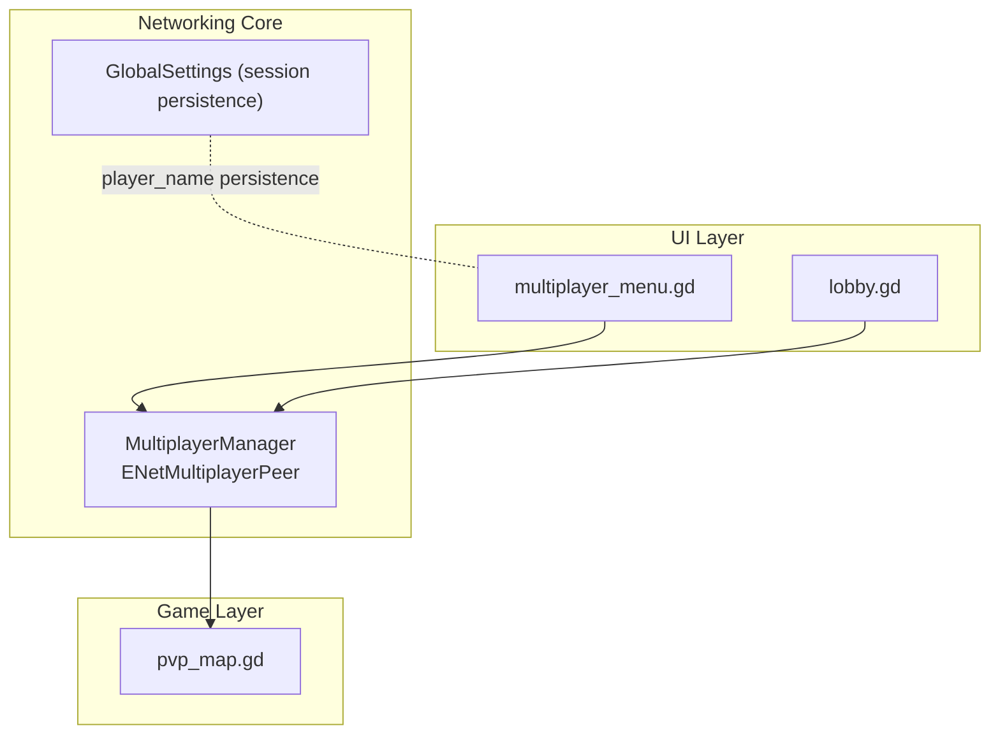
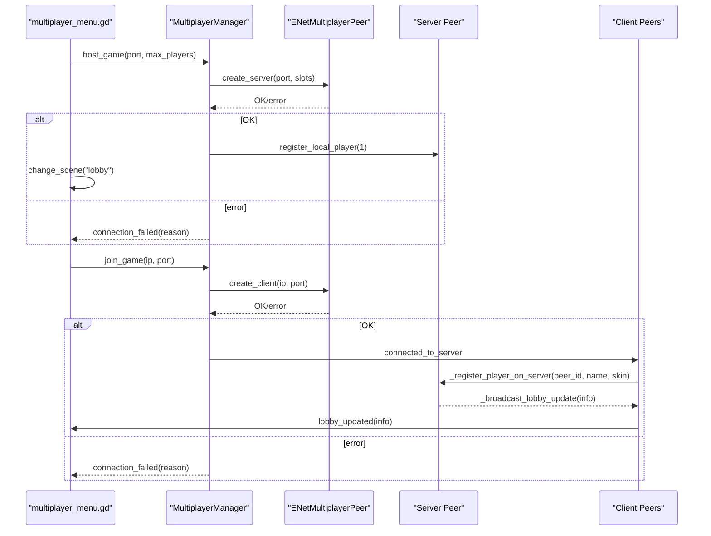
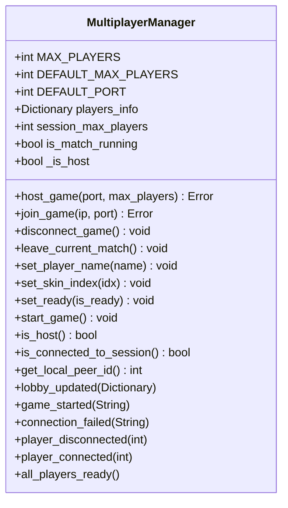
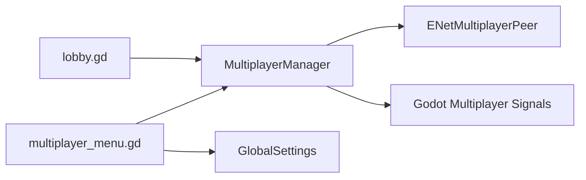

# Network Architecture

<cite>
**Referenced Files in This Document**
- [multiplayer_manager.gd](file://Scripts/multiplayer_manager.gd)
- [multiplayer_menu.gd](file://Menu/multiplayer_menu.gd)
- [lobby.gd](file://Menu/lobby.gd)
- [pvp_map.gd](file://Scripts/pvp_map.gd)
- [global_settings.gd](file://Scripts/global_settings.gd)
- [export_presets.cfg](file://export_presets.cfg)
</cite>

## Table of Contents
1. [Introduction](#introduction)
2. [Project Structure](#project-structure)
3. [Core Components](#core-components)
4. [Architecture Overview](#architecture-overview)
5. [Detailed Component Analysis](#detailed-component-analysis)
6. [Dependency Analysis](#dependency-analysis)
7. [Performance Considerations](#performance-considerations)
8. [Troubleshooting Guide](#troubleshooting-guide)
9. [Conclusion](#conclusion)

## Introduction
This document describes the multiplayer network architecture of TFA Agents, centered on an ENet-based client-server model integrated with Godot’s multiplayer framework. It covers server initialization, client connection procedures, lobby management, team assignment, scene synchronization handshake, and connection lifecycle events. It also documents reliability mechanisms via RPC delivery guarantees, connection status handling, and error propagation. Security considerations, authentication, and session persistence are addressed with practical guidance grounded in the repository’s implementation.

## Project Structure
The multiplayer system is implemented as a singleton autoload that encapsulates ENet connectivity and exposes a clean API for lobby, teams, and spawn management. UI scenes orchestrate user actions (host/join), while the manager coordinates state and RPCs.

**Diagram sources**
- [multiplayer_menu.gd:22-53](file://Menu/multiplayer_menu.gd#L22-L53)
- [lobby.gd:17-35](file://Menu/lobby.gd#L17-L35)
- [multiplayer_manager.gd:59-64](file://Scripts/multiplayer_manager.gd#L59-L64)
- [pvp_map.gd:55-91](file://Scripts/pvp_map.gd#L55-L91)
- [global_settings.gd:100-121](file://Scripts/global_settings.gd#L100-L121)

**Section sources**
- [multiplayer_menu.gd:22-53](file://Menu/multiplayer_menu.gd#L22-L53)
- [lobby.gd:17-35](file://Menu/lobby.gd#L17-L35)
- [multiplayer_manager.gd:59-64](file://Scripts/multiplayer_manager.gd#L59-L64)
- [pvp_map.gd:55-91](file://Scripts/pvp_map.gd#L55-L91)
- [global_settings.gd:100-121](file://Scripts/global_settings.gd#L100-L121)

## Core Components
- MultiplayerManager (ENet backend): Singleton that creates servers/clients, manages lobby state, handles RPCs, and emits signals for UI updates.
- UI Scenes: Multiplayer menu and lobby scenes that collect user inputs, configure session parameters, and react to networking signals.
- Game Scene (PvP Map): Implements a scene synchronization handshake to coordinate readiness across peers.

Key implementation references:
- ENet server/client creation and connection lifecycle
- Lobby state dictionary and RPC broadcasting
- Reliable RPC delivery for lobby and game start
- Scene readiness handshake

**Section sources**
- [multiplayer_manager.gd:74-106](file://Scripts/multiplayer_manager.gd#L74-L106)
- [multiplayer_manager.gd:176-183](file://Scripts/multiplayer_manager.gd#L176-L183)
- [multiplayer_manager.gd:225-274](file://Scripts/multiplayer_manager.gd#L225-L274)
- [pvp_map.gd:77-91](file://Scripts/pvp_map.gd#L77-L91)

## Architecture Overview
The system follows a centralized client-server topology using ENet. The host acts as the server and authority; clients connect to the host. The manager maintains a shared lobby state and broadcasts updates. RPCs are used for lobby controls and game start, with reliable delivery semantics. The PvP map implements a scene synchronization handshake to ensure all peers are ready before gameplay begins.

**Diagram sources**
- [multiplayer_menu.gd:63-78](file://Menu/multiplayer_menu.gd#L63-L78)
- [multiplayer_menu.gd:80-94](file://Menu/multiplayer_menu.gd#L80-L94)
- [multiplayer_manager.gd:74-106](file://Scripts/multiplayer_manager.gd#L74-L106)
- [multiplayer_manager.gd:225-250](file://Scripts/multiplayer_manager.gd#L225-L250)
- [multiplayer_manager.gd:245-250](file://Scripts/multiplayer_manager.gd#L245-L250)

## Detailed Component Analysis

### MultiplayerManager (ENet Backend)
Responsibilities:
- Initialize ENet server or client
- Manage lobby state (players_info)
- Broadcast lobby updates and handle readiness
- Start the game and synchronize scene state
- Emit signals for UI and higher-level logic

Implementation highlights:
- Constants define maximum players and default port
- Signals for lobby updates, game start, connection failures, and peer events
- Host and join APIs wrap ENetMultiplayerPeer.create_server/create_client
- Reliable RPCs for lobby and game start
- Key-value normalization after RPC serialization

**Diagram sources**
- [multiplayer_manager.gd:10-22](file://Scripts/multiplayer_manager.gd#L10-L22)
- [multiplayer_manager.gd:28-47](file://Scripts/multiplayer_manager.gd#L28-L47)
- [multiplayer_manager.gd:74-106](file://Scripts/multiplayer_manager.gd#L74-L106)
- [multiplayer_manager.gd:154-169](file://Scripts/multiplayer_manager.gd#L154-L169)

**Section sources**
- [multiplayer_manager.gd:10-22](file://Scripts/multiplayer_manager.gd#L10-L22)
- [multiplayer_manager.gd:28-47](file://Scripts/multiplayer_manager.gd#L28-L47)
- [multiplayer_manager.gd:74-106](file://Scripts/multiplayer_manager.gd#L74-L106)
- [multiplayer_manager.gd:154-169](file://Scripts/multiplayer_manager.gd#L154-L169)

### Multiplayer Menu (Host/Join UI)
Responsibilities:
- Collect player name and session parameters
- Trigger host_game or join_game
- Display status messages and handle errors
- Persist player name via GlobalSettings

Behavior:
- Defaults to default port and reasonable max players
- Applies player name to MultiplayerManager and persists it
- Emits connection_failed and lobby_updated to drive navigation

**Section sources**
- [multiplayer_menu.gd:22-53](file://Menu/multiplayer_menu.gd#L22-L53)
- [multiplayer_menu.gd:63-78](file://Menu/multiplayer_menu.gd#L63-L78)
- [multiplayer_menu.gd:80-94](file://Menu/multiplayer_menu.gd#L80-L94)
- [multiplayer_menu.gd:101-121](file://Menu/multiplayer_menu.gd#L101-L121)
- [global_settings.gd:100-121](file://Scripts/global_settings.gd#L100-L121)

### Lobby Scene (Waiting Room)
Responsibilities:
- Display connected players, readiness, and teams
- Allow host to start the game when everyone is ready
- Enable chat with reliable delivery
- React to connection failures and game starts

Key flows:
- Builds player rows reflecting readiness and team
- Enables Start button only when all are ready and ≥2 players
- Sends chat messages via reliable RPC
- Receives broadcast updates and game start signal

**Section sources**
- [lobby.gd:40-59](file://Menu/lobby.gd#L40-L59)
- [lobby.gd:95-103](file://Menu/lobby.gd#L95-L103)
- [lobby.gd:113-134](file://Menu/lobby.gd#L113-L134)
- [lobby.gd:147-151](file://Menu/lobby.gd#L147-L151)

### Scene Synchronization Handshake (PvP Map)
Responsibilities:
- Coordinate readiness across peers after scene load
- Server aggregates client readiness and triggers game start

Handshake:
- Server adds itself to readiness list and defers callback
- Clients send RPC to notify server they finished loading
- Server invokes readiness callback and proceeds to game start

**Section sources**
- [pvp_map.gd:55-91](file://Scripts/pvp_map.gd#L55-L91)

## Dependency Analysis
- UI scenes depend on MultiplayerManager for networking actions and state.
- MultiplayerManager depends on ENetMultiplayerPeer for transport and Godot multiplayer signals for lifecycle events.
- GlobalSettings is used by the UI to persist player name across sessions.
- Export presets define platform capabilities; networking permissions are disabled by default on Android.

**Diagram sources**
- [multiplayer_menu.gd:22-30](file://Menu/multiplayer_menu.gd#L22-L30)
- [lobby.gd:17-23](file://Menu/lobby.gd#L17-L23)
- [multiplayer_manager.gd:59-64](file://Scripts/multiplayer_manager.gd#L59-L64)
- [global_settings.gd:100-121](file://Scripts/global_settings.gd#L100-L121)

**Section sources**
- [multiplayer_menu.gd:22-30](file://Menu/multiplayer_menu.gd#L22-L30)
- [lobby.gd:17-23](file://Menu/lobby.gd#L17-L23)
- [multiplayer_manager.gd:59-64](file://Scripts/multiplayer_manager.gd#L59-L64)
- [global_settings.gd:100-121](file://Scripts/global_settings.gd#L100-L121)

## Performance Considerations
- Use reliable RPCs for lobby updates and game start to minimize retransmissions and ensure consistency.
- Clamp max players to avoid overload; the manager enforces a maximum and subtracts the server slot.
- Keep lobby updates minimal; broadcast only changed dictionaries to reduce bandwidth.
- Scene readiness handshake avoids busy-waiting by leveraging RPC acknowledgments.

[No sources needed since this section provides general guidance]

## Troubleshooting Guide
Common issues and remedies:
- Cannot start server on default port
  - Symptom: connection_failed emitted with port binding error.
  - Action: Change port in UI or check for conflicts; retry host_game.
  - Reference: [multiplayer_menu.gd:70-77](file://Menu/multiplayer_menu.gd#L70-L77), [multiplayer_manager.gd:77-81](file://Scripts/multiplayer_manager.gd#L77-L81)

- Cannot connect to host
  - Symptom: connection_failed emitted during join_game.
  - Action: Verify IP/port correctness, firewall/NAT traversal, and that the host is reachable.
  - Reference: [multiplayer_menu.gd:88-94](file://Menu/multiplayer_menu.gd#L88-L94), [multiplayer_manager.gd:97-101](file://Scripts/multiplayer_manager.gd#L97-L101)

- Players not appearing in lobby
  - Symptom: lobby_updated not firing or empty list.
  - Action: Confirm successful registration RPC and that server accepted the player.
  - Reference: [multiplayer_manager.gd:227-242](file://Scripts/multiplayer_manager.gd#L227-L242), [multiplayer_manager.gd:245-250](file://Scripts/multiplayer_manager.gd#L245-L250)

- Game does not start
  - Symptom: Start button disabled or no game_started signal.
  - Action: Ensure all players clicked Ready; host checks readiness before start_game.
  - Reference: [lobby.gd:55-56](file://Menu/lobby.gd#L55-L56), [multiplayer_manager.gd:164-168](file://Scripts/multiplayer_manager.gd#L164-L168)

- Scene readiness handshake stalls
  - Symptom: Game waits indefinitely after loading.
  - Action: Ensure clients send readiness RPC and server invokes readiness callback.
  - Reference: [pvp_map.gd:77-91](file://Scripts/pvp_map.gd#L77-L91)

- Persistent player name not applied
  - Symptom: Name resets on launch.
  - Action: Save name via UI and confirm GlobalSettings persistence.
  - Reference: [multiplayer_menu.gd:113-121](file://Menu/multiplayer_menu.gd#L113-L121), [global_settings.gd:100-121](file://Scripts/global_settings.gd#L100-L121)

**Section sources**
- [multiplayer_menu.gd:70-77](file://Menu/multiplayer_menu.gd#L70-L77)
- [multiplayer_manager.gd:77-81](file://Scripts/multiplayer_manager.gd#L77-L81)
- [multiplayer_menu.gd:88-94](file://Menu/multiplayer_menu.gd#L88-L94)
- [multiplayer_manager.gd:97-101](file://Scripts/multiplayer_manager.gd#L97-L101)
- [multiplayer_manager.gd:227-242](file://Scripts/multiplayer_manager.gd#L227-L242)
- [multiplayer_manager.gd:245-250](file://Scripts/multiplayer_manager.gd#L245-L250)
- [lobby.gd:55-56](file://Menu/lobby.gd#L55-L56)
- [multiplayer_manager.gd:164-168](file://Scripts/multiplayer_manager.gd#L164-L168)
- [pvp_map.gd:77-91](file://Scripts/pvp_map.gd#L77-L91)
- [multiplayer_menu.gd:113-121](file://Menu/multiplayer_menu.gd#L113-L121)
- [global_settings.gd:100-121](file://Scripts/global_settings.gd#L100-L121)

## Conclusion
The multiplayer architecture in TFA Agents centers on a robust ENet-backed client-server model with clear separation between transport (ENet), session logic (MultiplayerManager), and UI. Reliable RPCs ensure consistent lobby and game state, while a scene readiness handshake synchronizes peers. The design supports configurable ports, max players, and team modes, and integrates with GlobalSettings for session persistence. The provided troubleshooting guidance and diagrams should help diagnose and resolve typical networking issues.