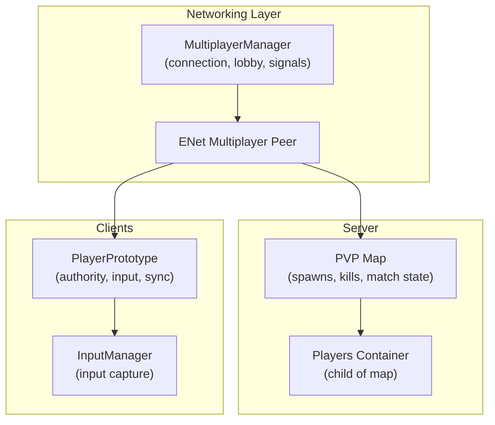
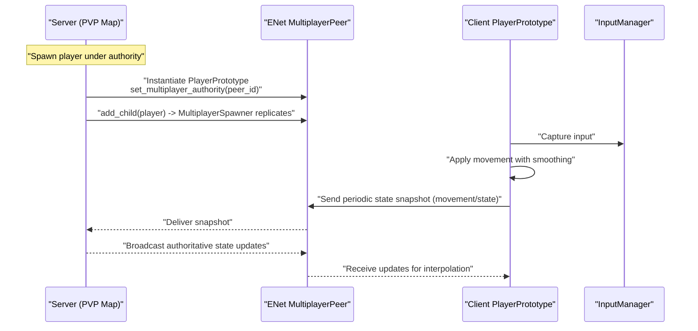
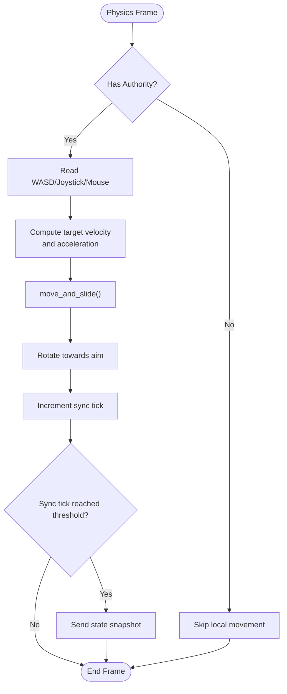
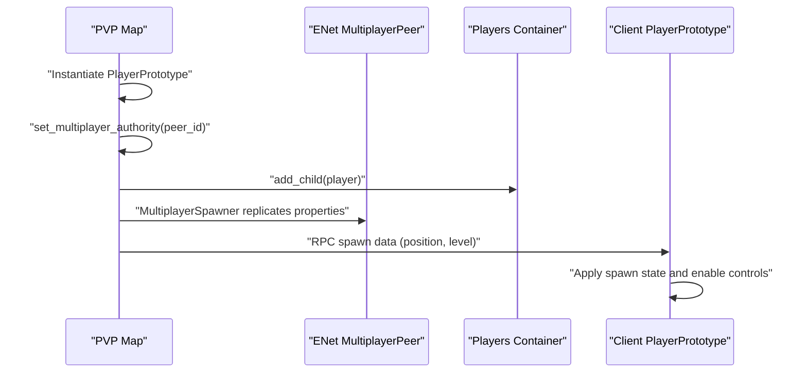
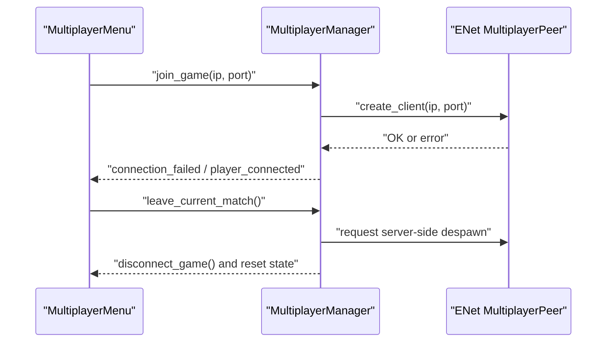
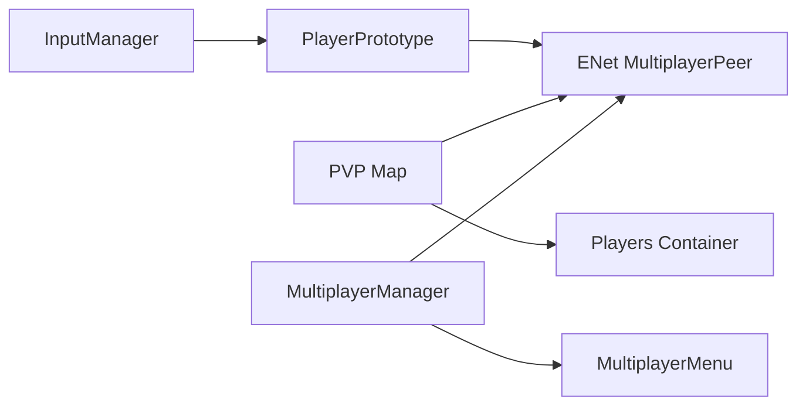

# Player Synchronization

<cite>
**Referenced Files in This Document**
- [player_prototype.gd](file://Scripts/player_prototype.gd)
- [multiplayer_manager.gd](file://Scripts/multiplayer_manager.gd)
- [pvp_map.gd](file://Scripts/pvp_map.gd)
- [input_manager.gd](file://Game/input_manager.gd)
- [multiplayer_menu.gd](file://Menu/multiplayer_menu.gd)
</cite>

## Table of Contents
1. [Introduction](#introduction)
2. [Project Structure](#project-structure)
3. [Core Components](#core-components)
4. [Architecture Overview](#architecture-overview)
5. [Detailed Component Analysis](#detailed-component-analysis)
6. [Dependency Analysis](#dependency-analysis)
7. [Performance Considerations](#performance-considerations)
8. [Troubleshooting Guide](#troubleshooting-guide)
9. [Conclusion](#conclusion)

## Introduction
This document explains how player synchronization works in TFA Agents across networked clients. It covers authoritative movement, state replication, position interpolation, real-time updates, player spawning/despawning, lifecycle events, conflict resolution, latency compensation, serialization, and debugging aids. The goal is to help developers implement smooth, predictable multiplayer behavior for agents controlled by human players.

## Project Structure
The multiplayer system centers around three key scripts:
- PlayerPrototype: Implements client-side input handling, authority gating, state updates, and RPC-based damage/respawn logic.
- PVP Map: Manages server-side spawning, despawning, and match lifecycle callbacks invoked by the server.
- Multiplayer Manager: Provides connection orchestration, lobby signals, and server-side despawn requests.

**Diagram sources**
- [multiplayer_manager.gd:1-136](file://Scripts/multiplayer_manager.gd#L1-L136)
- [pvp_map.gd:164-210](file://Scripts/pvp_map.gd#L164-L210)
- [player_prototype.gd:260-301](file://Scripts/player_prototype.gd#L260-L301)
- [input_manager.gd](file://Game/input_manager.gd)

**Section sources**
- [multiplayer_manager.gd:1-136](file://Scripts/multiplayer_manager.gd#L1-L136)
- [pvp_map.gd:164-210](file://Scripts/pvp_map.gd#L164-L210)
- [player_prototype.gd:260-301](file://Scripts/player_prototype.gd#L260-L301)
- [input_manager.gd](file://Game/input_manager.gd)

## Core Components
- PlayerPrototype
  - Enforces authority gating during physics processing.
  - Gathers input locally and applies movement with smoothing.
  - Periodically sends a compact movement/state snapshot to peers.
  - Receives and applies remote damage/respawn RPCs with sender validation.
- PVP Map
  - Spawns players under server authority, sets multiplayer authority, and ensures properties replicate.
  - Issues kill events and triggers server-side despawn.
- Multiplayer Manager
  - Establishes ENet connections, exposes lobby signals, and supports server-side despawn requests.

Key synchronization primitives:
- Authority model: Movement and state changes occur only on the authoritative client; others interpolate.
- Replication: Properties and RPCs propagate via Godot’s multiplayer peer.
- Lifecycle: Spawn, death, respawn, and despawn are coordinated centrally on the server.

**Section sources**
- [player_prototype.gd:260-301](file://Scripts/player_prototype.gd#L260-L301)
- [player_prototype.gd:787-827](file://Scripts/player_prototype.gd#L787-L827)
- [player_prototype.gd:828-918](file://Scripts/player_prototype.gd#L828-L918)
- [pvp_map.gd:164-210](file://Scripts/pvp_map.gd#L164-L210)
- [multiplayer_manager.gd:92-128](file://Scripts/multiplayer_manager.gd#L92-L128)

## Architecture Overview
The system uses a client-authoritative model for player movement and server-authoritative logic for combat and lifecycle events. The server spawns players, validates actions, and broadcasts outcomes. Clients predict movement locally and reconcile with server snapshots.

**Diagram sources**
- [pvp_map.gd:164-210](file://Scripts/pvp_map.gd#L164-L210)
- [player_prototype.gd:260-301](file://Scripts/player_prototype.gd#L260-L301)
- [input_manager.gd](file://Game/input_manager.gd)

## Detailed Component Analysis

### PlayerPrototype: Authority, Movement, and Sync
- Authority gating
  - Physics processing runs only when the client has authority or when there is no multiplayer peer.
  - Prevents conflicting movement between local prediction and remote authoritative updates.
- Input and movement
  - Reads keyboard/joystick input and applies acceleration/velocity with smoothing.
  - Uses directional lerping for rotation toward mouse or touch aim.
- State synchronization
  - Sends a compact snapshot periodically to reduce bandwidth.
  - Receives and validates RPCs for damage and respawn to avoid replay attacks.
- Health and death
  - Broadcasts health updates and triggers death logic, including UI feedback and respawn preparation.
  - Respawn RPC restores health, ammo, position, and re-enables physics.

**Diagram sources**
- [player_prototype.gd:260-301](file://Scripts/player_prototype.gd#L260-L301)

**Section sources**
- [player_prototype.gd:260-301](file://Scripts/player_prototype.gd#L260-L301)
- [player_prototype.gd:787-827](file://Scripts/player_prototype.gd#L787-L827)
- [player_prototype.gd:828-918](file://Scripts/player_prototype.gd#L828-L918)

### PVP Map: Spawning, Despawning, and Match Events
- Spawning
  - Instantiates the player scene, assigns authority to the peer ID, configures team/skin, and adds to groups.
  - Sets initial position and height level, then safely defers sending spawn data via RPC to ensure replication.
- Despawning
  - On server request, removes the player node from the tree.
- Match events
  - Triggers kill events and coordinates win conditions; integrates with MultiplayerManager for lobby signaling.

**Diagram sources**
- [pvp_map.gd:164-210](file://Scripts/pvp_map.gd#L164-L210)

**Section sources**
- [pvp_map.gd:164-210](file://Scripts/pvp_map.gd#L164-L210)
- [multiplayer_manager.gd:119-128](file://Scripts/multiplayer_manager.gd#L119-L128)

### Multiplayer Manager: Connection and Lobby Signals
- Establishes client connections to a hosted server using ENet.
- Emits lobby and game signals for UI and state machines.
- Supports server-side despawn requests and clean disconnection/reset.

**Diagram sources**
- [multiplayer_menu.gd](file://Menu/multiplayer_menu.gd)
- [multiplayer_manager.gd:92-128](file://Scripts/multiplayer_manager.gd#L92-L128)

**Section sources**
- [multiplayer_manager.gd:92-128](file://Scripts/multiplayer_manager.gd#L92-L128)
- [multiplayer_menu.gd](file://Menu/multiplayer_menu.gd)

## Dependency Analysis
- PlayerPrototype depends on:
  - Godot’s multiplayer peer for authority checks and RPC delivery.
  - InputManager for capturing raw input.
- PVP Map depends on:
  - MultiplayerManager for lobby signals and server-side coordination.
  - Scene hierarchy for spawn points and teams.
- MultiplayerManager depends on:
  - ENetMultiplayerPeer for transport and connection lifecycle.

**Diagram sources**
- [input_manager.gd](file://Game/input_manager.gd)
- [player_prototype.gd:260-301](file://Scripts/player_prototype.gd#L260-L301)
- [pvp_map.gd:164-210](file://Scripts/pvp_map.gd#L164-L210)
- [multiplayer_manager.gd:92-128](file://Scripts/multiplayer_manager.gd#L92-L128)
- [multiplayer_menu.gd](file://Menu/multiplayer_menu.gd)

**Section sources**
- [player_prototype.gd:260-301](file://Scripts/player_prototype.gd#L260-L301)
- [pvp_map.gd:164-210](file://Scripts/pvp_map.gd#L164-L210)
- [multiplayer_manager.gd:92-128](file://Scripts/multiplayer_manager.gd#L92-L128)
- [input_manager.gd](file://Game/input_manager.gd)

## Performance Considerations
- Reduce bandwidth by:
  - Sending state snapshots at a fixed cadence rather than every frame.
  - Encoding only essential fields (position, velocity, rotation, height level, and minimal flags).
- Optimize replication:
  - Use MultiplayerSpawner to replicate initial properties; follow up with targeted RPCs for dynamic state.
  - Defer non-critical updates until after spawn replication completes.
- Client-side smoothing:
  - Apply linear interpolation for position and angular interpolation for rotation.
  - Use small thresholds to snap to final positions to avoid jitter.
- Authority boundaries:
  - Keep heavy computations on the server (damage, kills, respawns) to minimize client-side lag impact.

[No sources needed since this section provides general guidance]

## Troubleshooting Guide
Common issues and remedies:
- Player stutters or snaps
  - Verify authority gating is active and local movement is skipped when not authoritative.
  - Confirm interpolation parameters and thresholds are tuned for the target frame rate.
- Damage not applying or wrong source attribution
  - Ensure RPCs validate the sender ID and avoid processing self-originated events.
  - Confirm that friendly fire checks and team assignment are correct.
- Despawn not working
  - Check that server-side despawn is called only on the server and that the player node exists under the “Players” container.
- Spawn mismatch
  - Ensure authority is set before adding the player to the scene tree.
  - Verify that spawn position and height level are applied consistently before enabling physics.

**Section sources**
- [player_prototype.gd:260-301](file://Scripts/player_prototype.gd#L260-L301)
- [player_prototype.gd:787-827](file://Scripts/player_prototype.gd#L787-L827)
- [player_prototype.gd:828-918](file://Scripts/player_prototype.gd#L828-L918)
- [pvp_map.gd:164-210](file://Scripts/pvp_map.gd#L164-L210)
- [multiplayer_manager.gd:119-128](file://Scripts/multiplayer_manager.gd#L119-L128)

## Conclusion
TFA Agents employs a clear client-authoritative movement model with server-authoritative combat and lifecycle events. PlayerPrototype encapsulates input handling, authority gating, and periodic state updates, while PVP Map centralizes spawning and despawning. MultiplayerManager handles connection and lobby signaling. Together, these components deliver responsive, predictable multiplayer behavior with robust synchronization and debugging hooks.

[No sources needed since this section summarizes without analyzing specific files]