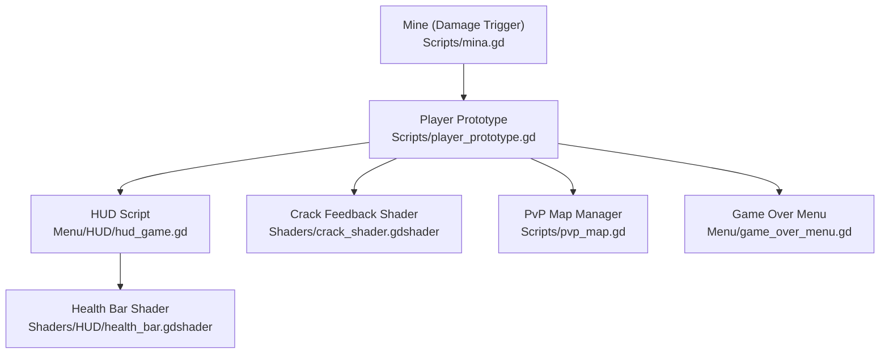
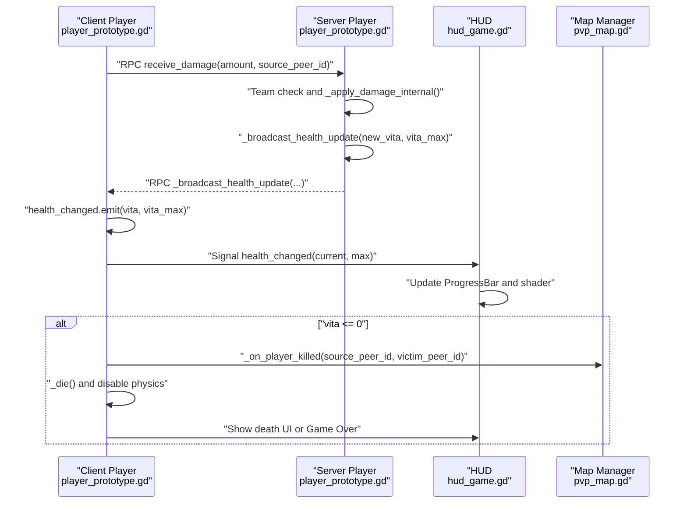
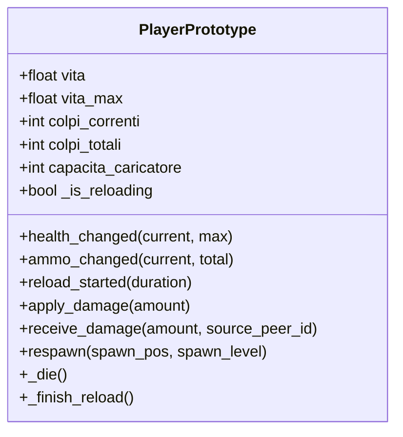
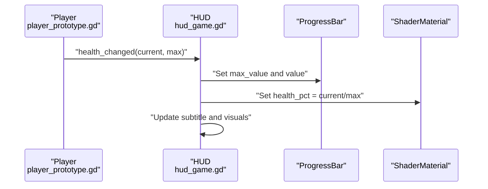
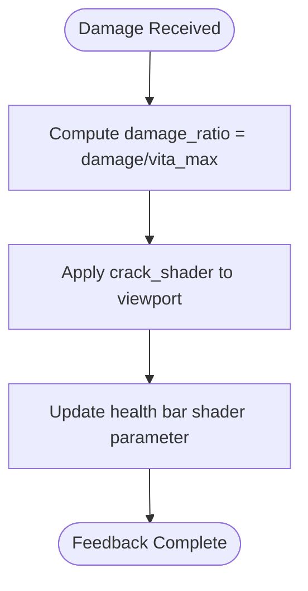
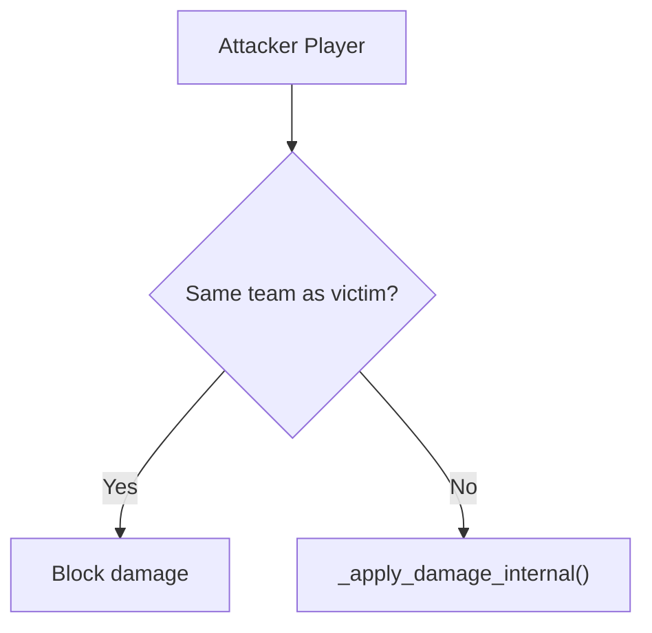
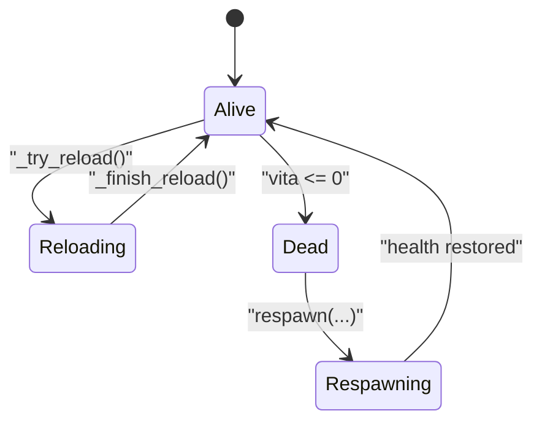
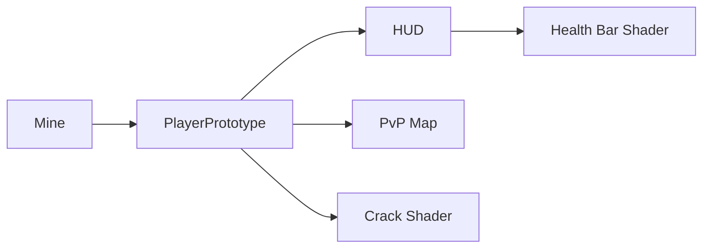

# Character States and Health

<cite>
**Referenced Files in This Document**
- [player_prototype.gd](file://Scripts/player_prototype.gd)
- [hud_game.gd](file://Menu/HUD/hud_game.gd)
- [health_bar.gdshader](file://Shaders/HUD/health_bar.gdshader)
- [crack_shader.gdshader](file://Shaders/crack_shader.gdshader)
- [pvp_map.gd](file://Scripts/pvp_map.gd)
- [mina.gd](file://Scripts/mina.gd)
- [game_over_menu.gd](file://Menu/game_over_menu.gd)
</cite>

## Table of Contents
1. [Introduction](#introduction)
2. [Project Structure](#project-structure)
3. [Core Components](#core-components)
4. [Architecture Overview](#architecture-overview)
5. [Detailed Component Analysis](#detailed-component-analysis)
6. [Dependency Analysis](#dependency-analysis)
7. [Performance Considerations](#performance-considerations)
8. [Troubleshooting Guide](#troubleshooting-guide)
9. [Conclusion](#conclusion)

## Introduction
This document explains the Character States and Health management system. It covers maximum health, damage calculation, damage application, friendly fire detection, team-based targeting, health regeneration mechanics, state transitions (alive, reloading, taking cover, respawning), the health_changed signal, HUD integration, health bar visualization, damage feedback systems, and death handling. It also provides examples of health modification, custom damage types, and integration with mission objectives.

## Project Structure
The health and state system spans several modules:
- Character logic and state machine: [player_prototype.gd](file://Scripts/player_prototype.gd)
- HUD and UI integration: [hud_game.gd](file://Menu/HUD/hud_game.gd)
- Health bar shader: [health_bar.gdshader](file://Shaders/HUD/health_bar.gdshader)
- Damage feedback shader: [crack_shader.gdshader](file://Shaders/crack_shader.gdshader)
- Match/map lifecycle and respawns: [pvp_map.gd](file://Scripts/pvp_map.gd)
- Environment-triggered damage: [mina.gd](file://Scripts/mina.gd)
- Death UI/menu: [game_over_menu.gd](file://Menu/game_over_menu.gd)

**Diagram sources**
- [player_prototype.gd](file://Scripts/player_prototype.gd)
- [hud_game.gd](file://Menu/HUD/hud_game.gd)
- [health_bar.gdshader](file://Shaders/HUD/health_bar.gdshader)
- [crack_shader.gdshader](file://Shaders/crack_shader.gdshader)
- [pvp_map.gd](file://Scripts/pvp_map.gd)
- [mina.gd](file://Scripts/mina.gd)
- [game_over_menu.gd](file://Menu/game_over_menu.gd)

**Section sources**
- [player_prototype.gd](file://Scripts/player_prototype.gd)
- [hud_game.gd](file://Menu/HUD/hud_game.gd)
- [health_bar.gdshader](file://Shaders/HUD/health_bar.gdshader)
- [crack_shader.gdshader](file://Shaders/crack_shader.gdshader)
- [pvp_map.gd](file://Scripts/pvp_map.gd)
- [mina.gd](file://Scripts/mina.gd)
- [game_over_menu.gd](file://Menu/game_over_menu.gd)

## Core Components
- Player health model and signals:
  - Maximum health and current health tracked on the player node.
  - Signals emitted for health updates and ammo changes.
  - RPC-based damage application and broadcast for multiplayer synchronization.
- HUD integration:
  - Subscribes to health_changed and ammo_changed signals.
  - Updates health bar value and shader parameter.
  - Manages subtitle feedback and reload visuals.
- Damage feedback:
  - Health bar shader reacts to health percentage.
  - Crack shader provides screen-space damage indication.
- Death and respawn:
  - Death disables physics and triggers UI or game over.
  - Respawn restores health and ammo, re-enables controls, and updates HUD.
- Friendly fire and team targeting:
  - Team-aware damage checks prevent self-harm.
  - Team groups enable targeted interactions.

**Section sources**
- [player_prototype.gd](file://Scripts/player_prototype.gd)
- [hud_game.gd](file://Menu/HUD/hud_game.gd)
- [health_bar.gdshader](file://Shaders/HUD/health_bar.gdshader)
- [crack_shader.gdshader](file://Shaders/crack_shader.gdshader)

## Architecture Overview
The health system follows a client-authoritative pattern in multiplayer:
- Authority handles damage calculations and broadcasts updates.
- Clients update UI and visuals locally.
- HUD listens to signals and renders health/ammo states.
- Death triggers UI or game over, and map manager orchestrates respawns.

**Diagram sources**
- [player_prototype.gd](file://Scripts/player_prototype.gd)
- [hud_game.gd](file://Menu/HUD/hud_game.gd)
- [pvp_map.gd](file://Scripts/pvp_map.gd)

## Detailed Component Analysis

### Player Health Model and Signals
- Health attributes:
  - Current health: vita
  - Maximum health: vita_max
  - Ammunition: colpi_correnti, colpi_totali, capacita_caricatore
- Signals:
  - health_changed: emitted when health changes
  - ammo_changed: emitted when ammo changes
  - reload_started: emitted when reloading begins
- Damage application:
  - apply_damage: client-side entry point
  - receive_damage: server-side RPC validating source and applying damage
  - _apply_damage_internal: performs damage subtraction and health broadcast
  - _broadcast_health_update: synchronizes health across peers and emits health_changed
- Death handling:
  - _die: disables physics, triggers UI feedback, and invokes map-specific kill handling
  - respawn: restores health and ammo, re-enables controls, updates HUD
- Reloading:
  - _try_reload initiates reload, plays animation, and emits reload_started
  - _finish_reload updates ammo counts and emits ammo_changed

**Diagram sources**
- [player_prototype.gd](file://Scripts/player_prototype.gd)

**Section sources**
- [player_prototype.gd](file://Scripts/player_prototype.gd)

### HUD Integration and Health Bar Visualization
- Signal subscription:
  - On player discovery, HUD connects to health_changed, ammo_changed, and reload_started.
- Health bar update:
  - ProgressBar value and max_value reflect current and maximum health.
  - Shader material parameter "health_pct" drives animated health bar rendering.
- Ammo display:
  - Current and total ammo labels updated on ammo_changed.
- Reload feedback:
  - Visual flash and subtitle during reload.
- Quality settings:
  - Shader effects enabled at higher graphics presets.

**Diagram sources**
- [hud_game.gd](file://Menu/HUD/hud_game.gd)
- [health_bar.gdshader](file://Shaders/HUD/health_bar.gdshader)

**Section sources**
- [hud_game.gd](file://Menu/HUD/hud_game.gd)
- [health_bar.gdshader](file://Shaders/HUD/health_bar.gdshader)

### Damage Feedback Systems
- Screen-space crack effect:
  - Shader uses voronoi noise to simulate cracks and darkening proportional to damage ratio.
  - Integrated into the player viewport for immediate visual feedback after receiving damage.
- Health bar pulse/glow:
  - Shader animates color and edge glow based on health percentage.

**Diagram sources**
- [crack_shader.gdshader](file://Shaders/crack_shader.gdshader)
- [health_bar.gdshader](file://Shaders/HUD/health_bar.gdshader)

**Section sources**
- [crack_shader.gdshader](file://Shaders/crack_shader.gdshader)
- [health_bar.gdshader](file://Shaders/HUD/health_bar.gdshader)

### Friendly Fire Detection and Team-Based Targeting
- Team awareness:
  - Players belong to teams; friendly fire is prevented by comparing team_id between attacker and victim.
- Team groups:
  - Entities are added to team-specific groups enabling targeted interactions (e.g., damageable by teammates).
- Example usage:
  - Projectiles or mines can filter targets using team membership to avoid harming allies.

**Diagram sources**
- [player_prototype.gd](file://Scripts/player_prototype.gd)
- [mina.gd](file://Scripts/mina.gd)

**Section sources**
- [player_prototype.gd](file://Scripts/player_prototype.gd)
- [mina.gd](file://Scripts/mina.gd)

### Death Handling and Respawn Mechanics
- Death:
  - When health reaches zero, the player dies, physics are disabled, and a death UI or game over menu appears depending on mode.
- Respawn:
  - Respawn restores health and ammo, resets state, and re-enables movement.
  - Map manager coordinates spawn points and levels for respawns.

**Diagram sources**
- [player_prototype.gd](file://Scripts/player_prototype.gd)
- [pvp_map.gd](file://Scripts/pvp_map.gd)
- [game_over_menu.gd](file://Menu/game_over_menu.gd)

**Section sources**
- [player_prototype.gd](file://Scripts/player_prototype.gd)
- [pvp_map.gd](file://Scripts/pvp_map.gd)
- [game_over_menu.gd](file://Menu/game_over_menu.gd)

### Examples and Integration Patterns
- Health modification:
  - Modify vita and vita_max directly for temporary buffs or debuffs.
  - Emit health_changed to synchronize HUD updates.
- Custom damage types:
  - Extend receive_damage to interpret damage categories (bullet, explosive, environmental).
  - Adjust damage ratio for feedback shaders accordingly.
- Mission objectives:
  - Use map events (e.g., _on_player_killed) to track kills and win conditions.
  - Integrate respawns with mission checkpoints to enforce respawntime and spawn locations.

**Section sources**
- [player_prototype.gd](file://Scripts/player_prototype.gd)
- [pvp_map.gd](file://Scripts/pvp_map.gd)

## Dependency Analysis
- Player depends on:
  - Multiplayer authority for damage application.
  - HUD for UI updates via signals.
  - Map manager for spawn/respawn coordination.
- HUD depends on:
  - Player signals for state updates.
  - Shader materials for visual effects.
- Damage sources depend on:
  - Team membership and group membership for targeting.
  - Player health attributes for damage application.

**Diagram sources**
- [player_prototype.gd](file://Scripts/player_prototype.gd)
- [hud_game.gd](file://Menu/HUD/hud_game.gd)
- [health_bar.gdshader](file://Shaders/HUD/health_bar.gdshader)
- [crack_shader.gdshader](file://Shaders/crack_shader.gdshader)
- [mina.gd](file://Scripts/mina.gd)
- [pvp_map.gd](file://Scripts/pvp_map.gd)

**Section sources**
- [player_prototype.gd](file://Scripts/player_prototype.gd)
- [hud_game.gd](file://Menu/HUD/hud_game.gd)
- [health_bar.gdshader](file://Shaders/HUD/health_bar.gdshader)
- [crack_shader.gdshader](file://Shaders/crack_shader.gdshader)
- [mina.gd](file://Scripts/mina.gd)
- [pvp_map.gd](file://Scripts/pvp_map.gd)

## Performance Considerations
- Minimize redundant health broadcasts by consolidating updates.
- Use shader parameters efficiently; avoid frequent material recreation.
- Keep reload animations and feedback lightweight to maintain frame rates.
- Prefer server-authoritative damage to reduce client-side prediction overhead.

## Troubleshooting Guide
- Health not updating in HUD:
  - Verify health_changed emission and HUD signal connection.
  - Confirm ProgressBar max_value and shader parameter updates.
- Friendly fire still applies:
  - Ensure team_id comparison occurs before damage application.
  - Verify team groups are correctly assigned.
- Death UI missing:
  - Confirm _die path executes and map manager is invoked for kills.
  - Check single-player vs multiplayer death handling branches.
- Reload visuals not triggering:
  - Ensure reload_started emission and HUD tween setup occur on client authority.

**Section sources**
- [hud_game.gd](file://Menu/HUD/hud_game.gd)
- [player_prototype.gd](file://Scripts/player_prototype.gd)
- [pvp_map.gd](file://Scripts/pvp_map.gd)

## Conclusion
The Character States and Health system integrates authoritative damage handling, robust HUD visualization, and responsive state transitions. It supports team-based targeting, friendly fire prevention, and flexible respawn mechanics. Extending the system involves adding new damage types, integrating mission events, and refining feedback shaders for immersive player experiences.