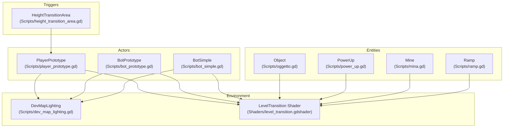
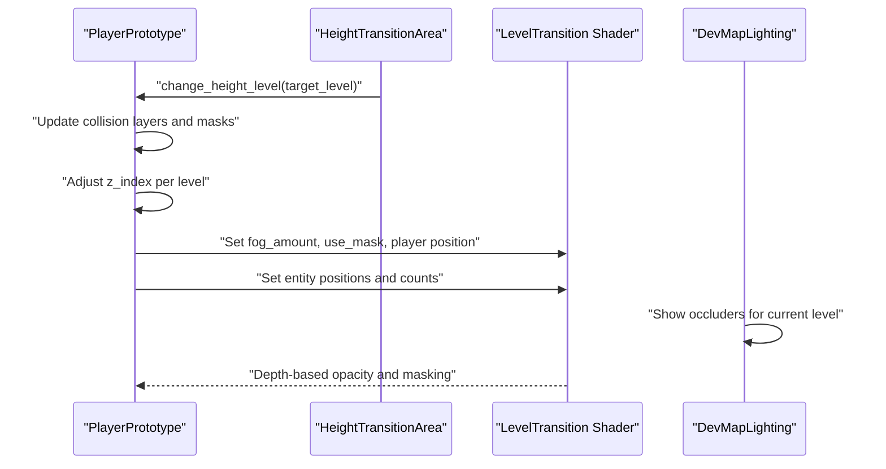
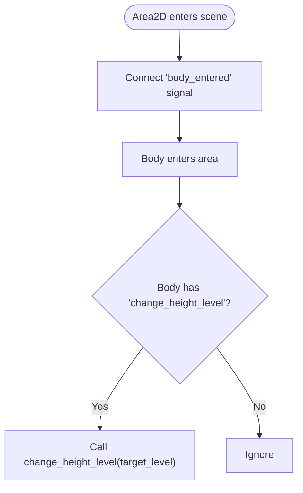
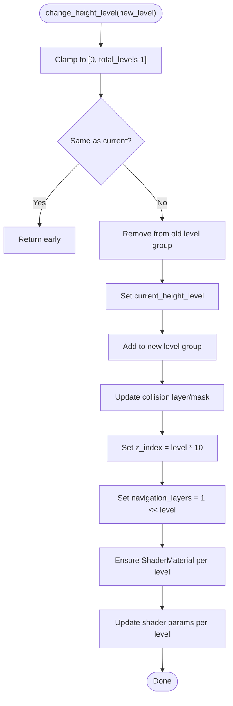
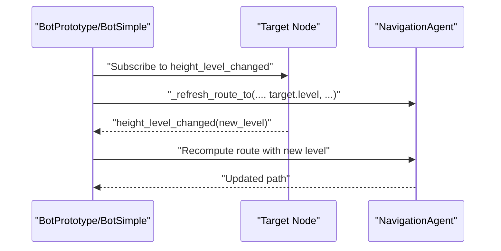
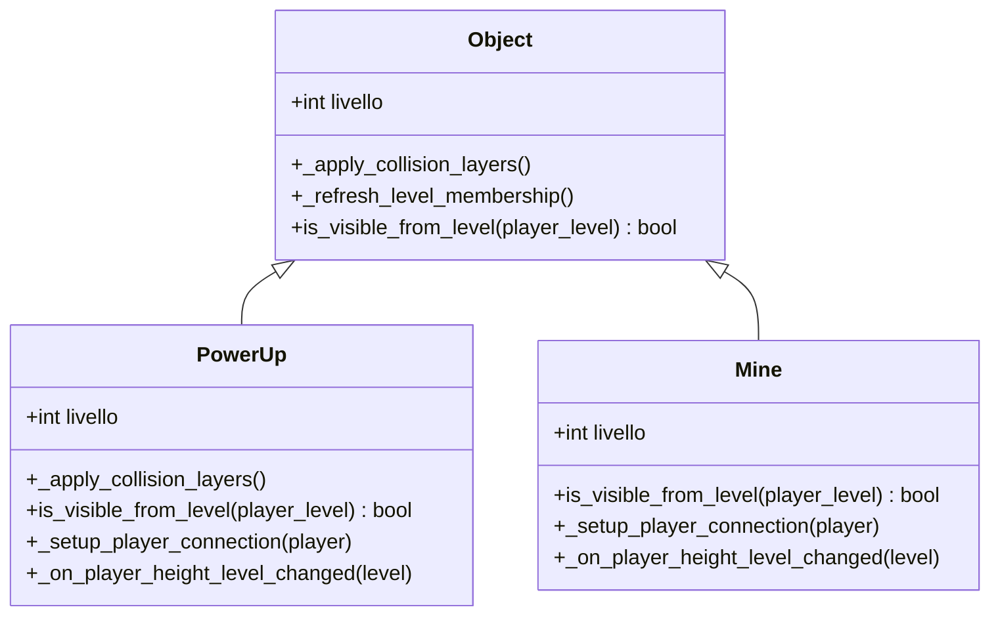
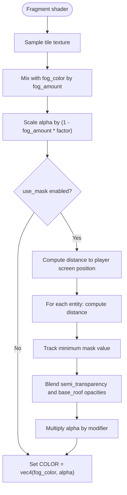
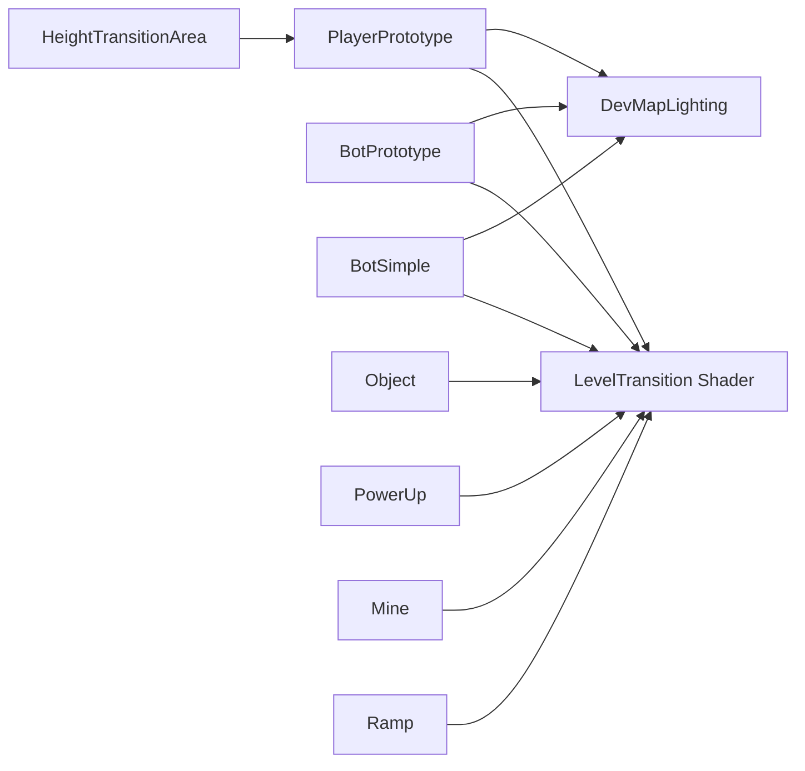

# Height Level System

<cite>
**Referenced Files in This Document**
- [height_transition_area.gd](file://Scripts/height_transition_area.gd)
- [level_transition.gdshader](file://Shaders/level_transition.gdshader)
- [player_prototype.gd](file://Scripts/player_prototype.gd)
- [bot_prototype.gd](file://Scripts/bot_prototype.gd)
- [bot_simple.gd](file://Scripts/bot_simple.gd)
- [oggetto.gd](file://Scripts/oggetto.gd)
- [power_up.gd](file://Scripts/power_up.gd)
- [mina.gd](file://Scripts/mina.gd)
- [ramp.gd](file://Scripts/ramp.gd)
- [dev_map_lighting.gd](file://Scripts/dev_map_lighting.gd)
</cite>

## Table of Contents
1. [Introduction](#introduction)
2. [Project Structure](#project-structure)
3. [Core Components](#core-components)
4. [Architecture Overview](#architecture-overview)
5. [Detailed Component Analysis](#detailed-component-analysis)
6. [Dependency Analysis](#dependency-analysis)
7. [Performance Considerations](#performance-considerations)
8. [Troubleshooting Guide](#troubleshooting-guide)
9. [Conclusion](#conclusion)
10. [Appendices](#appendices)

## Introduction
This document describes the Height Level System that enables 3D-like gameplay in a 2D space. It covers level transitions, collision layer management, z-index positioning, and visibility effects. It also documents the shader-based level masking system that creates depth perception through fog and masking, the logic for changing height levels, collision detection across levels, and navigation agent integration. Visual effects such as screen shake, level transition animations, and shader parameter updates are explained, along with the level shader implementation, entity grouping by level, and performance considerations for multiple levels. Examples of level configuration, custom level effects, and debugging tips are included.

## Project Structure
The Height Level System spans several scripts and a dedicated shader:
- Transition triggers: [height_transition_area.gd](file://Scripts/height_transition_area.gd)
- Player and AI movement: [player_prototype.gd](file://Scripts/player_prototype.gd), [bot_prototype.gd](file://Scripts/bot_prototype.gd), [bot_simple.gd](file://Scripts/bot_simple.gd)
- Entities and props: [oggetto.gd](file://Scripts/oggetto.gd), [power_up.gd](file://Scripts/power_up.gd), [mina.gd](file://Scripts/mina.gd), [ramp.gd](file://Scripts/ramp.gd)
- Lighting and occluders: [dev_map_lighting.gd](file://Scripts/dev_map_lighting.gd)
- Level masking shader: [level_transition.gdshader](file://Shaders/level_transition.gdshader)

**Diagram sources**
- [height_transition_area.gd:1-15](file://Scripts/height_transition_area.gd#L1-L15)
- [player_prototype.gd:330-352](file://Scripts/player_prototype.gd#L330-L352)
- [bot_prototype.gd:152-169](file://Scripts/bot_prototype.gd#L152-L169)
- [bot_simple.gd:220-250](file://Scripts/bot_simple.gd#L220-L250)
- [oggetto.gd:254-280](file://Scripts/oggetto.gd#L254-L280)
- [power_up.gd:188-235](file://Scripts/power_up.gd#L188-L235)
- [mina.gd:358-361](file://Scripts/mina.gd#L358-L361)
- [ramp.gd:93-96](file://Scripts/ramp.gd#L93-L96)
- [dev_map_lighting.gd:119-133](file://Scripts/dev_map_lighting.gd#L119-L133)
- [level_transition.gdshader:1-64](file://Shaders/level_transition.gdshader#L1-L64)

**Section sources**
- [height_transition_area.gd:1-15](file://Scripts/height_transition_area.gd#L1-L15)
- [player_prototype.gd:330-352](file://Scripts/player_prototype.gd#L330-L352)
- [bot_prototype.gd:152-169](file://Scripts/bot_prototype.gd#L152-L169)
- [bot_simple.gd:220-250](file://Scripts/bot_simple.gd#L220-L250)
- [oggetto.gd:254-280](file://Scripts/oggetto.gd#L254-L280)
- [power_up.gd:188-235](file://Scripts/power_up.gd#L188-L235)
- [mina.gd:358-361](file://Scripts/mina.gd#L358-L361)
- [ramp.gd:93-96](file://Scripts/ramp.gd#L93-L96)
- [dev_map_lighting.gd:119-133](file://Scripts/dev_map_lighting.gd#L119-L133)
- [level_transition.gdshader:1-64](file://Shaders/level_transition.gdshader#L1-L64)

## Core Components
- HeightTransitionArea: Triggers height level changes when actors enter its collision shape.
- PlayerPrototype: Manages height level transitions, collision layers, z-index, shader parameters, and camera shake.
- BotPrototype/BotSimple: Handle height-aware navigation and route updates.
- Entities (Object/PowerUp/Mine): Group by level, adjust visibility and z-index per level.
- Ramp: Visible only from connected levels; adjusts z-index and rotation per level.
- DevMapLighting: Controls occluder visibility per level.
- LevelTransition Shader: Implements fog and masking effects for depth perception.

**Section sources**
- [height_transition_area.gd:1-15](file://Scripts/height_transition_area.gd#L1-L15)
- [player_prototype.gd:330-352](file://Scripts/player_prototype.gd#L330-L352)
- [bot_prototype.gd:152-169](file://Scripts/bot_prototype.gd#L152-L169)
- [bot_simple.gd:220-250](file://Scripts/bot_simple.gd#L220-L250)
- [oggetto.gd:254-280](file://Scripts/oggetto.gd#L254-L280)
- [power_up.gd:188-235](file://Scripts/power_up.gd#L188-L235)
- [mina.gd:358-361](file://Scripts/mina.gd#L358-L361)
- [ramp.gd:93-96](file://Scripts/ramp.gd#L93-L96)
- [dev_map_lighting.gd:119-133](file://Scripts/dev_map_lighting.gd#L119-L133)
- [level_transition.gdshader:1-64](file://Shaders/level_transition.gdshader#L1-L64)

## Architecture Overview
The system orchestrates height level transitions through triggers, updates actor collision layers and z-index, and applies shader parameters per level. Visibility and occlusion are managed per level, while the shader enforces depth cues.

**Diagram sources**
- [height_transition_area.gd:11-14](file://Scripts/height_transition_area.gd#L11-L14)
- [player_prototype.gd:330-352](file://Scripts/player_prototype.gd#L330-L352)
- [player_prototype.gd:668-681](file://Scripts/player_prototype.gd#L668-L681)
- [player_prototype.gd:683-693](file://Scripts/player_prototype.gd#L683-L693)
- [player_prototype.gd:695-719](file://Scripts/player_prototype.gd#L695-L719)
- [player_prototype.gd:719-758](file://Scripts/player_prototype.gd#L719-L758)
- [dev_map_lighting.gd:119-133](file://Scripts/dev_map_lighting.gd#L119-L133)
- [level_transition.gdshader:23-63](file://Shaders/level_transition.gdshader#L23-L63)

## Detailed Component Analysis

### HeightTransitionArea
- Purpose: Detects when actors enter the area and invokes a height-level change method on the colliding body.
- Behavior: Connects to the body_entered signal at ready and checks for a change_height_level method before invoking it with the configured target level.

**Diagram sources**
- [height_transition_area.gd:7-14](file://Scripts/height_transition_area.gd#L7-L14)

**Section sources**
- [height_transition_area.gd:1-15](file://Scripts/height_transition_area.gd#L1-L15)

### PlayerPrototype: Height Level Management
- Level Change: Updates collision layers/masks, z-index, and navigation layers; groups entities accordingly.
- Shader Setup: Creates ShaderMaterial instances for each level’s canvas items and assigns the level shader.
- Shader Parameters: Updates player screen position, mask radius/softness, entity positions array, and fog amount per level.
- Visibility Effects: Sets use_mask and fog_amount depending on whether the level is above or below the current level; toggles entity visibility for the current level.
- Camera Shake: Applies configurable screen shake feedback during gameplay.

**Diagram sources**
- [player_prototype.gd:330-352](file://Scripts/player_prototype.gd#L330-L352)
- [player_prototype.gd:668-681](file://Scripts/player_prototype.gd#L668-L681)
- [player_prototype.gd:683-693](file://Scripts/player_prototype.gd#L683-L693)
- [player_prototype.gd:695-719](file://Scripts/player_prototype.gd#L695-L719)
- [player_prototype.gd:719-758](file://Scripts/player_prototype.gd#L719-L758)

**Section sources**
- [player_prototype.gd:330-352](file://Scripts/player_prototype.gd#L330-L352)
- [player_prototype.gd:668-681](file://Scripts/player_prototype.gd#L668-L681)
- [player_prototype.gd:683-693](file://Scripts/player_prototype.gd#L683-L693)
- [player_prototype.gd:695-719](file://Scripts/player_prototype.gd#L695-L719)
- [player_prototype.gd:719-758](file://Scripts/player_prototype.gd#L719-L758)

### BotPrototype and BotSimple: Navigation Across Levels
- Route Planning: Uses the tracked target’s height level when computing navigation requests.
- Signal Handling: Subscribes to target’s height_level_changed to refresh routes.
- Path Drawing: Filters points to only draw when the target is on the same level.

**Diagram sources**
- [bot_prototype.gd:122-131](file://Scripts/bot_prototype.gd#L122-L131)
- [bot_simple.gd:220-250](file://Scripts/bot_simple.gd#L220-L250)

**Section sources**
- [bot_prototype.gd:122-169](file://Scripts/bot_prototype.gd#L122-L169)
- [bot_simple.gd:220-250](file://Scripts/bot_simple.gd#L220-L250)

### Entities and Props: Level Membership and Visibility
- Collision Layers: Derived from the entity’s level to define what it collides with.
- Groups: Entities register themselves into a level-specific group and update membership when their level changes.
- Visibility: Entities are visible only from their own level; z-index is adjusted accordingly.

**Diagram sources**
- [oggetto.gd:254-280](file://Scripts/oggetto.gd#L254-L280)
- [oggetto.gd:279-314](file://Scripts/oggetto.gd#L279-L314)
- [power_up.gd:188-235](file://Scripts/power_up.gd#L188-L235)
- [mina.gd:358-361](file://Scripts/mina.gd#L358-L361)

**Section sources**
- [oggetto.gd:254-280](file://Scripts/oggetto.gd#L254-L280)
- [oggetto.gd:279-314](file://Scripts/oggetto.gd#L279-L314)
- [power_up.gd:188-235](file://Scripts/power_up.gd#L188-L235)
- [mina.gd:358-361](file://Scripts/mina.gd#L358-L361)

### Ramp: Level-Specific Visibility and Rendering
- Visibility: Visible only from the start or arrival level.
- Rendering: Adjusts z-index and rotation based on the player’s current level.

**Section sources**
- [ramp.gd:53-96](file://Scripts/ramp.gd#L53-L96)

### DevMapLighting: Occluder Visibility Per Level
- Controls which occluder containers are visible based on the player’s current level.

**Section sources**
- [dev_map_lighting.gd:119-133](file://Scripts/dev_map_lighting.gd#L119-L133)

### LevelTransition Shader: Fog and Masking Effects
- Fog: Mixes tile color with a fog color based on fog_amount, reducing alpha for lower levels.
- Masking: Applies a circular transparency mask around the player and nearby entities when the player is above another level, with soft edges and an elliptical scale.
- Parameters:
  - fog_amount: Controls depth fade for lower levels.
  - fog_color: Base color for fog blending.
  - use_mask: Enables masking when the player is above another level.
  - player_screen_position: Screen-space position of the player.
  - mask_radius, mask_softness: Control the size and falloff of the player mask.
  - ellipse_y_scale: Stretches the mask vertically for aspect ratio.
  - semi_transparency_opacity: Opacity inside the mask region.
  - base_roof_opacity: Opacity outside the mask region.
  - entity_screen_positions[], entity_count, entity_radius, entity_softness: Additional entity-based masking.

**Diagram sources**
- [level_transition.gdshader:23-63](file://Shaders/level_transition.gdshader#L23-L63)

**Section sources**
- [level_transition.gdshader:1-64](file://Shaders/level_transition.gdshader#L1-L64)

## Dependency Analysis
- Actors depend on HeightTransitionArea to trigger level changes.
- PlayerPrototype and bots update collision layers and navigation layers per level.
- Shader parameters are updated per level to reflect the player’s position and surrounding entities.
- DevMapLighting toggles occluders per level.
- Entities register into level-specific groups and adjust visibility and z-index.

**Diagram sources**
- [height_transition_area.gd:11-14](file://Scripts/height_transition_area.gd#L11-L14)
- [player_prototype.gd:330-352](file://Scripts/player_prototype.gd#L330-L352)
- [player_prototype.gd:668-681](file://Scripts/player_prototype.gd#L668-L681)
- [player_prototype.gd:695-719](file://Scripts/player_prototype.gd#L695-L719)
- [bot_prototype.gd:122-131](file://Scripts/bot_prototype.gd#L122-L131)
- [bot_simple.gd:220-250](file://Scripts/bot_simple.gd#L220-L250)
- [oggetto.gd:254-280](file://Scripts/oggetto.gd#L254-L280)
- [power_up.gd:188-235](file://Scripts/power_up.gd#L188-L235)
- [mina.gd:358-361](file://Scripts/mina.gd#L358-L361)
- [ramp.gd:93-96](file://Scripts/ramp.gd#L93-L96)
- [dev_map_lighting.gd:119-133](file://Scripts/dev_map_lighting.gd#L119-L133)
- [level_transition.gdshader:1-64](file://Shaders/level_transition.gdshader#L1-L64)

**Section sources**
- [height_transition_area.gd:1-15](file://Scripts/height_transition_area.gd#L1-L15)
- [player_prototype.gd:330-352](file://Scripts/player_prototype.gd#L330-L352)
- [bot_prototype.gd:122-169](file://Scripts/bot_prototype.gd#L122-L169)
- [bot_simple.gd:220-250](file://Scripts/bot_simple.gd#L220-L250)
- [oggetto.gd:254-280](file://Scripts/oggetto.gd#L254-L280)
- [power_up.gd:188-235](file://Scripts/power_up.gd#L188-L235)
- [mina.gd:358-361](file://Scripts/mina.gd#L358-L361)
- [ramp.gd:93-96](file://Scripts/ramp.gd#L93-L96)
- [dev_map_lighting.gd:119-133](file://Scripts/dev_map_lighting.gd#L119-L133)
- [level_transition.gdshader:1-64](file://Shaders/level_transition.gdshader#L1-L64)

## Performance Considerations
- Shader Parameter Updates:
  - Limit entity count passed to the shader to reduce uniform overhead; capped at 24 entities.
  - Scale mask radius and softness with camera zoom to maintain consistent visual impact without unnecessary computation.
- Collision Layer Management:
  - Keep collision masks minimal and aligned to level offsets to avoid broad queries.
- Visibility Culling:
  - Toggle visibility of entities and occluders per level to reduce draw calls.
- Navigation:
  - Filter navigation paths to the target’s level to prevent invalid routing computations.
- Camera Shake:
  - Disable or reduce intensity when performance is constrained.

[No sources needed since this section provides general guidance]

## Troubleshooting Guide
- Player does not change levels:
  - Verify HeightTransitionArea target_level and that the body has a change_height_level method.
  - Confirm the signal connection in _ready.
- Incorrect visibility or z-index:
  - Ensure entities are registered into the correct level group and that z_index is computed as level * 10 + offset.
  - Check collision layer/mask alignment with level offsets.
- Shader artifacts or incorrect masking:
  - Validate player_screen_position and entity positions are transformed by the viewport canvas transform.
  - Confirm use_mask is enabled only when the player is above another level.
  - Adjust fog_amount and entity_radius/softness to match intended depth perception.
- Navigation errors:
  - Ensure navigation_layers matches the current level and that route targets resolve to the correct level.
- Lighting issues:
  - Confirm occluder containers are toggled per level based on the player’s current level.

**Section sources**
- [height_transition_area.gd:7-14](file://Scripts/height_transition_area.gd#L7-L14)
- [oggetto.gd:254-280](file://Scripts/oggetto.gd#L254-L280)
- [player_prototype.gd:668-681](file://Scripts/player_prototype.gd#L668-L681)
- [player_prototype.gd:695-719](file://Scripts/player_prototype.gd#L695-L719)
- [bot_simple.gd:220-250](file://Scripts/bot_simple.gd#L220-L250)
- [dev_map_lighting.gd:119-133](file://Scripts/dev_map_lighting.gd#L119-L133)

## Conclusion
The Height Level System combines trigger-based transitions, level-aware collision and rendering, and a shader-driven depth effect to simulate 3D-like gameplay in 2D. By carefully managing groups, visibility, shader parameters, and navigation layers, the system achieves immersive depth perception and robust gameplay mechanics across multiple levels.

[No sources needed since this section summarizes without analyzing specific files]

## Appendices

### Level Configuration Examples
- HeightTransitionArea:
  - Set target_level to the desired destination level when the player enters the area.
- PlayerPrototype:
  - total_levels defines the number of supported levels; ensure navigation_layers and shader materials are set per level.
- Entities:
  - Assign livello to the entity’s level; collision layers and visibility will follow automatically.

**Section sources**
- [height_transition_area.gd:4-5](file://Scripts/height_transition_area.gd#L4-L5)
- [player_prototype.gd:330-352](file://Scripts/player_prototype.gd#L330-L352)
- [oggetto.gd:254-280](file://Scripts/oggetto.gd#L254-L280)

### Custom Level Effects
- Shader Parameters:
  - Modify fog_color and fog_amount to adjust depth perception.
  - Tune mask_radius, mask_softness, and ellipse_y_scale for player masking.
  - Adjust entity_radius and entity_softness to influence nearby-entity masking.
- Visual Feedback:
  - Integrate screen shake or transition animations in response to level changes.

**Section sources**
- [level_transition.gdshader:3-22](file://Shaders/level_transition.gdshader#L3-L22)
- [player_prototype.gd:651-666](file://Scripts/player_prototype.gd#L651-L666)