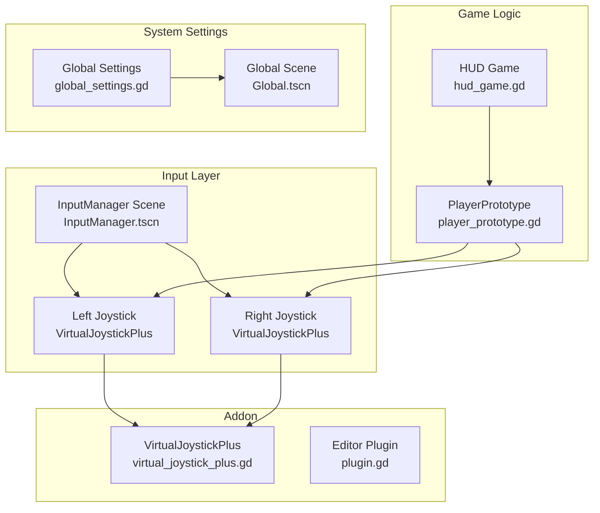
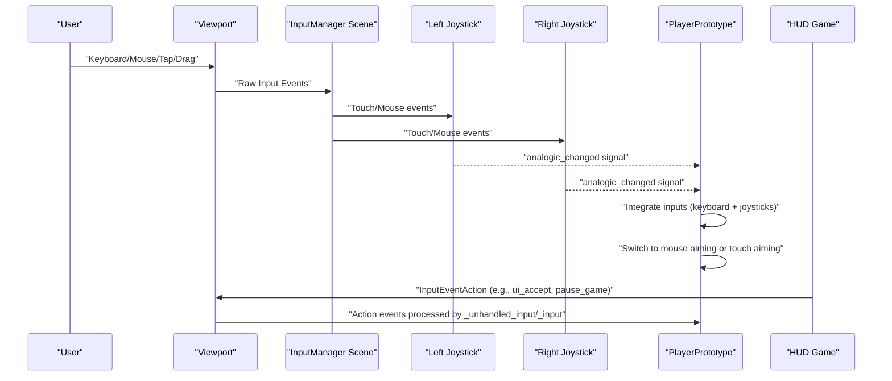
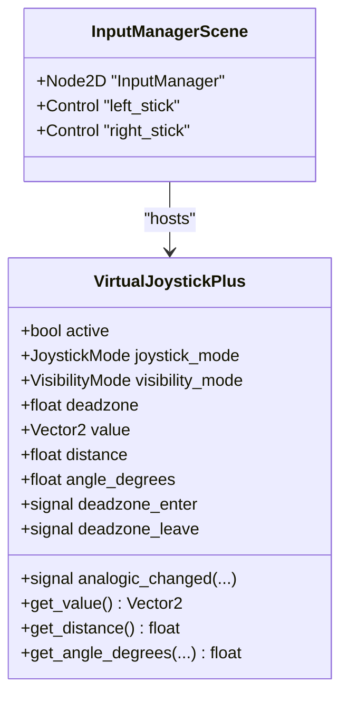
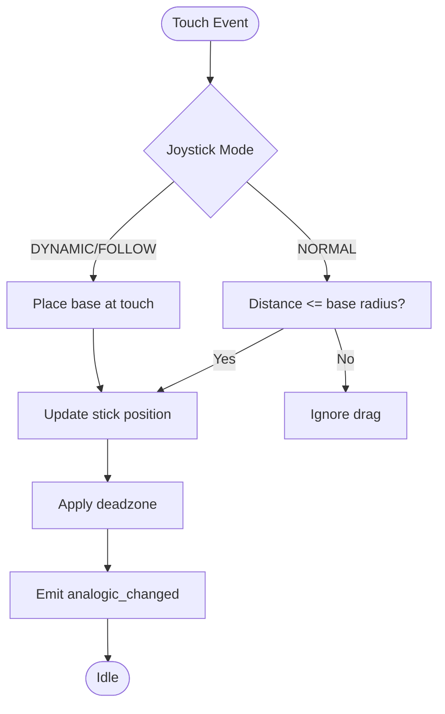
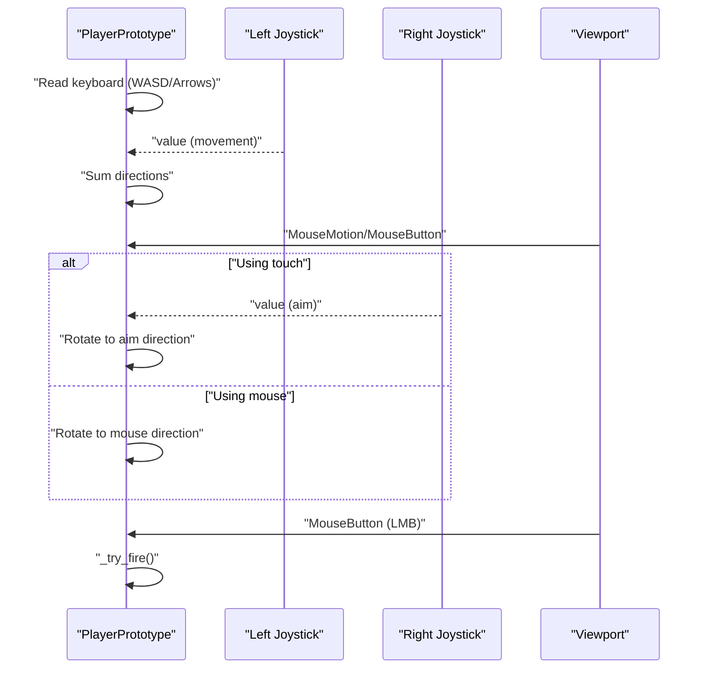
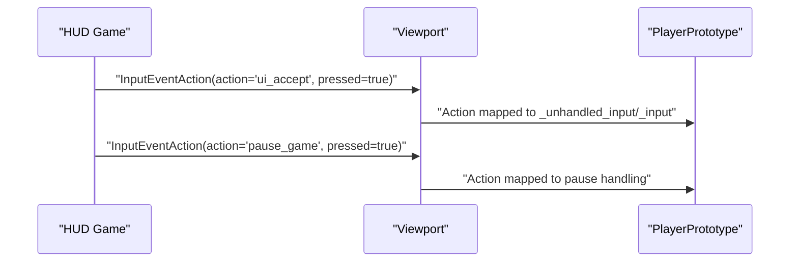
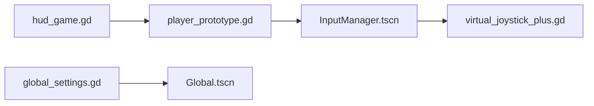

# Input Management

<cite>
**Referenced Files in This Document**
- [input_manager.gd](file://Game/input_manager.gd)
- [InputManager.tscn](file://Game/InputManager.tscn)
- [virtual_joystick_plus.gd](file://addons/virtual_joystick_plus/virtual_joystick_plus.gd)
- [plugin.gd](file://addons/virtual_joystick_plus/plugin.gd)
- [player_prototype.gd](file://Scripts/player_prototype.gd)
- [hud_game.gd](file://Menu/HUD/hud_game.gd)
- [global_settings.gd](file://Scripts/global_settings.gd)
- [Global.tscn](file://Global.tscn)
</cite>

## Table of Contents
1. [Introduction](#introduction)
2. [Project Structure](#project-structure)
3. [Core Components](#core-components)
4. [Architecture Overview](#architecture-overview)
5. [Detailed Component Analysis](#detailed-component-analysis)
6. [Dependency Analysis](#dependency-analysis)
7. [Performance Considerations](#performance-considerations)
8. [Troubleshooting Guide](#troubleshooting-guide)
9. [Conclusion](#conclusion)

## Introduction
This document describes the Input Management system that centralizes keyboard, mouse, and touch controls for the game. It explains the InputManager node structure, the dual-mode virtual joystick addon for desktop and mobile, action mapping via Input.parse_input_event, and the event processing pipeline from raw input to game actions. It also covers configuration options, sensitivity tuning, and practical guidance for customization, debugging, and optimizing input responsiveness.

## Project Structure
The Input Management system is composed of:
- A dedicated InputManager scene that hosts two virtual joysticks (left and right).
- A reusable virtual joystick addon providing analog stick behavior and signals.
- Player logic that reads joystick values and switches between mouse aiming and touch aiming.
- HUD logic that triggers actions (such as shooting) and parses them into the engine’s action map.
- Global settings that influence rendering and UI scaling, indirectly affecting input responsiveness.

**Diagram sources**
- [InputManager.tscn:8-48](file://Game/InputManager.tscn#L8-L48)
- [virtual_joystick_plus.gd:1-657](file://addons/virtual_joystick_plus/virtual_joystick_plus.gd#L1-L657)
- [player_prototype.gd:29-31](file://Scripts/player_prototype.gd#L29-L31)
- [hud_game.gd:150-176](file://Menu/HUD/hud_game.gd#L150-L176)
- [global_settings.gd:1-618](file://Scripts/global_settings.gd#L1-L618)
- [Global.tscn:1-32](file://Global.tscn#L1-L32)

**Section sources**
- [InputManager.tscn:1-48](file://Game/InputManager.tscn#L1-L48)
- [virtual_joystick_plus.gd:1-657](file://addons/virtual_joystick_plus/virtual_joystick_plus.gd#L1-L657)
- [player_prototype.gd:29-31](file://Scripts/player_prototype.gd#L29-L31)
- [hud_game.gd:150-176](file://Menu/HUD/hud_game.gd#L150-L176)
- [global_settings.gd:1-618](file://Scripts/global_settings.gd#L1-L618)
- [Global.tscn:1-32](file://Global.tscn#L1-L32)

## Core Components
- InputManager scene: Hosts two VirtualJoystickPlus nodes configured for left movement and right aim/shoot.
- VirtualJoystickPlus: A configurable on-screen analog stick with three operation modes, deadzone, and signals for analogic values.
- PlayerPrototype: Reads joystick values, handles keyboard/mouse input, and toggles between mouse aiming and touch aiming.
- HUD Game: Emits actions (e.g., pause, shoot) by constructing InputEventAction and passing them to Input.parse_input_event.
- Global Settings: Applies UI scale and other system settings that can affect input responsiveness and layout.

Key responsibilities:
- Centralized input handling for desktop and mobile.
- Action mapping through Input.parse_input_event.
- Dual-mode joystick support (desktop vs. mobile).
- Sensitivity and deadzone configuration.

**Section sources**
- [input_manager.gd:1-2](file://Game/input_manager.gd#L1-L2)
- [InputManager.tscn:8-48](file://Game/InputManager.tscn#L8-L48)
- [virtual_joystick_plus.gd:107-121](file://addons/virtual_joystick_plus/virtual_joystick_plus.gd#L107-L121)
- [player_prototype.gd:261-298](file://Scripts/player_prototype.gd#L261-L298)
- [hud_game.gd:150-176](file://Menu/HUD/hud_game.gd#L150-L176)
- [global_settings.gd:164-183](file://Scripts/global_settings.gd#L164-L183)

## Architecture Overview
The input pipeline processes raw input events and converts them into actionable game states:
- Raw input: Keyboard keys, mouse motion/buttons, and touch events.
- Virtual joystick: Translates touch gestures into normalized analog vectors and emits signals.
- Player logic: Integrates keyboard/mouse and joystick inputs; selects mouse aiming or touch aiming based on device type and input source.
- HUD actions: Converts UI-triggered actions into InputEvents parsed by the engine’s action map.

**Diagram sources**
- [virtual_joystick_plus.gd:107-121](file://addons/virtual_joystick_plus/virtual_joystick_plus.gd#L107-L121)
- [virtual_joystick_plus.gd:501-519](file://addons/virtual_joystick_plus/virtual_joystick_plus.gd#L501-L519)
- [player_prototype.gd:261-298](file://Scripts/player_prototype.gd#L261-L298)
- [hud_game.gd:150-176](file://Menu/HUD/hud_game.gd#L150-L176)

## Detailed Component Analysis

### InputManager Scene and Nodes
- The InputManager scene instantiates two VirtualJoystickPlus nodes:
  - Left joystick for movement.
  - Right joystick for aiming/shooting.
- Each joystick is configured with:
  - Joystick mode NORMAL for fixed base.
  - Only-mobile visibility for on-device deployment.
  - Custom textures/colors and presets.
  - Relative positioning and sizes suitable for split-screen-like layouts.

**Diagram sources**
- [InputManager.tscn:8-48](file://Game/InputManager.tscn#L8-L48)
- [virtual_joystick_plus.gd:8-121](file://addons/virtual_joystick_plus/virtual_joystick_plus.gd#L8-L121)

**Section sources**
- [InputManager.tscn:8-48](file://Game/InputManager.tscn#L8-L48)
- [virtual_joystick_plus.gd:123-194](file://addons/virtual_joystick_plus/virtual_joystick_plus.gd#L123-L194)
- [virtual_joystick_plus.gd:196-274](file://addons/virtual_joystick_plus/virtual_joystick_plus.gd#L196-L274)

### VirtualJoystickPlus Behavior and Signals
- Modes:
  - NORMAL: Responds only to touches inside the base area.
  - DYNAMIC/FOLLOW: Appears at touch location; FOLLOW moves the base when the stick hits the outer radius.
- Visibility:
  - VISIBILITY_ALWAYS or VISIBILITY_WHEN_TOUCHED.
- Deadzone:
  - Smoothly normalizes small inputs to zero to avoid jitter.
- Signals:
  - analogic_changed(value, distance, angles) emitted during movement.
  - deadzone_enter/leave emitted when crossing thresholds.

**Diagram sources**
- [virtual_joystick_plus.gd:318-372](file://addons/virtual_joystick_plus/virtual_joystick_plus.gd#L318-L372)
- [virtual_joystick_plus.gd:422-462](file://addons/virtual_joystick_plus/virtual_joystick_plus.gd#L422-L462)
- [virtual_joystick_plus.gd:464-498](file://addons/virtual_joystick_plus/virtual_joystick_plus.gd#L464-L498)
- [virtual_joystick_plus.gd:501-519](file://addons/virtual_joystick_plus/virtual_joystick_plus.gd#L501-L519)

**Section sources**
- [virtual_joystick_plus.gd:88-97](file://addons/virtual_joystick_plus/virtual_joystick_plus.gd#L88-L97)
- [virtual_joystick_plus.gd:146-154](file://addons/virtual_joystick_plus/virtual_joystick_plus.gd#L146-L154)
- [virtual_joystick_plus.gd:156-165](file://addons/virtual_joystick_plus/virtual_joystick_plus.gd#L156-L165)
- [virtual_joystick_plus.gd:167-173](file://addons/virtual_joystick_plus/virtual_joystick_plus.gd#L167-L173)
- [virtual_joystick_plus.gd:190-193](file://addons/virtual_joystick_plus/virtual_joystick_plus.gd#L190-L193)
- [virtual_joystick_plus.gd:422-462](file://addons/virtual_joystick_plus/virtual_joystick_plus.gd#L422-L462)
- [virtual_joystick_plus.gd:464-498](file://addons/virtual_joystick_plus/virtual_joystick_plus.gd#L464-L498)
- [virtual_joystick_plus.gd:501-519](file://addons/virtual_joystick_plus/virtual_joystick_plus.gd#L501-L519)

### Player Input Processing
- Movement:
  - Integrates WASD/arrow keys with left joystick value.
- Aiming:
  - Mouse aiming when not using touch.
  - Touch aiming via right joystick when touch input is detected.
- Shooting:
  - Left mouse button fires.
  - Touch HUD can trigger shooting actions via InputEventAction.

**Diagram sources**
- [player_prototype.gd:261-298](file://Scripts/player_prototype.gd#L261-L298)
- [player_prototype.gd:230-249](file://Scripts/player_prototype.gd#L230-L249)
- [player_prototype.gd:251-258](file://Scripts/player_prototype.gd#L251-L258)

**Section sources**
- [player_prototype.gd:261-298](file://Scripts/player_prototype.gd#L261-L298)
- [player_prototype.gd:230-249](file://Scripts/player_prototype.gd#L230-L249)
- [player_prototype.gd:251-258](file://Scripts/player_prototype.gd#L251-L258)

### HUD Actions and Action Mapping
- The HUD constructs InputEventAction instances for actions like ui_accept (shoot) and pause_game.
- These are passed to Input.parse_input_event, which routes them to the action map used by the game logic.

**Diagram sources**
- [hud_game.gd:150-176](file://Menu/HUD/hud_game.gd#L150-L176)

**Section sources**
- [hud_game.gd:150-176](file://Menu/HUD/hud_game.gd#L150-L176)

### Editor Plugin Integration
- The addon registers VirtualJoystickPlus as a custom control in the editor, enabling placement and configuration directly in scenes.

**Section sources**
- [plugin.gd:7-11](file://addons/virtual_joystick_plus/plugin.gd#L7-L11)

## Dependency Analysis
- InputManager scene depends on VirtualJoystickPlus nodes.
- PlayerPrototype depends on InputManager’s joystick children and reads their values.
- HUD depends on the action map and Input.parse_input_event.
- Global settings influence UI scale and rendering, indirectly affecting perceived input responsiveness.

**Diagram sources**
- [InputManager.tscn:8-48](file://Game/InputManager.tscn#L8-L48)
- [virtual_joystick_plus.gd:1-657](file://addons/virtual_joystick_plus/virtual_joystick_plus.gd#L1-L657)
- [player_prototype.gd:29-31](file://Scripts/player_prototype.gd#L29-L31)
- [hud_game.gd:150-176](file://Menu/HUD/hud_game.gd#L150-L176)
- [global_settings.gd:164-183](file://Scripts/global_settings.gd#L164-L183)
- [Global.tscn:1-32](file://Global.tscn#L1-L32)

**Section sources**
- [InputManager.tscn:8-48](file://Game/InputManager.tscn#L8-L48)
- [virtual_joystick_plus.gd:1-657](file://addons/virtual_joystick_plus/virtual_joystick_plus.gd#L1-L657)
- [player_prototype.gd:29-31](file://Scripts/player_prototype.gd#L29-L31)
- [hud_game.gd:150-176](file://Menu/HUD/hud_game.gd#L150-L176)
- [global_settings.gd:164-183](file://Scripts/global_settings.gd#L164-L183)
- [Global.tscn:1-32](file://Global.tscn#L1-L32)

## Performance Considerations
- Deadzone reduces micro-movements and signal noise, improving stability without sacrificing precision.
- Using only-mobile visibility prevents unnecessary rendering on desktop platforms.
- Signal emission occurs only when values change, minimizing redundant updates.
- Keep joystick scale and sizes proportional to screen size to maintain consistent sensitivity across devices.

[No sources needed since this section provides general guidance]

## Troubleshooting Guide
Common issues and resolutions:
- Joystick not visible on desktop:
  - Verify only_mobile is disabled or platform is Android/iOS.
- No response when dragging:
  - Ensure joystick_mode is NORMAL/DYNAMIC/FOLLOW and the Control area covers the intended interaction region.
- Stuttering or jittery movement:
  - Increase deadzone slightly to filter minor drift.
- Touch aiming not triggering shooting:
  - Confirm HUD emits InputEventAction with the correct action name and pressed state.
- Mouse aiming feels sluggish:
  - Adjust rotation interpolation and ensure mouse input is not blocked by other controls.

**Section sources**
- [virtual_joystick_plus.gd:167-173](file://addons/virtual_joystick_plus/virtual_joystick_plus.gd#L167-L173)
- [virtual_joystick_plus.gd:127-138](file://addons/virtual_joystick_plus/virtual_joystick_plus.gd#L127-L138)
- [virtual_joystick_plus.gd:156-165](file://addons/virtual_joystick_plus/virtual_joystick_plus.gd#L156-L165)
- [hud_game.gd:150-176](file://Menu/HUD/hud_game.gd#L150-L176)
- [player_prototype.gd:294-297](file://Scripts/player_prototype.gd#L294-L297)

## Conclusion
The Input Management system centralizes input handling across keyboard, mouse, and touch, leveraging a robust virtual joystick addon to deliver consistent gameplay on both desktop and mobile. By combining raw input processing, action mapping, and configurable sensitivity, it enables flexible control schemes and reliable responsiveness. Use the provided configuration options and troubleshooting tips to tailor input behavior to your audience and optimize the player experience.