# Movement Mechanics

<cite>
**Referenced Files in This Document**
- [player_prototype.gd](file://Scripts/player_prototype.gd)
- [input_manager.gd](file://Game/input_manager.gd)
- [virtual_joystick_plus.gd](file://addons/virtual_joystick_plus/virtual_joystick_plus.gd)
- [bot_prototype.gd](file://Scripts/bot_prototype.gd)
- [bot_simple.gd](file://Scripts/bot_simple.gd)
- [ramp.gd](file://Scripts/ramp.gd)
- [projectile_visual.gd](file://Scripts/projectile_visual.gd)
- [Piano1.tres](file://Maps/Nav1/Piano1.tres)
</cite>

## Table of Contents
1. [Introduction](#introduction)
2. [Project Structure](#project-structure)
3. [Core Components](#core-components)
4. [Architecture Overview](#architecture-overview)
5. [Detailed Component Analysis](#detailed-component-analysis)
6. [Dependency Analysis](#dependency-analysis)
7. [Performance Considerations](#performance-considerations)
8. [Troubleshooting Guide](#troubleshooting-guide)
9. [Conclusion](#conclusion)

## Introduction
This document focuses on the Movement Mechanics of the Player System, centered around the CharacterBody2D implementation. It explains how acceleration curves, velocity interpolation, and ground/air control are handled, along with movement parameters such as speed, acceleration, and friction-like behavior. It also documents the input processing pipeline from keyboard/mouse/touch to character movement, collision detection with walls and platforms, slope handling, movement constraints, the physics process, vector calculations, and smooth movement interpolation. Practical examples, performance optimization techniques, and troubleshooting common movement issues are included.

## Project Structure
The movement system spans several scripts and assets:
- Player controller logic and input pipeline
- Virtual joystick addon for analog input
- Height-level aware collision routing for multi-layered navigation
- Ramp transitions for vertical movement
- Navigation mesh configuration for layered worlds

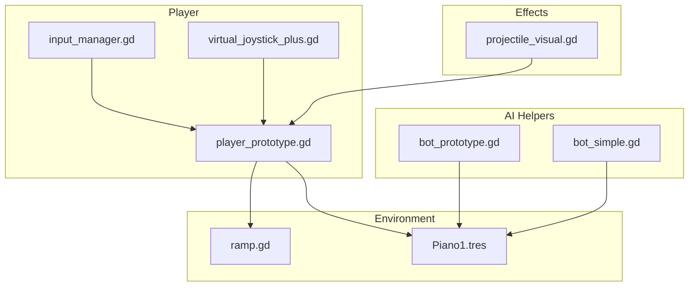

**Diagram sources**
- [player_prototype.gd](file://Scripts/player_prototype.gd)
- [input_manager.gd](file://Game/input_manager.gd)
- [virtual_joystick_plus.gd](file://addons/virtual_joystick_plus/virtual_joystick_plus.gd)
- [bot_prototype.gd](file://Scripts/bot_prototype.gd)
- [bot_simple.gd](file://Scripts/bot_simple.gd)
- [ramp.gd](file://Scripts/ramp.gd)
- [Piano1.tres](file://Maps/Nav1/Piano1.tres)
- [projectile_visual.gd](file://Scripts/projectile_visual.gd)

**Section sources**
- [player_prototype.gd](file://Scripts/player_prototype.gd)
- [input_manager.gd](file://Game/input_manager.gd)
- [virtual_joystick_plus.gd](file://addons/virtual_joystick_plus/virtual_joystick_plus.gd)
- [bot_prototype.gd](file://Scripts/bot_prototype.gd)
- [bot_simple.gd](file://Scripts/bot_simple.gd)
- [ramp.gd](file://Scripts/ramp.gd)
- [Piano1.tres](file://Maps/Nav1/Piano1.tres)
- [projectile_visual.gd](file://Scripts/projectile_visual.gd)

## Core Components
- Player controller: Reads input, computes target velocity, applies acceleration via linear interpolation, and integrates movement using the physics engine.
- Input manager: Centralizes input mapping and state.
- Virtual joystick: Provides analog stick input with deadzone shaping and emits normalized vectors.
- AI helpers: Demonstrate similar acceleration/lerp patterns and smoothed look direction for comparison.
- Environment: Ramps enable height-level transitions; navigation meshes support multi-layered world geometry.

Key movement behaviors:
- Acceleration curve: Velocity approaches target velocity using a fixed-time smoothing factor dependent on delta.
- Friction-like stopping: When input is absent, velocity decays toward zero with a stop smoothing factor.
- Ground/air control: Movement is integrated via the physics engine’s collision and movement routine.
- Slope handling: Managed implicitly by the physics engine during move_and_slide.
- Movement constraints: Directional input is combined with analog stick; normalized to avoid diagonal speedup.

**Section sources**
- [player_prototype.gd:260-283](file://Scripts/player_prototype.gd#L260-L283)
- [bot_prototype.gd:99-105](file://Scripts/bot_prototype.gd#L99-L105)
- [bot_simple.gd:79-85](file://Scripts/bot_simple.gd#L79-L85)

## Architecture Overview
The movement pipeline integrates input, computes desired motion, applies acceleration, and delegates collision and movement to the physics engine.

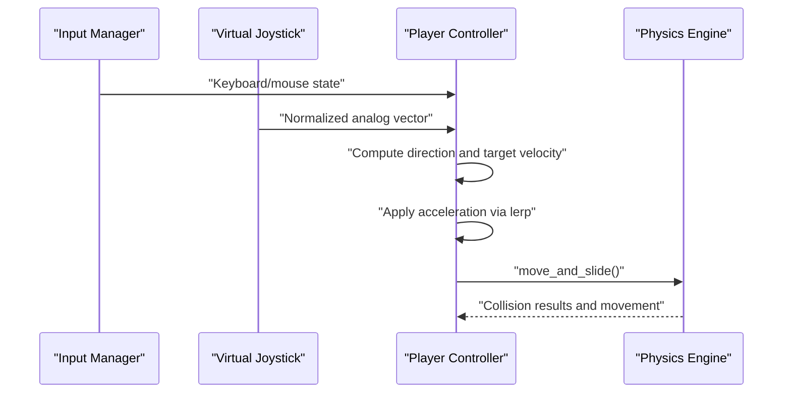

**Diagram sources**
- [player_prototype.gd:260-283](file://Scripts/player_prototype.gd#L260-L283)
- [virtual_joystick_plus.gd:464-499](file://addons/virtual_joystick_plus/virtual_joystick_plus.gd#L464-L499)
- [input_manager.gd](file://Game/input_manager.gd)

## Detailed Component Analysis

### Player Controller Movement Loop
The player controller reads discrete and analog inputs, computes a normalized direction, derives a target velocity, accelerates toward it using a delta-dependent weight, and finally moves using the physics engine.

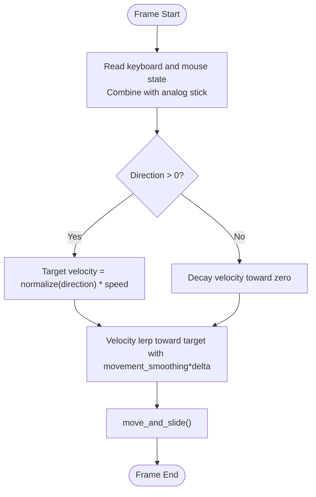

**Diagram sources**
- [player_prototype.gd:260-283](file://Scripts/player_prototype.gd#L260-L283)

**Section sources**
- [player_prototype.gd:260-283](file://Scripts/player_prototype.gd#L260-L283)

### Input Processing Pipeline
- Keyboard: W/A/S/D and arrow keys contribute to direction.
- Mouse: Rotation is smoothly interpolated toward the mouse direction when not using touch aim.
- Touch: Right stick provides analog look; left stick can be used for movement depending on configuration.
- Deadzone: Analog values below a threshold are treated as zero to prevent jitter.

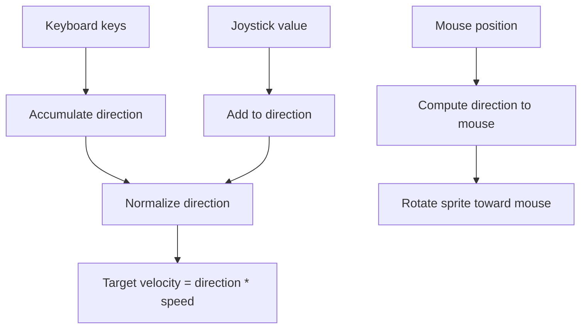

**Diagram sources**
- [player_prototype.gd:260-293](file://Scripts/player_prototype.gd#L260-L293)
- [virtual_joystick_plus.gd:464-499](file://addons/virtual_joystick_plus/virtual_joystick_plus.gd#L464-L499)

**Section sources**
- [player_prototype.gd:260-293](file://Scripts/player_prototype.gd#L260-L293)
- [virtual_joystick_plus.gd:318-373](file://addons/virtual_joystick_plus/virtual_joystick_plus.gd#L318-L373)
- [virtual_joystick_plus.gd:464-499](file://addons/virtual_joystick_plus/virtual_joystick_plus.gd#L464-L499)

### Acceleration Curves and Velocity Interpolation
- Movement acceleration: Velocity is moved toward the target using a weight derived from a smoothing constant multiplied by delta time, clamped to [0, 1].
- Stopping acceleration: When no input is present, velocity lerps toward zero using a separate stop smoothing constant.
- Threshold-based stop: Velocity is forced to zero if its length falls below a small threshold after decay.

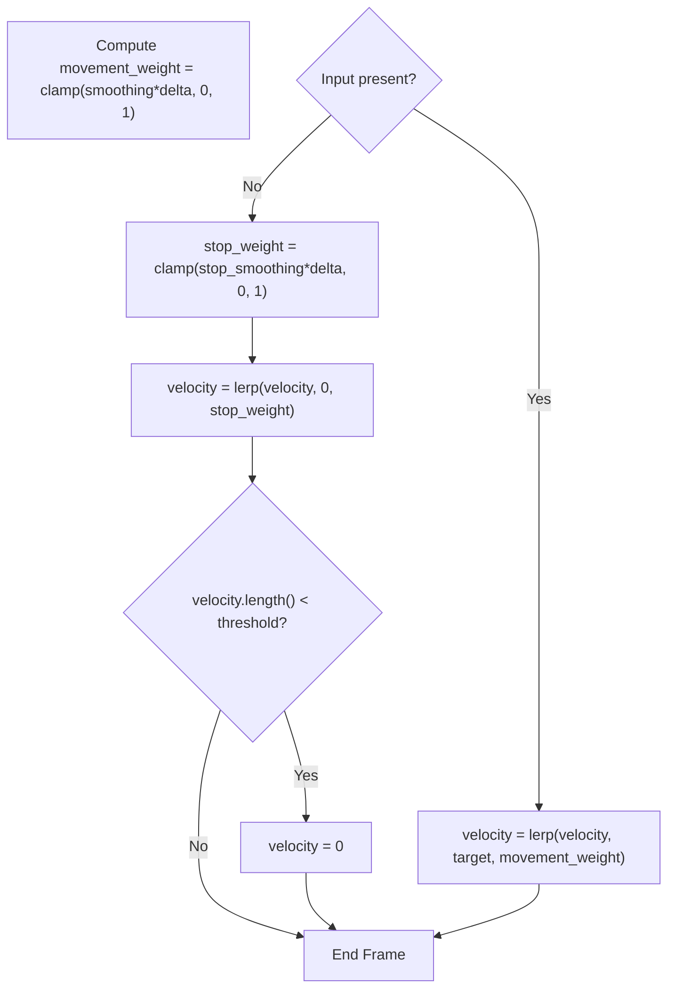

**Diagram sources**
- [player_prototype.gd:276-282](file://Scripts/player_prototype.gd#L276-L282)
- [bot_prototype.gd:99-105](file://Scripts/bot_prototype.gd#L99-L105)
- [bot_simple.gd:79-85](file://Scripts/bot_simple.gd#L79-L85)

**Section sources**
- [player_prototype.gd:276-282](file://Scripts/player_prototype.gd#L276-L282)
- [bot_prototype.gd:99-105](file://Scripts/bot_prototype.gd#L99-L105)
- [bot_simple.gd:79-85](file://Scripts/bot_simple.gd#L79-L85)

### Ground/air Control and Collision Detection
- Movement is delegated to the physics engine’s movement routine, which handles collisions with static geometry and other bodies.
- Slope handling is implicit in the physics engine’s collision resolution during movement.
- Multi-level world: Collision masks and layers are adjusted per height level to ensure characters collide with walls on their level while moving freely on ramps or platforms.

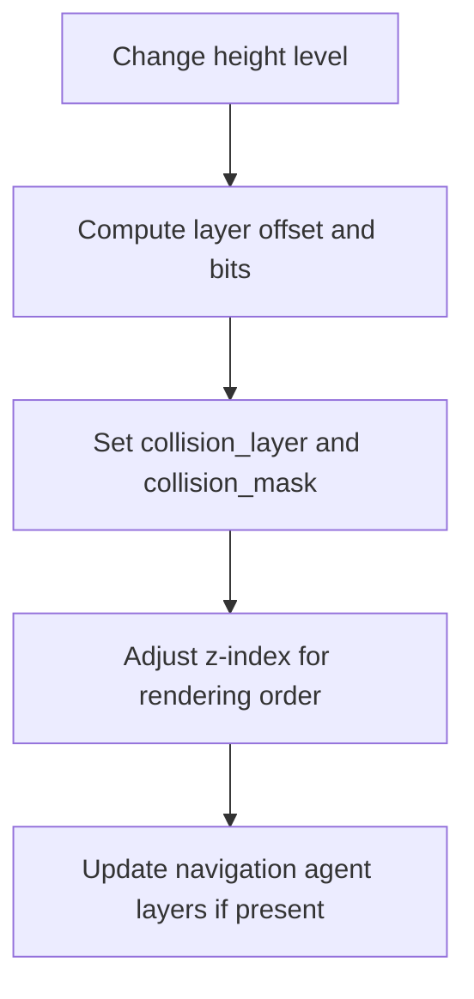

**Diagram sources**
- [bot_prototype.gd:171-193](file://Scripts/bot_prototype.gd#L171-L193)
- [bot_simple.gd:104-122](file://Scripts/bot_simple.gd#L104-L122)

**Section sources**
- [bot_prototype.gd:171-193](file://Scripts/bot_prototype.gd#L171-L193)
- [bot_simple.gd:104-122](file://Scripts/bot_simple.gd#L104-L122)

### Ramps and Movement Constraints
Ramps connect different height levels and enforce level-aware movement:
- Level membership: Entities are added/removed from groups per visible levels.
- Collision mask: Only characters on the same level interact with walls; others pass through.
- Destination resolution: Ramps resolve transitions between start and arrival levels.

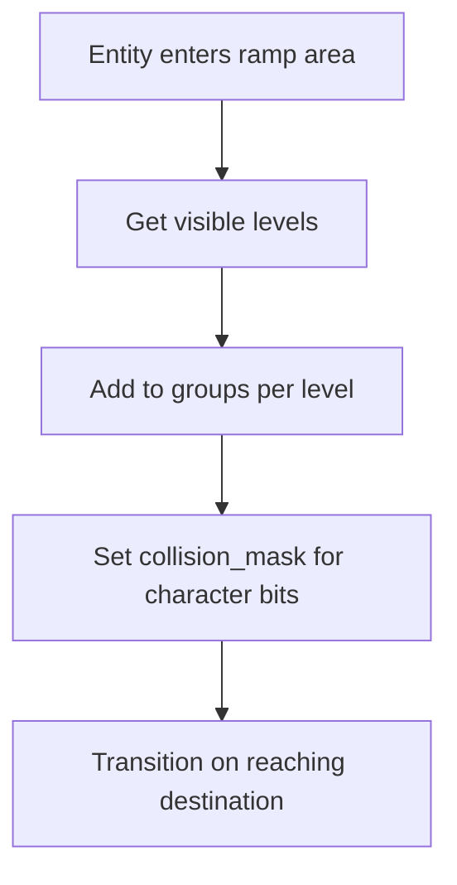

**Diagram sources**
- [ramp.gd:164-189](file://Scripts/ramp.gd#L164-L189)

**Section sources**
- [ramp.gd:142-189](file://Scripts/ramp.gd#L142-L189)

### Smooth Movement Interpolation and Look Direction
- Look direction smoothing: Desired direction is blended toward a smoothed direction using a look smoothing factor.
- Visual alignment: Sprite rotation follows the smoothed direction for consistent facing.

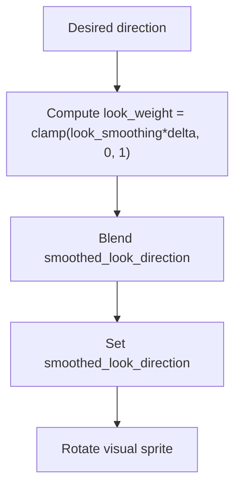

**Diagram sources**
- [bot_prototype.gd:409-435](file://Scripts/bot_prototype.gd#L409-L435)
- [bot_simple.gd:197-200](file://Scripts/bot_simple.gd#L197-L200)

**Section sources**
- [bot_prototype.gd:409-435](file://Scripts/bot_prototype.gd#L409-L435)
- [bot_simple.gd:197-200](file://Scripts/bot_simple.gd#L197-L200)

### Navigation Mesh and Layered World
Navigation meshes define walkable areas per height level. The navigation layers are updated when entities change levels to keep pathfinding consistent with collision masks.

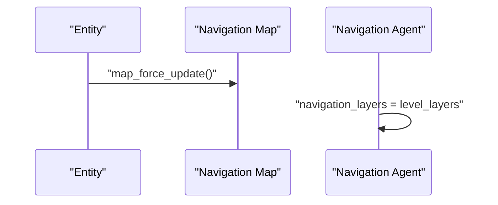

**Diagram sources**
- [bot_prototype.gd:497-500](file://Scripts/bot_prototype.gd#L497-L500)
- [Piano1.tres:4-9](file://Maps/Nav1/Piano1.tres#L4-L9)

**Section sources**
- [bot_prototype.gd:497-500](file://Scripts/bot_prototype.gd#L497-L500)
- [Piano1.tres:4-9](file://Maps/Nav1/Piano1.tres#L4-L9)

### Projectile Movement Example (Reference)
While not the player, projectiles demonstrate smooth movement interpolation along a direction vector with distance-based completion.

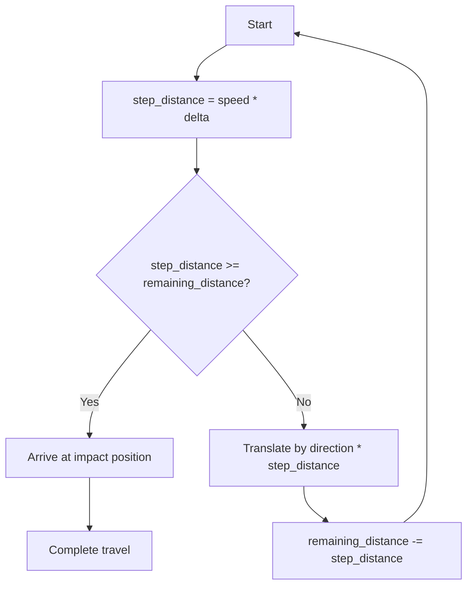

**Diagram sources**
- [projectile_visual.gd:43-58](file://Scripts/projectile_visual.gd#L43-L58)

**Section sources**
- [projectile_visual.gd:43-58](file://Scripts/projectile_visual.gd#L43-L58)

## Dependency Analysis
- Player controller depends on input manager and virtual joystick for directional input.
- Movement relies on the physics engine’s move_and_slide for collision handling.
- Height-level awareness requires coordination between ramp logic, collision masks, and navigation layers.
- AI helpers illustrate equivalent movement patterns for comparison and validation.

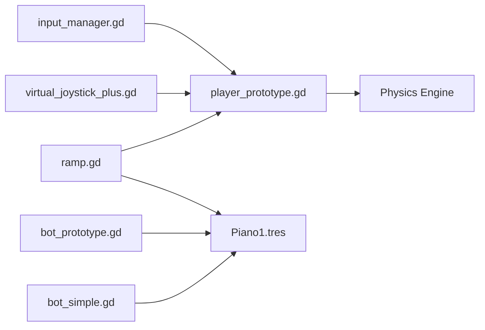

**Diagram sources**
- [player_prototype.gd](file://Scripts/player_prototype.gd)
- [input_manager.gd](file://Game/input_manager.gd)
- [virtual_joystick_plus.gd](file://addons/virtual_joystick_plus/virtual_joystick_plus.gd)
- [ramp.gd](file://Scripts/ramp.gd)
- [Piano1.tres](file://Maps/Nav1/Piano1.tres)
- [bot_prototype.gd](file://Scripts/bot_prototype.gd)
- [bot_simple.gd](file://Scripts/bot_simple.gd)

**Section sources**
- [player_prototype.gd](file://Scripts/player_prototype.gd)
- [input_manager.gd](file://Game/input_manager.gd)
- [virtual_joystick_plus.gd](file://addons/virtual_joystick_plus/virtual_joystick_plus.gd)
- [ramp.gd](file://Scripts/ramp.gd)
- [Piano1.tres](file://Maps/Nav1/Piano1.tres)
- [bot_prototype.gd](file://Scripts/bot_prototype.gd)
- [bot_simple.gd](file://Scripts/bot_simple.gd)

## Performance Considerations
- Prefer delta-time dependent weights for smoothness across variable frame rates.
- Clamp lerping weights to [0, 1] to avoid overshoots.
- Normalize directions before computing target velocity to prevent diagonal speedup.
- Use thresholds to stop velocity cleanly and reduce residual drift.
- Keep collision masks minimal to reduce unnecessary collision checks.
- For multi-level worlds, update navigation layers only when levels change to minimize overhead.

## Troubleshooting Guide
Common issues and resolutions:
- Jittery movement with analog sticks:
  - Ensure deadzone is configured and applied to analog values.
  - Verify that direction normalization occurs before target velocity computation.
- Stuck on edges or slopes:
  - Confirm collision shapes and move_and_slide are functioning as expected.
  - Check that navigation meshes align with level geometry.
- Incorrect facing during movement:
  - Ensure look direction smoothing is applied consistently and that visual rotation follows the smoothed direction.
- Unexpected collisions across levels:
  - Verify height-level collision masks and group memberships are updated when changing levels.
- Pathfinding inconsistencies:
  - Trigger navigation map updates when levels change to refresh walkable areas.

**Section sources**
- [virtual_joystick_plus.gd:464-499](file://addons/virtual_joystick_plus/virtual_joystick_plus.gd#L464-L499)
- [player_prototype.gd:276-282](file://Scripts/player_prototype.gd#L276-L282)
- [bot_prototype.gd:171-193](file://Scripts/bot_prototype.gd#L171-L193)
- [bot_prototype.gd:497-500](file://Scripts/bot_prototype.gd#L497-L500)

## Conclusion
The movement system combines discrete and analog input, smooth acceleration via delta-weighted interpolation, and robust collision handling through the physics engine. Height-level awareness ensures appropriate collision and navigation behavior across multiple planes. By tuning smoothing factors, applying deadzones, and maintaining consistent collision masks and navigation layers, developers can achieve responsive, predictable movement across varied environments.