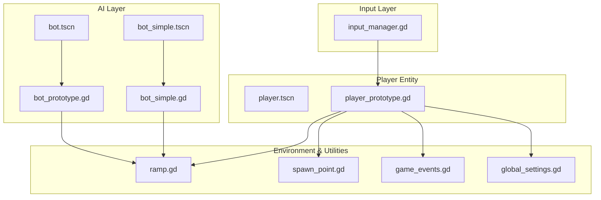
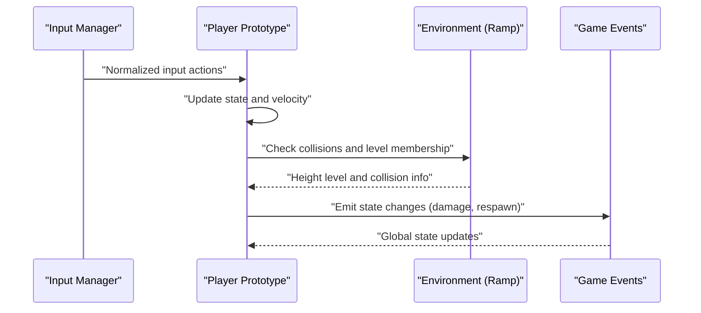
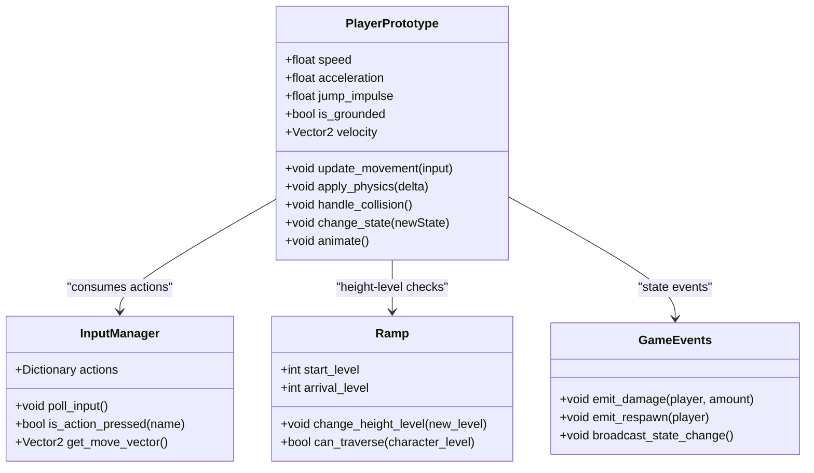
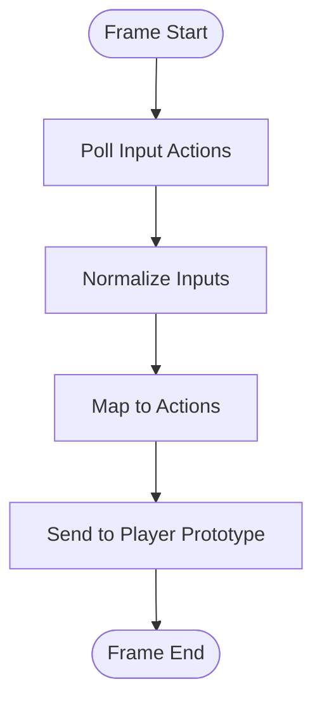
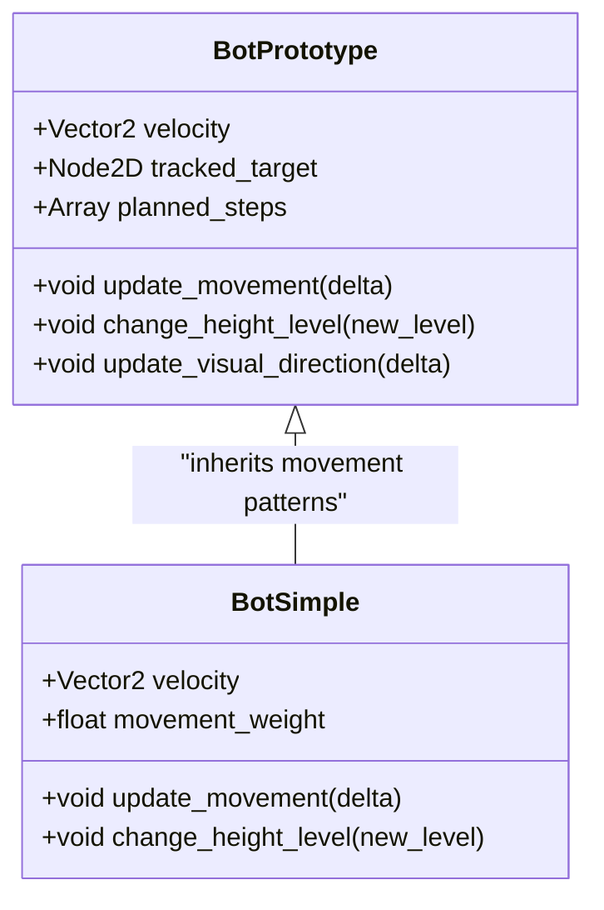
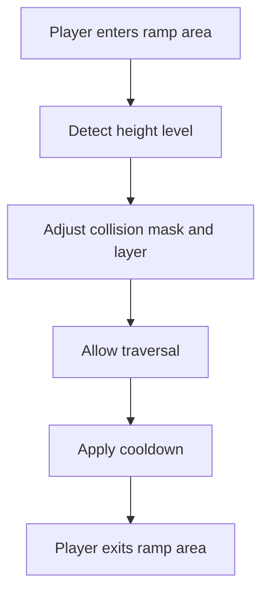
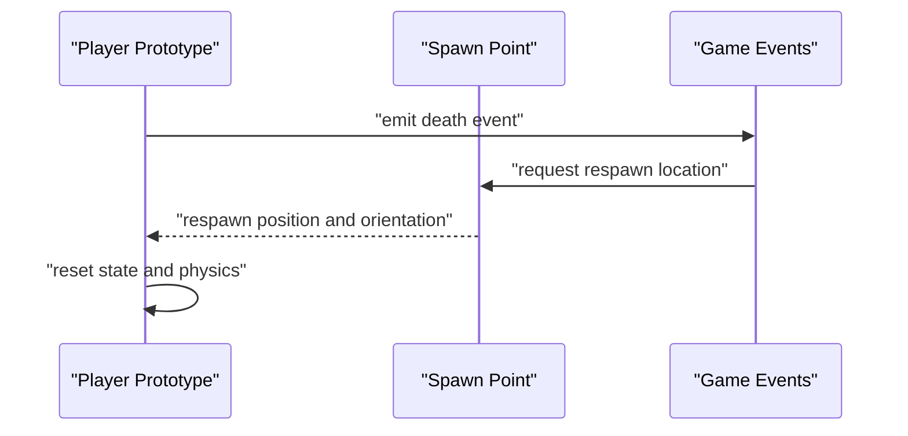
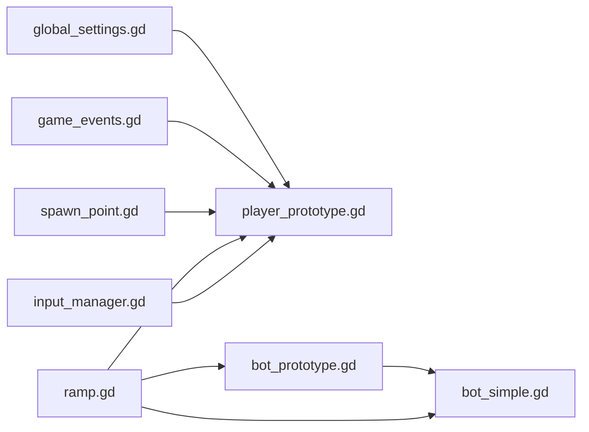

# Player System

<cite>
**Referenced Files in This Document**
- [player.tscn](file://player.tscn)
- [player_prototype.gd](file://Scripts/player_prototype.gd)
- [input_manager.gd](file://Game/input_manager.gd)
- [bot_prototype.gd](file://Scripts/bot_prototype.gd)
- [bot_simple.gd](file://Scripts/bot_simple.gd)
- [bot.tscn](file://bot.tscn)
- [bot_simple.tscn](file://bot_simple.tscn)
- [ramp.gd](file://Scripts/ramp.gd)
- [spawn_point.gd](file://Scripts/spawn_point.gd)
- [game_events.gd](file://Scripts/game_events.gd)
- [global_settings.gd](file://Scripts/global_settings.gd)
</cite>

## Table of Contents
1. [Introduction](#introduction)
2. [Project Structure](#project-structure)
3. [Core Components](#core-components)
4. [Architecture Overview](#architecture-overview)
5. [Detailed Component Analysis](#detailed-component-analysis)
6. [Dependency Analysis](#dependency-analysis)
7. [Performance Considerations](#performance-considerations)
8. [Troubleshooting Guide](#troubleshooting-guide)
9. [Conclusion](#conclusion)

## Introduction
This document describes the Player System in TFA Agents, covering the player character implementation, movement mechanics, physics, collision detection, animation states, input management (keyboard, mouse, touch), the player prototype architecture, AI bot implementations, and state management patterns. It also documents the relationship between player nodes, collision shapes, and animation controllers, along with examples of state management, damage handling, and respawn mechanisms.

## Project Structure
The Player System spans scene and script assets organized under the repository:
- Scene: player.tscn defines the player entity in the game world.
- Scripts: player_prototype.gd implements the core player behavior and state machine.
- Input: input_manager.gd centralizes input handling for keyboard, mouse, and touch.
- AI Bots: bot_prototype.gd and bot_simple.gd define AI-controlled characters with navigation and movement.
- Environment: ramp.gd and spawn_point.gd provide height-level traversal and respawning logic.
- Events: game_events.gd coordinates game-wide events including player state transitions.
- Settings: global_settings.gd provides shared configuration values.

**Diagram sources**
- [player.tscn](file://player.tscn)
- [player_prototype.gd](file://Scripts/player_prototype.gd)
- [input_manager.gd](file://Game/input_manager.gd)
- [bot_prototype.gd](file://Scripts/bot_prototype.gd)
- [bot_simple.gd](file://Scripts/bot_simple.gd)
- [bot.tscn](file://bot.tscn)
- [bot_simple.tscn](file://bot_simple.tscn)
- [ramp.gd](file://Scripts/ramp.gd)
- [spawn_point.gd](file://Scripts/spawn_point.gd)
- [game_events.gd](file://Scripts/game_events.gd)
- [global_settings.gd](file://Scripts/global_settings.gd)

**Section sources**
- [player.tscn](file://player.tscn)
- [player_prototype.gd](file://Scripts/player_prototype.gd)
- [input_manager.gd](file://Game/input_manager.gd)
- [bot_prototype.gd](file://Scripts/bot_prototype.gd)
- [bot_simple.gd](file://Scripts/bot_simple.gd)
- [ramp.gd](file://Scripts/ramp.gd)
- [spawn_point.gd](file://Scripts/spawn_point.gd)
- [game_events.gd](file://Scripts/game_events.gd)
- [global_settings.gd](file://Scripts/global_settings.gd)

## Core Components
- Player Scene (player.tscn): Defines the visual representation and child nodes (sprite, collision shapes, animation controller) attached to the player entity.
- Player Prototype Script (player_prototype.gd): Implements movement, jumping, ground/air control, collision detection, state management (idle, moving, jumping, falling), and integration with input and environment systems.
- Input Manager (input_manager.gd): Centralizes input polling for keyboard, mouse, and touch, normalizing actions for the player script.
- Bot Prototype (bot_prototype.gd): Provides advanced AI behavior including pathfinding, height-level traversal, and targeting logic.
- Bot Simple (bot_simple.gd): Implements simplified AI movement with smoothing and basic navigation.
- Ramp (ramp.gd): Handles height-level transitions and collision masks for multi-layered gameplay.
- Spawn Point (spawn_point.gd): Manages respawn locations and reset logic.
- Game Events (game_events.gd): Coordinates game-wide state changes affecting players.
- Global Settings (global_settings.gd): Exposes shared constants and parameters used across systems.

**Section sources**
- [player.tscn](file://player.tscn)
- [player_prototype.gd](file://Scripts/player_prototype.gd)
- [input_manager.gd](file://Game/input_manager.gd)
- [bot_prototype.gd](file://Scripts/bot_prototype.gd)
- [bot_simple.gd](file://Scripts/bot_simple.gd)
- [ramp.gd](file://Scripts/ramp.gd)
- [spawn_point.gd](file://Scripts/spawn_point.gd)
- [game_events.gd](file://Scripts/game_events.gd)
- [global_settings.gd](file://Scripts/global_settings.gd)

## Architecture Overview
The Player System follows a layered architecture:
- Input Layer: input_manager.gd captures raw input and exposes normalized actions.
- Behavior Layer: player_prototype.gd consumes input, updates state, applies movement physics, and interacts with the environment.
- Environment Layer: ramp.gd and spawn_point.gd manage height-level traversal and respawns.
- AI Layer: bot_prototype.gd and bot_simple.gd mirror similar movement logic for AI characters.
- Event Layer: game_events.gd orchestrates state changes and synchronization.

**Diagram sources**
- [input_manager.gd](file://Game/input_manager.gd)
- [player_prototype.gd](file://Scripts/player_prototype.gd)
- [ramp.gd](file://Scripts/ramp.gd)
- [game_events.gd](file://Scripts/game_events.gd)

## Detailed Component Analysis

### Player Prototype Implementation
The player prototype script encapsulates movement mechanics, physics, collision detection, and state management. Key aspects include:
- Movement parameters and acceleration curves: controlled via configurable parameters exposed through global settings and internal calculations.
- Jump mechanics: grounded checks, vertical velocity application, and jump state transitions.
- Ground/air control: friction, acceleration, and deceleration logic depending on whether the player is on the ground or airborne.
- Collision detection: integrates with environment collision shapes and ramp height-level logic.
- State management: maintains states such as idle, moving, jumping, falling, and handles transitions based on input and physics.
- Animation integration: connects movement and state changes to animation controller nodes present in the scene.

**Diagram sources**
- [player_prototype.gd](file://Scripts/player_prototype.gd)
- [input_manager.gd](file://Game/input_manager.gd)
- [ramp.gd](file://Scripts/ramp.gd)
- [game_events.gd](file://Scripts/game_events.gd)

**Section sources**
- [player_prototype.gd](file://Scripts/player_prototype.gd)
- [input_manager.gd](file://Game/input_manager.gd)
- [ramp.gd](file://Scripts/ramp.gd)
- [game_events.gd](file://Scripts/game_events.gd)

### Input Management System
The input manager consolidates keyboard, mouse, and touch controls:
- Normalized actions: exposes standardized action names for movement, jump, aim, and other interactions.
- Polling cycle: updates per frame to capture current input state.
- Action mapping: supports platform-specific bindings and remapping.
- Integration: feeds processed input to the player prototype for movement and state decisions.

**Diagram sources**
- [input_manager.gd](file://Game/input_manager.gd)

**Section sources**
- [input_manager.gd](file://Game/input_manager.gd)

### AI Bot Implementations
Two AI implementations demonstrate different complexity levels:
- Bot Prototype: Advanced pathfinding, height-level traversal, targeting, and visual direction updates.
- Bot Simple: Simplified movement with velocity smoothing and basic navigation.

**Diagram sources**
- [bot_prototype.gd](file://Scripts/bot_prototype.gd)
- [bot_simple.gd](file://Scripts/bot_simple.gd)

**Section sources**
- [bot_prototype.gd](file://Scripts/bot_prototype.gd)
- [bot_simple.gd](file://Scripts/bot_simple.gd)

### Height-Level Traversal and Environment Integration
Ramp logic enables multi-level traversal:
- Level membership: entities belong to groups per height level.
- Collision masks: dynamically adjust collision layers and masks based on current level.
- Cooldowns: prevent rapid re-entry after traversal.

**Diagram sources**
- [ramp.gd](file://Scripts/ramp.gd)

**Section sources**
- [ramp.gd](file://Scripts/ramp.gd)

### Respawn Mechanisms
Spawn points provide respawn logic:
- Registration: checkpoints register themselves with the mission flow or game manager.
- Respawns: reset player position, orientation, and state upon death or level transition.
- Integration: coordinated with game events for synchronized respawns.

**Diagram sources**
- [spawn_point.gd](file://Scripts/spawn_point.gd)
- [game_events.gd](file://Scripts/game_events.gd)

**Section sources**
- [spawn_point.gd](file://Scripts/spawn_point.gd)
- [game_events.gd](file://Scripts/game_events.gd)

## Dependency Analysis
The Player System exhibits clear separation of concerns:
- player_prototype.gd depends on input_manager.gd for actions, ramp.gd for environment state, spawn_point.gd for respawns, and game_events.gd for state broadcasts.
- AI scripts depend on ramp logic for level-aware movement and share similar state machines.
- global_settings.gd provides shared constants consumed by player and bot scripts.

**Diagram sources**
- [input_manager.gd](file://Game/input_manager.gd)
- [player_prototype.gd](file://Scripts/player_prototype.gd)
- [ramp.gd](file://Scripts/ramp.gd)
- [spawn_point.gd](file://Scripts/spawn_point.gd)
- [game_events.gd](file://Scripts/game_events.gd)
- [global_settings.gd](file://Scripts/global_settings.gd)
- [bot_prototype.gd](file://Scripts/bot_prototype.gd)
- [bot_simple.gd](file://Scripts/bot_simple.gd)

**Section sources**
- [player_prototype.gd](file://Scripts/player_prototype.gd)
- [input_manager.gd](file://Game/input_manager.gd)
- [ramp.gd](file://Scripts/ramp.gd)
- [spawn_point.gd](file://Scripts/spawn_point.gd)
- [game_events.gd](file://Scripts/game_events.gd)
- [global_settings.gd](file://Scripts/global_settings.gd)
- [bot_prototype.gd](file://Scripts/bot_prototype.gd)
- [bot_simple.gd](file://Scripts/bot_simple.gd)

## Performance Considerations
- Input polling frequency: keep input updates minimal and cache normalized actions per frame.
- Physics updates: use fixed timestep where appropriate and batch collision checks.
- AI pathfinding: limit path recalculation frequency and prune reached steps efficiently.
- Height-level transitions: avoid frequent layer/mask toggles; coalesce updates during traversal.
- Animation updates: defer expensive sprite operations until after physics resolution.

## Troubleshooting Guide
Common issues and resolutions:
- Player does not move: verify input actions are being polled and mapped correctly; check that the player is not stuck in a non-movable state.
- Stuck in air or unable to land: inspect grounded checks and collision shapes; confirm ramp height-level alignment.
- AI overshooting targets: review movement smoothing weights and step trimming logic; ensure path points are pruned when reached.
- Respawns not occurring: confirm spawn registration and game event emission; verify respawn position validity.

**Section sources**
- [player_prototype.gd](file://Scripts/player_prototype.gd)
- [bot_simple.gd](file://Scripts/bot_simple.gd)
- [ramp.gd](file://Scripts/ramp.gd)
- [spawn_point.gd](file://Scripts/spawn_point.gd)
- [game_events.gd](file://Scripts/game_events.gd)

## Conclusion
The Player System in TFA Agents combines a robust player prototype with modular input handling, environment-aware movement, and AI-driven bots. Its layered architecture promotes maintainability and extensibility, enabling clear separation between input, behavior, environment, and state management. By leveraging shared settings, collision-aware height-level traversal, and centralized event broadcasting, the system supports both human and AI-controlled characters with consistent mechanics and responsive feedback.