# Weapon System

<cite>
**Referenced Files in This Document**
- [player_prototype.gd](file://Scripts/player_prototype.gd)
- [projectile_visual.gd](file://Scripts/projectile_visual.gd)
- [projectile_visual.tscn](file://Scenes/projectile_visual.tscn)
- [hud_game.gd](file://Menu/HUD/hud_game.gd)
- [dev_map_tutorial.gd](file://Scripts/dev_map_tutorial.gd)
- [pvp_map.gd](file://Scripts/pvp_map.gd)
- [global_settings.gd](file://Scripts/global_settings.gd)
- [player.tscn](file://player.tscn)
</cite>

## Table of Contents
1. [Introduction](#introduction)
2. [Project Structure](#project-structure)
3. [Core Components](#core-components)
4. [Architecture Overview](#architecture-overview)
5. [Detailed Component Analysis](#detailed-component-analysis)
6. [Dependency Analysis](#dependency-analysis)
7. [Performance Considerations](#performance-considerations)
8. [Troubleshooting Guide](#troubleshooting-guide)
9. [Conclusion](#conclusion)

## Introduction
This document describes the Weapon System implementation, focusing on firing mechanics, ammo management, reload behavior, projectile lifecycle, visual effects, trajectory handling, impact detection, and multiplayer synchronization. It also covers configuration parameters, auto-fire/touch auto-fire logic, weapon animations, HUD feedback, and customization hooks.

## Project Structure
The weapon system spans several scripts and scenes:
- Player prototype defines weapon stats, firing logic, ammo tracking, reload, and replication.
- Projectile visual scene/script handles trajectory rendering and impact callbacks.
- HUD subscribes to player signals to reflect ammo and reload states.
- Tutorial and map scripts demonstrate signal connections and initial state propagation.
- Global settings integrates subtitle feedback for weapon events.

```mermaid
graph TB
subgraph "Player"
PP["PlayerPrototype<br/>Firing, Ammo, Reload, Signals"]
end
subgraph "Projectile"
PV_Scn["projectile_visual.tscn"]
PV_Scr["projectile_visual.gd"]
end
subgraph "HUD"
HUD["hud_game.gd<br/>Ammo/Reload UI"]
end
subgraph "Multiplayer"
PVP["pvp_map.gd<br/>Authority & Spawning"]
GS["global_settings.gd<br/>Subtitles"]
end
PP --> PV_Scn
PV_Scn --> PV_Scr
PP --> HUD
PP --> GS
PVP --> PP
```

**Diagram sources**
- [player_prototype.gd](file://Scripts/player_prototype.gd)
- [projectile_visual.tscn](file://Scenes/projectile_visual.tscn)
- [projectile_visual.gd](file://Scripts/projectile_visual.gd)
- [hud_game.gd](file://Menu/HUD/hud_game.gd)
- [pvp_map.gd](file://Scripts/pvp_map.gd)
- [global_settings.gd](file://Scripts/global_settings.gd)

**Section sources**
- [player_prototype.gd](file://Scripts/player_prototype.gd)
- [projectile_visual.tscn](file://Scenes/projectile_visual.tscn)
- [projectile_visual.gd](file://Scripts/projectile_visual.gd)
- [hud_game.gd](file://Menu/HUD/hud_game.gd)
- [pvp_map.gd](file://Scripts/pvp_map.gd)
- [global_settings.gd](file://Scripts/global_settings.gd)

## Core Components
- PlayerPrototype: Central weapon controller with export parameters for damage, cooldown, range, ammo capacities, and visual speed. Manages firing, touch auto-fire, reload, and multiplayer replication.
- ProjectileVisual: Scene/script that renders a moving projectile along a path and emits impact events to the player logic.
- HUD: Subscribes to player signals to update ammo counters and visual reload warnings.
- Multiplayer: Authority assignment and initial state propagation for weapons and players.

Key exported parameters and signals:
- Firing: fire_cooldown, shot_range, touch_auto_fire_range, projectile_visual_speed
- Ammunition: colpi_correnti, colpi_totali, capacita_caricatore
- Effects: projectile_damage, reload_duration
- Signals: health_changed, ammo_changed, reload_started

**Section sources**
- [player_prototype.gd](file://Scripts/player_prototype.gd)
- [hud_game.gd](file://Menu/HUD/hud_game.gd)

## Architecture Overview
The weapon pipeline consists of:
- Input and aim direction determination (mouse/touch).
- Shot validation (cooldown, ammo, reloading).
- Projectile instantiation and setup with origin, target, speed, and height level.
- Impact detection via raycast and target application of damage or destruction.
- HUD updates and optional subtitle feedback.
- Multiplayer replication of shots and initial state.

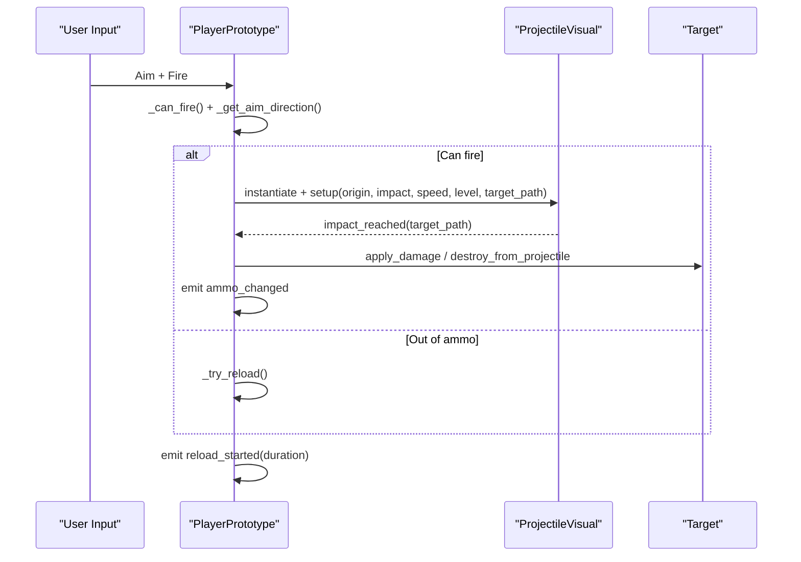

**Diagram sources**
- [player_prototype.gd](file://Scripts/player_prototype.gd)
- [projectile_visual.gd](file://Scripts/projectile_visual.gd)

## Detailed Component Analysis

### Firing Logic and Auto-Fire Detection
- Cooldown enforcement prevents rapid fire.
- Touch auto-fire detects enemies within a configurable range and fires automatically while aiming.
- Aim direction prioritizes touch input when active, otherwise mouse position.

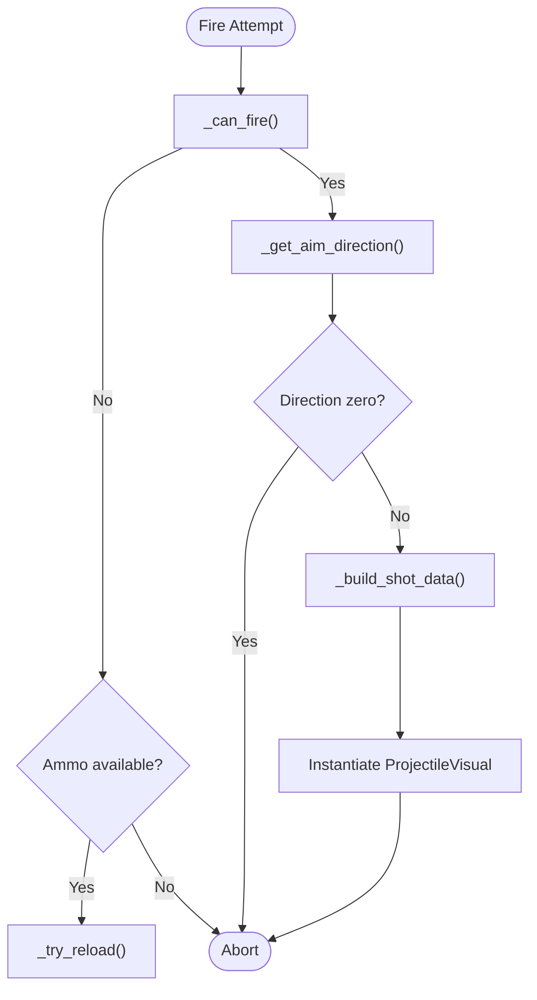

**Diagram sources**
- [player_prototype.gd](file://Scripts/player_prototype.gd)

**Section sources**
- [player_prototype.gd](file://Scripts/player_prototype.gd)

### Touch Auto-Fire
- While touch aim is active, the system checks for targets within a radius and fires automatically when an enemy is detected in the aimed direction.

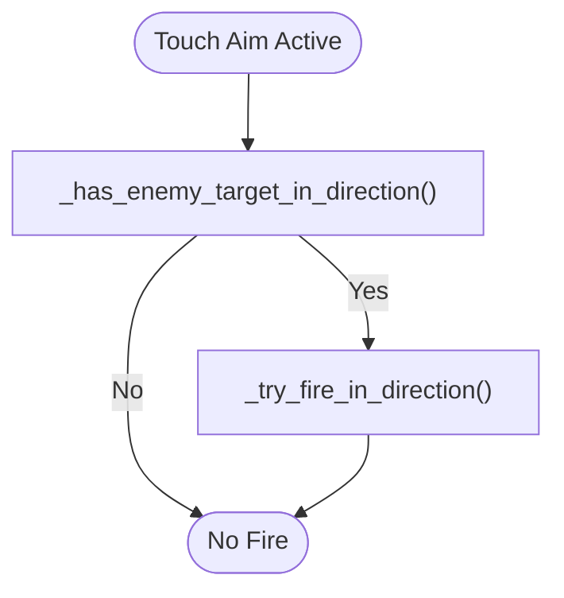

**Diagram sources**
- [player_prototype.gd](file://Scripts/player_prototype.gd)

**Section sources**
- [player_prototype.gd](file://Scripts/player_prototype.gd)

### Ammo Management and Reload Mechanics
- Magazine capacity and reserve tracking with reload refill logic.
- Reload animation and HUD warning flashes synchronized to reload duration.
- Local feedback includes screen shake and subtitle notifications.

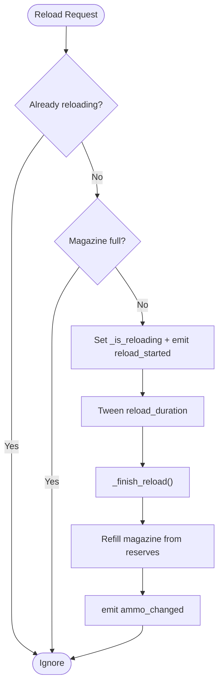

**Diagram sources**
- [player_prototype.gd](file://Scripts/player_prototype.gd)
- [hud_game.gd](file://Menu/HUD/hud_game.gd)

**Section sources**
- [player_prototype.gd](file://Scripts/player_prototype.gd)
- [hud_game.gd](file://Menu/HUD/hud_game.gd)

### Projectile System: Trajectory and Impact
- ProjectileVisual is instantiated with start/end positions, speed, height level, and optional target path.
- On reaching the target, an impact event is emitted back to the player, which applies damage or destruction to the target.
- Targets implementing specific methods receive damage accordingly; others may be queued for removal.

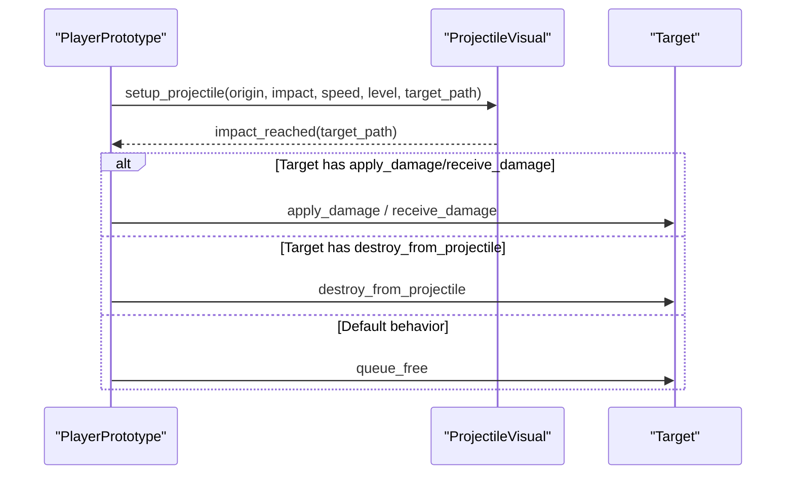

**Diagram sources**
- [player_prototype.gd](file://Scripts/player_prototype.gd)
- [projectile_visual.gd](file://Scripts/projectile_visual.gd)

**Section sources**
- [player_prototype.gd](file://Scripts/player_prototype.gd)
- [projectile_visual.gd](file://Scripts/projectile_visual.gd)

### Weapon Configuration Parameters
- Firing rate: fire_cooldown controls minimum time between shots.
- Range: shot_range limits projectile travel distance; touch_auto_fire_range enables automatic fire near targets.
- Projectile speed: projectile_visual_speed sets movement speed for the visual projectile.
- Damage: projectile_damage determines damage applied on impact.
- Reload: reload_duration governs reload animation length and HUD warning timing.
- Ammo: capacita_caricatore defines magazine capacity; colpi_correnti and colpi_totali track current and reserve rounds.

These parameters are exposed as exported variables on the player prototype and influence both gameplay and visuals.

**Section sources**
- [player_prototype.gd](file://Scripts/player_prototype.gd)

### Firing Logic Details
- Origin determination uses a muzzle marker if present; otherwise the player’s global position.
- Shot data includes origin, impact position, target path, height level, and visual speed.
- Multiplayer-aware: only the authority instance performs firing; other peers replicate via RPC.

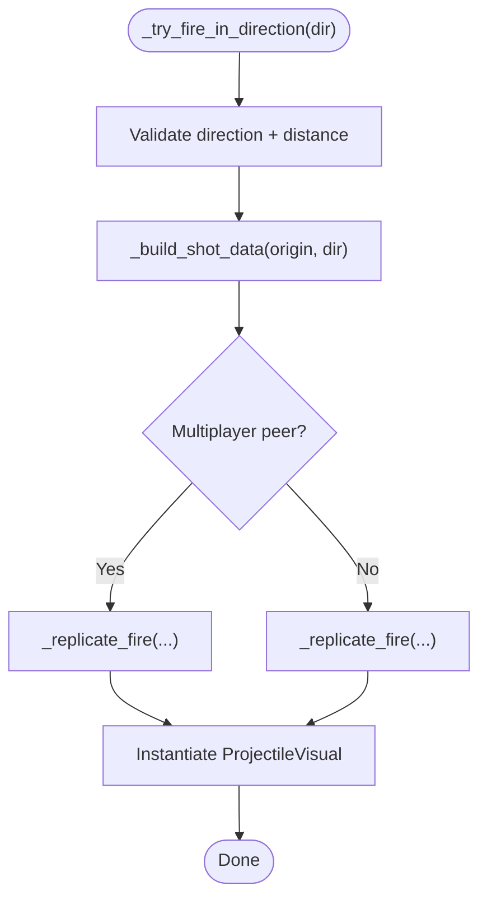

**Diagram sources**
- [player_prototype.gd](file://Scripts/player_prototype.gd)

**Section sources**
- [player_prototype.gd](file://Scripts/player_prototype.gd)

### Projectile Visual System and Muzzle Flash
- ProjectileVisual scene/script receives setup parameters and moves toward the target.
- Muzzle flash effect is integrated into the player’s weapon animation during firing and reload actions.

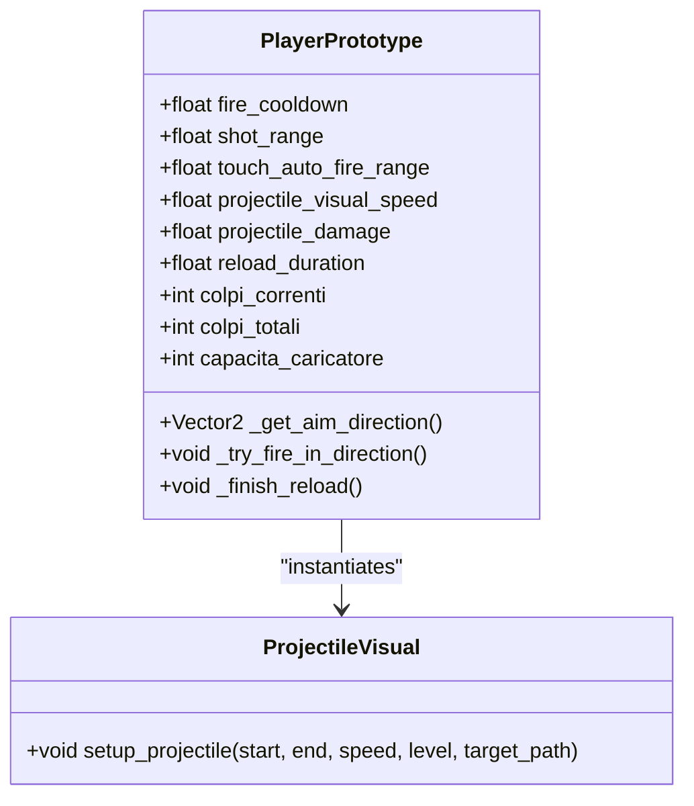

**Diagram sources**
- [player_prototype.gd](file://Scripts/player_prototype.gd)
- [projectile_visual.gd](file://Scripts/projectile_visual.gd)

**Section sources**
- [player_prototype.gd](file://Scripts/player_prototype.gd)
- [projectile_visual.gd](file://Scripts/projectile_visual.gd)

### Weapon Animations
- Reload animation uses a tween-driven sequence on the weapon sprite node to simulate recoil and return to rest.
- The animation timing aligns with reload_duration to provide consistent feedback.

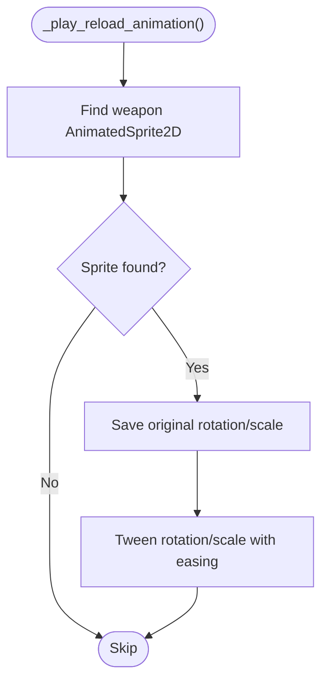

**Diagram sources**
- [player_prototype.gd](file://Scripts/player_prototype.gd)

**Section sources**
- [player_prototype.gd](file://Scripts/player_prototype.gd)

### Multiplayer Synchronization
- Authority assignment ensures only the authoritative instance processes firing.
- Initial state propagation sends team, skin, weapon name, and player name to peers.
- Spawn data replication adjusts position and height level across clients.

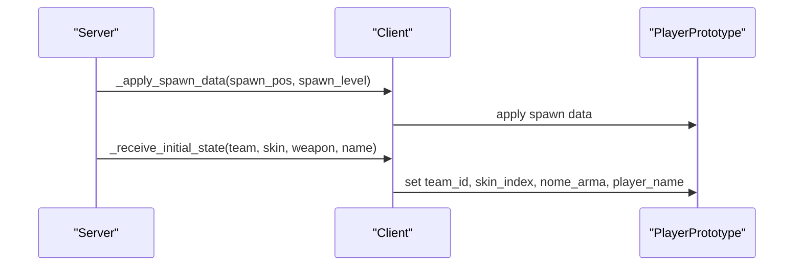

**Diagram sources**
- [pvp_map.gd](file://Scripts/pvp_map.gd)
- [player_prototype.gd](file://Scripts/player_prototype.gd)

**Section sources**
- [pvp_map.gd](file://Scripts/pvp_map.gd)
- [player_prototype.gd](file://Scripts/player_prototype.gd)

### HUD Integration and Feedback
- HUD subscribes to ammo_changed and reload_started signals to update UI and trigger visual warnings.
- Subtitle feedback is triggered locally for weapon events.

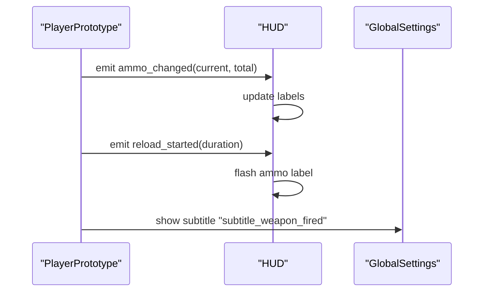

**Diagram sources**
- [hud_game.gd](file://Menu/HUD/hud_game.gd)
- [global_settings.gd](file://Scripts/global_settings.gd)
- [player_prototype.gd](file://Scripts/player_prototype.gd)

**Section sources**
- [hud_game.gd](file://Menu/HUD/hud_game.gd)
- [global_settings.gd](file://Scripts/global_settings.gd)
- [player_prototype.gd](file://Scripts/player_prototype.gd)

### Examples and Customization
- Modifying weapon stats: adjust exported parameters on the player prototype to change damage, cooldown, range, and reload duration.
- Custom projectile behavior: extend the projectile visual script to alter movement, effects, or impact logic.
- Performance optimization tips:
  - Limit projectile count by pooling or reusing instances.
  - Reduce visual speed only when necessary to maintain perceived responsiveness.
  - Use raycast caching for repeated detections within a short timeframe.
  - Minimize HUD tweens and subtitle triggers to reduce UI overhead.

[No sources needed since this section provides general guidance]

## Dependency Analysis
- PlayerPrototype depends on:
  - ProjectileVisual scene/script for trajectory rendering.
  - HUD for UI updates.
  - GlobalSettings for subtitle feedback.
  - Multiplayer manager for authority and initial state propagation.
- ProjectileVisual depends on:
  - PlayerPrototype for setup parameters and impact callback.
- HUD depends on:
  - PlayerPrototype signals for state updates.

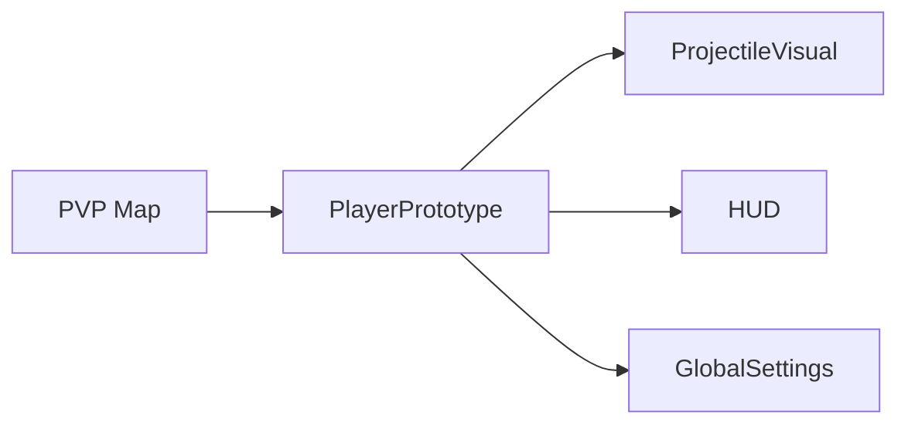

**Diagram sources**
- [player_prototype.gd](file://Scripts/player_prototype.gd)
- [projectile_visual.gd](file://Scripts/projectile_visual.gd)
- [hud_game.gd](file://Menu/HUD/hud_game.gd)
- [pvp_map.gd](file://Scripts/pvp_map.gd)
- [global_settings.gd](file://Scripts/global_settings.gd)

**Section sources**
- [player_prototype.gd](file://Scripts/player_prototype.gd)
- [projectile_visual.gd](file://Scripts/projectile_visual.gd)
- [hud_game.gd](file://Menu/HUD/hud_game.gd)
- [pvp_map.gd](file://Scripts/pvp_map.gd)
- [global_settings.gd](file://Scripts/global_settings.gd)

## Performance Considerations
- Keep projectile_visual_speed balanced to avoid excessive travel time and visual lag.
- Use raycasts judiciously; cache results within a single frame when possible.
- Limit HUD animations and subtitle frequency to maintain smooth gameplay.
- Prefer deferred calls for heavy operations (e.g., applying damage) to avoid blocking the main thread.

[No sources needed since this section provides general guidance]

## Troubleshooting Guide
- No fire despite being ready:
  - Verify _can_fire conditions (reloading, ammo, cooldown).
  - Confirm aim direction is non-zero.
- Reload does not visually trigger:
  - Ensure reload_started is emitted and HUD flash tween is initialized.
  - Check weapon sprite node exists for animation.
- Impacts not registering:
  - Confirm target implements apply_damage/receive_damage or destroy_from_projectile.
  - Verify target_path is passed and impact_reached is connected.
- Multiplayer desync:
  - Ensure only the authoritative instance fires.
  - Confirm initial state propagation and spawn data application.

**Section sources**
- [player_prototype.gd](file://Scripts/player_prototype.gd)
- [hud_game.gd](file://Menu/HUD/hud_game.gd)
- [pvp_map.gd](file://Scripts/pvp_map.gd)

## Conclusion
The Weapon System combines deterministic firing logic, robust ammo management, and synchronized multiplayer behavior with a clean visual projectile pipeline. By tuning exported parameters and leveraging the provided hooks, developers can customize weapon characteristics, enhance visual feedback, and optimize performance for diverse gameplay needs.