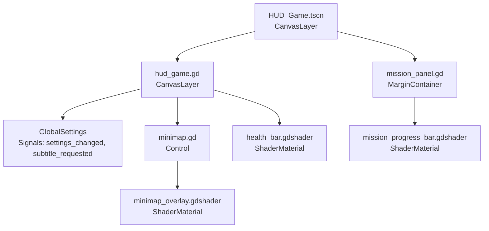
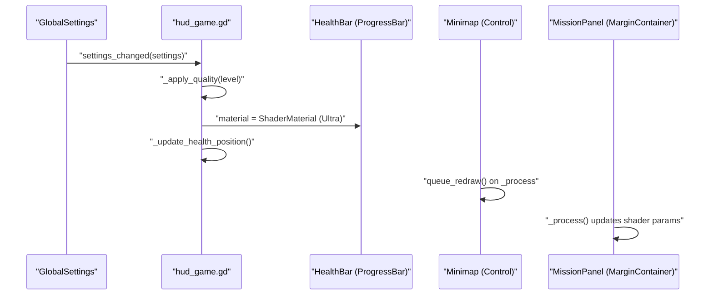
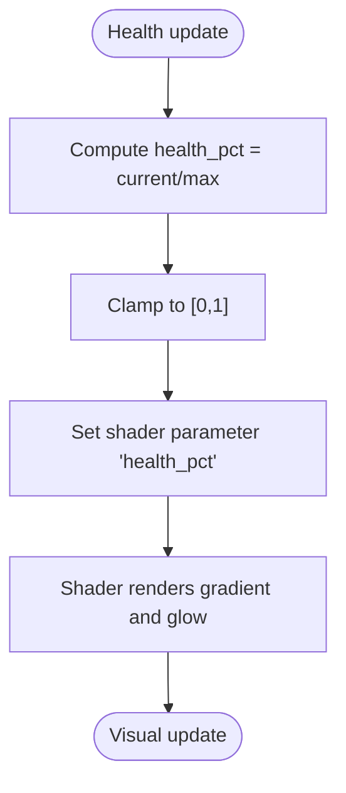
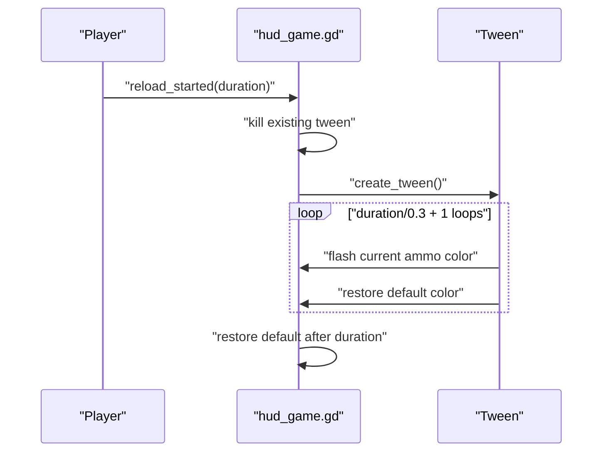
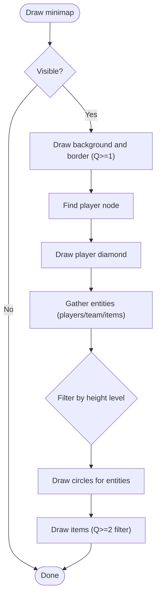
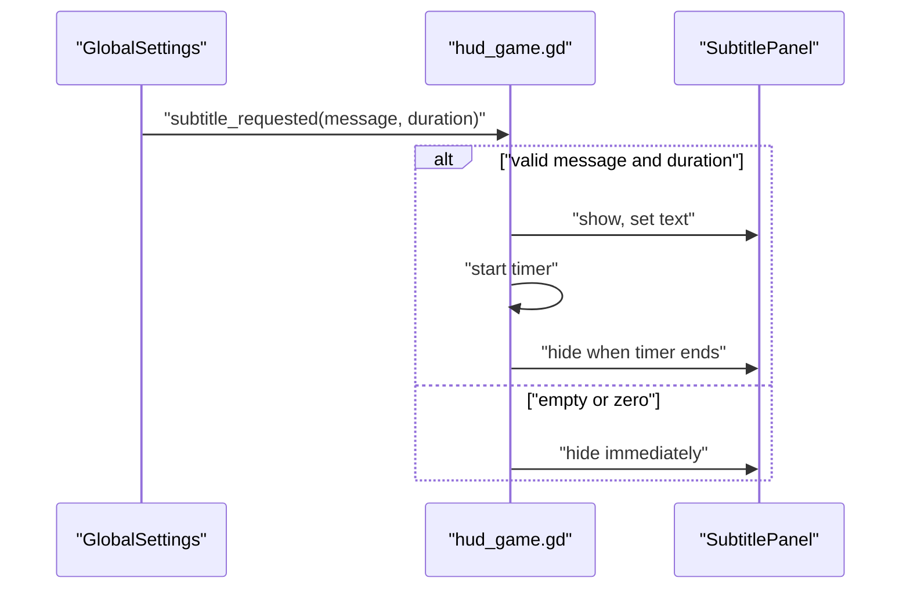
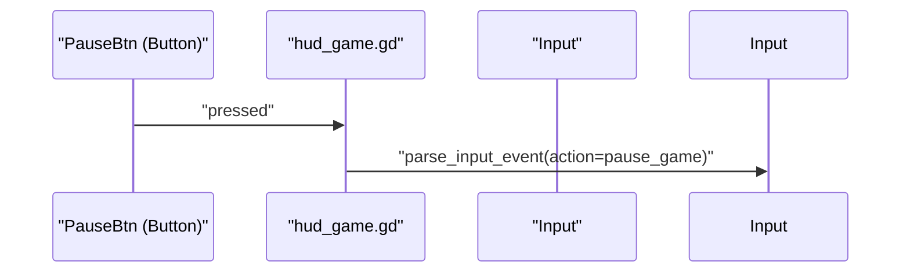
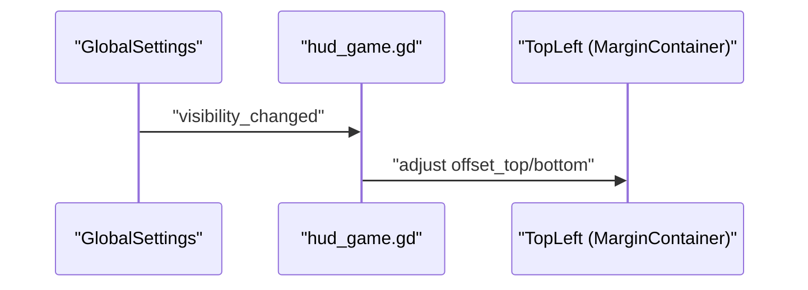
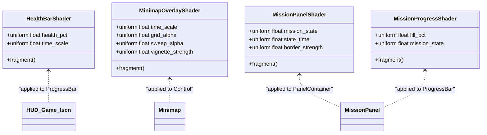
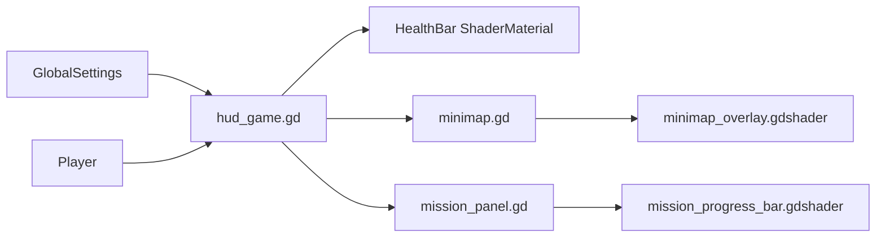

# HUD Components

<cite>
**Referenced Files in This Document**
- [hud_game.gd](file://Menu/HUD/hud_game.gd)
- [HUD_Game.tscn](file://Menu/HUD/HUD_Game.tscn)
- [minimap.gd](file://Menu/HUD/minimap.gd)
- [minimap_overlay.gdshader](file://Shaders/HUD/minimap_overlay.gdshader)
- [health_bar.gdshader](file://Shaders/HUD/health_bar.gdshader)
- [mission_panel.gd](file://Scripts/mission_panel.gd)
- [mission_progress_bar.gdshader](file://Shaders/HUD/mission_progress_bar.gdshader)
- [global_settings.gd](file://Scripts/global_settings.gd)
</cite>

## Table of Contents
1. [Introduction](#introduction)
2. [Project Structure](#project-structure)
3. [Core Components](#core-components)
4. [Architecture Overview](#architecture-overview)
5. [Detailed Component Analysis](#detailed-component-analysis)
6. [Dependency Analysis](#dependency-analysis)
7. [Performance Considerations](#performance-considerations)
8. [Troubleshooting Guide](#troubleshooting-guide)
9. [Conclusion](#conclusion)

## Introduction
This document explains the HUD system used in the game, focusing on:
- Health bar with shader-based visual effects and material management
- Ammo display with current/total tracking, reload warning flashes, and tween-based animations
- Minimap with radar rendering, coordinate mapping, player positioning, and optional overlay shader
- Subtitle panel for mission messages and notifications
- Scoreboard display, pause button integration, and FPS panel compatibility
- Shader material creation, parameter updates, and quality level–dependent rendering
- Examples of HUD customization, signal connections, and responsive positioning

## Project Structure
The HUD is composed of:
- A scene (HUD_Game.tscn) containing UI nodes for health, ammo, weapon info, minimap, subtitle panel, and pause button
- A controller script (hud_game.gd) that connects to the player and GlobalSettings, manages signals, and applies quality settings
- A minimap script (minimap.gd) that draws teammates/enemies/items around the player
- Shader materials for health bar, mission panel, mission progress bar, and minimap overlay
- A mission panel script (mission_panel.gd) that drives mission UI and animations

**Diagram sources**
- [HUD_Game.tscn:61-312](file://Menu/HUD/HUD_Game.tscn#L61-L312)
- [hud_game.gd:1-206](file://Menu/HUD/hud_game.gd#L1-L206)
- [minimap.gd:1-114](file://Menu/HUD/minimap.gd#L1-L114)
- [health_bar.gdshader:1-38](file://Shaders/HUD/health_bar.gdshader#L1-L38)
- [minimap_overlay.gdshader:1-73](file://Shaders/HUD/minimap_overlay.gdshader#L1-L73)
- [mission_panel.gd:1-359](file://Scripts/mission_panel.gd#L1-L359)
- [mission_progress_bar.gdshader:1-63](file://Shaders/HUD/mission_progress_bar.gdshader#L1-L63)

**Section sources**
- [HUD_Game.tscn:61-312](file://Menu/HUD/HUD_Game.tscn#L61-L312)
- [hud_game.gd:1-206](file://Menu/HUD/hud_game.gd#L1-L206)
- [minimap.gd:1-114](file://Menu/HUD/minimap.gd#L1-L114)
- [health_bar.gdshader:1-38](file://Shaders/HUD/health_bar.gdshader#L1-L38)
- [minimap_overlay.gdshader:1-73](file://Shaders/HUD/minimap_overlay.gdshader#L1-L73)
- [mission_panel.gd:1-359](file://Scripts/mission_panel.gd#L1-L359)
- [mission_progress_bar.gdshader:1-63](file://Shaders/HUD/mission_progress_bar.gdshader#L1-L63)

## Core Components
- Health bar system
  - ProgressBar styled with custom background and fill
  - ShaderMaterial applied to the ProgressBar to render dynamic visuals
  - Health percentage computed and passed to the shader via a uniform
  - Material lifecycle tied to quality level (Ultra enables shader)
- Ammo display system
  - Current and total labels bound to player signals
  - Reload warning using a tween to alternate between default and warning colors
  - Smooth color transitions for visual feedback during reload
- Minimap
  - Player-centered radar rendering with teammates/enemies/items
  - Quality-aware drawing (background, borders, and detail)
  - Optional minimap overlay shader for sci-fi radar effects
- Subtitle panel
  - Centered panel controlled by GlobalSettings subtitles
  - Visibility and duration managed by a timer
- Mission panel
  - Dynamic mission UI with progress bar or counter
  - Shader-driven state visuals (normal, completed, failed)
  - Quality-aware animations and shader parameters
- Scoreboard and pause button
  - Scoreboard label toggled by HUD controller
  - Pause button triggers a pause action event
- FPS panel compatibility
  - Health bar vertical offset adjusts when FPS panel is visible
  - Signals propagate visibility changes to HUD controller

**Section sources**
- [hud_game.gd:101-144](file://Menu/HUD/hud_game.gd#L101-L144)
- [HUD_Game.tscn:92-101](file://Menu/HUD/HUD_Game.tscn#L92-L101)
- [minimap.gd:39-110](file://Menu/HUD/minimap.gd#L39-L110)
- [minimap_overlay.gdshader:1-73](file://Shaders/HUD/minimap_overlay.gdshader#L1-L73)
- [global_settings.gd:67-162](file://Scripts/global_settings.gd#L67-L162)
- [mission_panel.gd:323-346](file://Scripts/mission_panel.gd#L323-L346)

## Architecture Overview
The HUD controller orchestrates UI updates by connecting to the player and GlobalSettings. It also listens for quality changes to enable/disable shader materials and adjust layout offsets.

**Diagram sources**
- [hud_game.gd:198-206](file://Menu/HUD/hud_game.gd#L198-L206)
- [HUD_Game.tscn:92-101](file://Menu/HUD/HUD_Game.tscn#L92-L101)
- [minimap.gd:35-37](file://Menu/HUD/minimap.gd#L35-L37)
- [mission_panel.gd:323-346](file://Scripts/mission_panel.gd#L323-L346)

## Detailed Component Analysis

### Health Bar System
- Shader-based rendering
  - A ShaderMaterial is applied to the ProgressBar when quality allows
  - The shader computes color gradients and edge glow based on a health percentage uniform
- Health percentage calculation
  - Derived from player health and max values
  - Clamped to [0, 1] and passed to the shader
- Material management
  - Material is created/destroyed depending on graphics preset
  - Health position adapts when the FPS panel becomes visible

**Diagram sources**
- [hud_game.gd:101-109](file://Menu/HUD/hud_game.gd#L101-L109)
- [health_bar.gdshader:3-37](file://Shaders/HUD/health_bar.gdshader#L3-L37)

**Section sources**
- [hud_game.gd:101-109](file://Menu/HUD/hud_game.gd#L101-L109)
- [health_bar.gdshader:1-38](file://Shaders/HUD/health_bar.gdshader#L1-L38)
- [HUD_Game.tscn:92-101](file://Menu/HUD/HUD_Game.tscn#L92-L101)

### Ammo Display System
- Tracking
  - Current and total ammo labels reflect player state
- Reload warnings
  - On reload start, a tween alternates the current ammo label color between default and warning color
  - Loops based on reload duration and restores default color afterward
- Animations
  - Tween-based property animation for color flashing

**Diagram sources**
- [hud_game.gd:118-134](file://Menu/HUD/hud_game.gd#L118-L134)

**Section sources**
- [hud_game.gd:111-134](file://Menu/HUD/hud_game.gd#L111-L134)
- [HUD_Game.tscn:253-266](file://Menu/HUD/HUD_Game.tscn#L253-L266)

### Minimap Functionality
- Radar rendering
  - Draws a centered diamond for the player
  - Collects entities from groups and filters by height level
  - Draws friends and enemies differently; items drawn with a distinct color
- Coordinate mapping
  - Uses a scale factor to convert world positions to minimap coordinates
  - Positions entities relative to the player’s offset
- Navigation overlays
  - Optional minimap overlay shader adds grid, sweep, vignette, and scanlines
- Quality-dependent rendering
  - Background and border drawn at medium quality and above
  - Items filtered by height level at high quality and above

**Diagram sources**
- [minimap.gd:39-110](file://Menu/HUD/minimap.gd#L39-L110)
- [minimap_overlay.gdshader:1-73](file://Shaders/HUD/minimap_overlay.gdshader#L1-L73)

**Section sources**
- [minimap.gd:39-110](file://Menu/HUD/minimap.gd#L39-L110)
- [minimap_overlay.gdshader:1-73](file://Shaders/HUD/minimap_overlay.gdshader#L1-L73)

### Subtitle Panel System
- Controlled by GlobalSettings
  - Emits subtitle events with message and duration
  - HUD hides the panel when message is empty or duration is zero
- Responsive behavior
  - Timer-based visibility management; panel hidden when time expires

**Diagram sources**
- [global_settings.gd:67-162](file://Scripts/global_settings.gd#L67-L162)
- [hud_game.gd:135-144](file://Menu/HUD/hud_game.gd#L135-L144)
- [HUD_Game.tscn:289-312](file://Menu/HUD/HUD_Game.tscn#L289-L312)

**Section sources**
- [global_settings.gd:154-162](file://Scripts/global_settings.gd#L154-L162)
- [hud_game.gd:135-144](file://Menu/HUD/hud_game.gd#L135-L144)
- [HUD_Game.tscn:289-312](file://Menu/HUD/HUD_Game.tscn#L289-L312)

### Scoreboard Display and Pause Button Integration
- Scoreboard
  - HUD controller exposes a method to set scoreboard text and visibility
- Pause button
  - Pressing the button simulates a pause action event, triggering the pause menu

**Diagram sources**
- [HUD_Game.tscn:198-211](file://Menu/HUD/HUD_Game.tscn#L198-L211)
- [hud_game.gd:153-159](file://Menu/HUD/hud_game.gd#L153-L159)

**Section sources**
- [hud_game.gd:145-152](file://Menu/HUD/hud_game.gd#L145-L152)
- [HUD_Game.tscn:198-211](file://Menu/HUD/HUD_Game.tscn#L198-L211)
- [hud_game.gd:153-159](file://Menu/HUD/hud_game.gd#L153-L159)

### FPS Panel Compatibility
- Health bar vertical offset adjusts when the FPS panel is visible
- HUD listens for visibility changes and updates margins accordingly

**Diagram sources**
- [global_settings.gd:71-72](file://Scripts/global_settings.gd#L71-L72)
- [hud_game.gd:59-61](file://Menu/HUD/hud_game.gd#L59-L61)
- [hud_game.gd:184-192](file://Menu/HUD/hud_game.gd#L184-L192)

**Section sources**
- [global_settings.gd:71-72](file://Scripts/global_settings.gd#L71-L72)
- [hud_game.gd:184-192](file://Menu/HUD/hud_game.gd#L184-L192)

### Shader Material Creation and Parameter Updates
- Health bar
  - Shader reads health_pct and time_scale; computes color and edge glow
- Minimap overlay
  - Adds vignette, grid, sweep, rings, scanlines, and border glow
- Mission panel and progress bar
  - Mission panel shader reacts to mission_state and state_time
  - Progress bar shader reacts to fill_pct and mission_state
- Quality-dependent rendering
  - HUD controller emits quality_changed to child components
  - Minimap and mission panel scripts rebuild animations and draw modes based on quality

**Diagram sources**
- [health_bar.gdshader:1-38](file://Shaders/HUD/health_bar.gdshader#L1-L38)
- [minimap_overlay.gdshader:1-73](file://Shaders/HUD/minimap_overlay.gdshader#L1-L73)
- [mission_panel.gdshader:1-112](file://Shaders/HUD/mission_panel.gdshader#L1-L112)
- [mission_progress_bar.gdshader:1-63](file://Shaders/HUD/mission_progress_bar.gdshader#L1-L63)
- [HUD_Game.tscn:164-169](file://Menu/HUD/HUD_Game.tscn#L164-L169)
- [mission_panel.gd:323-346](file://Scripts/mission_panel.gd#L323-L346)

**Section sources**
- [health_bar.gdshader:1-38](file://Shaders/HUD/health_bar.gdshader#L1-L38)
- [minimap_overlay.gdshader:1-73](file://Shaders/HUD/minimap_overlay.gdshader#L1-L73)
- [mission_panel.gdshader:1-112](file://Shaders/HUD/mission_panel.gdshader#L1-L112)
- [mission_progress_bar.gdshader:1-63](file://Shaders/HUD/mission_progress_bar.gdshader#L1-L63)
- [HUD_Game.tscn:164-169](file://Menu/HUD/HUD_Game.tscn#L164-L169)
- [mission_panel.gd:323-346](file://Scripts/mission_panel.gd#L323-L346)

### HUD Customization, Signal Connections, and Responsive Positioning
- Customization
  - ProgressBar styles and colors configured in the scene
  - Minimap colors and scale configurable via exported variables
  - Mission panel styles and animations depend on quality level
- Signal connections
  - HUD controller connects to player signals for health, ammo, and reload
  - HUD controller connects to GlobalSettings for subtitles and quality changes
  - Minimap and mission panel connect to GlobalSettings for quality changes
- Responsive positioning
  - Health bar margins adjust based on FPS panel visibility
  - Mission panel animations vary by quality (none, fade/Y, bounce/scale)

**Section sources**
- [HUD_Game.tscn:92-101](file://Menu/HUD/HUD_Game.tscn#L92-L101)
- [minimap.gd:3-12](file://Menu/HUD/minimap.gd#L3-L12)
- [hud_game.gd:36-56](file://Menu/HUD/hud_game.gd#L36-L56)
- [mission_panel.gd:28-49](file://Scripts/mission_panel.gd#L28-L49)

## Dependency Analysis
- HUD controller depends on:
  - Player signals for health/ammo/reload
  - GlobalSettings for subtitles and quality
- Minimap depends on:
  - Player node and groups for entities
  - GlobalSettings for quality
- Mission panel depends on:
  - MissionManager signals
  - GlobalSettings for quality
- Shaders depend on:
  - Uniform parameters set by scripts

**Diagram sources**
- [hud_game.gd:36-56](file://Menu/HUD/hud_game.gd#L36-L56)
- [minimap.gd:16-22](file://Menu/HUD/minimap.gd#L16-L22)
- [mission_panel.gd:32-49](file://Scripts/mission_panel.gd#L32-L49)

**Section sources**
- [hud_game.gd:36-56](file://Menu/HUD/hud_game.gd#L36-L56)
- [minimap.gd:16-22](file://Menu/HUD/minimap.gd#L16-L22)
- [mission_panel.gd:32-49](file://Scripts/mission_panel.gd#L32-L49)

## Performance Considerations
- Shader usage
  - Health bar and mission panel shaders are enabled only at higher quality presets
  - Minimap overlay shader is applied to the minimap Control node
- Redraw frequency
  - Minimap queues redraw every frame when visible; keep scale factors reasonable
- Tween usage
  - Reload flash tween loops for the duration of reload; ensure cleanup on subsequent reloads
- Quality scaling
  - Animations and drawing complexity increase with quality; disable heavy effects at lower presets

## Troubleshooting Guide
- Health bar not updating
  - Verify player signals are connected and health values are valid
  - Confirm shader material is applied at the selected quality preset
- Minimap not visible
  - Ensure player node exists and is in the “players” group
  - Check that entities are in expected groups and height levels match
- Subtitles not appearing
  - Confirm GlobalSettings subtitles setting is enabled
  - Ensure subtitle_requested is emitted with a non-empty message and positive duration
- Reload warning not flashing
  - Verify reload_started signal is emitted and HUD tween is created
  - Check that the current ammo label exists and supports theme overrides
- Mission panel visuals not changing
  - Ensure MissionManager emits state signals and shader parameters are updated each frame

**Section sources**
- [hud_game.gd:76-91](file://Menu/HUD/hud_game.gd#L76-L91)
- [minimap.gd:24-34](file://Menu/HUD/minimap.gd#L24-L34)
- [global_settings.gd:154-162](file://Scripts/global_settings.gd#L154-L162)
- [mission_panel.gd:323-346](file://Scripts/mission_panel.gd#L323-L346)

## Conclusion
The HUD system integrates UI nodes, shader materials, and quality-aware logic to deliver a polished, responsive interface. Health, ammo, minimap, subtitles, and mission panels are coordinated via signals and GlobalSettings, while shaders and animations adapt to the selected graphics preset. This modular design enables easy customization and maintainability across different hardware configurations.