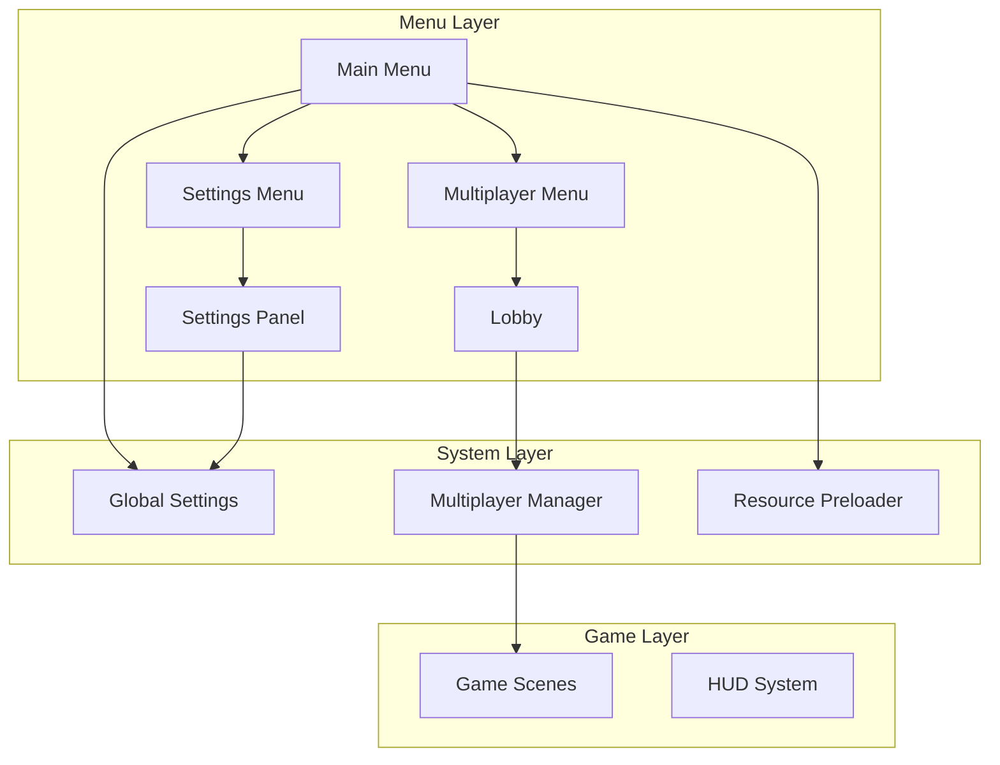
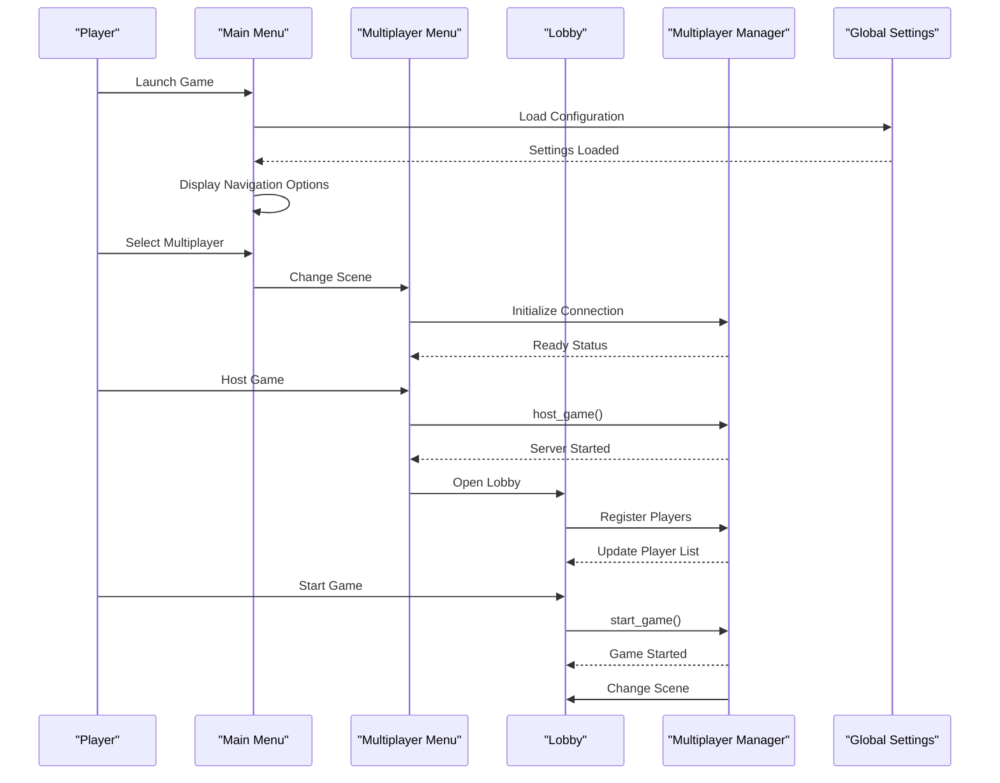
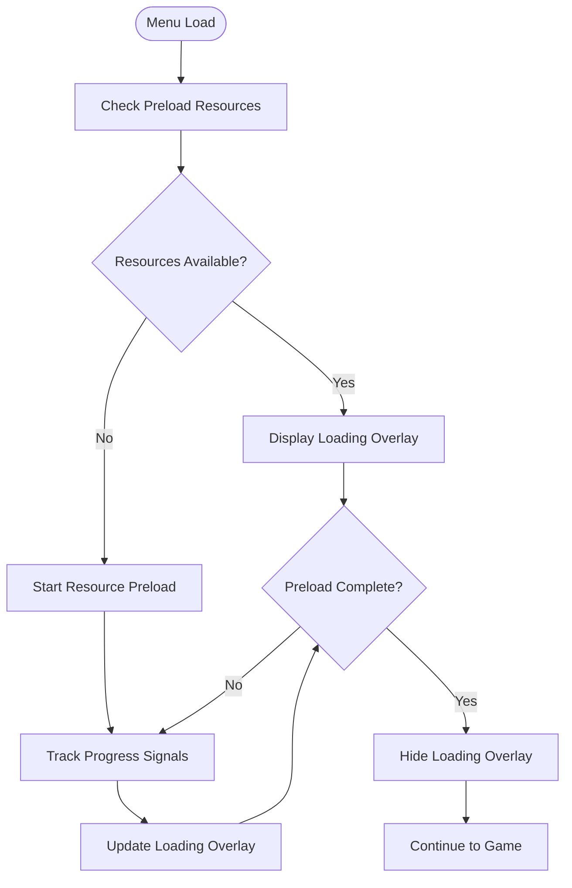
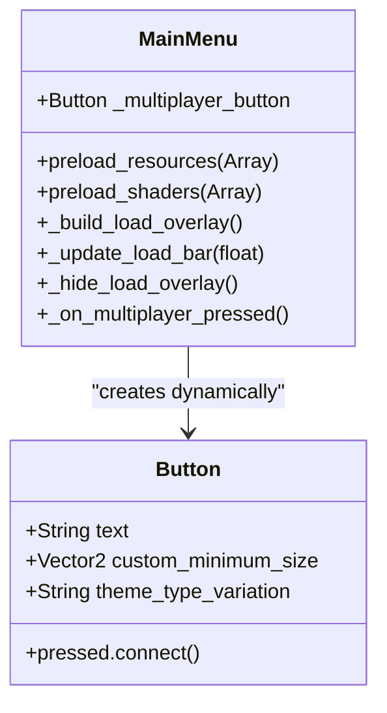
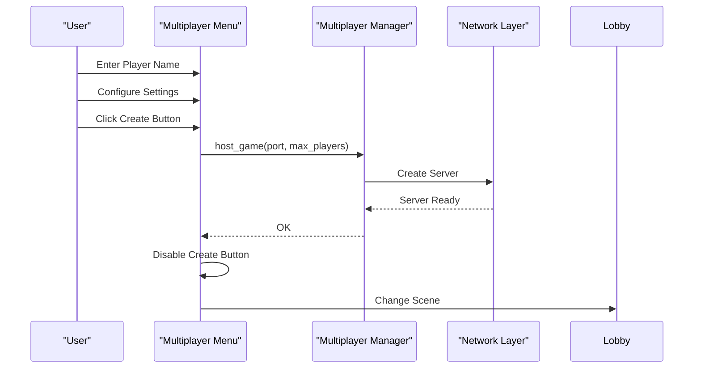
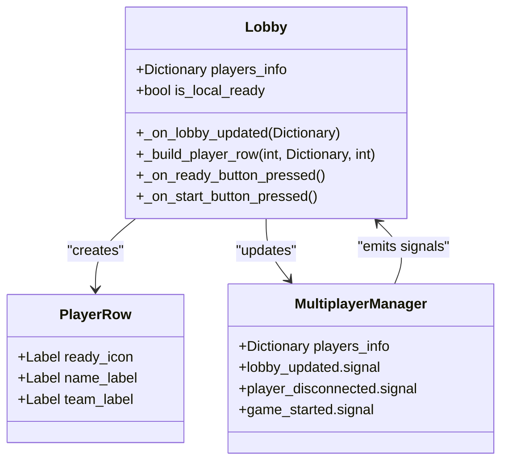
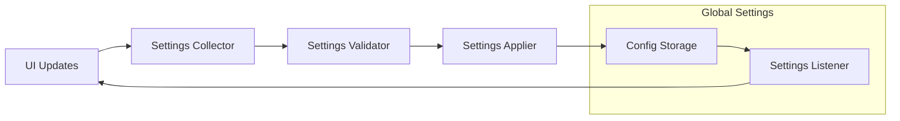
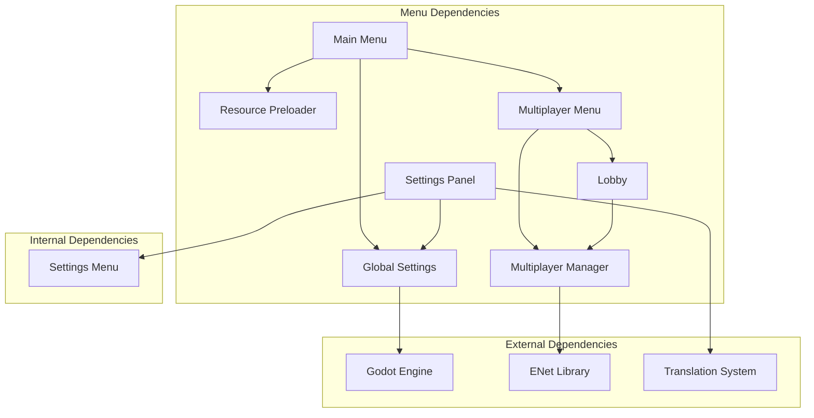
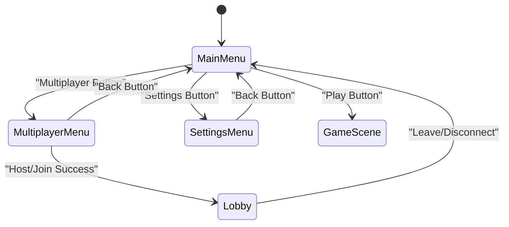

# Main Menu System

<cite>
**Referenced Files in This Document**
- [main_menu.gd](file://Menu/main_menu.gd)
- [main_menu.tscn](file://Menu/main_menu.tscn)
- [multiplayer_menu.gd](file://Menu/multiplayer_menu.gd)
- [multiplayer_menu.tscn](file://Menu/multiplayer_menu.tscn)
- [lobby.gd](file://Menu/lobby.gd)
- [multiplayer_manager.gd](file://Scripts/multiplayer_manager.gd)
- [global_settings.gd](file://Scripts/global_settings.gd)
- [settings_menu.gd](file://Menu/settings_menu.gd)
- [settings_menu.tscn](file://Menu/settings_menu.tscn)
- [settings_panel.gd](file://Menu/settings_panel.gd)
- [settings_panel.tscn](file://Menu/settings_panel.tscn)
</cite>

## Table of Contents
1. [Introduction](#introduction)
2. [Project Structure](#project-structure)
3. [Core Components](#core-components)
4. [Architecture Overview](#architecture-overview)
5. [Detailed Component Analysis](#detailed-component-analysis)
6. [Dependency Analysis](#dependency-analysis)
7. [Performance Considerations](#performance-considerations)
8. [Troubleshooting Guide](#troubleshooting-guide)
9. [Conclusion](#conclusion)

## Introduction

The Main Menu System is a comprehensive navigation framework for the TFA Agents game, providing seamless access to single-player gameplay, multiplayer functionality, and system settings. Built with Godot 4's modern architecture, the system features responsive layouts, dynamic theming, and robust multiplayer integration through ENet networking.

The system consists of three primary menu screens: the main menu for initial navigation, the multiplayer menu for network setup, and the lobby system for real-time coordination. Each component integrates with the global settings system for persistent configuration management and supports internationalization through translation keys.

## Project Structure

The menu system follows a modular architecture with clear separation of concerns:

**Diagram sources**
- [main_menu.gd:1-416](file://Menu/main_menu.gd#L1-L416)
- [multiplayer_menu.gd:1-121](file://Menu/multiplayer_menu.gd#L1-L121)
- [lobby.gd:1-162](file://Menu/lobby.gd#L1-L162)

**Section sources**
- [main_menu.tscn:1-324](file://Menu/main_menu.tscn#L1-L324)
- [multiplayer_menu.tscn:1-141](file://Menu/multiplayer_menu.tscn#L1-L141)

## Core Components

### Main Menu Interface

The main menu serves as the central hub for game navigation, featuring:

- **Navigation Buttons**: Play, Settings, and Exit controls with dynamic localization
- **Game Mode Selection**: Single-player mode with configurable scene paths
- **Update Management**: Integrated release checking and download progress tracking
- **Responsive Layout**: Adaptive sizing with theme-based styling

Key implementation features include dynamic button creation, resource preloading, and integrated changelog display.

**Section sources**
- [main_menu.gd:1-416](file://Menu/main_menu.gd#L1-L416)

### Multiplayer Menu Integration

The multiplayer system provides comprehensive network functionality:

- **Server Hosting**: Local game creation with customizable parameters
- **Client Connection**: Remote server joining with IP/port configuration
- **Player Management**: Dynamic player list updates and readiness tracking
- **Team Configuration**: Support for team-based and FFA modes

**Section sources**
- [multiplayer_menu.gd:1-121](file://Menu/multiplayer_menu.gd#L1-L121)
- [multiplayer_manager.gd:1-322](file://Scripts/multiplayer_manager.gd#L1-L322)

### Lobby System

Real-time coordination for multiplayer sessions:

- **Player Waiting Areas**: Live player list with readiness indicators
- **Team Selection**: Automatic team assignment and manual overrides
- **Match Preparation**: Host-controlled game start with synchronization
- **Chat Integration**: Real-time messaging between participants

**Section sources**
- [lobby.gd:1-162](file://Menu/lobby.gd#L1-L162)

### Settings Management

Comprehensive configuration system:

- **Audio Controls**: Master volume, music, and SFX sliders
- **Graphics Options**: Window modes, VSync, FPS limits, and preset configurations
- **Interface Settings**: UI scaling, language selection, and accessibility options
- **Persistence Layer**: Automatic saving and restoration of preferences

**Section sources**
- [settings_panel.gd:1-202](file://Menu/settings_panel.gd#L1-L202)
- [global_settings.gd:1-618](file://Scripts/global_settings.gd#L1-L618)

## Architecture Overview

The menu system employs a layered architecture with clear separation between presentation, logic, and persistence:

**Diagram sources**
- [main_menu.gd:143-153](file://Menu/main_menu.gd#L143-L153)
- [multiplayer_menu.gd:63-77](file://Menu/multiplayer_menu.gd#L63-L77)
- [lobby.gd:101-102](file://Menu/lobby.gd#L101-L102)

## Detailed Component Analysis

### Main Menu Component Analysis

The main menu implements advanced features for resource management and user experience:

#### Resource Preloading System

The system includes sophisticated resource preloading with asynchronous loading and progress tracking:

**Diagram sources**
- [main_menu.gd:88-105](file://Menu/main_menu.gd#L88-L105)
- [main_menu.gd:376-383](file://Menu/main_menu.gd#L376-L383)

#### Dynamic Button Creation

The main menu dynamically creates the multiplayer button at runtime:

**Diagram sources**
- [main_menu.gd:75-86](file://Menu/main_menu.gd#L75-L86)
- [main_menu.gd:143-144](file://Menu/main_menu.gd#L143-L144)

#### Release Management Integration

The main menu integrates with the global settings system for update checking:

**Section sources**
- [main_menu.gd:250-286](file://Menu/main_menu.gd#L250-L286)
- [global_settings.gd:192-223](file://Scripts/global_settings.gd#L192-L223)

### Multiplayer Menu Component Analysis

The multiplayer menu provides comprehensive network configuration:

#### Server Hosting Workflow

**Diagram sources**
- [multiplayer_menu.gd:63-77](file://Menu/multiplayer_menu.gd#L63-L77)
- [multiplayer_manager.gd:74-89](file://Scripts/multiplayer_manager.gd#L74-L89)

#### Client Connection Process

The client connection process handles various error scenarios:

**Section sources**
- [multiplayer_menu.gd:80-94](file://Menu/multiplayer_menu.gd#L80-L94)
- [multiplayer_manager.gd:95-106](file://Scripts/multiplayer_manager.gd#L95-L106)

### Lobby System Component Analysis

The lobby system manages real-time multiplayer coordination:

#### Player Management Architecture

**Diagram sources**
- [lobby.gd:40-89](file://Menu/lobby.gd#L40-L89)
- [multiplayer_manager.gd:28-47](file://Scripts/multiplayer_manager.gd#L28-L47)

#### Team Assignment Logic

The lobby system implements intelligent team assignment:

**Section sources**
- [multiplayer_manager.gd:199-218](file://Scripts/multiplayer_manager.gd#L199-L218)
- [lobby.gd:59-89](file://Menu/lobby.gd#L59-L89)

### Settings Management Component Analysis

The settings system provides comprehensive configuration management:

#### Settings Persistence Architecture

**Diagram sources**
- [settings_panel.gd:136-148](file://Menu/settings_panel.gd#L136-L148)
- [global_settings.gd:164-185](file://Scripts/global_settings.gd#L164-L185)

#### Theme System Integration

The settings system integrates with the global theme resource for dynamic UI scaling:

**Section sources**
- [settings_panel.gd:190-193](file://Menu/settings_panel.gd#L190-L193)
- [global_settings.gd:308-327](file://Scripts/global_settings.gd#L308-L327)

## Dependency Analysis

The menu system exhibits clean dependency relationships with minimal coupling:

**Diagram sources**
- [main_menu.gd:23-25](file://Menu/main_menu.gd#L23-L25)
- [multiplayer_menu.gd:19-26](file://Menu/multiplayer_menu.gd#L19-L26)
- [lobby.gd:13-22](file://Menu/lobby.gd#L13-L22)

### Menu State Transitions

The system implements a clear state machine for navigation:

**Diagram sources**
- [main_menu.gd:143-153](file://Menu/main_menu.gd#L143-L153)
- [multiplayer_menu.gd:96-98](file://Menu/multiplayer_menu.gd#L96-L98)
- [settings_menu.gd:16-19](file://Menu/settings_menu.gd#L16-L19)

### Button Event Handling

All menu buttons follow a consistent event handling pattern:

**Section sources**
- [main_menu.gd:119-153](file://Menu/main_menu.gd#L119-L153)
- [multiplayer_menu.gd:55-77](file://Menu/multiplayer_menu.gd#L55-L77)
- [lobby.gd:95-107](file://Menu/lobby.gd#L95-L107)

## Performance Considerations

### Resource Management

The main menu implements efficient resource management through:

- **Asynchronous Loading**: Non-blocking resource preloading during menu display
- **Progress Tracking**: Real-time feedback for long-loading assets
- **Memory Optimization**: Proper cleanup of loading overlays and temporary nodes

### Network Optimization

The multiplayer system optimizes network performance through:

- **Connection Pooling**: Efficient peer management and connection reuse
- **RPC Optimization**: Reliable and efficient remote procedure calls
- **State Synchronization**: Minimal bandwidth usage for lobby updates

### UI Responsiveness

The menu system maintains responsiveness through:

- **Lazy Loading**: Deferred creation of complex UI elements
- **Event Delegation**: Centralized event handling reduces overhead
- **Theme Caching**: Precomputed theme values minimize runtime calculations

## Troubleshooting Guide

### Common Issues and Solutions

#### Multiplayer Connection Failures

**Problem**: Unable to connect to hosted games
**Solution**: Verify port availability and firewall settings

#### Resource Loading Problems

**Problem**: Loading overlay remains visible indefinitely
**Solution**: Check resource paths and ensure proper asset packaging

#### Settings Persistence Issues

**Problem**: Settings not saving between sessions
**Solution**: Verify configuration file permissions and path validity

**Section sources**
- [multiplayer_menu.gd:101-104](file://Menu/multiplayer_menu.gd#L101-L104)
- [main_menu.gd:364-373](file://Menu/main_menu.gd#L364-L373)
- [global_settings.gd:226-244](file://Scripts/global_settings.gd#L226-L244)

### Debugging Menu Components

Each component provides debugging hooks:

- **Signal Connections**: All major events emit debug information
- **Error Handling**: Comprehensive error reporting for failed operations
- **State Validation**: Runtime checks for invalid menu states

**Section sources**
- [multiplayer_manager.gd:299-308](file://Scripts/multiplayer_manager.gd#L299-L308)
- [main_menu.gd:56-74](file://Menu/main_menu.gd#L56-L74)

## Conclusion

The Main Menu System provides a robust, extensible foundation for game navigation and multiplayer coordination. Its modular architecture enables easy customization while maintaining performance and reliability. The system's integration with Godot's modern features ensures compatibility with current development practices and future enhancements.

Key strengths include comprehensive resource management, flexible multiplayer integration, and extensive customization capabilities through the settings system. The clean separation of concerns facilitates maintenance and extension, making it an excellent foundation for game development projects requiring sophisticated menu systems.

The system demonstrates best practices in UI architecture, including proper state management, efficient resource utilization, and comprehensive error handling. These patterns serve as valuable examples for developers building similar menu systems in Godot applications.