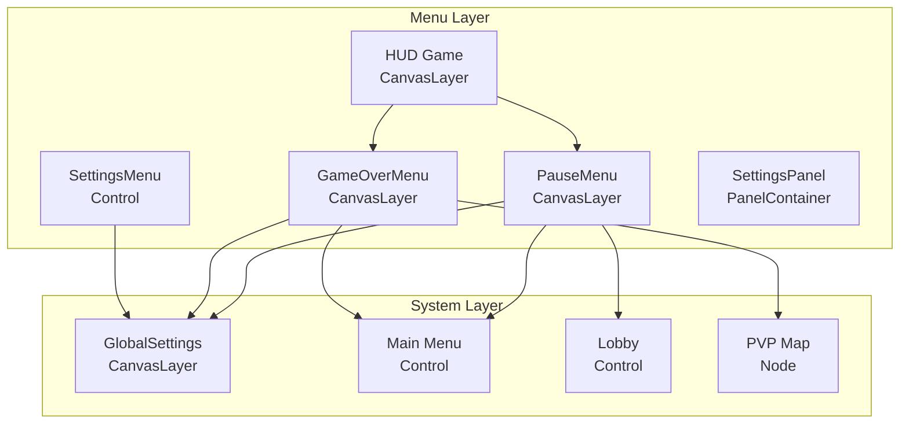
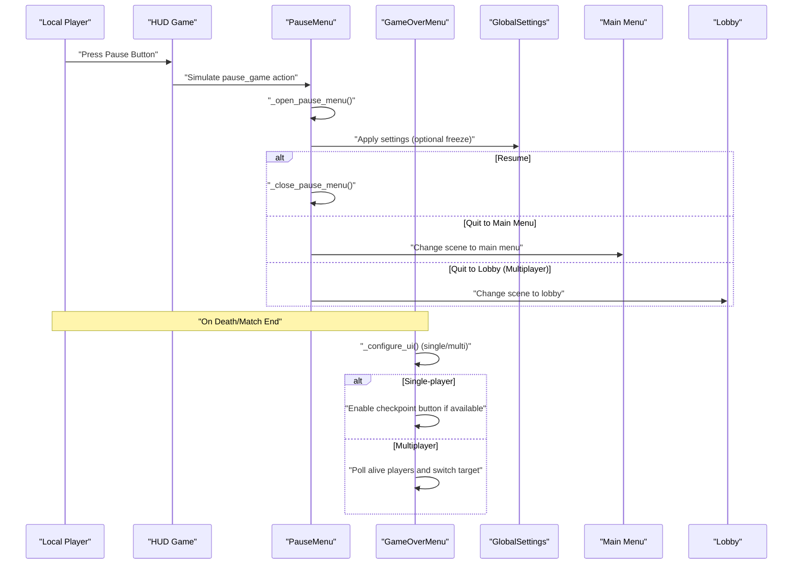
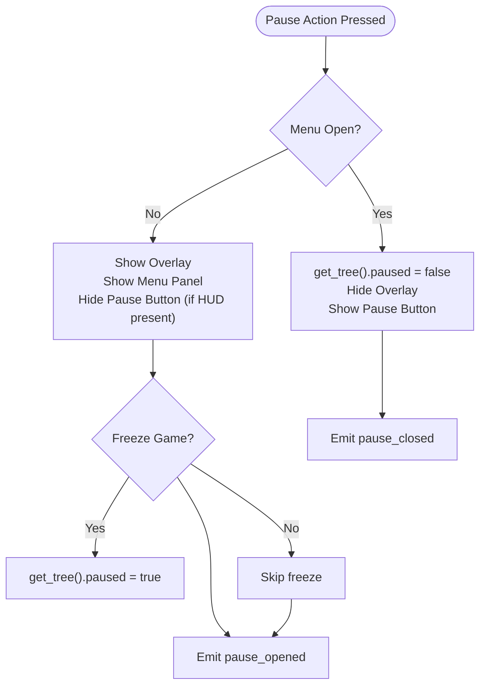
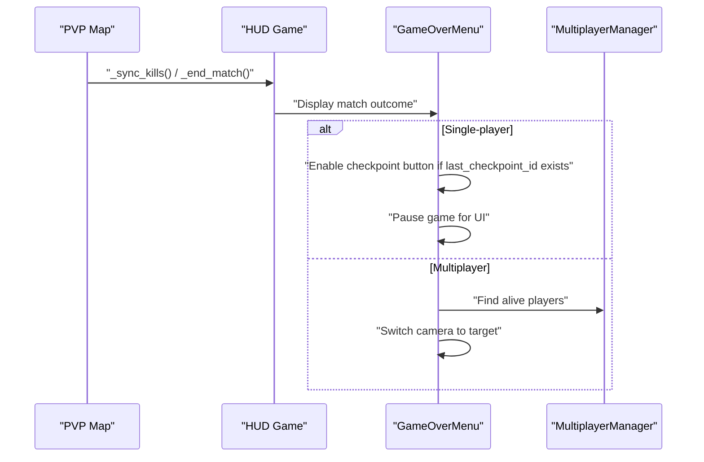
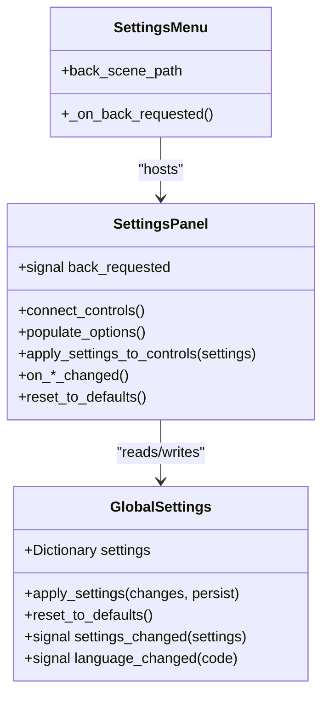
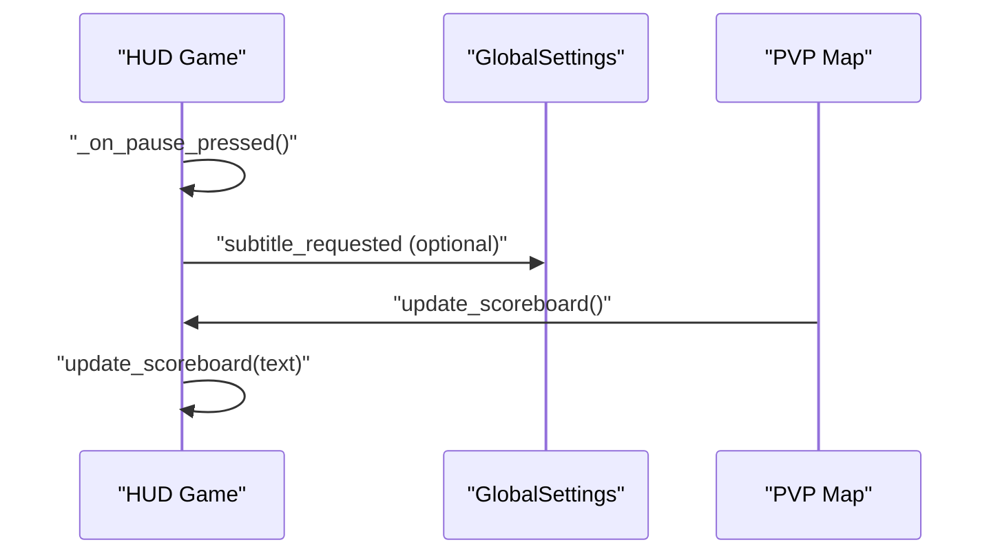
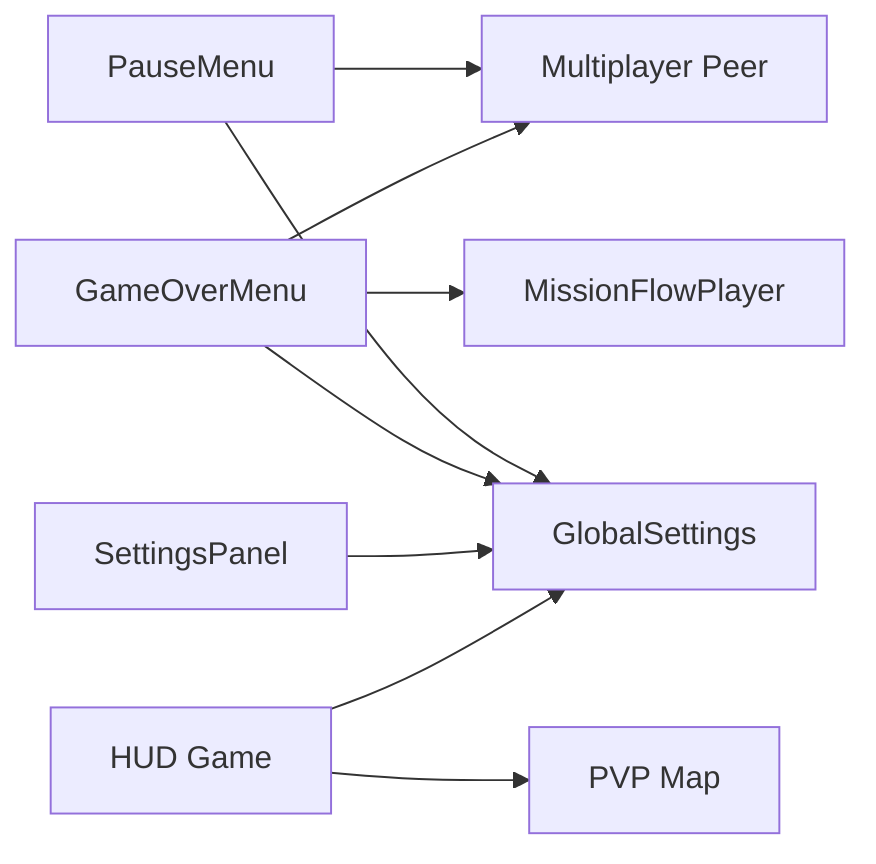

# Pause and Game Over Menus

<cite>
**Referenced Files in This Document**
- [pause_menu.gd](file://Menu/pause_menu.gd)
- [pause_menu.tscn](file://Menu/pause_menu.tscn)
- [game_over_menu.gd](file://Menu/game_over_menu.gd)
- [game_over_menu.tscn](file://Menu/game_over_menu.tscn)
- [settings_menu.gd](file://Menu/settings_menu.gd)
- [settings_menu.tscn](file://Menu/settings_menu.tscn)
- [settings_panel.gd](file://Menu/settings_panel.gd)
- [settings_panel.tscn](file://Menu/settings_panel.tscn)
- [global_settings.gd](file://Scripts/global_settings.gd)
- [hud_game.gd](file://Menu/HUD/hud_game.gd)
- [main_menu.gd](file://Menu/main_menu.gd)
- [lobby.gd](file://Menu/lobby.gd)
- [pvp_map.gd](file://Scripts/pvp_map.gd)
</cite>

## Table of Contents
1. [Introduction](#introduction)
2. [Project Structure](#project-structure)
3. [Core Components](#core-components)
4. [Architecture Overview](#architecture-overview)
5. [Detailed Component Analysis](#detailed-component-analysis)
6. [Dependency Analysis](#dependency-analysis)
7. [Performance Considerations](#performance-considerations)
8. [Troubleshooting Guide](#troubleshooting-guide)
9. [Conclusion](#conclusion)

## Introduction
This document explains the pause and game over menu systems in the project. It covers pause menu functionality (resume, settings access, quit to main menu), game over menu behavior (score display, restart prompts, main menu navigation), state preservation during pause, audio management, input handling restrictions, transition animations, menu positioning, overlay rendering, scoring system integration, win/lose condition detection, and reward display mechanisms. It also includes examples of menu customization, state management, and integration with game flow control.

## Project Structure
The pause and game over menus are implemented as CanvasLayer nodes integrated into the game’s UI hierarchy. They rely on GlobalSettings for audio and graphics configuration, and connect to HUD and multiplayer managers for seamless gameplay transitions.

**Diagram sources**
- [pause_menu.gd:1-143](file://Menu/pause_menu.gd#L1-L143)
- [game_over_menu.gd:1-269](file://Menu/game_over_menu.gd#L1-L269)
- [settings_menu.gd:1-20](file://Menu/settings_menu.gd#L1-L20)
- [settings_panel.gd:1-202](file://Menu/settings_panel.gd#L1-L202)
- [global_settings.gd:1-618](file://Scripts/global_settings.gd#L1-L618)
- [hud_game.gd:1-206](file://Menu/HUD/hud_game.gd#L1-L206)
- [main_menu.gd:1-416](file://Menu/main_menu.gd#L1-L416)
- [lobby.gd:1-162](file://Menu/lobby.gd#L1-L162)
- [pvp_map.gd](file://Scripts/pvp_map.gd)

**Section sources**
- [pause_menu.gd:1-143](file://Menu/pause_menu.gd#L1-L143)
- [game_over_menu.gd:1-269](file://Menu/game_over_menu.gd#L1-L269)
- [settings_panel.gd:1-202](file://Menu/settings_panel.gd#L1-L202)
- [global_settings.gd:1-618](file://Scripts/global_settings.gd#L1-L618)
- [hud_game.gd:1-206](file://Menu/HUD/hud_game.gd#L1-L206)
- [main_menu.gd:1-416](file://Menu/main_menu.gd#L1-L416)
- [lobby.gd:1-162](file://Menu/lobby.gd#L1-L162)
- [pvp_map.gd](file://Scripts/pvp_map.gd)

## Core Components
- PauseMenu: Handles pause overlay, resume, settings, and main menu transitions. Supports single-player freeze and multiplayer passthrough.
- GameOverMenu: Manages single-player restart and checkpoint reload, and multiplayer spectator mode with live target switching.
- SettingsMenu/SettingsPanel: Centralized audio and graphics controls synchronized with GlobalSettings.
- HUD Game: Integrates pause button and displays dynamic scoreboards; triggers pause via input action.
- GlobalSettings: Applies audio volume, window mode, vsync, FPS cap, graphics presets, UI scale, language, and subtitles; emits signals for UI updates.
- Main Menu and Lobby: Provide navigation targets for pause and game over exits.

Key responsibilities:
- State preservation during pause: Overlay visibility, panel visibility, and optional game tree pause.
- Audio management: Master volume applied globally; window/vsync/FPS cap adjustments; graphics preset scaling.
- Input handling: Pause action toggles menu; settings back action returns to previous scene.
- Scoring integration: HUD updates scoreboard; PVP map broadcasts kills and match results.

**Section sources**
- [pause_menu.gd:1-143](file://Menu/pause_menu.gd#L1-L143)
- [game_over_menu.gd:1-269](file://Menu/game_over_menu.gd#L1-L269)
- [settings_panel.gd:1-202](file://Menu/settings_panel.gd#L1-L202)
- [global_settings.gd:164-186](file://Scripts/global_settings.gd#L164-L186)
- [hud_game.gd:145-158](file://Menu/HUD/hud_game.gd#L145-L158)
- [pvp_map.gd:264-352](file://Scripts/pvp_map.gd#L264-L352)

## Architecture Overview
The pause and game over menus operate as overlay layers above gameplay. They communicate with GlobalSettings for configuration and with HUD/PVP systems for scoring and state.

**Diagram sources**
- [hud_game.gd:153-158](file://Menu/HUD/hud_game.gd#L153-L158)
- [pause_menu.gd:56-113](file://Menu/pause_menu.gd#L56-L113)
- [game_over_menu.gd:60-98](file://Menu/game_over_menu.gd#L60-L98)
- [global_settings.gd:164-186](file://Scripts/global_settings.gd#L164-L186)
- [main_menu.gd:119-141](file://Menu/main_menu.gd#L119-L141)
- [lobby.gd:105-107](file://Menu/lobby.gd#L105-L107)

## Detailed Component Analysis

### Pause Menu
The pause menu overlays the game world and provides:
- Resume game
- Settings access
- Quit to main menu or lobby (multiplayer-aware)
- Mode indicator (single-player vs multiplayer)
- Optional freezing of game physics/audio timers

Behavior highlights:
- Toggle via pause action; overlay visible when open.
- Freeze behavior controlled by export variable and multiplayer peer presence.
- HUD integration: if present, the on-screen pause button is hidden while the menu is open.
- Settings panel embedded inside the pause menu scene.

**Diagram sources**
- [pause_menu.gd:47-82](file://Menu/pause_menu.gd#L47-L82)
- [pause_menu.gd:115-118](file://Menu/pause_menu.gd#L115-L118)

**Section sources**
- [pause_menu.gd:1-143](file://Menu/pause_menu.gd#L1-L143)
- [pause_menu.tscn:1-105](file://Menu/pause_menu.tscn#L1-L105)

### Game Over Menu
The game over menu adapts to single-player and multiplayer modes:
- Single-player: restart from beginning or checkpoint; optional checkpoint availability checked via MissionFlowPlayer.
- Multiplayer: spectator mode with live polling of alive players; prev/next buttons cycle targets; display team affiliation; return to lobby or main menu.

Scoring integration:
- HUD scoreboard updated by PVP map during matches; game over screen inherits the paused state in single-player mode to prevent further movement.

**Diagram sources**
- [pvp_map.gd:264-352](file://Scripts/pvp_map.gd#L264-L352)
- [hud_game.gd:145-151](file://Menu/HUD/hud_game.gd#L145-L151)
- [game_over_menu.gd:60-98](file://Menu/game_over_menu.gd#L60-L98)

**Section sources**
- [game_over_menu.gd:1-269](file://Menu/game_over_menu.gd#L1-L269)
- [game_over_menu.tscn:1-129](file://Menu/game_over_menu.tscn#L1-L129)
- [pvp_map.gd](file://Scripts/pvp_map.gd)

### Settings System
Settings are centralized in GlobalSettings and applied immediately upon change:
- Audio: master volume applied to AudioServer bus.
- Graphics: window mode, vsync, FPS cap, graphics preset, UI scale.
- Gameplay: language, subtitles, screen shake.
- SettingsPanel populates OptionButtons and CheckButtons, translating labels and values.

**Diagram sources**
- [global_settings.gd:164-186](file://Scripts/global_settings.gd#L164-L186)
- [settings_panel.gd:39-180](file://Menu/settings_panel.gd#L39-L180)
- [settings_menu.gd:16-19](file://Menu/settings_menu.gd#L16-L19)

**Section sources**
- [global_settings.gd:1-618](file://Scripts/global_settings.gd#L1-L618)
- [settings_panel.gd:1-202](file://Menu/settings_panel.gd#L1-L202)
- [settings_menu.gd:1-20](file://Menu/settings_menu.gd#L1-L20)
- [settings_menu.tscn:1-45](file://Menu/settings_menu.tscn#L1-L45)

### HUD Integration and Scoring
The HUD integrates pause controls and displays dynamic scoreboards:
- Pause button triggers the pause action programmatically.
- Scoreboard updates are broadcast by PVP map and displayed in HUD.
- Subtitles and FPS counters are managed by GlobalSettings and HUD.

**Diagram sources**
- [hud_game.gd:153-158](file://Menu/HUD/hud_game.gd#L153-L158)
- [hud_game.gd:145-151](file://Menu/HUD/hud_game.gd#L145-L151)
- [global_settings.gd:154-161](file://Scripts/global_settings.gd#L154-L161)
- [pvp_map.gd:274-317](file://Scripts/pvp_map.gd#L274-L317)

**Section sources**
- [hud_game.gd:1-206](file://Menu/HUD/hud_game.gd#L1-L206)
- [pvp_map.gd:264-352](file://Scripts/pvp_map.gd#L264-L352)

## Dependency Analysis
- PauseMenu depends on GlobalSettings for language and mode labels, and on multiplayer state for freeze behavior.
- GameOverMenu depends on multiplayer peer detection and PVP map for match outcomes; it also interacts with MissionFlowPlayer for checkpoints.
- SettingsPanel depends on GlobalSettings for applying and reflecting changes.
- HUD depends on GlobalSettings for subtitles and on PVP map for score updates.

**Diagram sources**
- [pause_menu.gd:12-142](file://Menu/pause_menu.gd#L12-L142)
- [game_over_menu.gd:37-224](file://Menu/game_over_menu.gd#L37-L224)
- [settings_panel.gd:5-36](file://Menu/settings_panel.gd#L5-L36)
- [hud_game.gd:52-66](file://Menu/HUD/hud_game.gd#L52-L66)
- [pvp_map.gd:264-352](file://Scripts/pvp_map.gd#L264-L352)

**Section sources**
- [pause_menu.gd:1-143](file://Menu/pause_menu.gd#L1-L143)
- [game_over_menu.gd:1-269](file://Menu/game_over_menu.gd#L1-L269)
- [settings_panel.gd:1-202](file://Menu/settings_panel.gd#L1-L202)
- [hud_game.gd:1-206](file://Menu/HUD/hud_game.gd#L1-L206)
- [pvp_map.gd:1-373](file://Scripts/pvp_map.gd#L1-L373)

## Performance Considerations
- Single-player freeze: Pausing the engine halts physics and timers, reducing CPU/GPU load until resume.
- Multiplayer passthrough: In multiplayer, the pause menu does not freeze the game tree, allowing network updates and camera switching.
- Settings apply immediately: Audio bus changes and display updates occur without scene reloads.
- Scrolling lists and polling: Game over spectator mode polls alive players periodically; keep polling intervals reasonable to avoid overhead.

## Troubleshooting Guide
Common issues and resolutions:
- Pause menu not opening: Verify the pause action is mapped and HUD does not hide the on-screen button while the menu is open.
- Settings not applying: Confirm GlobalSettings.apply_settings is called and settings_changed signal is connected.
- Game over checkpoint button disabled: Ensure MissionFlowPlayer has a valid last_checkpoint_id.
- Spectator target invalid: The system automatically switches to next alive player; if none remain, buttons become disabled.
- Returning to lobby fails: Ensure MultiplayerManager.leave_current_match exists; otherwise, fallback to lobby scene path.

**Section sources**
- [pause_menu.gd:47-82](file://Menu/pause_menu.gd#L47-L82)
- [settings_panel.gd:162-179](file://Menu/settings_panel.gd#L162-L179)
- [game_over_menu.gd:80-85](file://Menu/game_over_menu.gd#L80-L85)
- [game_over_menu.gd:151-166](file://Menu/game_over_menu.gd#L151-L166)
- [pause_menu.gd:105-112](file://Menu/pause_menu.gd#L105-L112)

## Conclusion
The pause and game over menus are tightly integrated with GlobalSettings, HUD, and multiplayer systems. They provide robust state preservation, flexible input handling, and seamless transitions between gameplay and UI. The settings system ensures immediate feedback for audio and graphics preferences, while the game over menu supports both single-player restart and multiplayer spectator modes with dynamic target switching.