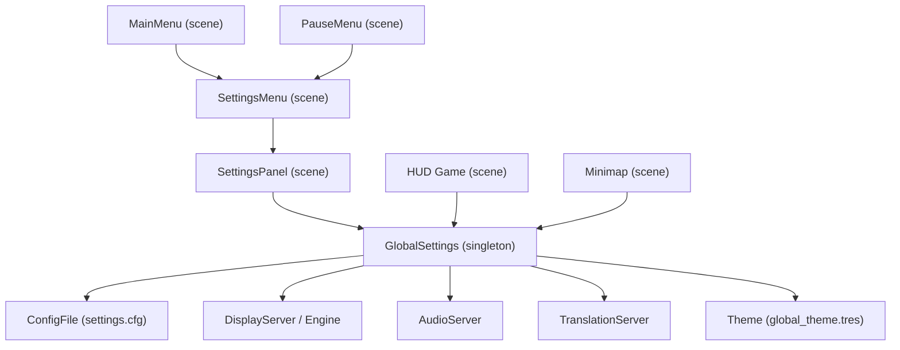
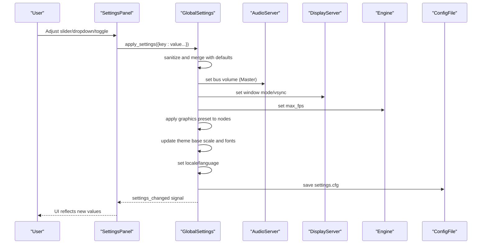
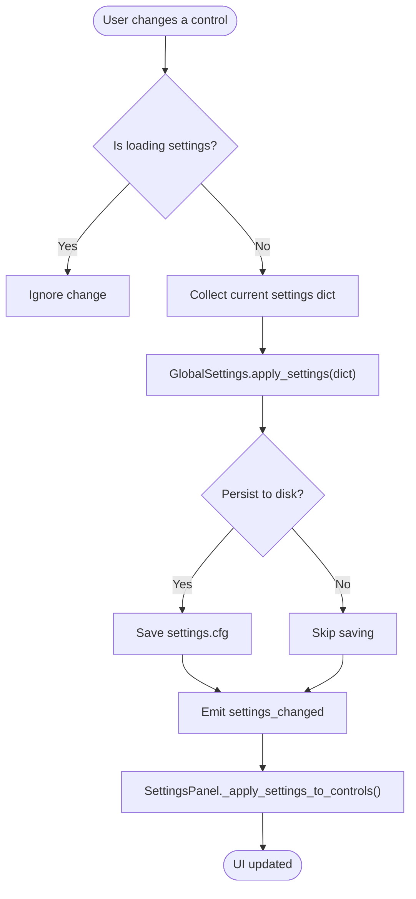
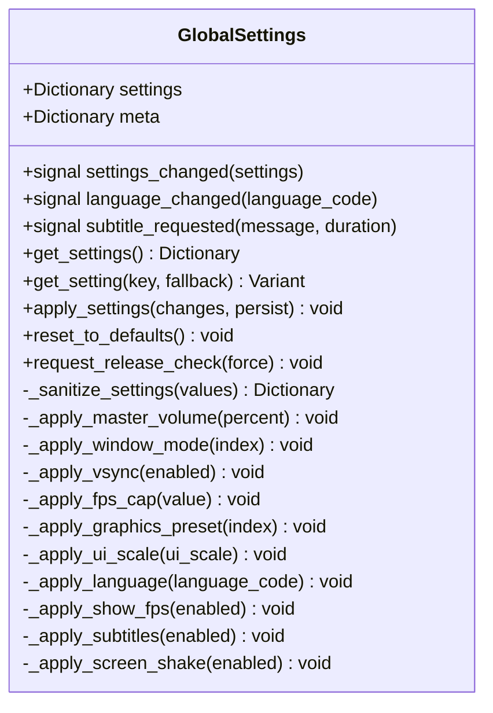
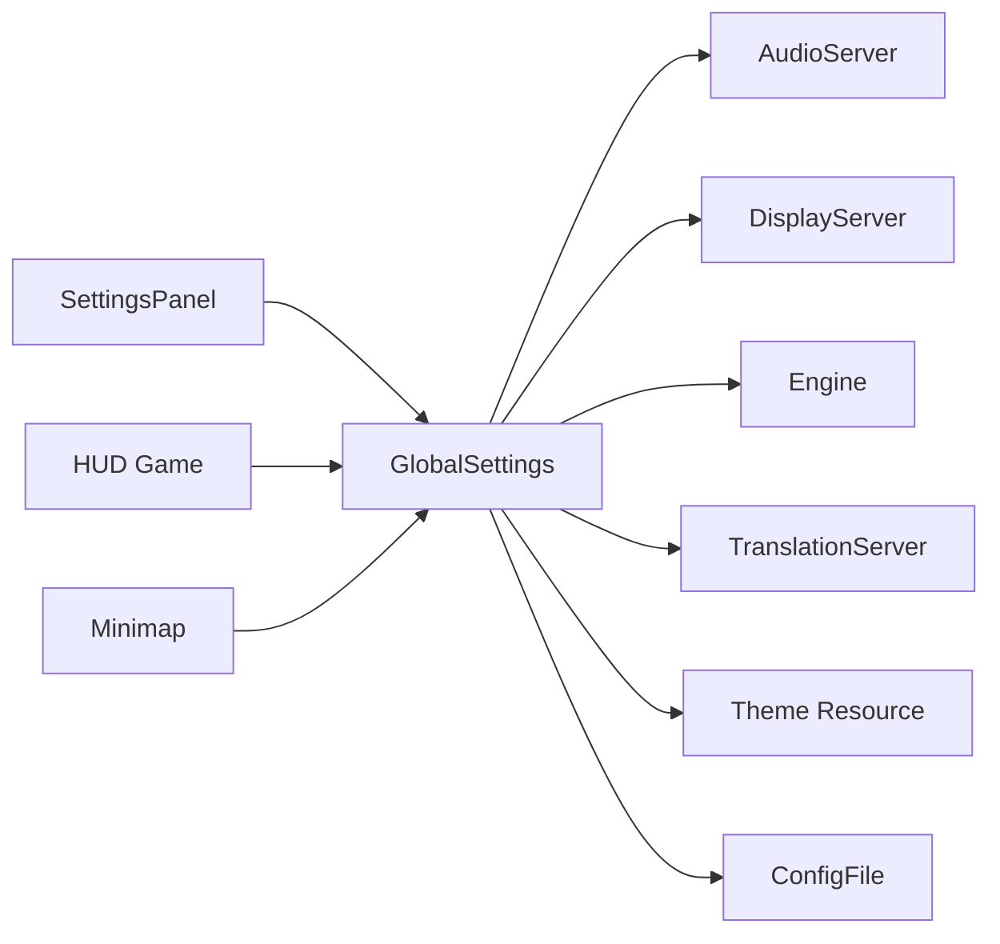

# Settings Interface

<cite>
**Referenced Files in This Document**
- [settings_menu.gd](file://Menu/settings_menu.gd)
- [settings_menu.tscn](file://Menu/settings_menu.tscn)
- [settings_panel.gd](file://Menu/settings_panel.gd)
- [settings_panel.tscn](file://Menu/settings_panel.tscn)
- [global_settings.gd](file://Scripts/global_settings.gd)
- [main_menu.gd](file://Menu/main_menu.gd)
- [pause_menu.gd](file://Menu/pause_menu.gd)
- [hud_game.gd](file://Menu/HUD/hud_game.gd)
- [minimap.gd](file://Menu/HUD/minimap.gd)
- [translations.csv](file://Locale/translations.csv)
</cite>

## Table of Contents
1. [Introduction](#introduction)
2. [Project Structure](#project-structure)
3. [Core Components](#core-components)
4. [Architecture Overview](#architecture-overview)
5. [Detailed Component Analysis](#detailed-component-analysis)
6. [Dependency Analysis](#dependency-analysis)
7. [Performance Considerations](#performance-considerations)
8. [Troubleshooting Guide](#troubleshooting-guide)
9. [Conclusion](#conclusion)
10. [Appendices](#appendices)

## Introduction
This document describes the settings interface system used to configure audio, graphics, and gameplay options. It covers the settings menu structure, the settings panel functionality, global settings integration, validation and persistence, UI components, and practical guidance for extending the system while maintaining backward compatibility.

## Project Structure
The settings system is composed of:
- A top-level settings menu scene/controller that hosts the settings panel
- A reusable settings panel script and scene that renders controls and applies changes
- A global settings singleton responsible for validation, persistence, and applying changes
- Integration points in the main menu and pause menu
- HUD components that react to settings changes
- Translation keys for internationalization

**Diagram sources**
- [settings_menu.tscn:1-45](file://Menu/settings_menu.tscn#L1-L45)
- [settings_panel.tscn:1-338](file://Menu/settings_panel.tscn#L1-L338)
- [global_settings.gd:1-618](file://Scripts/global_settings.gd#L1-L618)
- [main_menu.gd:140-180](file://Menu/main_menu.gd#L140-L180)
- [pause_menu.gd:1-143](file://Menu/pause_menu.gd#L1-L143)
- [hud_game.gd:32-66](file://Menu/HUD/hud_game.gd#L32-L66)
- [minimap.gd:100-114](file://Menu/HUD/minimap.gd#L100-L114)

**Section sources**
- [settings_menu.tscn:1-45](file://Menu/settings_menu.tscn#L1-L45)
- [settings_panel.tscn:1-338](file://Menu/settings_panel.tscn#L1-L338)

## Core Components
- SettingsMenu: Hosts the settings panel and handles navigation/back transitions.
- SettingsPanel: Renders UI rows for audio, graphics, and gameplay settings; collects changes; forwards updates to GlobalSettings; resets to defaults.
- GlobalSettings: Centralized settings manager with defaults, validation, persistence, and real-time application to engine systems (audio, display, UI theme, subtitles).
- Integration scenes: MainMenu and PauseMenu embed the settings overlay/panel.
- HUD and Minimap: Subscribe to settings changes to adjust visuals and behavior.

Key responsibilities:
- Real-time application of settings (audio volume, window mode, vsync, fps cap, graphics preset, UI scale, language, FPS overlay, subtitles, screen shake)
- Automatic persistence to a configuration file
- Change notifications via signals
- Validation and sanitization of user inputs
- Backward compatibility through default fallbacks

**Section sources**
- [settings_menu.gd:1-20](file://Menu/settings_menu.gd#L1-L20)
- [settings_panel.gd:1-202](file://Menu/settings_panel.gd#L1-L202)
- [global_settings.gd:1-618](file://Scripts/global_settings.gd#L1-L618)
- [main_menu.gd:140-180](file://Menu/main_menu.gd#L140-L180)
- [pause_menu.gd:1-143](file://Menu/pause_menu.gd#L1-L143)
- [hud_game.gd:190-206](file://Menu/HUD/hud_game.gd#L190-L206)
- [minimap.gd:100-114](file://Menu/HUD/minimap.gd#L100-L114)

## Architecture Overview
The settings architecture follows a layered pattern:
- UI Layer: SettingsPanel defines controls and reacts to user input
- Application Layer: SettingsPanel delegates to GlobalSettings for validation and application
- Persistence Layer: GlobalSettings reads/writes settings.cfg
- Engine Integration: GlobalSettings applies settings to AudioServer, DisplayServer, Engine, TranslationServer, and Theme

**Diagram sources**
- [settings_panel.gd:162-180](file://Menu/settings_panel.gd#L162-L180)
- [global_settings.gd:164-186](file://Scripts/global_settings.gd#L164-L186)
- [global_settings.gd:226-244](file://Scripts/global_settings.gd#L226-L244)

## Detailed Component Analysis

### SettingsMenu
- Purpose: Top-level container for the settings panel; handles back navigation and scene transitions.
- Behavior: Listens for a pause-game action to close the settings and return to the previous scene.

**Section sources**
- [settings_menu.gd:1-20](file://Menu/settings_menu.gd#L1-L20)
- [settings_menu.tscn:1-45](file://Menu/settings_menu.tscn#L1-L45)

### SettingsPanel
- UI Controls: Sliders, dropdowns, toggles for master volume, window mode, vsync, fps cap, graphics preset, UI scale, language, show FPS, subtitles, screen shake.
- Initialization:
  - Hides non-applicable rows (e.g., music/sfx sliders).
  - Connects signals from controls to handlers.
  - Populates dropdowns with localized items and metadata.
  - Updates labels and tooltips via translation keys.
  - Applies current settings to UI controls.
- Event Handlers:
  - Slider and dropdown changes trigger immediate updates via GlobalSettings.
  - Toggle changes refresh labels and apply settings.
  - Reset button requests defaults from GlobalSettings.
- Data Flow:
  - Collects current UI state into a dictionary.
  - Emits back_requested to parent when navigating away.

**Diagram sources**
- [settings_panel.gd:162-180](file://Menu/settings_panel.gd#L162-L180)
- [settings_panel.gd:186-193](file://Menu/settings_panel.gd#L186-L193)

**Section sources**
- [settings_panel.gd:1-202](file://Menu/settings_panel.gd#L1-L202)
- [settings_panel.tscn:1-338](file://Menu/settings_panel.tscn#L1-L338)

### GlobalSettings
- Defaults and Meta: Defines default values and metadata defaults; supports version tracking and changelog visibility.
- Persistence: Reads/writes settings.cfg under user:// with two sections (settings, meta).
- Validation: Sanitizes incoming values against allowed ranges and supported languages; merges with defaults.
- Real-time Application:
  - Master volume to AudioServer bus
  - Window mode to DisplayServer
  - VSync to DisplayServer
  - FPS cap to Engine.max_fps
  - Graphics preset to scene nodes (light energy, shadows, glow alpha)
  - UI scale to Theme (base scale and font sizes/constants)
  - Language to TranslationServer
  - Show FPS toggles overlay visibility and updates text
  - Subtitles emit subtitle events
  - Screen shake toggles HUD effects
- Signals:
  - settings_changed: emitted after applying changes
  - language_changed: emitted when language changes
  - subtitle_requested: emitted for subtitle display
- Additional Features:
  - Changelog retrieval and version comparison
  - Release checking via GitHub API

**Diagram sources**
- [global_settings.gd:1-618](file://Scripts/global_settings.gd#L1-L618)

**Section sources**
- [global_settings.gd:1-618](file://Scripts/global_settings.gd#L1-L618)

### Integration Scenes
- MainMenu: Toggles a settings overlay visible state; integrates with GlobalSettings for language and release banners.
- PauseMenu: Switches between main menu and settings panels; connects to GlobalSettings for language updates.

**Section sources**
- [main_menu.gd:140-180](file://Menu/main_menu.gd#L140-L180)
- [pause_menu.gd:1-143](file://Menu/pause_menu.gd#L1-L143)

### HUD and Minimap
- HUD Game: Subscribes to settings_changed and subtitle_requested; adjusts quality level propagation and subtitle display.
- Minimap: Subscribes to settings_changed to track quality level for rendering logic.

**Section sources**
- [hud_game.gd:32-66](file://Menu/HUD/hud_game.gd#L32-L66)
- [hud_game.gd:190-206](file://Menu/HUD/hud_game.gd#L190-L206)
- [minimap.gd:100-114](file://Menu/HUD/minimap.gd#L100-L114)

## Dependency Analysis
- SettingsPanel depends on GlobalSettings for applying and resetting settings.
- GlobalSettings depends on:
  - AudioServer for volume
  - DisplayServer for window mode and vsync
  - Engine for fps cap
  - TranslationServer for language
  - Theme resource for UI scaling
  - ConfigFile for persistence
- HUD and Minimap depend on GlobalSettings signals for runtime updates.

**Diagram sources**
- [settings_panel.gd:1-202](file://Menu/settings_panel.gd#L1-L202)
- [global_settings.gd:1-618](file://Scripts/global_settings.gd#L1-L618)
- [hud_game.gd:32-66](file://Menu/HUD/hud_game.gd#L32-L66)
- [minimap.gd:100-114](file://Menu/HUD/minimap.gd#L100-L114)

**Section sources**
- [settings_panel.gd:1-202](file://Menu/settings_panel.gd#L1-L202)
- [global_settings.gd:1-618](file://Scripts/global_settings.gd#L1-L618)

## Performance Considerations
- Immediate application: Settings are applied in real time, which is efficient but can cause frequent theme and light updates when adjusting multiple sliders quickly. Consider debouncing rapid changes if needed.
- Graphics preset application: Traverses the scene tree to adjust lights and glow sprites. On very large scenes, this traversal may incur overhead; however, it is scoped to the current scene and only performed when settings change.
- Audio volume: Applying volume to the Master bus is lightweight.
- FPS overlay: Text updates occur only when enabled and when the frame rate changes.

## Troubleshooting Guide
Common issues and resolutions:
- Settings not persisting:
  - Verify settings.cfg exists under user:// and is readable/writable.
  - Ensure apply_settings is called with persist enabled (default).
- Changes not reflected:
  - Confirm GlobalSettings.settings_changed is connected and _apply_settings_to_controls is invoked.
  - Check that _is_loading flag is not preventing updates during initial load.
- Language not changing:
  - Ensure language_changed signal is emitted and _on_language_changed updates UI and re-applies settings.
- Graphics preset not taking effect:
  - Verify the graphics preset logic runs on settings change and on new nodes added to the tree.
- Audio volume not updating:
  - Confirm the Master bus exists and volume conversion from percentage to dB is correct.

**Section sources**
- [global_settings.gd:226-244](file://Scripts/global_settings.gd#L226-L244)
- [global_settings.gd:164-186](file://Scripts/global_settings.gd#L164-L186)
- [settings_panel.gd:186-193](file://Menu/settings_panel.gd#L186-L193)

## Conclusion
The settings interface system provides a robust, extensible foundation for configuring audio, graphics, and gameplay options. It ensures real-time application, reliable persistence, and responsive UI updates, while offering strong validation and internationalization support. The modular design allows easy addition of new settings with minimal impact on existing functionality.

## Appendices

### Settings Menu Structure
- Audio Section
  - Master Volume (slider)
  - Music Volume (hidden in current UI)
  - SFX Volume (hidden in current UI)
- Graphics Section
  - Window Mode (dropdown)
  - VSync (toggle)
  - FPS Cap (dropdown)
  - Graphics Preset (dropdown)
- Gameplay Section
  - UI Scale (dropdown)
  - Language (dropdown)
  - Show FPS (toggle)
  - Subtitles (toggle)
  - Screen Shake (toggle)

**Section sources**
- [settings_panel.tscn:79-338](file://Menu/settings_panel.tscn#L79-L338)
- [settings_panel.gd:61-115](file://Menu/settings_panel.gd#L61-L115)

### Settings Panel Functionality
- Quality Level Management:
  - Graphics preset selection adjusts lighting energy, shadow visibility, and glow alpha for compatible nodes.
- Resolution and Window Mode:
  - Window mode is applied to DisplayServer; note platform-specific limitations (e.g., Android exclusive fullscreen).
- Performance Optimization:
  - FPS cap is applied to Engine.max_fps; VSync toggles vertical synchronization.

**Section sources**
- [global_settings.gd:301-306](file://Scripts/global_settings.gd#L301-L306)
- [global_settings.gd:279-298](file://Scripts/global_settings.gd#L279-L298)
- [global_settings.gd:292-294](file://Scripts/global_settings.gd#L292-L294)

### Global Settings Integration
- Setting Persistence:
  - Settings are stored in settings.cfg under user:// with separate sections for settings and meta.
- Change Notifications:
  - settings_changed is emitted after applying changes; language_changed is emitted when language changes.
- Real-time Application:
  - Audio, display, engine, theme, and translation subsystems are updated immediately upon change.

**Section sources**
- [global_settings.gd:8-13](file://Scripts/global_settings.gd#L8-L13)
- [global_settings.gd:226-244](file://Scripts/global_settings.gd#L226-L244)
- [global_settings.gd:164-186](file://Scripts/global_settings.gd#L164-L186)

### Settings Validation and Defaults
- Validation:
  - Values are sanitized to allowed ranges and supported lists; invalid entries revert to defaults.
- Default Values:
  - Centralized in DEFAULTS constant; used for initial load and reset operations.
- Supported Options:
  - FPS caps, UI scales, and languages are constrained to predefined lists.

**Section sources**
- [global_settings.gd:14-32](file://Scripts/global_settings.gd#L14-L32)
- [global_settings.gd:247-262](file://Scripts/global_settings.gd#L247-L262)

### Configuration File Handling
- Load:
  - Reads settings.cfg; merges loaded values with defaults.
- Save:
  - Writes settings and meta sections to settings.cfg.

**Section sources**
- [global_settings.gd:226-244](file://Scripts/global_settings.gd#L226-L244)

### Settings UI Components
- Sliders:
  - Master volume slider updates percentage label and applies audio volume.
- Dropdown Menus:
  - Window mode, FPS cap, graphics preset, UI scale, and language populate localized items and metadata.
- Toggle Switches:
  - VSync, show FPS, subtitles, and screen shake update labels and apply settings.

**Section sources**
- [settings_panel.gd:151-159](file://Menu/settings_panel.gd#L151-L159)
- [settings_panel.gd:61-95](file://Menu/settings_panel.gd#L61-L95)
- [settings_panel.gd:162-180](file://Menu/settings_panel.gd#L162-L180)

### Examples

- Adding a New Setting
  - Define default value in DEFAULTS.
  - Add UI control in the settings panel scene and connect its signal to a handler.
  - Extend apply_settings to handle the new key and apply it to the appropriate subsystem.
  - Add localization keys for the new control’s label and options.
  - Ensure sanitization in _sanitize_settings if needed.

- Handling Setting Changes
  - Use the existing pattern: collect settings, call apply_settings, and rely on settings_changed to update UI.

- Maintaining Backward Compatibility
  - Always check for key existence before reading; use defaults as fallbacks.
  - Avoid removing keys; deprecate silently by ignoring unknown keys.

**Section sources**
- [global_settings.gd:14-32](file://Scripts/global_settings.gd#L14-L32)
- [global_settings.gd:247-262](file://Scripts/global_settings.gd#L247-L262)
- [settings_panel.gd:136-148](file://Menu/settings_panel.gd#L136-L148)
- [translations.csv:1-30](file://Locale/translations.csv#L1-L30)