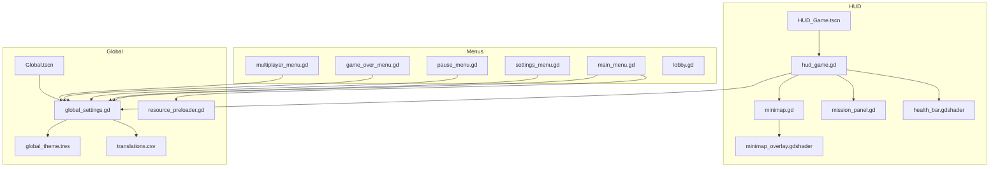
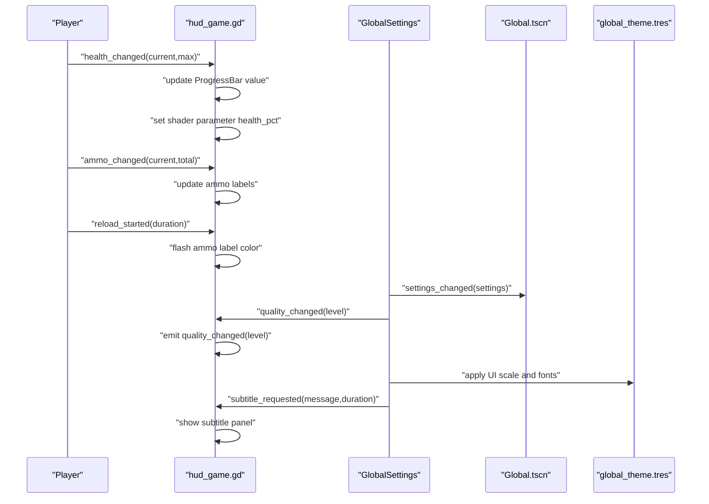
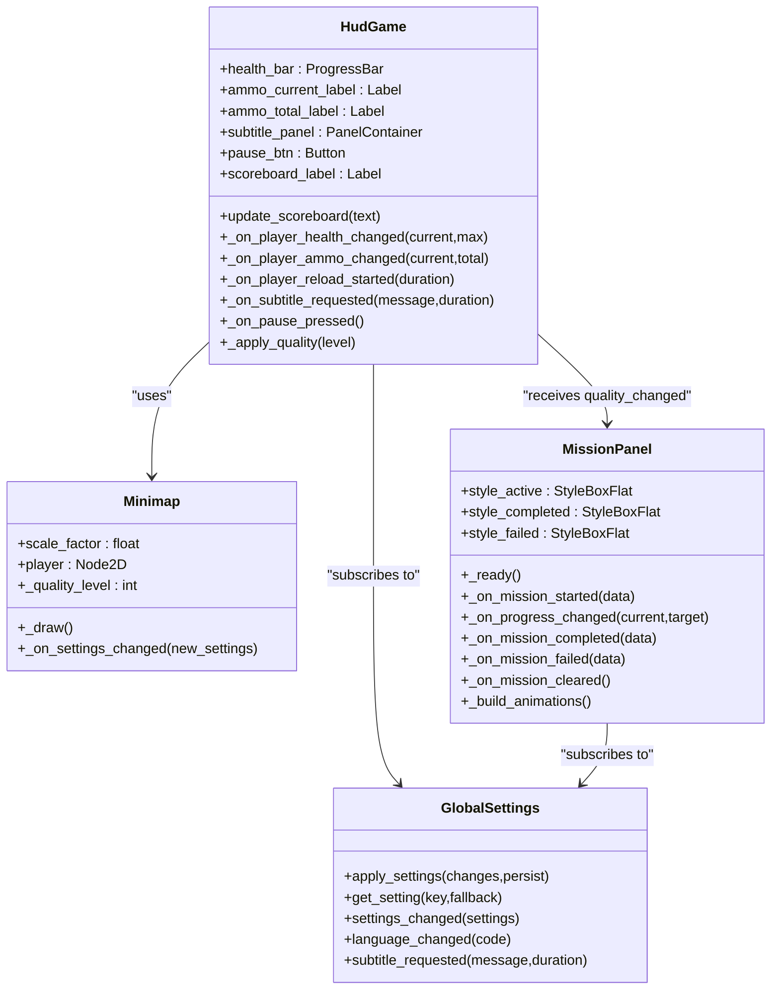
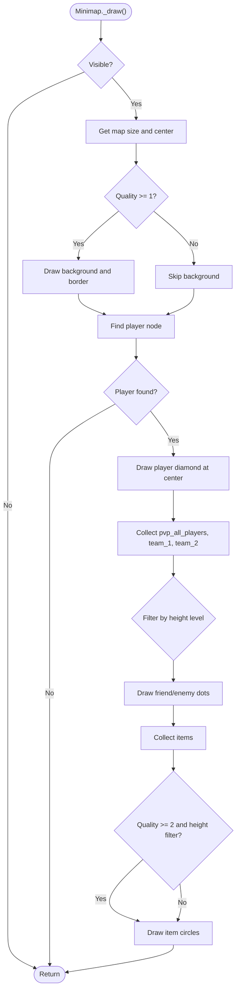
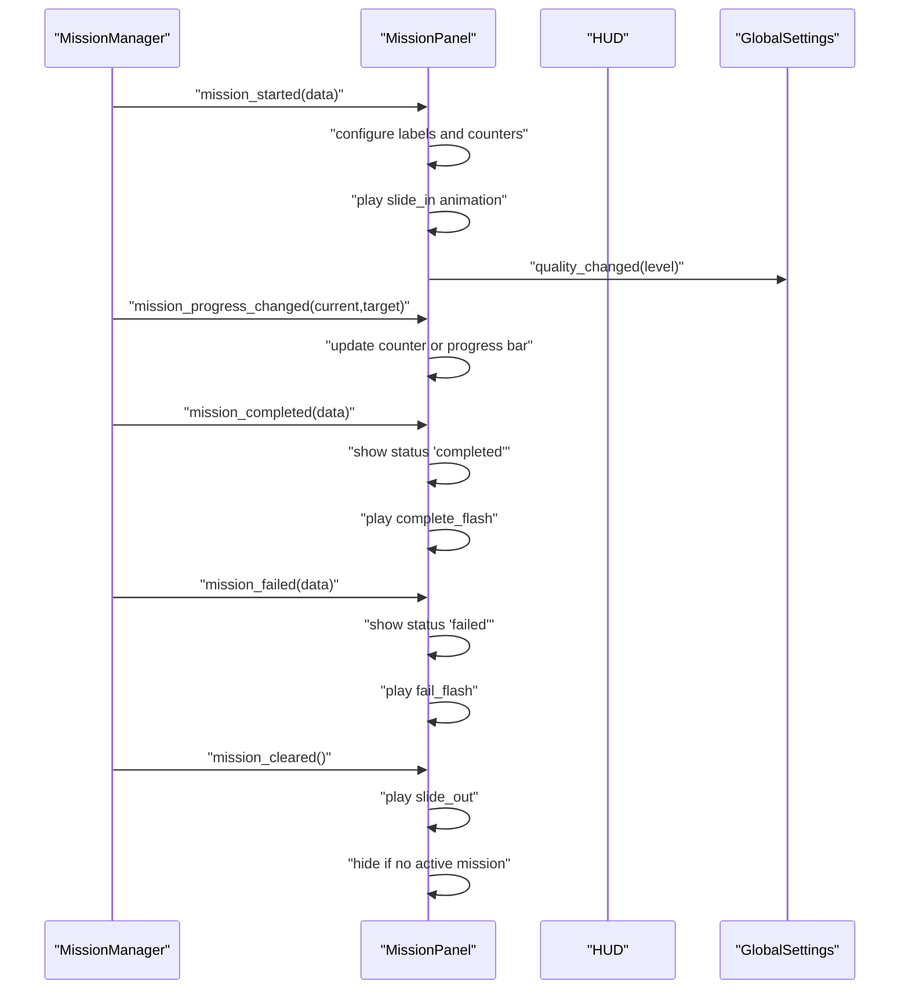
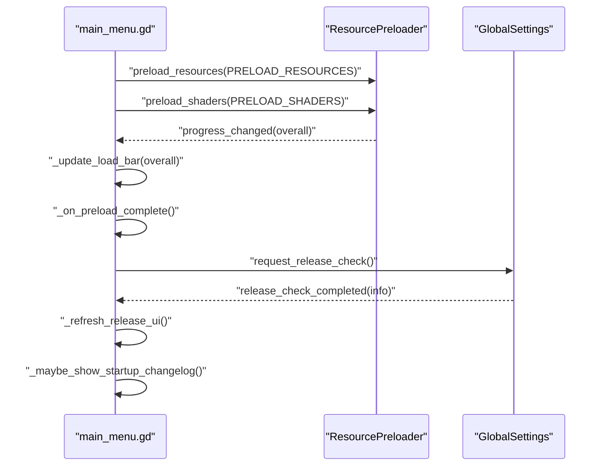
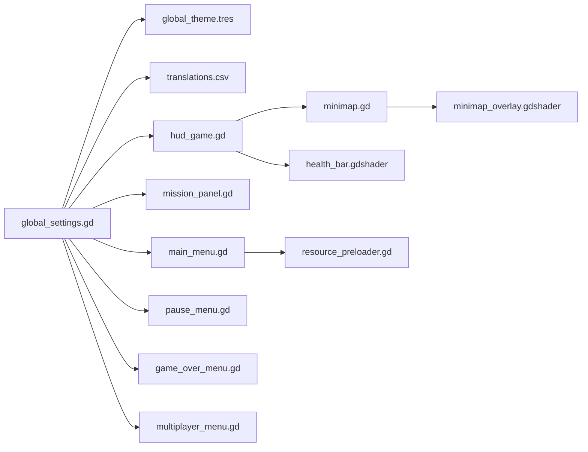

# UI and HUD System

<cite>
**Referenced Files in This Document**
- [HUD_Game.tscn](file://Menu/HUD/HUD_Game.tscn)
- [hud_game.gd](file://Menu/HUD/hud_game.gd)
- [minimap.gd](file://Menu/HUD/minimap.gd)
- [health_bar.gdshader](file://Shaders/HUD/health_bar.gdshader)
- [minimap_overlay.gdshader](file://Shaders/HUD/minimap_overlay.gdshader)
- [mission_panel.gd](file://Scripts/mission_panel.gd)
- [main_menu.gd](file://Menu/main_menu.gd)
- [settings_menu.gd](file://Menu/settings_menu.gd)
- [pause_menu.gd](file://Menu/pause_menu.gd)
- [game_over_menu.gd](file://Menu/game_over_menu.gd)
- [lobby.gd](file://Menu/lobby.gd)
- [multiplayer_menu.gd](file://Menu/multiplayer_menu.gd)
- [global_settings.gd](file://Scripts/global_settings.gd)
- [global_theme.tres](file://Assets/UI/global_theme.tres)
- [Global.tscn](file://Global.tscn)
- [resource_preloader.gd](file://Scripts/resource_preloader.gd)
- [translations.csv](file://Locale/translations.csv)
</cite>

## Table of Contents
1. [Introduction](#introduction)
2. [Project Structure](#project-structure)
3. [Core Components](#core-components)
4. [Architecture Overview](#architecture-overview)
5. [Detailed Component Analysis](#detailed-component-analysis)
6. [Dependency Analysis](#dependency-analysis)
7. [Performance Considerations](#performance-considerations)
8. [Troubleshooting Guide](#troubleshooting-guide)
9. [Conclusion](#conclusion)
10. [Appendices](#appendices)

## Introduction
This document describes the UI and HUD system for TFA Agents, focusing on the in-game HUD (health, ammo, minimap, mission panel, subtitles), main menu, settings, pause menu, and game over screens. It explains UI component organization, signal-driven updates, responsive design, minimap rendering and radar effects, theming, localization, and accessibility. It also provides examples of HUD customization, menu navigation, and UI state management.

## Project Structure
The UI system is organized around several scenes and scripts:
- HUD scene and scripts for health, ammo, minimap, mission panel, and subtitles
- Main menu with integrated resource preloading and release checks
- Settings and pause menus
- Game over screen supporting single-player restart and multiplayer spectator modes
- Global settings singleton controlling themes, language, and runtime settings
- Shared theme resource and translation database

**Diagram sources**
- [HUD_Game.tscn](file://Menu/HUD/HUD_Game.tscn)
- [hud_game.gd](file://Menu/HUD/hud_game.gd)
- [minimap.gd](file://Menu/HUD/minimap.gd)
- [mission_panel.gd](file://Scripts/mission_panel.gd)
- [health_bar.gdshader](file://Shaders/HUD/health_bar.gdshader)
- [minimap_overlay.gdshader](file://Shaders/HUD/minimap_overlay.gdshader)
- [main_menu.gd](file://Menu/main_menu.gd)
- [settings_menu.gd](file://Menu/settings_menu.gd)
- [pause_menu.gd](file://Menu/pause_menu.gd)
- [game_over_menu.gd](file://Menu/game_over_menu.gd)
- [multiplayer_menu.gd](file://Menu/multiplayer_menu.gd)
- [lobby.gd](file://Menu/lobby.gd)
- [global_settings.gd](file://Scripts/global_settings.gd)
- [Global.tscn](file://Global.tscn)
- [global_theme.tres](file://Assets/UI/global_theme.tres)
- [resource_preloader.gd](file://Scripts/resource_preloader.gd)
- [translations.csv](file://Locale/translations.csv)

**Section sources**
- [HUD_Game.tscn](file://Menu/HUD/HUD_Game.tscn)
- [hud_game.gd](file://Menu/HUD/hud_game.gd)
- [minimap.gd](file://Menu/HUD/minimap.gd)
- [mission_panel.gd](file://Scripts/mission_panel.gd)
- [main_menu.gd](file://Menu/main_menu.gd)
- [settings_menu.gd](file://Menu/settings_menu.gd)
- [pause_menu.gd](file://Menu/pause_menu.gd)
- [game_over_menu.gd](file://Menu/game_over_menu.gd)
- [multiplayer_menu.gd](file://Menu/multiplayer_menu.gd)
- [lobby.gd](file://Menu/lobby.gd)
- [global_settings.gd](file://Scripts/global_settings.gd)
- [Global.tscn](file://Global.tscn)
- [global_theme.tres](file://Assets/UI/global_theme.tres)
- [resource_preloader.gd](file://Scripts/resource_preloader.gd)
- [translations.csv](file://Locale/translations.csv)

## Core Components
- HUD scene and scripts:
  - Health bar with shader-based color and glow effects
  - Ammo display with reload warning animation
  - Minimap with radar overlay and height-filtered entities
  - Mission panel with progress bar or counter, animated states
  - Subtitles overlay controlled by GlobalSettings
- Menus:
  - Main menu with preloading, release checks, and changelog
  - Settings menu with language and graphics presets
  - Pause menu with resume, settings, and main menu transitions
  - Game over screen with restart and spectator modes
  - Multiplayer lobby with chat and ready states
- Global systems:
  - GlobalSettings for theme, language, FPS, subtitles, and graphics presets
  - ResourcePreloader for async scene and shader warm-up
  - Shared theme and translations

**Section sources**
- [hud_game.gd](file://Menu/HUD/hud_game.gd)
- [minimap.gd](file://Menu/HUD/minimap.gd)
- [mission_panel.gd](file://Scripts/mission_panel.gd)
- [main_menu.gd](file://Menu/main_menu.gd)
- [settings_menu.gd](file://Menu/settings_menu.gd)
- [pause_menu.gd](file://Menu/pause_menu.gd)
- [game_over_menu.gd](file://Menu/game_over_menu.gd)
- [multiplayer_menu.gd](file://Menu/multiplayer_menu.gd)
- [lobby.gd](file://Menu/lobby.gd)
- [global_settings.gd](file://Scripts/global_settings.gd)
- [resource_preloader.gd](file://Scripts/resource_preloader.gd)
- [global_theme.tres](file://Assets/UI/global_theme.tres)
- [translations.csv](file://Locale/translations.csv)

## Architecture Overview
The UI system relies on:
- Signal-driven updates: HUD subscribes to player signals and GlobalSettings signals
- Quality-aware rendering: shaders and animations activate based on graphics preset
- Centralized settings: GlobalSettings applies theme, language, and runtime effects
- Async resource loading: ResourcePreloader avoids UI freezes during scene transitions
- Localization: CSV-backed translations with dynamic refresh

**Diagram sources**
- [hud_game.gd](file://Menu/HUD/hud_game.gd)
- [global_settings.gd](file://Scripts/global_settings.gd)
- [Global.tscn](file://Global.tscn)
- [global_theme.tres](file://Assets/UI/global_theme.tres)

## Detailed Component Analysis

### HUD Scene and Scripts
- Health bar:
  - Uses a ProgressBar with a ShaderMaterial driven by a shader parameter
  - Color transitions and subtle glow animate based on health percentage
- Ammo display:
  - Current and total labels update on ammo changes
  - Reload events trigger a flashing animation on the current ammo label
- Subtitles:
  - Controlled by GlobalSettings subtitle requests; managed by HUD panel visibility and timer
- Pause button:
  - Emits a parsed input action to open the pause menu
- Quality system:
  - Emits a quality_changed signal to child components (minimap, mission panel)

**Diagram sources**
- [hud_game.gd](file://Menu/HUD/hud_game.gd)
- [minimap.gd](file://Menu/HUD/minimap.gd)
- [mission_panel.gd](file://Scripts/mission_panel.gd)
- [global_settings.gd](file://Scripts/global_settings.gd)

**Section sources**
- [HUD_Game.tscn](file://Menu/HUD/HUD_Game.tscn)
- [hud_game.gd](file://Menu/HUD/hud_game.gd)
- [minimap.gd](file://Menu/HUD/minimap.gd)
- [mission_panel.gd](file://Scripts/mission_panel.gd)
- [health_bar.gdshader](file://Shaders/HUD/health_bar.gdshader)
- [minimap_overlay.gdshader](file://Shaders/HUD/minimap_overlay.gdshader)

### Minimap Rendering and Radar
- Minimap draws a centered player marker and nearby entities filtered by height level
- Radar overlay shader adds vignetting, grid, sweep, concentric rings, scanlines, and border glow
- Quality level controls whether overlays are drawn and how many details are shown

**Diagram sources**
- [minimap.gd](file://Menu/HUD/minimap.gd)
- [minimap_overlay.gdshader](file://Shaders/HUD/minimap_overlay.gdshader)

**Section sources**
- [minimap.gd](file://Menu/HUD/minimap.gd)
- [minimap_overlay.gdshader](file://Shaders/HUD/minimap_overlay.gdshader)

### Mission Panel and Progress Tracking
- MissionPanel listens to MissionManager signals and updates label, counter, or progress bar
- Animated states for active, completed, and failed missions
- Shader parameters drive panel and progress bar visuals synchronized with state

**Diagram sources**
- [mission_panel.gd](file://Scripts/mission_panel.gd)
- [global_settings.gd](file://Scripts/global_settings.gd)

**Section sources**
- [mission_panel.gd](file://Scripts/mission_panel.gd)

### Main Menu System
- Integrates resource preloading and shader warm-up
- Release checking and changelog display
- Dynamic creation of multiplayer button and localized text refresh
- Overlay for loading progress during scene transitions

**Diagram sources**
- [main_menu.gd](file://Menu/main_menu.gd)
- [resource_preloader.gd](file://Scripts/resource_preloader.gd)
- [global_settings.gd](file://Scripts/global_settings.gd)

**Section sources**
- [main_menu.gd](file://Menu/main_menu.gd)
- [resource_preloader.gd](file://Scripts/resource_preloader.gd)
- [global_settings.gd](file://Scripts/global_settings.gd)

### Settings Interface
- Applies settings immediately and emits signals for other systems
- Controls language, UI scale, graphics preset, subtitles, and FPS overlay
- Back navigation returns to the main menu

**Section sources**
- [settings_menu.gd](file://Menu/settings_menu.gd)
- [global_settings.gd](file://Scripts/global_settings.gd)
- [global_theme.tres](file://Assets/UI/global_theme.tres)
- [translations.csv](file://Locale/translations.csv)

### Pause Menu
- Opens and closes via input action or button
- Supports single-player and multiplayer pause modes
- Shows mode label and language-refreshed texts

**Section sources**
- [pause_menu.gd](file://Menu/pause_menu.gd)
- [translations.csv](file://Locale/translations.csv)

### Game Over Screens
- Single-player: restart from checkpoint or beginning, main menu
- Multiplayer: spectator mode cycling through living players, lobby return

**Section sources**
- [game_over_menu.gd](file://Menu/game_over_menu.gd)

### Multiplayer and Lobby
- Host/join flows with team mode selection and ready states
- Chat messaging and lobby updates

**Section sources**
- [multiplayer_menu.gd](file://Menu/multiplayer_menu.gd)
- [lobby.gd](file://Menu/lobby.gd)

## Dependency Analysis
- HUD depends on:
  - Player signals for health/ammo/reload
  - GlobalSettings for quality and subtitles
  - Minimap and MissionPanel for subsystems
- Menus depend on:
  - GlobalSettings for theme, language, and runtime settings
  - ResourcePreloader for seamless scene transitions
- GlobalSettings centralizes:
  - Theme application and UI scaling
  - Language switching and translation refresh
  - Graphics preset application to lights and glows
  - FPS overlay visibility and text updates

**Diagram sources**
- [global_settings.gd](file://Scripts/global_settings.gd)
- [global_theme.tres](file://Assets/UI/global_theme.tres)
- [translations.csv](file://Locale/translations.csv)
- [hud_game.gd](file://Menu/HUD/hud_game.gd)
- [minimap.gd](file://Menu/HUD/minimap.gd)
- [health_bar.gdshader](file://Shaders/HUD/health_bar.gdshader)
- [minimap_overlay.gdshader](file://Shaders/HUD/minimap_overlay.gdshader)
- [mission_panel.gd](file://Scripts/mission_panel.gd)
- [main_menu.gd](file://Menu/main_menu.gd)
- [pause_menu.gd](file://Menu/pause_menu.gd)
- [game_over_menu.gd](file://Menu/game_over_menu.gd)
- [multiplayer_menu.gd](file://Menu/multiplayer_menu.gd)
- [resource_preloader.gd](file://Scripts/resource_preloader.gd)

**Section sources**
- [global_settings.gd](file://Scripts/global_settings.gd)
- [hud_game.gd](file://Menu/HUD/hud_game.gd)
- [minimap.gd](file://Menu/HUD/minimap.gd)
- [mission_panel.gd](file://Scripts/mission_panel.gd)
- [main_menu.gd](file://Menu/main_menu.gd)
- [pause_menu.gd](file://Menu/pause_menu.gd)
- [game_over_menu.gd](file://Menu/game_over_menu.gd)
- [multiplayer_menu.gd](file://Menu/multiplayer_menu.gd)
- [resource_preloader.gd](file://Scripts/resource_preloader.gd)

## Performance Considerations
- Asynchronous resource preloading prevents UI stalls during scene transitions
- Graphics preset reduces shader and lighting complexity for lower tiers
- Minimap drawing is bounded by visibility and simple circle/diamond primitives
- Subtitles and FPS overlays are conditionally shown to reduce overdraw

[No sources needed since this section provides general guidance]

## Troubleshooting Guide
- HUD not updating:
  - Verify player signals are connected and player nodes are in the “players” group
  - Confirm GlobalSettings is emitting settings_changed and quality_changed
- Minimap missing entities:
  - Ensure entities are in the correct groups and share the same height level as the player
- Subtitles not appearing:
  - Check GlobalSettings subtitles setting and subtitle_requested signal emission
- Pause menu not opening:
  - Confirm pause action mapping and that pause menu is not hidden by HUD presence
- Multiplayer lobby issues:
  - Validate port availability and network connectivity; check connection_failed callbacks

**Section sources**
- [hud_game.gd](file://Menu/HUD/hud_game.gd)
- [minimap.gd](file://Menu/HUD/minimap.gd)
- [global_settings.gd](file://Scripts/global_settings.gd)
- [pause_menu.gd](file://Menu/pause_menu.gd)
- [multiplayer_menu.gd](file://Menu/multiplayer_menu.gd)

## Conclusion
The UI and HUD system in TFA Agents is modular, signal-driven, and responsive. It integrates health and ammo feedback, a configurable minimap with radar effects, mission progress tracking, and robust menus with localization and settings. GlobalSettings centralizes theming and runtime adjustments, while ResourcePreloader ensures smooth scene transitions. The system scales visually across quality presets and supports both single-player and multiplayer contexts.

[No sources needed since this section summarizes without analyzing specific files]

## Appendices

### UI Theming and Accessibility
- Theme resource defines consistent styles, fonts, and colors across all UI elements
- UI scale adjusts font sizes and constants proportionally
- Language switching updates all labels and subtitles dynamically

**Section sources**
- [global_theme.tres](file://Assets/UI/global_theme.tres)
- [global_settings.gd](file://Scripts/global_settings.gd)
- [translations.csv](file://Locale/translations.csv)

### Localization Workflow
- Translations are stored in CSV and refreshed when language changes
- Menus and HUD labels use translation keys and dynamic refresh

**Section sources**
- [translations.csv](file://Locale/translations.csv)
- [main_menu.gd](file://Menu/main_menu.gd)
- [pause_menu.gd](file://Menu/pause_menu.gd)
- [game_over_menu.gd](file://Menu/game_over_menu.gd)

### Examples Index
- HUD customization:
  - Adjust ProgressBar styles and shader parameters in the HUD scene
  - Modify minimap scale factor and colors in the minimap script
- Menu navigation:
  - Use pause action or pause button to toggle pause menu
  - Navigate from main menu to settings and multiplayer menus
- UI state management:
  - Observe settings_changed and quality_changed signals to synchronize UI elements

**Section sources**
- [HUD_Game.tscn](file://Menu/HUD/HUD_Game.tscn)
- [hud_game.gd](file://Menu/HUD/hud_game.gd)
- [minimap.gd](file://Menu/HUD/minimap.gd)
- [main_menu.gd](file://Menu/main_menu.gd)
- [pause_menu.gd](file://Menu/pause_menu.gd)
- [game_over_menu.gd](file://Menu/game_over_menu.gd)
- [multiplayer_menu.gd](file://Menu/multiplayer_menu.gd)
- [lobby.gd](file://Menu/lobby.gd)
- [global_settings.gd](file://Scripts/global_settings.gd)