# Development Guidelines

<cite>
**Referenced Files in This Document**
- [project.godot](file://project.godot)
- [export_presets.cfg](file://export_presets.cfg)
- [global_settings.gd](file://Scripts/global_settings.gd)
- [resource_preloader.gd](file://Scripts/resource_preloader.gd)
- [main_menu.gd](file://Menu/main_menu.gd)
- [multiplayer_manager.gd](file://Scripts/multiplayer_manager.gd)
- [player_prototype.gd](file://Scripts/player_prototype.gd)
- [bot_prototype.gd](file://Scripts/bot_prototype.gd)
- [power_up.gd](file://Scripts/power_up.gd)
- [oggetto.gd](file://Scripts/oggetto.gd)
- [input_manager.gd](file://Game/input_manager.gd)
</cite>

## Table of Contents
1. [Introduction](#introduction)
2. [Project Structure](#project-structure)
3. [Core Components](#core-components)
4. [Architecture Overview](#architecture-overview)
5. [Detailed Component Analysis](#detailed-component-analysis)
6. [Dependency Analysis](#dependency-analysis)
7. [Performance Considerations](#performance-considerations)
8. [Asset Management Procedures](#asset-management-procedures)
9. [Testing Strategies](#testing-strategies)
10. [Debugging Techniques and Profiling Methods](#debugging-techniques-and-profiling-methods)
11. [Common Pitfalls and How to Avoid Them](#common-pitfalls-and-how-to-avoid-them)
12. [Contribution Workflows](#contribution-workflows)
13. [Documentation Requirements](#documentation-requirements)
14. [Conclusion](#conclusion)

## Introduction
This document provides comprehensive development guidelines for contributors working on TFA Agents. It consolidates code organization standards, naming conventions, file structure guidelines, and best practices for GDScript development within the project. It also covers asset management procedures, performance optimization guidelines, testing strategies, debugging techniques, profiling methods, and common pitfalls to avoid. The goal is to ensure consistent, maintainable, and efficient development across the codebase.

## Project Structure
The project follows a feature-based organization with clear separation of concerns:
- Core engine configuration and autoloads are centralized in the project configuration.
- Scripts are organized under a dedicated folder with clear functional grouping.
- Menus and gameplay scenes are separated into logical directories.
- Assets are categorized by type and purpose, with import metadata alongside assets.
- Addons provide reusable functionality such as mission editing, shader previewing, and virtual joysticks.

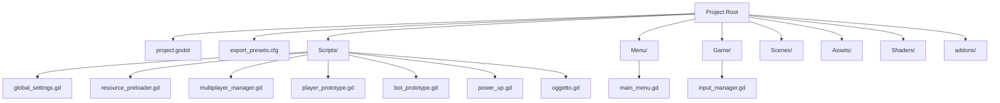

**Diagram sources**
- [project.godot](file://project.godot)
- [export_presets.cfg](file://export_presets.cfg)
- [global_settings.gd](file://Scripts/global_settings.gd)
- [resource_preloader.gd](file://Scripts/resource_preloader.gd)
- [multiplayer_manager.gd](file://Scripts/multiplayer_manager.gd)
- [player_prototype.gd](file://Scripts/player_prototype.gd)
- [bot_prototype.gd](file://Scripts/bot_prototype.gd)
- [power_up.gd](file://Scripts/power_up.gd)
- [oggetto.gd](file://Scripts/oggetto.gd)
- [main_menu.gd](file://Menu/main_menu.gd)
- [input_manager.gd](file://Game/input_manager.gd)

**Section sources**
- [project.godot](file://project.godot)
- [export_presets.cfg](file://export_presets.cfg)

## Core Components
This section outlines the primary systems and their responsibilities:
- Global Settings: Centralized settings management, graphics presets, audio bus control, FPS overlay, and release checking.
- Resource Preloader: Background loading of scenes and shader warm-up to reduce initial load times.
- Main Menu: Scene transitions, integrated release checks, changelog display, and preloading orchestration.
- Multiplayer Manager: Host/client lifecycle, lobby management, team assignment, and synchronized game start.
- Player Prototype: Movement, shooting, height-level transitions, camera effects, and multiplayer synchronization.
- Bot Prototype: AI-driven navigation, pathfinding across height levels, ramp traversal, and targeting.
- Power Up: Collectible items with level-aware visibility and effects.
- Generic Object: Destructible crates/barrels with explosion mechanics and level-aware visibility.

**Section sources**
- [global_settings.gd](file://Scripts/global_settings.gd)
- [resource_preloader.gd](file://Scripts/resource_preloader.gd)
- [main_menu.gd](file://Menu/main_menu.gd)
- [multiplayer_manager.gd](file://Scripts/multiplayer_manager.gd)
- [player_prototype.gd](file://Scripts/player_prototype.gd)
- [bot_prototype.gd](file://Scripts/bot_prototype.gd)
- [power_up.gd](file://Scripts/power_up.gd)
- [oggetto.gd](file://Scripts/oggetto.gd)

## Architecture Overview
The system relies on autoload singletons for cross-scene coordination and a modular script architecture:
- Autoloads manage global state and services (settings, events, resource preloading, multiplayer).
- Scenes communicate via signals and shared nodes to minimize tight coupling.
- Multiplayer logic is encapsulated in dedicated managers with RPC calls for authoritative actions.
- Level-aware systems use groups and shader materials to enforce visibility and effects.

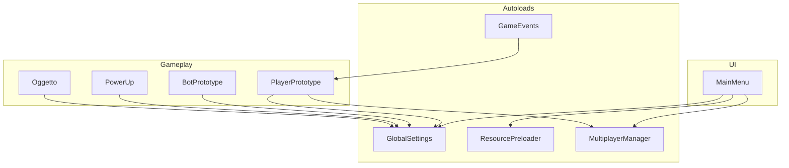

**Diagram sources**
- [project.godot](file://project.godot)
- [main_menu.gd](file://Menu/main_menu.gd)
- [global_settings.gd](file://Scripts/global_settings.gd)
- [resource_preloader.gd](file://Scripts/resource_preloader.gd)
- [multiplayer_manager.gd](file://Scripts/multiplayer_manager.gd)
- [player_prototype.gd](file://Scripts/player_prototype.gd)
- [bot_prototype.gd](file://Scripts/bot_prototype.gd)
- [power_up.gd](file://Scripts/power_up.gd)
- [oggetto.gd](file://Scripts/oggetto.gd)

## Detailed Component Analysis

### Global Settings
Responsibilities:
- Persist and apply user settings (volume, window mode, vsync, FPS cap, graphics preset, UI scale, language).
- Manage release checks via HTTP client and threading.
- Provide localized subtitles and FPS overlay.
- Apply graphics presets to nodes dynamically.

Best practices:
- Sanitize inputs against supported options and clamp ranges.
- Use threads for network operations and defer UI updates.
- Cache theme baseline values to efficiently scale fonts and constants.

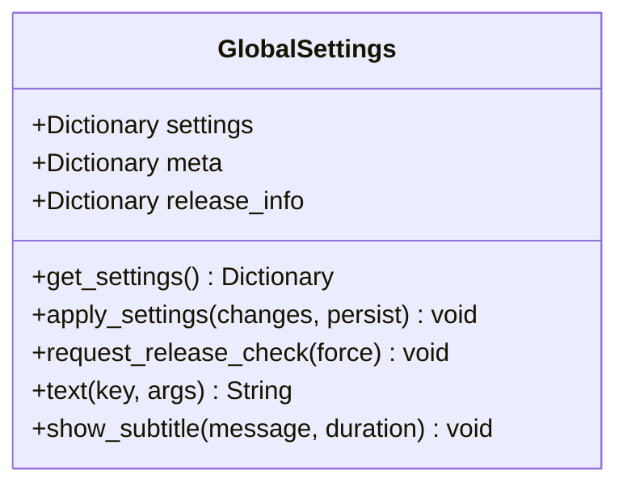

**Diagram sources**
- [global_settings.gd](file://Scripts/global_settings.gd)

**Section sources**
- [global_settings.gd](file://Scripts/global_settings.gd)

### Resource Preloader
Responsibilities:
- Asynchronously load scenes and compile shaders to warm GPU caches.
- Track progress and emit completion signals.
- Change scenes when resources are ready without blocking the main thread.

Best practices:
- Load only top-level scenes; rely on Godot’s internal dependency loading.
- Avoid polling in _process; use minimal polling loop and emit progress deltas.
- Prefer change_scene_to_packed for cached scenes to avoid disk reads.

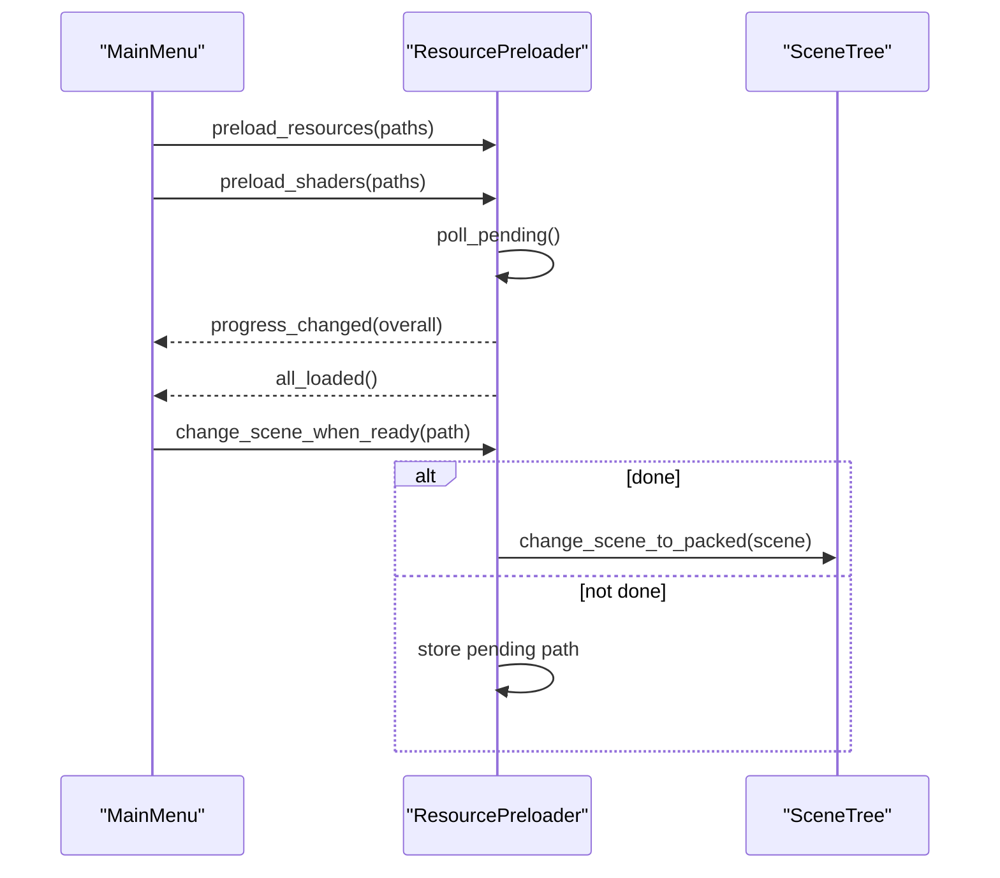

**Diagram sources**
- [resource_preloader.gd](file://Scripts/resource_preloader.gd)
- [main_menu.gd](file://Menu/main_menu.gd)

**Section sources**
- [resource_preloader.gd](file://Scripts/resource_preloader.gd)
- [main_menu.gd](file://Menu/main_menu.gd)

### Main Menu
Responsibilities:
- Orchestrate preloading and scene transitions.
- Integrate release checks and changelog display.
- Dynamically build overlays and handle input.

Best practices:
- Connect signals before starting preload to avoid missing progress updates.
- Use dynamic overlay creation sparingly; prefer scene-based overlays for performance.
- Keep UI text updates localized and reactive to language changes.

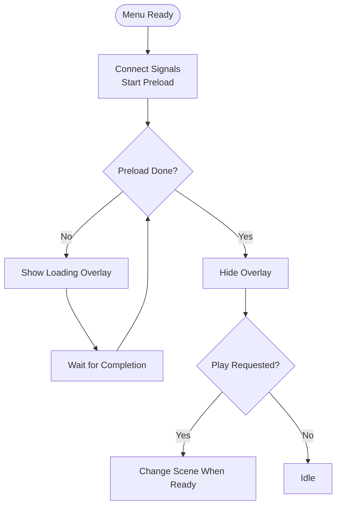

**Diagram sources**
- [main_menu.gd](file://Menu/main_menu.gd)
- [resource_preloader.gd](file://Scripts/resource_preloader.gd)

**Section sources**
- [main_menu.gd](file://Menu/main_menu.gd)

### Multiplayer Manager
Responsibilities:
- Host and join sessions, manage lobby state, and synchronize game start.
- Assign teams and broadcast updates to clients.
- Handle connection lifecycle and graceful disconnections.

Best practices:
- Normalize dictionary keys after RPC serialization to integers.
- Use authority-based RPCs for server-side authoritative actions.
- Keep lobby state consistent by broadcasting updates.

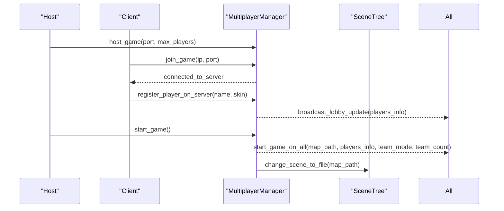

**Diagram sources**
- [multiplayer_manager.gd](file://Scripts/multiplayer_manager.gd)

**Section sources**
- [multiplayer_manager.gd](file://Scripts/multiplayer_manager.gd)

### Player Prototype
Responsibilities:
- Movement, aiming, shooting, reloading, and height-level transitions.
- Camera shake, nicknames, and multiplayer synchronization.
- Shader-based level effects and visibility.

Best practices:
- Limit sync frequency to reduce bandwidth and CPU overhead.
- Use raycasts for precise hit detection and level-aware collisions.
- Apply authority checks before applying feedback or modifying state.

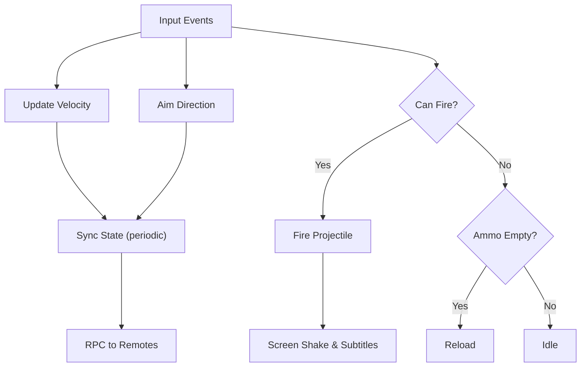

**Diagram sources**
- [player_prototype.gd](file://Scripts/player_prototype.gd)

**Section sources**
- [player_prototype.gd](file://Scripts/player_prototype.gd)

### Bot Prototype
Responsibilities:
- Pathfinding across height levels with ramps.
- Target tracking and smooth movement/rotation.
- Debug visualization of routes.

Best practices:
- Cache navigation regions per level to avoid repeated lookups.
- Use incremental route refresh on level changes to keep agents synchronized.
- Keep smoothing parameters tuned for responsiveness without overshooting.

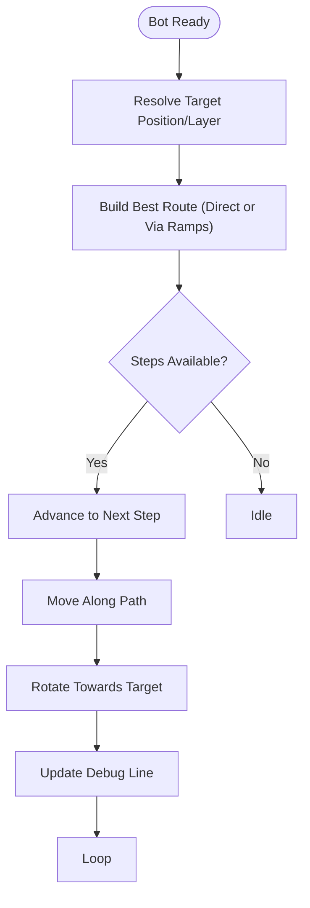

**Diagram sources**
- [bot_prototype.gd](file://Scripts/bot_prototype.gd)

**Section sources**
- [bot_prototype.gd](file://Scripts/bot_prototype.gd)

### Power Up
Responsibilities:
- Level-aware visibility and collision masks.
- Authority-based effect application and subtitle notifications.
- Dynamic shader glow and light effects.

Best practices:
- Use groups to categorize items and simplify filtering.
- Apply quality-dependent visuals to balance performance and fidelity.
- Emit global events only from authority to prevent duplication.

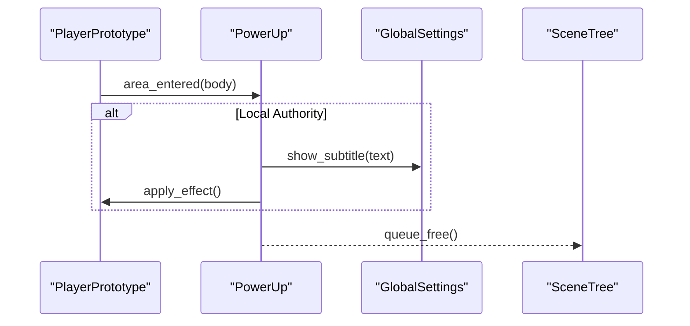

**Diagram sources**
- [power_up.gd](file://Scripts/power_up.gd)
- [global_settings.gd](file://Scripts/global_settings.gd)

**Section sources**
- [power_up.gd](file://Scripts/power_up.gd)

### Generic Object (Destructible)
Responsibilities:
- Health-based destruction and explosion mechanics.
- Level-aware collision masks and visibility.
- Particle and animation-based explosion effects.

Best practices:
- Server-authoritative destruction to prevent client-side manipulation.
- Scale particle effects with explosion radius and graphics preset.
- Disable collision after destruction to avoid further interactions.

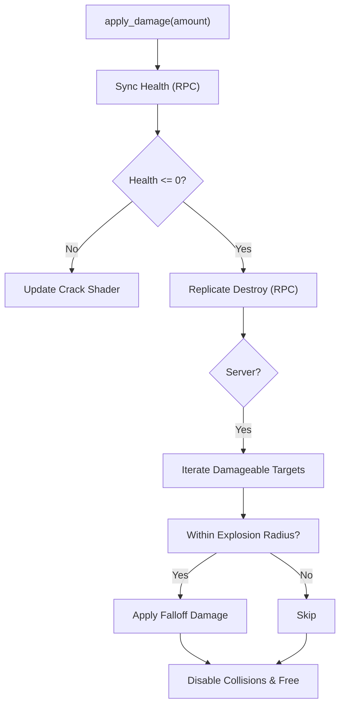

**Diagram sources**
- [oggetto.gd](file://Scripts/oggetto.gd)

**Section sources**
- [oggetto.gd](file://Scripts/oggetto.gd)

## Dependency Analysis
Key dependencies and relationships:
- Autoloads: GlobalSettings, ResourcePreloader, MultiplayerManager, GameEvents are declared in the project configuration and used across scenes.
- UI and Gameplay: Main menu depends on ResourcePreloader and GlobalSettings; gameplay scripts depend on GlobalSettings for subtitles and camera shake.
- Multiplayer: PlayerPrototype and bots coordinate via MultiplayerManager; authoritative actions are enforced via RPCs.
- Level Systems: PlayerPrototype, bots, power-ups, and destructibles use groups and shader materials to enforce level-aware behavior.

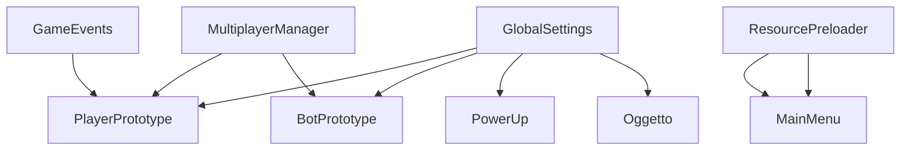

**Diagram sources**
- [project.godot](file://project.godot)
- [global_settings.gd](file://Scripts/global_settings.gd)
- [resource_preloader.gd](file://Scripts/resource_preloader.gd)
- [main_menu.gd](file://Menu/main_menu.gd)
- [multiplayer_manager.gd](file://Scripts/multiplayer_manager.gd)
- [player_prototype.gd](file://Scripts/player_prototype.gd)
- [bot_prototype.gd](file://Scripts/bot_prototype.gd)
- [power_up.gd](file://Scripts/power_up.gd)
- [oggetto.gd](file://Scripts/oggetto.gd)

**Section sources**
- [project.godot](file://project.godot)

## Performance Considerations
- Use ResourcePreloader for asynchronous scene and shader warm-up to avoid frame drops.
- Limit multiplayer sync frequency (e.g., every N physics frames) to reduce bandwidth and CPU usage.
- Prefer change_scene_to_packed for cached scenes to bypass disk reads.
- Clamp shader parameter updates and disable expensive effects at lower graphics presets.
- Use groups and layered collision masks to minimize unnecessary collision checks.
- Avoid heavy computations in _process; prefer _physics_process for movement and timing-sensitive logic.
- Disable debug overlays and verbose logging in release builds.

## Asset Management Procedures
- Place assets under appropriate categories (Animation, Audio, Lighting, UI, Weapons, etc.) with import metadata.
- Keep import files (.import) alongside assets to preserve platform-specific settings.
- Use theme resources for UI scaling and font sizing; GlobalSettings caches baseline values for responsive scaling.
- Organize tilesets and sheets with clear naming conventions and consistent cell sizes.
- For shaders, preload and warm-up via ResourcePreloader to reduce first-use latency.

## Testing Strategies
- Unit-like tests for individual systems:
  - PlayerPrototype: movement, firing, reloading, level transitions, and multiplayer sync.
  - BotPrototype: pathfinding accuracy, ramp traversal, and target tracking.
  - PowerUp: collection triggers, authority checks, and effect application.
  - Generic Object: explosion radius, damage falloff, and particle scaling.
- Integration tests:
  - MultiplayerManager: host/join flows, lobby updates, and game start synchronization.
  - ResourcePreloader: progress reporting and scene switching readiness.
- Manual QA:
  - Verify level-aware visibility and collision masks across height levels.
  - Test release check flow and changelog display in Main Menu.
  - Validate input handling on desktop and mobile (virtual joystick).

## Debugging Techniques and Profiling Methods
- Use print statements strategically and avoid excessive logging in production.
- Utilize Godot’s built-in profiler to identify hotspots in scripts and rendering.
- For multiplayer issues, verify authority checks and RPC sequences.
- Inspect shader parameters and material assignments for level effects.
- Monitor FPS overlay and audio bus volumes controlled by GlobalSettings.

## Common Pitfalls and How to Avoid Them
- Avoid blocking the main thread: use ResourcePreloader and threaded loading APIs.
- Do not assume RPC dictionaries retain integer keys; normalize keys after deserialization.
- Prevent friendly fire by checking team IDs before applying damage.
- Ensure level-aware systems update groups and collision masks consistently.
- Do not modify state on non-authority instances; delegate to server or local authority.

## Contribution Workflows
- Branching: Use feature branches for new features and bug fixes.
- Commits: Keep commits small and focused; include clear messages referencing issues.
- Code review: Review scripts for adherence to naming conventions, performance, and multiplayer correctness.
- Testing: Run manual QA across platforms and include automated checks for core systems.
- Documentation: Update relevant documentation and inline comments for new features.

## Documentation Requirements
- Inline comments: Document exported variables, complex logic, and multiplayer considerations.
- Public APIs: Add function-level documentation for scripts intended for reuse.
- Architecture decisions: Record rationale for autoload usage, level systems, and multiplayer design choices.
- Release notes: Maintain changelogs and integrate with GlobalSettings’ release check flow.

## Conclusion
These guidelines establish a consistent foundation for developing TFA Agents. By adhering to the outlined standards—code organization, naming conventions, performance optimization, asset management, testing, and debugging—you contribute to a maintainable, scalable, and enjoyable codebase. Follow the workflows and documentation requirements to ensure smooth collaboration and high-quality releases.