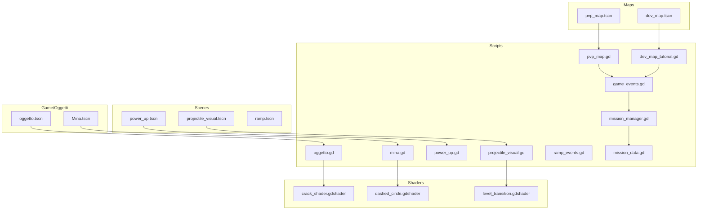
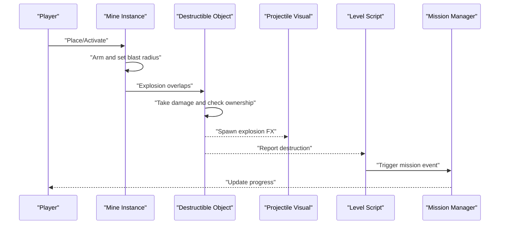
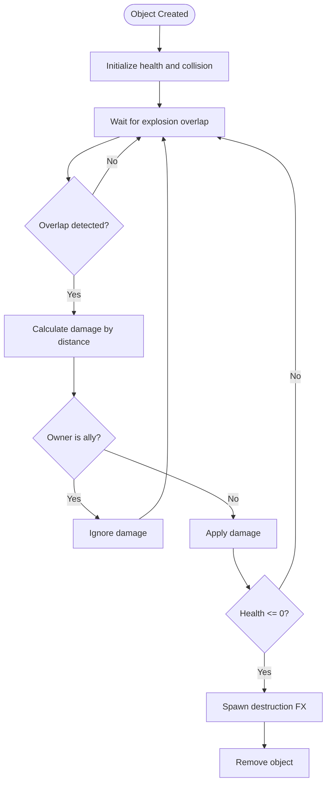
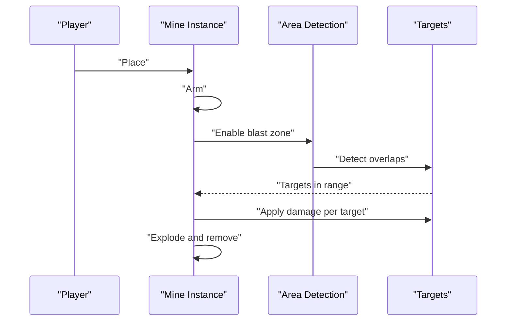
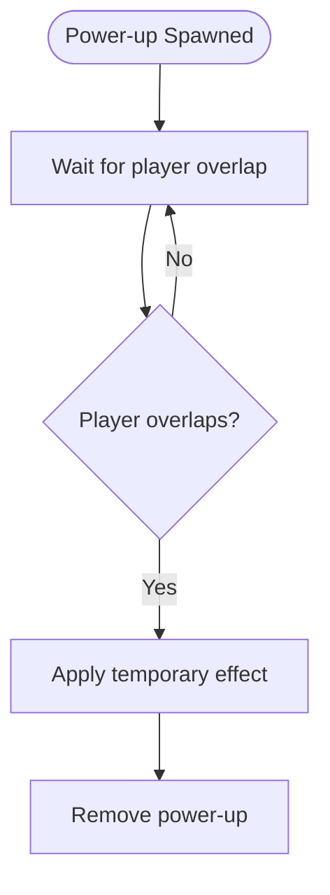
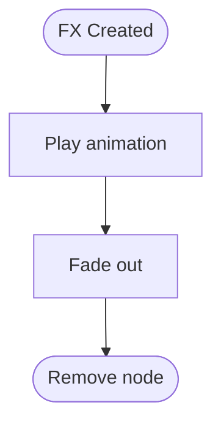
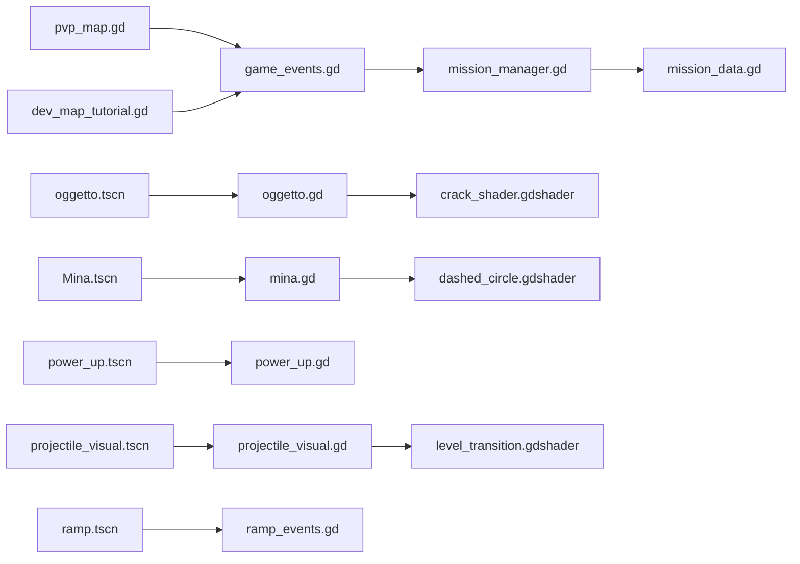

# Environmental Interactions

<cite>
**Referenced Files in This Document**
- [oggetto.gd](file://Scripts/oggetto.gd)
- [mina.gd](file://Scripts/mina.gd)
- [power_up.gd](file://Scripts/power_up.gd)
- [projectile_visual.gd](file://Scripts/projectile_visual.gd)
- [ramp_events.gd](file://Scripts/ramp_events.gd)
- [pvp_map.gd](file://Scripts/pvp_map.gd)
- [dev_map_tutorial.gd](file://Scripts/dev_map_tutorial.gd)
- [game_events.gd](file://Scripts/game_events.gd)
- [mission_manager.gd](file://Scripts/mission_manager.gd)
- [mission_data.gd](file://Scripts/mission_data.gd)
- [oggetto.tscn](file://Game/Oggetti/oggetto.tscn)
- [Mina.tscn](file://Game/Oggetti/Mina.tscn)
- [power_up.tscn](file://Scenes/power_up.tscn)
- [projectile_visual.tscn](file://Scenes/projectile_visual.tscn)
- [ramp.tscn](file://Scenes/ramp.tscn)
- [pvp_map.tscn](file://Maps/pvp_map.tscn)
- [dev_map.tscn](file://Maps/dev_map.tscn)
- [crack_shader.gdshader](file://Shaders/crack_shader.gdshader)
- [dashed_circle.gdshader](file://Shaders/dashed_circle.gdshader)
- [level_transition.gdshader](file://Shaders/level_transition.gdshader)
</cite>

## Table of Contents
1. [Introduction](#introduction)
2. [Project Structure](#project-structure)
3. [Core Components](#core-components)
4. [Architecture Overview](#architecture-overview)
5. [Detailed Component Analysis](#detailed-component-analysis)
6. [Dependency Analysis](#dependency-analysis)
7. [Performance Considerations](#performance-considerations)
8. [Troubleshooting Guide](#troubleshooting-guide)
9. [Conclusion](#conclusion)
10. [Appendices](#appendices)

## Introduction
This document describes the environmental interaction systems in TFA Agents, focusing on destructible objects, explosive interactions, power-up collection mechanics, and mine placement systems. It explains collision detection, explosion physics, damage calculation, and team-based object ownership. It also documents object lifecycle management, destruction effects, and integration with the mission system, including level-specific placement and scripting patterns for interactive elements.

## Project Structure
The environmental systems span several directories:
- Scripts: Core logic for objects, mines, power-ups, projectiles, ramps, and mission integration
- Game/Oggetti: Scene templates for generic environmental objects and mines
- Scenes: Dedicated scenes for power-ups and projectile visuals
- Maps: Level scenes that place environmental elements
- Shaders: Visual effects for destruction and transitions

**Diagram sources**
- [oggetto.gd](file://Scripts/oggetto.gd)
- [mina.gd](file://Scripts/mina.gd)
- [power_up.gd](file://Scripts/power_up.gd)
- [projectile_visual.gd](file://Scripts/projectile_visual.gd)
- [ramp_events.gd](file://Scripts/ramp_events.gd)
- [pvp_map.gd](file://Scripts/pvp_map.gd)
- [dev_map_tutorial.gd](file://Scripts/dev_map_tutorial.gd)
- [game_events.gd](file://Scripts/game_events.gd)
- [mission_manager.gd](file://Scripts/mission_manager.gd)
- [mission_data.gd](file://Scripts/mission_data.gd)
- [oggetto.tscn](file://Game/Oggetti/oggetto.tscn)
- [Mina.tscn](file://Game/Oggetti/Mina.tscn)
- [power_up.tscn](file://Scenes/power_up.tscn)
- [projectile_visual.tscn](file://Scenes/projectile_visual.tscn)
- [ramp.tscn](file://Scenes/ramp.tscn)
- [pvp_map.tscn](file://Maps/pvp_map.tscn)
- [dev_map.tscn](file://Maps/dev_map.tscn)
- [crack_shader.gdshader](file://Shaders/crack_shader.gdshader)
- [dashed_circle.gdshader](file://Shaders/dashed_circle.gdshader)
- [level_transition.gdshader](file://Shaders/level_transition.gdshader)

**Section sources**
- [oggetto.gd](file://Scripts/oggetto.gd)
- [mina.gd](file://Scripts/mina.gd)
- [power_up.gd](file://Scripts/power_up.gd)
- [projectile_visual.gd](file://Scripts/projectile_visual.gd)
- [ramp_events.gd](file://Scripts/ramp_events.gd)
- [pvp_map.gd](file://Scripts/pvp_map.gd)
- [dev_map_tutorial.gd](file://Scripts/dev_map_tutorial.gd)
- [game_events.gd](file://Scripts/game_events.gd)
- [mission_manager.gd](file://Scripts/mission_manager.gd)
- [mission_data.gd](file://Scripts/mission_data.gd)
- [oggetto.tscn](file://Game/Oggetti/oggetto.tscn)
- [Mina.tscn](file://Game/Oggetti/Mina.tscn)
- [power_up.tscn](file://Scenes/power_up.tscn)
- [projectile_visual.tscn](file://Scenes/projectile_visual.tscn)
- [ramp.tscn](file://Scenes/ramp.tscn)
- [pvp_map.tscn](file://Maps/pvp_map.tscn)
- [dev_map.tscn](file://Maps/dev_map.tscn)
- [crack_shader.gdshader](file://Shaders/crack_shader.gdshader)
- [dashed_circle.gdshader](file://Shaders/dashed_circle.gdshader)
- [level_transition.gdshader](file://Shaders/level_transition.gdshader)

## Core Components
- Generic environmental object: Base behavior for destructible items, including collision, destruction, and effects
- Mine: Placeable explosive with activation logic and blast radius
- Power-up: Collectible item that grants temporary abilities
- Projectile visual: Temporary FX for bullets and explosions
- Ramp events: Triggers for special environmental interactions
- Mission integration: Events and data that govern mission-critical environmental actions

Key responsibilities:
- Collision detection via collision shapes and layers
- Explosion physics and damage calculation
- Team-based ownership and friendly fire rules
- Lifecycle management: spawn, active, destroyed states
- Visual feedback: shaders and particle effects
- Mission-aware placement and scripted behaviors

**Section sources**
- [oggetto.gd](file://Scripts/oggetto.gd)
- [mina.gd](file://Scripts/mina.gd)
- [power_up.gd](file://Scripts/power_up.gd)
- [projectile_visual.gd](file://Scripts/projectile_visual.gd)
- [ramp_events.gd](file://Scripts/ramp_events.gd)
- [mission_manager.gd](file://Scripts/mission_manager.gd)
- [mission_data.gd](file://Scripts/mission_data.gd)

## Architecture Overview
The environmental system is composed of scene-driven components orchestrated by scripts. Levels instantiate scenes, scripts handle runtime logic, and shaders provide visual polish. Mission manager coordinates triggers and outcomes.

**Diagram sources**
- [mina.gd](file://Scripts/mina.gd)
- [oggetto.gd](file://Scripts/oggetto.gd)
- [projectile_visual.gd](file://Scripts/projectile_visual.gd)
- [pvp_map.gd](file://Scripts/pvp_map.gd)
- [mission_manager.gd](file://Scripts/mission_manager.gd)

## Detailed Component Analysis

### Generic Destructible Object (oggetto.gd)
Responsibilities:
- Collision shape and layer assignment
- Health and destruction thresholds
- Ownership tracking (team-based)
- Damage calculation and response
- Destruction effects and cleanup
- Integration with mission events

Collision and layers:
- Uses area/collision nodes with appropriate masks for explosion overlap
- Filters out friendly targets based on team ownership

Damage model:
- Applies blast damage scaled by distance
- Considers team ownership to prevent friendly destruction
- Triggers destruction when health reaches zero

Effects:
- Spawns explosion visuals
- Plays sound and particle effects
- Removes object after animation completes

Lifecycle:
- Spawned by level scripts
- Active until destroyed
- Cleaned up by parent or scene tree

**Diagram sources**
- [oggetto.gd](file://Scripts/oggetto.gd)

**Section sources**
- [oggetto.gd](file://Scripts/oggetto.gd)
- [oggetto.tscn](file://Game/Oggetti/oggetto.tscn)

### Mine (mina.gd)
Responsibilities:
- Placement logic and activation
- Blast radius and timer
- Friendly fire filtering
- Triggered explosion and FX

Behavior:
- Placed by player action
- Arms immediately or after delay
- Detects overlapping areas
- Damages enemies within blast radius
- Destroys itself after explosion

**Diagram sources**
- [mina.gd](file://Scripts/mina.gd)
- [Mina.tscn](file://Game/Oggetti/Mina.tscn)

**Section sources**
- [mina.gd](file://Scripts/mina.gd)
- [Mina.tscn](file://Game/Oggetti/Mina.tscn)

### Power-Up (power_up.gd)
Responsibilities:
- Collection detection
- Temporary effect application
- Visual feedback and removal

Behavior:
- Spawns at designated locations
- Triggers on player overlap
- Grants short-lived buffs
- Removes itself after collection

**Diagram sources**
- [power_up.gd](file://Scripts/power_up.gd)
- [power_up.tscn](file://Scenes/power_up.tscn)

**Section sources**
- [power_up.gd](file://Scripts/power_up.gd)
- [power_up.tscn](file://Scenes/power_up.tscn)

### Projectile Visual (projectile_visual.gd)
Responsibilities:
- Temporary FX for hits and explosions
- Lifetime management and cleanup
- Visual blending and transitions

Behavior:
- Instantiated on impact/explosion
- Plays animation and fades out
- Cleans up after duration

**Diagram sources**
- [projectile_visual.gd](file://Scripts/projectile_visual.gd)
- [projectile_visual.tscn](file://Scenes/projectile_visual.tscn)

**Section sources**
- [projectile_visual.gd](file://Scripts/projectile_visual.gd)
- [projectile_visual.tscn](file://Scenes/projectile_visual.tscn)

### Ramp Events (ramp_events.gd)
Responsibilities:
- Special environmental triggers
- Conditional activation based on state
- Integration with mission progress

Behavior:
- Listens for player or object interactions
- Triggers scripted sequences
- Coordinates with mission manager

**Section sources**
- [ramp_events.gd](file://Scripts/ramp_events.gd)
- [ramp.tscn](file://Scenes/ramp.tscn)

### Level Integration (pvp_map.gd, dev_map_tutorial.gd)
Responsibilities:
- Place environmental objects during level load
- Manage object pools and lifecycles
- Coordinate with game events

Behavior:
- Instantiate scenes at predefined positions
- Track destructibles and mines
- Report events to mission system

**Section sources**
- [pvp_map.gd](file://Scripts/pvp_map.gd)
- [dev_map_tutorial.gd](file://Scripts/dev_map_tutorial.gd)
- [pvp_map.tscn](file://Maps/pvp_map.tscn)
- [dev_map.tscn](file://Maps/dev_map.tscn)

### Mission Integration (game_events.gd, mission_manager.gd, mission_data.gd)
Responsibilities:
- Define mission-critical environmental actions
- Track completion conditions
- Update UI and progression

Behavior:
- Subscribe to environmental events
- Update mission state
- Trigger next steps or rewards

**Section sources**
- [game_events.gd](file://Scripts/game_events.gd)
- [mission_manager.gd](file://Scripts/mission_manager.gd)
- [mission_data.gd](file://Scripts/mission_data.gd)

## Dependency Analysis
The system exhibits layered dependencies:
- Scripts depend on scenes for instantiation
- Level scripts depend on mission manager for orchestration
- Visual effects rely on shaders for rendering
- Collision and physics are handled by engine nodes attached to scenes

**Diagram sources**
- [pvp_map.gd](file://Scripts/pvp_map.gd)
- [dev_map_tutorial.gd](file://Scripts/dev_map_tutorial.gd)
- [game_events.gd](file://Scripts/game_events.gd)
- [mission_manager.gd](file://Scripts/mission_manager.gd)
- [mission_data.gd](file://Scripts/mission_data.gd)
- [oggetto.tscn](file://Game/Oggetti/oggetto.tscn)
- [Mina.tscn](file://Game/Oggetti/Mina.tscn)
- [power_up.tscn](file://Scenes/power_up.tscn)
- [projectile_visual.tscn](file://Scenes/projectile_visual.tscn)
- [ramp.tscn](file://Scenes/ramp.tscn)
- [oggetto.gd](file://Scripts/oggetto.gd)
- [mina.gd](file://Scripts/mina.gd)
- [power_up.gd](file://Scripts/power_up.gd)
- [projectile_visual.gd](file://Scripts/projectile_visual.gd)
- [ramp_events.gd](file://Scripts/ramp_events.gd)
- [crack_shader.gdshader](file://Shaders/crack_shader.gdshader)
- [dashed_circle.gdshader](file://Shaders/dashed_circle.gdshader)
- [level_transition.gdshader](file://Shaders/level_transition.gdshader)

**Section sources**
- [pvp_map.gd](file://Scripts/pvp_map.gd)
- [dev_map_tutorial.gd](file://Scripts/dev_map_tutorial.gd)
- [game_events.gd](file://Scripts/game_events.gd)
- [mission_manager.gd](file://Scripts/mission_manager.gd)
- [mission_data.gd](file://Scripts/mission_data.gd)
- [oggetto.gd](file://Scripts/oggetto.gd)
- [mina.gd](file://Scripts/mina.gd)
- [power_up.gd](file://Scripts/power_up.gd)
- [projectile_visual.gd](file://Scripts/projectile_visual.gd)
- [ramp_events.gd](file://Scripts/ramp_events.gd)
- [crack_shader.gdshader](file://Shaders/crack_shader.gdshader)
- [dashed_circle.gdshader](file://Shaders/dashed_circle.gdshader)
- [level_transition.gdshader](file://Shaders/level_transition.gdshader)

## Performance Considerations
- Minimize collision checks by using area-based detection with appropriate masks
- Pool and reuse projectile FX to reduce allocation overhead
- Limit explosion radius and frequency in dense environments
- Use shaders for visual effects to keep CPU work off the main thread
- Defer heavy computations to idle frames when possible
- Prefer static destructibles where feasible to avoid dynamic physics

## Troubleshooting Guide
Common issues and resolutions:
- Objects not taking damage: Verify collision layers and masks; ensure overlap detection is enabled
- Friendly fire still damages allies: Confirm team ownership logic and filtering
- Mines not exploding: Check arm/activation state and blast zone enablement
- Power-ups not collecting: Ensure overlap area is properly sized and detection logic is active
- Visual artifacts: Adjust shader parameters and ensure FX lifetimes are configured correctly
- Mission events not triggering: Validate event subscriptions and mission manager wiring

**Section sources**
- [oggetto.gd](file://Scripts/oggetto.gd)
- [mina.gd](file://Scripts/mina.gd)
- [power_up.gd](file://Scripts/power_up.gd)
- [projectile_visual.gd](file://Scripts/projectile_visual.gd)
- [game_events.gd](file://Scripts/game_events.gd)
- [mission_manager.gd](file://Scripts/mission_manager.gd)

## Conclusion
TFA Agents’ environmental interaction systems combine scene-based prefabs with robust script logic to deliver destructible environments, explosive mechanics, power-up collection, and mine placement. Team-based ownership, collision detection, and mission integration form a cohesive framework that supports both casual and mission-driven gameplay. Shaders and FX enhance immersion while maintaining performance. Proper level placement and scripting patterns ensure scalability and maintainability across diverse scenarios.

## Appendices

### Object Types and Behaviors
- Explosive crates: Destructible, team-owned, explode on blast contact
- Power-ups: Collectible, grant temporary effects, despawn after collection
- Mines: Placeable explosives, detect nearby targets, apply area damage

**Section sources**
- [oggetto.gd](file://Scripts/oggetto.gd)
- [mina.gd](file://Scripts/mina.gd)
- [power_up.gd](file://Scripts/power_up.gd)

### Collision Layer Assignments
- Destructible objects: Collision layer for blast overlap
- Mines: Separate blast layer with enemy mask
- Power-ups: Collection area layer
- Projectiles: Impact FX layer

**Section sources**
- [oggetto.gd](file://Scripts/oggetto.gd)
- [mina.gd](file://Scripts/mina.gd)
- [power_up.gd](file://Scripts/power_up.gd)

### Level-Specific Placement Examples
- Use level scripts to instantiate scenes at fixed positions
- Tag placement points for mission checkpoints
- Configure ramp events for conditional activation

**Section sources**
- [pvp_map.gd](file://Scripts/pvp_map.gd)
- [dev_map_tutorial.gd](file://Scripts/dev_map_tutorial.gd)
- [ramp_events.gd](file://Scripts/ramp_events.gd)

### Scripting Patterns for Interactive Elements
- Subscribe to overlap signals and apply damage or effects
- Use timers for delayed activation (e.g., mines)
- Track collected power-ups and update state
- Emit mission events on key environmental actions

**Section sources**
- [oggetto.gd](file://Scripts/oggetto.gd)
- [mina.gd](file://Scripts/mina.gd)
- [power_up.gd](file://Scripts/power_up.gd)
- [projectile_visual.gd](file://Scripts/projectile_visual.gd)
- [game_events.gd](file://Scripts/game_events.gd)
- [mission_manager.gd](file://Scripts/mission_manager.gd)

### Visual Effects and Shaders
- Cracked surface shader for destructible materials
- Dashed circle shader for blast zones
- Level transition shader for environmental transitions

**Section sources**
- [crack_shader.gdshader](file://Shaders/crack_shader.gdshader)
- [dashed_circle.gdshader](file://Shaders/dashed_circle.gdshader)
- [level_transition.gdshader](file://Shaders/level_transition.gdshader)