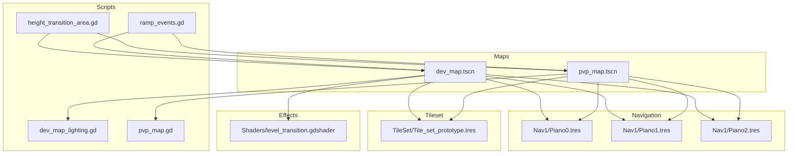
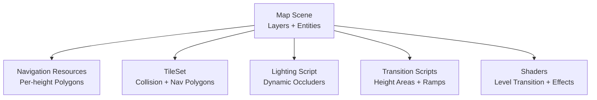
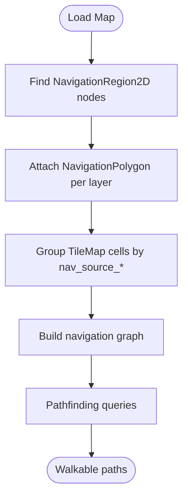
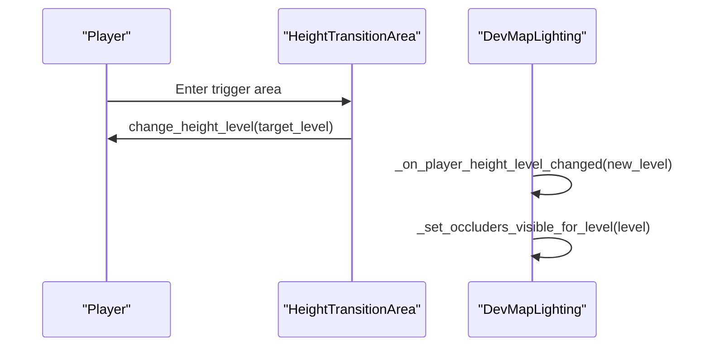
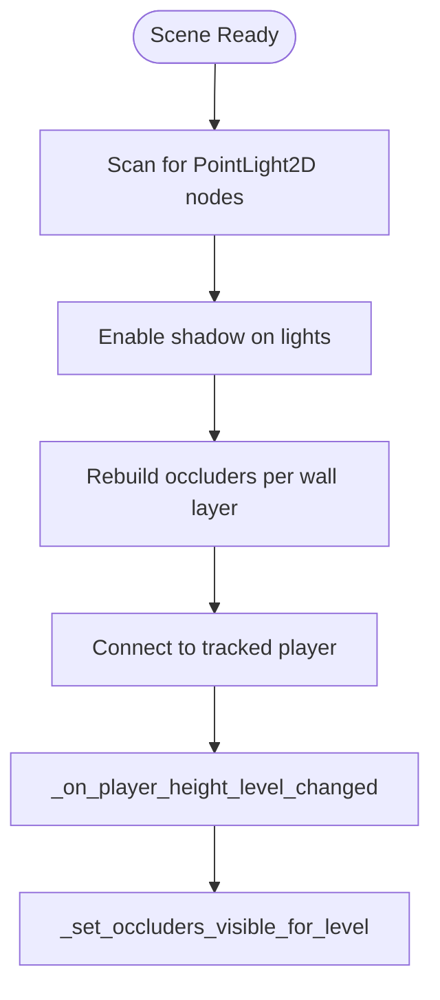
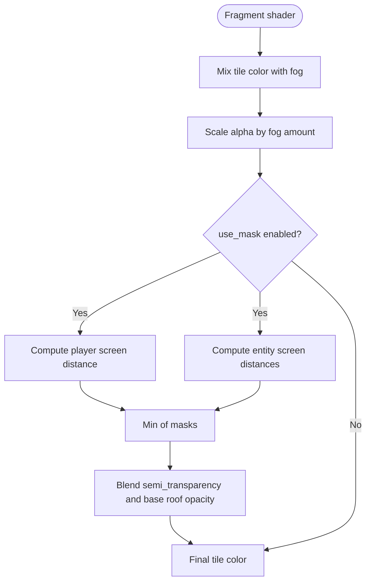
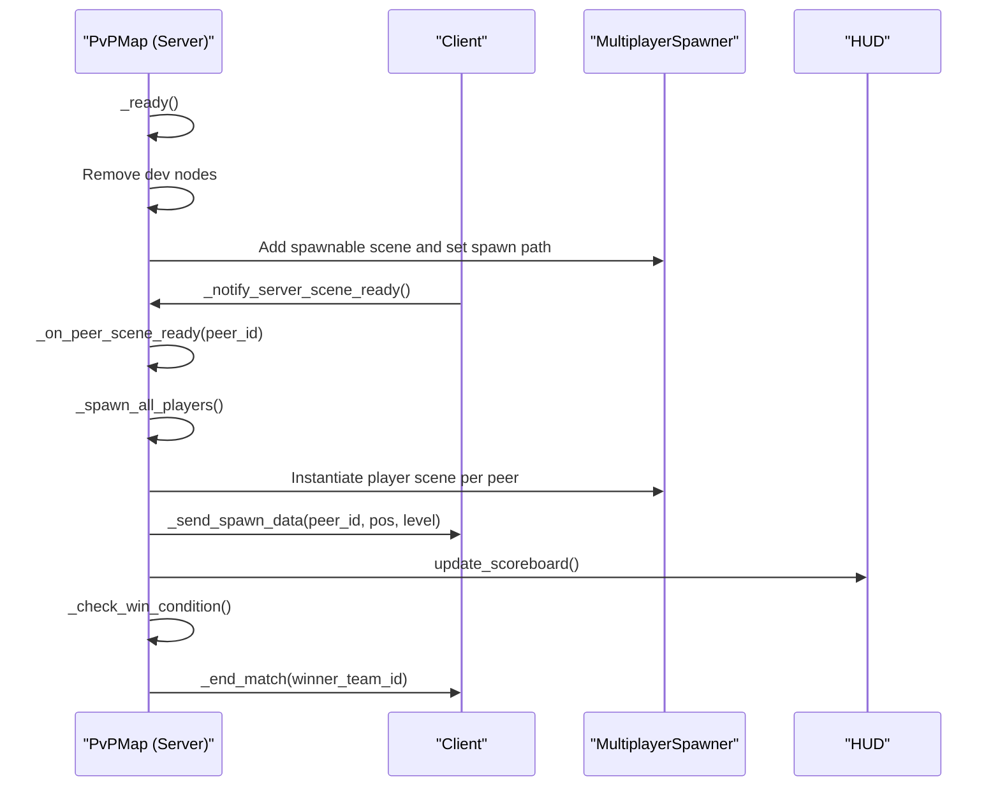
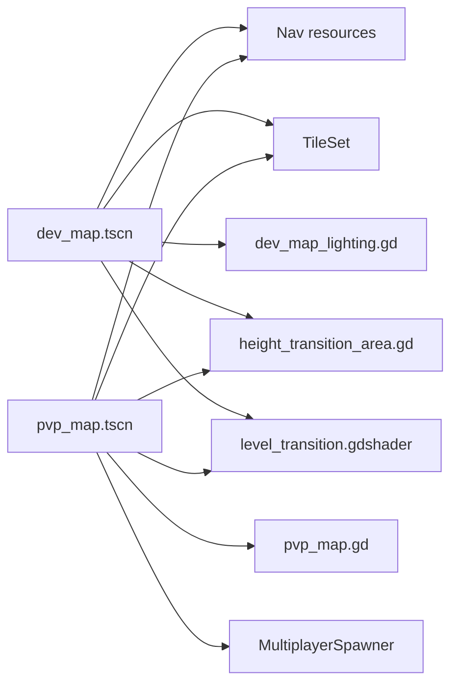

# Game Maps and Levels

<cite>
**Referenced Files in This Document**
- [dev_map.tscn](file://Maps/dev_map.tscn)
- [pvp_map.tscn](file://Maps/pvp_map.tscn)
- [pvp_map.gd](file://Scripts/pvp_map.gd)
- [dev_map_lighting.gd](file://Scripts/dev_map_lighting.gd)
- [height_transition_area.gd](file://Scripts/height_transition_area.gd)
- [ramp.tscn](file://Scenes/ramp.tscn)
- [ramp_events.gd](file://Scripts/ramp_events.gd)
- [Tile_set_prototype.tres](file://Scenes/TileSet/Tile_set_prototype.tres)
- [Piano0.tres](file://Maps/Nav1/Piano0.tres)
- [Piano1.tres](file://Maps/Nav1/Piano1.tres)
- [level_transition.gdshader](file://Shaders/level_transition.gdshader)
- [multiplayer_manager.gd](file://Scripts/multiplayer_manager.gd)
</cite>

## Table of Contents
1. [Introduction](#introduction)
2. [Project Structure](#project-structure)
3. [Core Components](#core-components)
4. [Architecture Overview](#architecture-overview)
5. [Detailed Component Analysis](#detailed-component-analysis)
6. [Dependency Analysis](#dependency-analysis)
7. [Performance Considerations](#performance-considerations)
8. [Troubleshooting Guide](#troubleshooting-guide)
9. [Conclusion](#conclusion)
10. [Appendices](#appendices)

## Introduction
This document explains the TFA Agents map and level design systems. It covers how maps are structured, how navigation meshes enable AI/pathfinding, how level transitions work, and how lighting integrates with the environment. It also provides practical guidance for creating custom maps, choosing tilesets, configuring collisions, and optimizing performance for different map sizes and complexity levels.

## Project Structure
The map system is composed of:
- Scene files defining map layout, layers, entities, and gameplay elements
- Navigation resources for pathfinding across multiple height levels
- Scripts that manage lighting, transitions, and multiplayer spawning
- Tileset resources that define collision geometry and navigation polygons
- Shaders that implement dynamic effects like level transitions and environmental damage

**Diagram sources**
- [dev_map.tscn:1-607](file://Maps/dev_map.tscn#L1-L607)
- [pvp_map.tscn:1-691](file://Maps/pvp_map.tscn#L1-L691)
- [Piano0.tres:1-11](file://Maps/Nav1/Piano0.tres#L1-L11)
- [Piano1.tres:1-10](file://Maps/Nav1/Piano1.tres#L1-L10)
- [dev_map_lighting.gd:1-134](file://Scripts/dev_map_lighting.gd#L1-L134)
- [pvp_map.gd:1-417](file://Scripts/pvp_map.gd#L1-L417)
- [height_transition_area.gd:1-15](file://Scripts/height_transition_area.gd#L1-L15)
- [ramp_events.gd:1-9](file://Scripts/ramp_events.gd#L1-L9)
- [Tile_set_prototype.tres:1-800](file://Scenes/TileSet/Tile_set_prototype.tres#L1-L800)
- [level_transition.gdshader:1-64](file://Shaders/level_transition.gdshader#L1-L64)

**Section sources**
- [dev_map.tscn:1-607](file://Maps/dev_map.tscn#L1-L607)
- [pvp_map.tscn:1-691](file://Maps/pvp_map.tscn#L1-L691)

## Core Components
- Map scenes: Two primary scenes define gameplay spaces—development and competitive play. Both share similar layered structure and navigation resources.
- Navigation system: NavigationPolygon resources encode walkable areas per height level and group membership for pathfinding.
- Lighting system: A dynamic lighting controller builds occluders from wall tiles and toggles visibility per height level.
- Level transitions: Transition zones and ramps connect height levels, emitting signals when traversed.
- Tileset and collisions: The TileSet defines collision polygons and navigation polygons per tile, enabling accurate pathfinding and occlusion.
- Shaders: Effects like level transitions and environmental damage integrate with scene rendering.

**Section sources**
- [dev_map_lighting.gd:1-134](file://Scripts/dev_map_lighting.gd#L1-L134)
- [height_transition_area.gd:1-15](file://Scripts/height_transition_area.gd#L1-L15)
- [ramp_events.gd:1-9](file://Scripts/ramp_events.gd#L1-L9)
- [Tile_set_prototype.tres:1-800](file://Scenes/TileSet/Tile_set_prototype.tres#L1-L800)
- [level_transition.gdshader:1-64](file://Shaders/level_transition.gdshader#L1-L64)

## Architecture Overview
The map architecture separates concerns across scenes, scripts, and resources:
- Scenes define layers (ground/walls), entities, and gameplay elements.
- Navigation resources provide pathfinding data grouped by height level.
- Scripts handle lighting occlusion, multiplayer spawning, and transition signaling.
- Tilesets unify collision and navigation data.
- Shaders enhance visuals and support gameplay effects.

**Diagram sources**
- [dev_map.tscn:1-607](file://Maps/dev_map.tscn#L1-L607)
- [pvp_map.tscn:1-691](file://Maps/pvp_map.tscn#L1-L691)
- [Piano0.tres:1-11](file://Maps/Nav1/Piano0.tres#L1-L11)
- [Piano1.tres:1-10](file://Maps/Nav1/Piano1.tres#L1-L10)
- [dev_map_lighting.gd:1-134](file://Scripts/dev_map_lighting.gd#L1-L134)
- [height_transition_area.gd:1-15](file://Scripts/height_transition_area.gd#L1-L15)
- [ramp_events.gd:1-9](file://Scripts/ramp_events.gd#L1-L9)
- [Tile_set_prototype.tres:1-800](file://Scenes/TileSet/Tile_set_prototype.tres#L1-L800)
- [level_transition.gdshader:1-64](file://Shaders/level_transition.gdshader#L1-L64)

## Detailed Component Analysis

### Development vs Competitive Play Maps
- Both scenes share a three-layer structure: L0 (ground), L1 (mid-level), L2 (upper level), with walls and navigation regions per layer.
- Development map includes bots, tutorial nodes, and extra props; competitive map replaces bots with multiplayer spawner and spawn points.
- Lighting script is inherited by both scenes; PvP map overrides unnecessary nodes and sets up multiplayer spawning.

Key differences:
- Entities: Development map spawns AI bots; PvP map spawns human players via MultiplayerSpawner.
- Spawn system: PvP map uses dedicated spawn markers with team assignments; development map does not.
- Networking: PvP map coordinates readiness, teams, and respawn logic; development map focuses on single-player/tutorial.

**Section sources**
- [dev_map.tscn:1-607](file://Maps/dev_map.tscn#L1-L607)
- [pvp_map.tscn:1-691](file://Maps/pvp_map.tscn#L1-L691)
- [pvp_map.gd:1-417](file://Scripts/pvp_map.gd#L1-L417)

### Navigation Mesh System
- Navigation resources encode walkable polygons per height level and group membership.
- Each NavigationRegion2D references a NavigationPolygon resource and sets navigation_layers to restrict pathfinding to specific levels.
- TileMap layers use groups ("nav_source_lX") to feed navigation polygons.

Implementation highlights:
- NavigationPolygon resources specify vertices, polygons, outlines, parsed_collision_mask, source_geometry_mode, and cell_size.
- NavigationRegion2D nodes attach polygons and control layer filtering.

**Diagram sources**
- [Piano0.tres:1-11](file://Maps/Nav1/Piano0.tres#L1-L11)
- [Piano1.tres:1-10](file://Maps/Nav1/Piano1.tres#L1-L10)
- [dev_map.tscn:38-84](file://Maps/dev_map.tscn#L38-L84)
- [pvp_map.tscn:146-193](file://Maps/pvp_map.tscn#L146-L193)

**Section sources**
- [Piano0.tres:1-11](file://Maps/Nav1/Piano0.tres#L1-L11)
- [Piano1.tres:1-10](file://Maps/Nav1/Piano1.tres#L1-L10)
- [dev_map.tscn:38-84](file://Maps/dev_map.tscn#L38-L84)
- [pvp_map.tscn:146-193](file://Maps/pvp_map.tscn#L146-L193)

### Level Transition Mechanics
- HeightTransitionArea detects when a player enters and triggers a height change.
- Ramps act as interactive transition zones; they emit a signal when traversed and can adjust collision masks to control traversal.
- Lighting script dynamically shows occluders only for the current height level.

**Diagram sources**
- [height_transition_area.gd:1-15](file://Scripts/height_transition_area.gd#L1-L15)
- [dev_map_lighting.gd:125-134](file://Scripts/dev_map_lighting.gd#L125-L134)
- [ramp_events.gd:1-9](file://Scripts/ramp_events.gd#L1-L9)

**Section sources**
- [height_transition_area.gd:1-15](file://Scripts/height_transition_area.gd#L1-L15)
- [dev_map_lighting.gd:125-134](file://Scripts/dev_map_lighting.gd#L125-L134)
- [ramp_events.gd:1-9](file://Scripts/ramp_events.gd#L1-L9)

### Lighting System Integration
- The lighting controller scans the scene for PointLight2D nodes and enables shadows.
- It builds dynamic occluders from wall tiles and organizes them by height level.
- Occluders are shown only for the player’s current height level.

**Diagram sources**
- [dev_map_lighting.gd:15-134](file://Scripts/dev_map_lighting.gd#L15-L134)
- [dev_map.tscn:20-23](file://Maps/dev_map.tscn#L20-L23)

**Section sources**
- [dev_map_lighting.gd:1-134](file://Scripts/dev_map_lighting.gd#L1-L134)
- [dev_map.tscn:20-23](file://Maps/dev_map.tscn#L20-L23)

### Environmental Interaction Elements
- Ramps: Interactive transition zones with collision shapes and light emitters; they emit a signal when traversed.
- Dynamic props: Explosive crates and power-ups are placed with collision layers and masks to interact with players and terrain.
- Lighting effects: PointLight2D nodes with shaders and textures contribute to ambient and dynamic illumination.

**Section sources**
- [ramp.tscn:1-44](file://Scenes/ramp.tscn#L1-L44)
- [dev_map.tscn:86-107](file://Maps/dev_map.tscn#L86-L107)
- [pvp_map.tscn:194-215](file://Maps/pvp_map.tscn#L194-L215)

### Tileset Usage and Collision Detection Setup
- The TileSet defines collision polygons and navigation polygons per tile index.
- TileMap layers reference the TileSet and use groups to feed navigation polygons.
- Collision masks on entities control interactions with terrain and other objects.

Guidelines:
- Assign collision layers and masks to props and entities to control interactions.
- Keep navigation polygons aligned with walkable surfaces; avoid overlapping invalid polygons.
- Use groups on TileMap layers to ensure navigation resources capture the intended geometry.

**Section sources**
- [Tile_set_prototype.tres:1-800](file://Scenes/TileSet/Tile_set_prototype.tres#L1-L800)
- [dev_map.tscn:27-36](file://Maps/dev_map.tscn#L27-L36)
- [pvp_map.tscn:135-144](file://Maps/pvp_map.tscn#L135-L144)

### Level Transition Shader Effects
- The level transition shader blends fog with tiles and applies a circular mask around the player to simulate depth and perspective.
- It reduces opacity of lower levels and can semi-transparentize areas outside the mask while keeping a base roof opacity inside.

**Diagram sources**
- [level_transition.gdshader:23-63](file://Shaders/level_transition.gdshader#L23-L63)

**Section sources**
- [level_transition.gdshader:1-64](file://Shaders/level_transition.gdshader#L1-L64)

### Multiplayer Spawning and Match Flow (PvP)
- The PvP map script removes development-specific nodes, creates a Players container, and instantiates the player scene per peer.
- It computes valid spawn levels near spawn points and synchronizes spawn data across peers.
- It tracks kills, win conditions, and ends the match with a victory screen.

**Diagram sources**
- [pvp_map.gd:44-129](file://Scripts/pvp_map.gd#L44-L129)
- [pvp_map.gd:164-210](file://Scripts/pvp_map.gd#L164-L210)
- [pvp_map.gd:256-301](file://Scripts/pvp_map.gd#L256-L301)
- [pvp_map.gd:306-417](file://Scripts/pvp_map.gd#L306-L417)
- [multiplayer_manager.gd:159-169](file://Scripts/multiplayer_manager.gd#L159-L169)

**Section sources**
- [pvp_map.gd:1-417](file://Scripts/pvp_map.gd#L1-L417)
- [multiplayer_manager.gd:1-322](file://Scripts/multiplayer_manager.gd#L1-L322)

## Dependency Analysis
- Map scenes depend on:
  - Navigation resources for pathfinding
  - TileSet for collision and navigation polygons
  - Lighting script for dynamic occluders
  - Transition scripts for height changes
  - Shaders for visual effects
- PvP map depends on MultiplayerSpawner and spawn points to orchestrate player instantiation and synchronization.

**Diagram sources**
- [dev_map.tscn:1-607](file://Maps/dev_map.tscn#L1-L607)
- [pvp_map.tscn:1-691](file://Maps/pvp_map.tscn#L1-L691)
- [Piano0.tres:1-11](file://Maps/Nav1/Piano0.tres#L1-L11)
- [Piano1.tres:1-10](file://Maps/Nav1/Piano1.tres#L1-L10)
- [dev_map_lighting.gd:1-134](file://Scripts/dev_map_lighting.gd#L1-L134)
- [height_transition_area.gd:1-15](file://Scripts/height_transition_area.gd#L1-L15)
- [level_transition.gdshader:1-64](file://Shaders/level_transition.gdshader#L1-L64)
- [pvp_map.gd:1-417](file://Scripts/pvp_map.gd#L1-L417)

**Section sources**
- [dev_map.tscn:1-607](file://Maps/dev_map.tscn#L1-L607)
- [pvp_map.tscn:1-691](file://Maps/pvp_map.tscn#L1-L691)

## Performance Considerations
- Navigation complexity:
  - Keep navigation polygons concise; avoid excessive small polygons.
  - Use appropriate cell_size in NavigationPolygon resources to balance accuracy and performance.
- TileMap layers:
  - Limit the number of used tiles per layer; large maps benefit from tiling strategies and layer culling.
  - Use y_sort_enabled judiciously on upper layers to reduce draw overhead.
- Lighting:
  - Dynamic occluders are built from wall tiles; keep wall geometry reasonable to minimize occluder count.
  - Toggle occluder visibility per height level to avoid rendering off-screen geometry.
- Shaders:
  - Level transition shader uses masking and entity arrays; limit entity_count and radius to reduce compute.
- Multiplayer:
  - Spawn only necessary entities; defer heavy initialization until after scene ready handshake completes.

[No sources needed since this section provides general guidance]

## Troubleshooting Guide
Common issues and resolutions:
- Navigation not working:
  - Verify NavigationRegion2D references correct NavigationPolygon and has proper navigation_layers.
  - Ensure TileMap layers use correct groups ("nav_source_lX") so polygons are generated.
- Lighting artifacts:
  - Confirm PointLight2D nodes exist and shadow_enabled is true.
  - Check that occluders are rebuilt after adding/removing wall tiles.
- Level transitions:
  - Ensure HeightTransitionArea target_level matches intended destination.
  - For ramps, confirm collision masks allow traversal and that ramp events signal is connected.
- Multiplayer spawn mismatch:
  - Validate spawn points exist and are reachable; use _get_valid_spawn_level fallback logic.
  - Confirm MultiplayerSpawner is configured with correct spawn path and scene.

**Section sources**
- [Piano0.tres:1-11](file://Maps/Nav1/Piano0.tres#L1-L11)
- [Piano1.tres:1-10](file://Maps/Nav1/Piano1.tres#L1-L10)
- [dev_map_lighting.gd:76-134](file://Scripts/dev_map_lighting.gd#L76-L134)
- [height_transition_area.gd:1-15](file://Scripts/height_transition_area.gd#L1-L15)
- [ramp_events.gd:1-9](file://Scripts/ramp_events.gd#L1-L9)
- [pvp_map.gd:150-163](file://Scripts/pvp_map.gd#L150-L163)

## Conclusion
TFA Agents’ map system combines layered TileMap environments, robust navigation resources, dynamic lighting, and interactive transition zones. Development and competitive maps share a common foundation, with the latter adding multiplayer orchestration. By following the guidelines here—using the TileSet correctly, setting up navigation polygons, managing lighting occluders, and leveraging shaders—you can build scalable, performant maps tailored for both development and competitive play.

[No sources needed since this section summarizes without analyzing specific files]

## Appendices

### Development Workflow for Custom Maps
- Design layout:
  - Plan three height levels (L0, L1, L2) with distinct ground/wall layers.
  - Place ramps and transition areas where players should move between levels.
- Configure navigation:
  - Set TileMap groups ("nav_source_lX") for each layer.
  - Create NavigationPolygon resources per layer and assign to NavigationRegion2D nodes.
- Lighting:
  - Add PointLight2D nodes and enable shadows.
  - Ensure the lighting script runs and rebuilds occluders when tiles change.
- Entities:
  - Place props with appropriate collision layers and masks.
  - For multiplayer, add spawn points and configure MultiplayerSpawner.
- Testing:
  - Verify pathfinding across levels and transitions.
  - Test lighting occlusion per height level.
  - Validate shader effects and performance.

[No sources needed since this section provides general guidance]