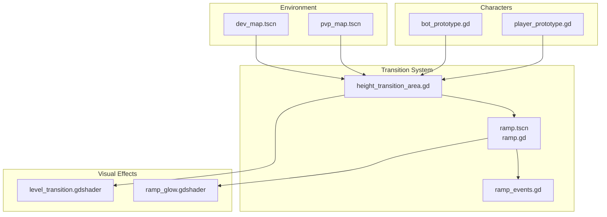
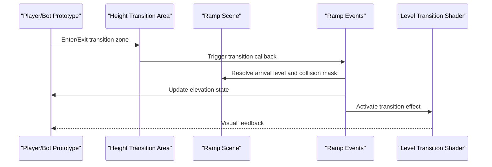
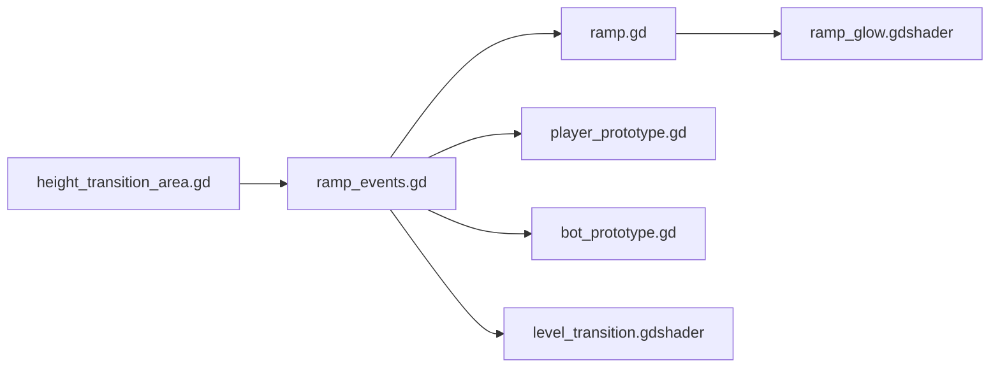

# Height Level Transitions

<cite>
**Referenced Files in This Document**
- [height_transition_area.gd](file://Scripts/height_transition_area.gd)
- [ramp.gd](file://Scripts/ramp.gd)
- [ramp_events.gd](file://Scripts/ramp_events.gd)
- [level_transition.gdshader](file://Shaders/level_transition.gdshader)
- [ramp_glow.gdshader](file://Shaders/ramp_glow.gdshader)
- [ramp.tscn](file://Scenes/ramp.tscn)
- [player_prototype.gd](file://Scripts/player_prototype.gd)
- [bot_prototype.gd](file://Scripts/bot_prototype.gd)
- [global_settings.gd](file://Scripts/global_settings.gd)
- [pvp_map.tscn](file://Maps/pvp_map.tscn)
- [dev_map.tscn](file://Maps/dev_map.tscn)
</cite>

## Table of Contents
1. [Introduction](#introduction)
2. [Project Structure](#project-structure)
3. [Core Components](#core-components)
4. [Architecture Overview](#architecture-overview)
5. [Detailed Component Analysis](#detailed-component-analysis)
6. [Dependency Analysis](#dependency-analysis)
7. [Performance Considerations](#performance-considerations)
8. [Troubleshooting Guide](#troubleshooting-guide)
9. [Conclusion](#conclusion)

## Introduction
This document explains TFA Agents' height level transition system. It covers how players move between elevation levels using ramps, the underlying collision layer management, height-based filtering, and the visual effects that accompany level changes. It also provides practical guidance for placing ramps, configuring collision masks, managing player state during transitions, and optimizing performance in multi-level environments.

## Project Structure
The height transition system spans several scripts, scenes, and shaders:
- Area-based triggers manage height transitions
- Ramp scenes and scripts define geometry and events
- Player and bot prototypes handle state and movement
- Shaders provide visual feedback for transitions and ramp glows
- Maps demonstrate real-world usage

**Diagram sources**
- [height_transition_area.gd](file://Scripts/height_transition_area.gd)
- [ramp.gd](file://Scripts/ramp.gd)
- [ramp_events.gd](file://Scripts/ramp_events.gd)
- [level_transition.gdshader](file://Shaders/level_transition.gdshader)
- [ramp_glow.gdshader](file://Shaders/ramp_glow.gdshader)
- [ramp.tscn](file://Scenes/ramp.tscn)
- [player_prototype.gd](file://Scripts/player_prototype.gd)
- [bot_prototype.gd](file://Scripts/bot_prototype.gd)
- [pvp_map.tscn](file://Maps/pvp_map.tscn)
- [dev_map.tscn](file://Maps/dev_map.tscn)

**Section sources**
- [height_transition_area.gd](file://Scripts/height_transition_area.gd)
- [ramp.gd](file://Scripts/ramp.gd)
- [ramp_events.gd](file://Scripts/ramp_events.gd)
- [level_transition.gdshader](file://Shaders/level_transition.gdshader)
- [ramp_glow.gdshader](file://Shaders/ramp_glow.gdshader)
- [ramp.tscn](file://Scenes/ramp.tscn)
- [player_prototype.gd](file://Scripts/player_prototype.gd)
- [bot_prototype.gd](file://Scripts/bot_prototype.gd)
- [pvp_map.tscn](file://Maps/pvp_map.tscn)
- [dev_map.tscn](file://Maps/dev_map.tscn)

## Core Components
- Height Transition Area: Detects when players enter/exit transition zones and initiates level changes.
- Ramp Scene and Script: Defines ramp geometry, collision masks, and event callbacks.
- Ramp Events: Manages transition logic, arrival level assignment, and state updates.
- Visual Shaders: Provide level-transition and ramp-glow effects.
- Player/Bot Prototypes: Track current elevation and update state during transitions.
- Maps: Demonstrate placement and configuration of ramps and areas.

Key responsibilities:
- Collision filtering via layers/masks to ensure only players interact with ramps.
- Deterministic arrival levels and smooth state transitions.
- Visual feedback to communicate elevation changes.

**Section sources**
- [height_transition_area.gd](file://Scripts/height_transition_area.gd)
- [ramp.gd](file://Scripts/ramp.gd)
- [ramp_events.gd](file://Scripts/ramp_events.gd)
- [player_prototype.gd](file://Scripts/player_prototype.gd)
- [bot_prototype.gd](file://Scripts/bot_prototype.gd)

## Architecture Overview
The system uses Area2D/AI2D nodes for detection and a dedicated ramp scene for geometry and collision. Player and bot prototypes maintain elevation state and react to transition events.

**Diagram sources**
- [height_transition_area.gd](file://Scripts/height_transition_area.gd)
- [ramp_events.gd](file://Scripts/ramp_events.gd)
- [ramp.tscn](file://Scenes/ramp.tscn)
- [level_transition.gdshader](file://Shaders/level_transition.gdshader)
- [player_prototype.gd](file://Scripts/player_prototype.gd)
- [bot_prototype.gd](file://Scripts/bot_prototype.gd)

## Detailed Component Analysis

### Height Transition Area
Purpose:
- Acts as a trigger zone for elevation changes.
- Invokes transition logic when players enter/exit.

Implementation highlights:
- Uses Area2D/AI2D with collision layers/masks to detect player overlap.
- Emits signals/events to the ramp system upon detection.

Collision and filtering:
- Configure layer/mask pairs so only player objects trigger transitions.
- Ensure the area does not collide with ramp geometry itself.

State management:
- Delegates actual transition logic to the ramp events handler.

**Section sources**
- [height_transition_area.gd](file://Scripts/height_transition_area.gd)

### Ramp Scene and Script
Purpose:
- Provides ramp geometry and collision boundaries.
- Exposes arrival level and collision mask configuration.

Key elements:
- Collision shape aligned to the ramp surface.
- Collision mask defines which layers can interact (typically only players).
- Event callbacks for when collisions occur.

Arrival level:
- Defined per-ramp to specify target elevation.
- Used by the transition system to set the player’s new height.

Collision filtering:
- Use narrow masks to avoid unintended interactions with environment or other objects.

**Section sources**
- [ramp.gd](file://Scripts/ramp.gd)
- [ramp.tscn](file://Scenes/ramp.tscn)

### Ramp Events Handler
Purpose:
- Centralized logic for resolving transitions.
- Applies arrival level and updates player state.
- Coordinates visual effects.

Responsibilities:
- Receive transition triggers from the area.
- Determine target elevation from the ramp.
- Update player elevation state.
- Trigger visual effects (shader activation).

Player state updates:
- Modify elevation property/state in player prototype.
- Ensure state changes are synchronized across client/server if applicable.

Visual feedback:
- Activate the level transition shader for a smooth effect.

**Section sources**
- [ramp_events.gd](file://Scripts/ramp_events.gd)

### Visual Effects: Level Transition and Ramp Glow
- Level Transition Shader: Provides a screen-space effect during elevation changes.
- Ramp Glow Shader: Highlights ramps to improve visibility and UX.

Usage:
- Level transition shader is triggered by the ramp events handler.
- Ramp glow shader is applied to the ramp mesh to indicate interactive geometry.

**Section sources**
- [level_transition.gdshader](file://Shaders/level_transition.gdshader)
- [ramp_glow.gdshader](file://Shaders/ramp_glow.gdshader)

### Player and Bot Prototypes
Purpose:
- Track current elevation and update state during transitions.
- React to elevation changes in movement and animations.

Key behaviors:
- Store elevation as part of character state.
- Adjust movement logic based on current height (e.g., gravity, collision bounds).
- Synchronize elevation with network state if multiplayer is enabled.

Integration:
- Listen for transition events and update internal state accordingly.

**Section sources**
- [player_prototype.gd](file://Scripts/player_prototype.gd)
- [bot_prototype.gd](file://Scripts/bot_prototype.gd)

### Maps and Placement Examples
- PVP Map and Dev Map demonstrate ramp placement and area configuration.
- Typical setup:
  - Place a ramp scene at the desired transition point.
  - Position a height transition area around the ramp to detect player proximity.
  - Assign appropriate collision masks and arrival levels.

Practical tips:
- Keep ramp collision shapes minimal and precise.
- Ensure areas encompass the ramp but do not overlap with solid geometry.
- Test transitions from multiple directions to confirm reliable detection.

**Section sources**
- [pvp_map.tscn](file://Maps/pvp_map.tscn)
- [dev_map.tscn](file://Maps/dev_map.tscn)

## Dependency Analysis
The system exhibits clear separation of concerns:
- Areas depend on ramp events for logic.
- Ramps expose configuration (arrival level, collision mask).
- Players/bots depend on events for state updates.
- Shaders are side-effect components activated by events.

**Diagram sources**
- [height_transition_area.gd](file://Scripts/height_transition_area.gd)
- [ramp_events.gd](file://Scripts/ramp_events.gd)
- [ramp.gd](file://Scripts/ramp.gd)
- [player_prototype.gd](file://Scripts/player_prototype.gd)
- [bot_prototype.gd](file://Scripts/bot_prototype.gd)
- [level_transition.gdshader](file://Shaders/level_transition.gdshader)
- [ramp_glow.gdshader](file://Shaders/ramp_glow.gdshader)

**Section sources**
- [height_transition_area.gd](file://Scripts/height_transition_area.gd)
- [ramp_events.gd](file://Scripts/ramp_events.gd)
- [ramp.gd](file://Scripts/ramp.gd)
- [player_prototype.gd](file://Scripts/player_prototype.gd)
- [bot_prototype.gd](file://Scripts/bot_prototype.gd)
- [level_transition.gdshader](file://Shaders/level_transition.gdshader)
- [ramp_glow.gdshader](file://Shaders/ramp_glow.gdshader)

## Performance Considerations
- Minimize collision checks:
  - Use narrow collision masks to limit overlap detection to relevant layers.
  - Keep ramp collision shapes simple and aligned to actual walkable surfaces.
- Optimize area sizing:
  - Keep transition areas compact to reduce unnecessary overlap checks.
- Visual effects:
  - Limit shader activation frequency; batch or debounce transition triggers.
- Multi-level environments:
  - Prefer hierarchical elevation indexing to simplify lookup and reduce branching.
  - Reuse shared transition logic across ramps to minimize duplicated work.
- Network synchronization (if applicable):
  - Validate elevation changes server-side and avoid redundant state updates.

[No sources needed since this section provides general guidance]

## Troubleshooting Guide
Common issues and resolutions:
- Player does not trigger transition:
  - Verify the height transition area overlaps the ramp and has correct layer/mask configuration.
  - Ensure the player body is on the expected collision layer and mask.
- Wrong arrival elevation:
  - Confirm the ramp’s arrival level matches intended destination.
  - Check that the transition event handler reads the correct value.
- Visual effect not playing:
  - Ensure the level transition shader is properly connected and invoked by the event handler.
- Ramps feel “too sensitive”:
  - Increase area size gradually and adjust collision masks to refine detection.
- Stuttering or lag during transitions:
  - Simplify collision shapes and reduce shader activation frequency.
  - Profile collision checks and optimize map layout.

**Section sources**
- [height_transition_area.gd](file://Scripts/height_transition_area.gd)
- [ramp.gd](file://Scripts/ramp.gd)
- [ramp_events.gd](file://Scripts/ramp_events.gd)
- [level_transition.gdshader](file://Shaders/level_transition.gdshader)

## Conclusion
TFA Agents’ height level transition system combines area-based triggers, configurable ramps, and visual feedback to deliver seamless elevation changes. By carefully managing collision layers, assigning accurate arrival levels, and coordinating player state updates, developers can build robust multi-level gameplay. The included shaders enhance clarity and immersion, while performance strategies help maintain responsiveness in complex environments.

[No sources needed since this section summarizes without analyzing specific files]