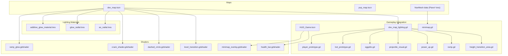
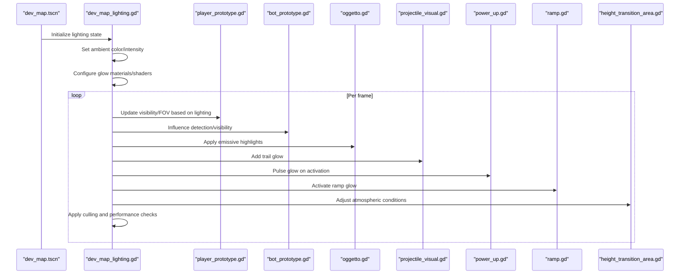
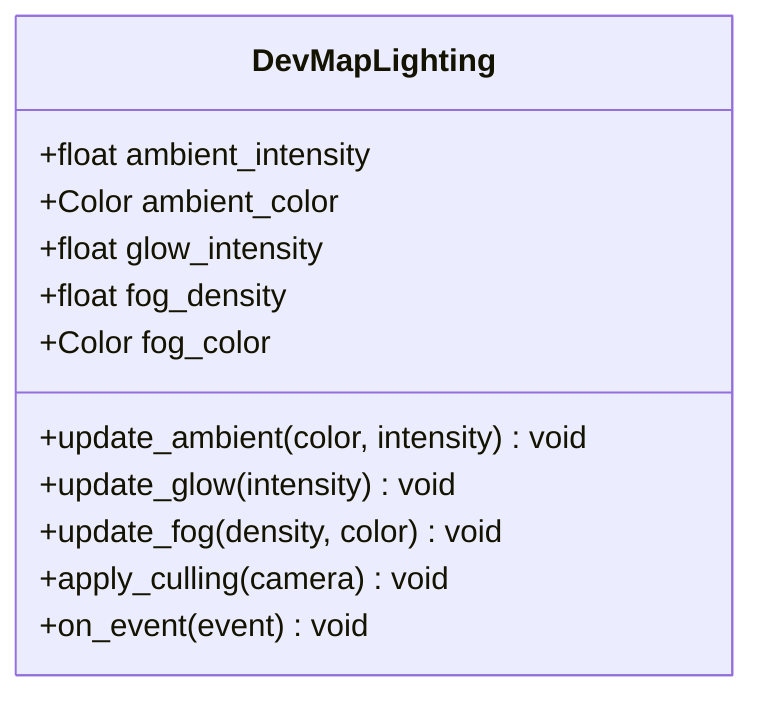
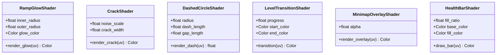
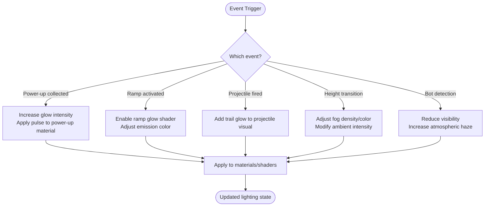
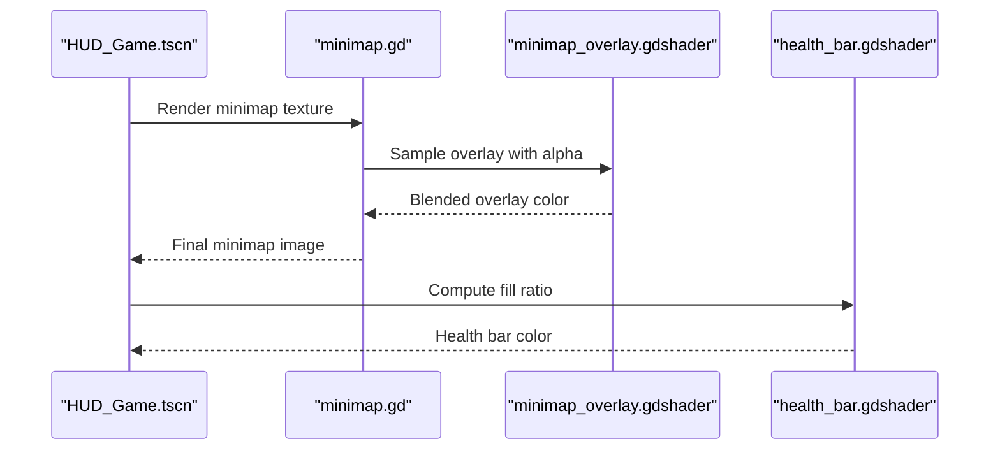
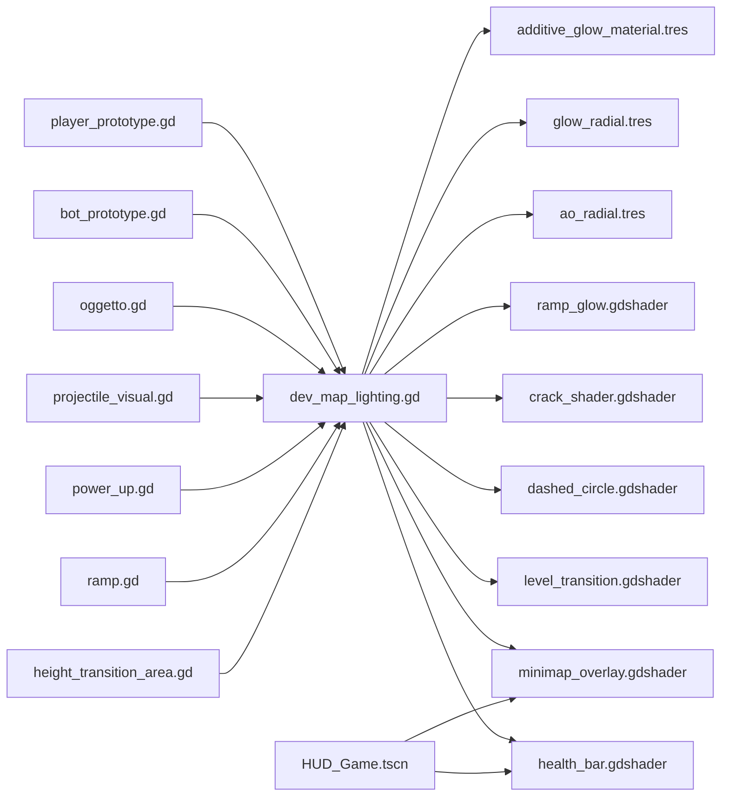

# Lighting and Visual Effects

<cite>
**Referenced Files in This Document**
- [dev_map_lighting.gd](file://Scripts/dev_map_lighting.gd)
- [additive_glow_material.tres](file://Assets/Lighting/additive_glow_material.tres)
- [glow_radial.tres](file://Assets/Lighting/glow_radial.tres)
- [ao_radial.tres](file://Assets/Lighting/ao_radial.tres)
- [ramp_glow.gdshader](file://Shaders/ramp_glow.gdshader)
- [crack_shader.gdshader](file://Shaders/crack_shader.gdshader)
- [dashed_circle.gdshader](file://Shaders/dashed_circle.gdshader)
- [level_transition.gdshader](file://Shaders/level_transition.gdshader)
- [minimap_overlay.gdshader](file://Shaders/HUD/minimap_overlay.gdshader)
- [health_bar.gdshader](file://Shaders/HUD/health_bar.gdshader)
- [dev_map.tscn](file://Maps/dev_map.tscn)
- [pvp_map.tscn](file://Maps/pvp_map.tscn)
- [HUD_Game.tscn](file://Menu/HUD/HUD_Game.tscn)
- [minimap.gd](file://Menu/HUD/minimap.gd)
- [hud_game.gd](file://Menu/HUD/hud_game.gd)
- [player_prototype.gd](file://Scripts/player_prototype.gd)
- [bot_prototype.gd](file://Scripts/bot_prototype.gd)
- [oggetto.gd](file://Scripts/oggetto.gd)
- [projectile_visual.gd](file://Scripts/projectile_visual.gd)
- [power_up.gd](file://Scripts/power_up.gd)
- [ramp.gd](file://Scripts/ramp.gd)
- [height_transition_area.gd](file://Scripts/height_transition_area.gd)
- [mission_manager.gd](file://Scripts/mission_manager.gd)
- [multiplayer_manager.gd](file://Scripts/multiplayer_manager.gd)
- [global_settings.gd](file://Scripts/global_settings.gd)
</cite>

## Table of Contents
1. [Introduction](#introduction)
2. [Project Structure](#project-structure)
3. [Core Components](#core-components)
4. [Architecture Overview](#architecture-overview)
5. [Detailed Component Analysis](#detailed-component-analysis)
6. [Dependency Analysis](#dependency-analysis)
7. [Performance Considerations](#performance-considerations)
8. [Troubleshooting Guide](#troubleshooting-guide)
9. [Conclusion](#conclusion)

## Introduction
This document explains TFA Agents' lighting and visual effects implementation, focusing on the dynamic lighting system used in development maps. It covers ambient lighting, glow effects, atmospheric conditions, and shader-based enhancements. It also documents the lighting script architecture, material properties, and how scene lighting integrates with gameplay elements such as visibility, player experience, and visual storytelling. Guidance is included for light culling, performance optimization, customization for different map themes, and troubleshooting lighting-related performance issues.

## Project Structure
The lighting and visual effects system spans several areas:
- Scene maps define spatial layout and navigation data.
- Materials provide base rendering properties for emissive and ambient occlusion effects.
- Shaders implement procedural glow, crack visuals, dashed circles, transitions, and HUD overlays.
- Scripts orchestrate dynamic lighting behaviors and integrate with gameplay systems.

**Diagram sources**
- [dev_map.tscn](file://Maps/dev_map.tscn)
- [pvp_map.tscn](file://Maps/pvp_map.tscn)
- [dev_map_lighting.gd](file://Scripts/dev_map_lighting.gd)
- [additive_glow_material.tres](file://Assets/Lighting/additive_glow_material.tres)
- [glow_radial.tres](file://Assets/Lighting/glow_radial.tres)
- [ao_radial.tres](file://Assets/Lighting/ao_radial.tres)
- [ramp_glow.gdshader](file://Shaders/ramp_glow.gdshader)
- [crack_shader.gdshader](file://Shaders/crack_shader.gdshader)
- [dashed_circle.gdshader](file://Shaders/dashed_circle.gdshader)
- [level_transition.gdshader](file://Shaders/level_transition.gdshader)
- [minimap_overlay.gdshader](file://Shaders/HUD/minimap_overlay.gdshader)
- [health_bar.gdshader](file://Shaders/HUD/health_bar.gdshader)
- [HUD_Game.tscn](file://Menu/HUD/HUD_Game.tscn)
- [minimap.gd](file://Menu/HUD/minimap.gd)
- [player_prototype.gd](file://Scripts/player_prototype.gd)
- [bot_prototype.gd](file://Scripts/bot_prototype.gd)
- [oggetto.gd](file://Scripts/oggetto.gd)
- [projectile_visual.gd](file://Scripts/projectile_visual.gd)
- [power_up.gd](file://Scripts/power_up.gd)
- [ramp.gd](file://Scripts/ramp.gd)
- [height_transition_area.gd](file://Scripts/height_transition_area.gd)

**Section sources**
- [dev_map.tscn](file://Maps/dev_map.tscn)
- [dev_map_lighting.gd](file://Scripts/dev_map_lighting.gd)

## Core Components
- Dynamic Lighting Controller: Orchestrates ambient lighting, glow intensity, and atmospheric adjustments per frame.
- Materials: Provide base properties for emissive and radial glow effects.
- Shaders: Implement procedural visuals such as ramp glow, crack effects, dashed circles, and HUD overlays.
- Gameplay Integration: Links lighting to player visibility, enemy detection, projectiles, power-ups, ramps, and height transitions.

Key responsibilities:
- Ambient lighting: Adjusts overall scene brightness and color temperature.
- Glow effects: Adds emissive highlights to interactive elements and environmental features.
- Atmospheric conditions: Modulates fog density, color, and visibility range.
- Shader-based enhancements: Provides real-time visual feedback for gameplay events.

**Section sources**
- [dev_map_lighting.gd](file://Scripts/dev_map_lighting.gd)
- [additive_glow_material.tres](file://Assets/Lighting/additive_glow_material.tres)
- [glow_radial.tres](file://Assets/Lighting/glow_radial.tres)
- [ao_radial.tres](file://Assets/Lighting/ao_radial.tres)
- [ramp_glow.gdshader](file://Shaders/ramp_glow.gdshader)
- [minimap_overlay.gdshader](file://Shaders/HUD/minimap_overlay.gdshader)

## Architecture Overview
The lighting system follows a layered approach:
- Scene maps define geometry and navigation.
- Materials and shaders define surface appearance and procedural effects.
- A central lighting controller updates lighting parameters and applies them to materials/shaders.
- Gameplay scripts trigger lighting changes based on events (e.g., power-ups, ramp activation, height transitions).

**Diagram sources**
- [dev_map_lighting.gd](file://Scripts/dev_map_lighting.gd)
- [player_prototype.gd](file://Scripts/player_prototype.gd)
- [bot_prototype.gd](file://Scripts/bot_prototype.gd)
- [oggetto.gd](file://Scripts/oggetto.gd)
- [projectile_visual.gd](file://Scripts/projectile_visual.gd)
- [power_up.gd](file://Scripts/power_up.gd)
- [ramp.gd](file://Scripts/ramp.gd)
- [height_transition_area.gd](file://Scripts/height_transition_area.gd)

## Detailed Component Analysis

### Dynamic Lighting Controller
The lighting controller manages:
- Ambient lighting: Color and intensity for the whole scene.
- Glow effects: Intensity and falloff for emissive materials.
- Atmospheric conditions: Fog density and color for depth perception.
- Culling: Reduces work by limiting lighting updates to visible regions.

**Diagram sources**
- [dev_map_lighting.gd](file://Scripts/dev_map_lighting.gd)

**Section sources**
- [dev_map_lighting.gd](file://Scripts/dev_map_lighting.gd)

### Materials and Surface Properties
- Additive glow material: Base emissive material for glowing objects.
- Glow radial material: Radial falloff for soft edge glows.
- AO radial material: Ambient occlusion for creased and shadowed areas.

Material properties commonly include:
- Albedo/base color
- Emission color and energy
- Normal map influence
- Rim/falloff parameters
- Blend mode (e.g., additive)

These materials are applied to:
- Interactive props (power-ups, ramps)
- Environmental features (walls, ramps)
- Projectiles and weapon effects

**Section sources**
- [additive_glow_material.tres](file://Assets/Lighting/additive_glow_material.tres)
- [glow_radial.tres](file://Assets/Lighting/glow_radial.tres)
- [ao_radial.tres](file://Assets/Lighting/ao_radial.tres)

### Shader-Based Visual Enhancements
- Ramp glow shader: Creates a luminous border effect along ramps for visibility and storytelling.
- Crack shader: Simulates damage or instability visuals.
- Dashed circle shader: Highlights selectable or actionable areas.
- Level transition shader: Smoothly blends scenes during transitions.
- Minimap overlay shader: Renders minimap elements with proper blending.
- Health bar shader: Visual feedback for player status.

**Diagram sources**
- [ramp_glow.gdshader](file://Shaders/ramp_glow.gdshader)
- [crack_shader.gdshader](file://Shaders/crack_shader.gdshader)
- [dashed_circle.gdshader](file://Shaders/dashed_circle.gdshader)
- [level_transition.gdshader](file://Shaders/level_transition.gdshader)
- [minimap_overlay.gdshader](file://Shaders/HUD/minimap_overlay.gdshader)
- [health_bar.gdshader](file://Shaders/HUD/health_bar.gdshader)

**Section sources**
- [ramp_glow.gdshader](file://Shaders/ramp_glow.gdshader)
- [crack_shader.gdshader](file://Shaders/crack_shader.gdshader)
- [dashed_circle.gdshader](file://Shaders/dashed_circle.gdshader)
- [level_transition.gdshader](file://Shaders/level_transition.gdshader)
- [minimap_overlay.gdshader](file://Shaders/HUD/minimap_overlay.gdshader)
- [health_bar.gdshader](file://Shaders/HUD/health_bar.gdshader)

### Integration with Gameplay Elements
Lighting influences:
- Visibility: Players and bots see differently under varying ambient and fog conditions.
- Player experience: Emissive highlights guide interaction points and important areas.
- Visual storytelling: Ramp glow and transition shaders emphasize narrative beats.

**Diagram sources**
- [power_up.gd](file://Scripts/power_up.gd)
- [ramp.gd](file://Scripts/ramp.gd)
- [projectile_visual.gd](file://Scripts/projectile_visual.gd)
- [height_transition_area.gd](file://Scripts/height_transition_area.gd)
- [player_prototype.gd](file://Scripts/player_prototype.gd)
- [bot_prototype.gd](file://Scripts/bot_prototype.gd)
- [dev_map_lighting.gd](file://Scripts/dev_map_lighting.gd)

**Section sources**
- [power_up.gd](file://Scripts/power_up.gd)
- [ramp.gd](file://Scripts/ramp.gd)
- [projectile_visual.gd](file://Scripts/projectile_visual.gd)
- [height_transition_area.gd](file://Scripts/height_transition_area.gd)
- [player_prototype.gd](file://Scripts/player_prototype.gd)
- [bot_prototype.gd](file://Scripts/bot_prototype.gd)
- [dev_map_lighting.gd](file://Scripts/dev_map_lighting.gd)

### HUD and Minimap Lighting
HUD elements use dedicated shaders for overlay rendering:
- Minimap overlay shader: Ensures minimap icons remain readable under varying lighting.
- Health bar shader: Provides clear visual feedback regardless of scene brightness.

**Diagram sources**
- [HUD_Game.tscn](file://Menu/HUD/HUD_Game.tscn)
- [minimap.gd](file://Menu/HUD/minimap.gd)
- [minimap_overlay.gdshader](file://Shaders/HUD/minimap_overlay.gdshader)
- [health_bar.gdshader](file://Shaders/HUD/health_bar.gdshader)

**Section sources**
- [HUD_Game.tscn](file://Menu/HUD/HUD_Game.tscn)
- [minimap.gd](file://Menu/HUD/minimap.gd)
- [minimap_overlay.gdshader](file://Shaders/HUD/minimap_overlay.gdshader)
- [health_bar.gdshader](file://Shaders/HUD/health_bar.gdshader)

## Dependency Analysis
Lighting dependencies across the system:

**Diagram sources**
- [dev_map_lighting.gd](file://Scripts/dev_map_lighting.gd)
- [additive_glow_material.tres](file://Assets/Lighting/additive_glow_material.tres)
- [glow_radial.tres](file://Assets/Lighting/glow_radial.tres)
- [ao_radial.tres](file://Assets/Lighting/ao_radial.tres)
- [ramp_glow.gdshader](file://Shaders/ramp_glow.gdshader)
- [crack_shader.gdshader](file://Shaders/crack_shader.gdshader)
- [dashed_circle.gdshader](file://Shaders/dashed_circle.gdshader)
- [level_transition.gdshader](file://Shaders/level_transition.gdshader)
- [minimap_overlay.gdshader](file://Shaders/HUD/minimap_overlay.gdshader)
- [health_bar.gdshader](file://Shaders/HUD/health_bar.gdshader)
- [HUD_Game.tscn](file://Menu/HUD/HUD_Game.tscn)
- [player_prototype.gd](file://Scripts/player_prototype.gd)
- [bot_prototype.gd](file://Scripts/bot_prototype.gd)
- [oggetto.gd](file://Scripts/oggetto.gd)
- [projectile_visual.gd](file://Scripts/projectile_visual.gd)
- [power_up.gd](file://Scripts/power_up.gd)
- [ramp.gd](file://Scripts/ramp.gd)
- [height_transition_area.gd](file://Scripts/height_transition_area.gd)

**Section sources**
- [dev_map_lighting.gd](file://Scripts/dev_map_lighting.gd)
- [player_prototype.gd](file://Scripts/player_prototype.gd)
- [bot_prototype.gd](file://Scripts/bot_prototype.gd)
- [oggetto.gd](file://Scripts/oggetto.gd)
- [projectile_visual.gd](file://Scripts/projectile_visual.gd)
- [power_up.gd](file://Scripts/power_up.gd)
- [ramp.gd](file://Scripts/ramp.gd)
- [height_transition_area.gd](file://Scripts/height_transition_area.gd)
- [HUD_Game.tscn](file://Menu/HUD/HUD_Game.tscn)

## Performance Considerations
- Light culling: Limit lighting updates to camera-visible regions to reduce shader and material computations.
- Material batching: Group similar materials/shaders to minimize draw calls.
- Shader complexity: Prefer simpler shaders for mobile targets; use advanced effects selectively.
- Dynamic resolution scaling: Lower resolution for lighting passes when necessary.
- Event-driven updates: Only change lighting on meaningful events rather than every frame.
- Fog distance: Reduce fog range in tight indoor spaces to improve performance.
- Glow intensity: Scale down glow energy for less visually demanding scenarios.

[No sources needed since this section provides general guidance]

## Troubleshooting Guide
Common lighting issues and resolutions:
- Flickering glow on moving objects: Verify material UV coordinates and shader uniform updates per frame.
- Excessive CPU/GPU usage: Enable light culling and reduce shader complexity; test with simplified materials.
- Minimap unreadable under bright conditions: Increase overlay alpha or adjust HUD shader tint.
- Inconsistent visibility: Check ambient intensity and fog density ranges; ensure they match gameplay needs.
- Shader artifacts: Validate UV mapping and texture sampling; confirm shader uniforms are set before rendering.

**Section sources**
- [dev_map_lighting.gd](file://Scripts/dev_map_lighting.gd)
- [minimap_overlay.gdshader](file://Shaders/HUD/minimap_overlay.gdshader)
- [health_bar.gdshader](file://Shaders/HUD/health_bar.gdshader)

## Conclusion
TFA Agents employs a modular lighting system combining materials, shaders, and a central controller to deliver dynamic ambient lighting, glow effects, and atmospheric conditions. By integrating lighting with gameplay events and optimizing through culling and selective shader usage, the system enhances visibility, immersion, and visual storytelling while maintaining performance across varied environments.