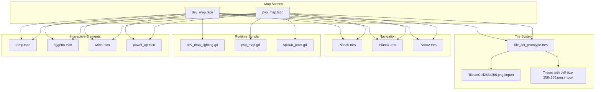
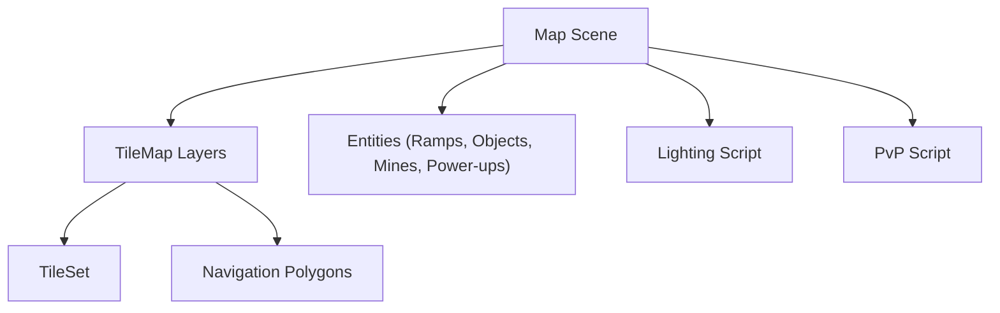
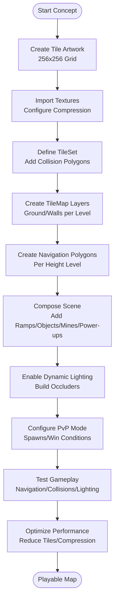
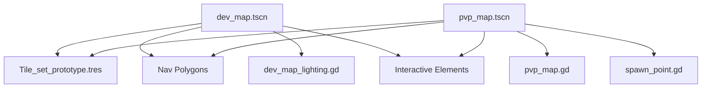

# Map Design Workflow

<cite>
**Referenced Files in This Document**
- [dev_map.tscn](file://Maps/dev_map.tscn)
- [pvp_map.tscn](file://Maps/pvp_map.tscn)
- [Tile_set_prototype.tres](file://Scenes/TileSet/Tile_set_prototype.tres)
- [TilesetCell256x256.png.import](file://Assets/TilesetCell256x256.png.import)
- [Tileset with cell size 256x256.png.import](file://Assets/Tileset with cell size 256x256.png.import)
- [Piano0.tres](file://Maps/Nav1/Piano0.tres)
- [Piano1.tres](file://Maps/Nav1/Piano1.tres)
- [Piano2.tres](file://Maps/Nav1/Piano2.tres)
- [dev_map_lighting.gd](file://Scripts/dev_map_lighting.gd)
- [pvp_map.gd](file://Scripts/pvp_map.gd)
- [spawn_point.gd](file://Scripts/spawn_point.gd)
- [ramp.tscn](file://Scenes/ramp.tscn)
- [oggetto.tscn](file://Game/Oggetti/oggetto.tscn)
- [Mina.tscn](file://Game/Oggetti/Mina.tscn)
- [power_up.tscn](file://Scenes/power_up.tscn)
</cite>

## Table of Contents
1. [Introduction](#introduction)
2. [Project Structure](#project-structure)
3. [Core Components](#core-components)
4. [Architecture Overview](#architecture-overview)
5. [Detailed Component Analysis](#detailed-component-analysis)
6. [Dependency Analysis](#dependency-analysis)
7. [Performance Considerations](#performance-considerations)
8. [Troubleshooting Guide](#troubleshooting-guide)
9. [Conclusion](#conclusion)

## Introduction
This document explains the complete map design workflow for TFA Agents using Godot's TileMap system. It covers tileset creation, layer organization, scene composition, and the differences between development and competitive play maps. You will learn how to build navigable, visually rich maps with proper collision detection, dynamic lighting, and scalable assets suitable for multiple screen resolutions.

## Project Structure
The map system is organized around three primary scenes:
- Development map scene: [dev_map.tscn](file://Maps/dev_map.tscn)
- Competitive play scene: [pvp_map.tscn](file://Maps/pvp_map.tscn)
- Shared tileset definition: [Tile_set_prototype.tres](file://Scenes/TileSet/Tile_set_prototype.tres)

Supporting assets and navigation data include:
- Tileset image import configurations: [TilesetCell256x256.png.import](file://Assets/TilesetCell256x256.png.import), [Tileset with cell size 256x256.png.import](file://Assets/Tileset with cell size 256x256.png.import)
- Navigation polygons for each height level: [Piano0.tres](file://Maps/Nav1/Piano0.tres), [Piano1.tres](file://Maps/Nav1/Piano1.tres), [Piano2.tres](file://Maps/Nav1/Piano2.tres)
- Runtime scripts for lighting and PvP logic: [dev_map_lighting.gd](file://Scripts/dev_map_lighting.gd), [pvp_map.gd](file://Scripts/pvp_map.gd)
- Scene instances for interactive elements: ramps ([ramp.tscn](file://Scenes/ramp.tscn)), destructible objects ([oggetto.tscn](file://Game/Oggetti/oggetto.tscn)), mines ([Mina.tscn](file://Game/Oggetti/Mina.tscn)), power-ups ([power_up.tscn](file://Scenes/power_up.tscn))

**Diagram sources**
- [dev_map.tscn](file://Maps/dev_map.tscn)
- [pvp_map.tscn](file://Maps/pvp_map.tscn)
- [Tile_set_prototype.tres](file://Scenes/TileSet/Tile_set_prototype.tres)
- [TilesetCell256x256.png.import](file://Assets/TilesetCell256x256.png.import)
- [Tileset with cell size 256x256.png.import](file://Assets/Tileset with cell size 256x256.png.import)
- [Piano0.tres](file://Maps/Nav1/Piano0.tres)
- [Piano1.tres](file://Maps/Nav1/Piano1.tres)
- [Piano2.tres](file://Maps/Nav1/Piano2.tres)
- [dev_map_lighting.gd](file://Scripts/dev_map_lighting.gd)
- [pvp_map.gd](file://Scripts/pvp_map.gd)
- [spawn_point.gd](file://Scripts/spawn_point.gd)
- [ramp.tscn](file://Scenes/ramp.tscn)
- [oggetto.tscn](file://Game/Oggetti/oggetto.tscn)
- [Mina.tscn](file://Game/Oggetti/Mina.tscn)
- [power_up.tscn](file://Scenes/power_up.tscn)

**Section sources**
- [dev_map.tscn](file://Maps/dev_map.tscn)
- [pvp_map.tscn](file://Maps/pvp_map.tscn)
- [Tile_set_prototype.tres](file://Scenes/TileSet/Tile_set_prototype.tres)

## Core Components
- TileMap layers: Ground and Walls layers per height level (L0, L1, L2), each with dedicated TileMapLayer nodes and navigation regions.
- TileSet: Centralized tile definitions and collision polygons for all tiles used in the map.
- Navigation: Separate NavigationPolygon resources per height level, linked to TileMap layers via group names.
- Interactive elements: Ramps for vertical movement, destructible objects, mines, and power-ups instantiated under dedicated nodes.
- Lighting: Dynamic shadow occluders built from wall tiles at runtime for each height level.
- PvP logic: Spawning system with team-aware spawn points and win conditions.

**Section sources**
- [dev_map.tscn](file://Maps/dev_map.tscn)
- [Tile_set_prototype.tres](file://Scenes/TileSet/Tile_set_prototype.tres)
- [Piano0.tres](file://Maps/Nav1/Piano0.tres)
- [Piano1.tres](file://Maps/Nav1/Piano1.tres)
- [Piano2.tres](file://Maps/Nav1/Piano2.tres)
- [dev_map_lighting.gd](file://Scripts/dev_map_lighting.gd)
- [pvp_map.gd](file://Scripts/pvp_map.gd)
- [spawn_point.gd](file://Scripts/spawn_point.gd)
- [ramp.tscn](file://Scenes/ramp.tscn)
- [oggetto.tscn](file://Game/Oggetti/oggetto.tscn)
- [Mina.tscn](file://Game/Oggetti/Mina.tscn)
- [power_up.tscn](file://Scenes/power_up.tscn)

## Architecture Overview
The map architecture separates concerns across scenes, tile definitions, navigation, and runtime systems:
- Scenes define the visual layout and entity instances.
- TileSet defines tile geometry and collision shapes.
- NavigationPolygons define walkable areas per height level.
- Scripts handle dynamic lighting and competitive gameplay mechanics.

**Diagram sources**
- [dev_map.tscn](file://Maps/dev_map.tscn)
- [pvp_map.tscn](file://Maps/pvp_map.tscn)
- [Tile_set_prototype.tres](file://Scenes/TileSet/Tile_set_prototype.tres)
- [Piano0.tres](file://Maps/Nav1/Piano0.tres)
- [Piano1.tres](file://Maps/Nav1/Piano1.tres)
- [Piano2.tres](file://Maps/Nav1/Piano2.tres)
- [dev_map_lighting.gd](file://Scripts/dev_map_lighting.gd)
- [pvp_map.gd](file://Scripts/pvp_map.gd)

## Detailed Component Analysis

### TileSet Creation and Tile Definition
- The TileSet resource references a tile atlas and defines collision polygons for each tile. These polygons are used by both rendering and navigation systems.
- Import files configure texture compression and VRAM usage for tile textures.

Key considerations:
- Cell size: The tile atlas uses 256x256 cells. Ensure your tile artwork aligns to this grid.
- Collision polygons: Each tile shape should have accurate collision polygons for predictable physics and navigation.
- Texture import settings: Compression and mipmaps affect performance and visual quality.

**Section sources**
- [Tile_set_prototype.tres](file://Scenes/TileSet/Tile_set_prototype.tres)
- [TilesetCell256x256.png.import](file://Assets/TilesetCell256x256.png.import)
- [Tileset with cell size 256x256.png.import](file://Assets/Tileset with cell size 256x256.png.import)

### Layer Organization and Scene Composition
Each height level (L0, L1, L2) follows a consistent structure:
- Node hierarchy: A Level node contains two TileMapLayer children: Ground and Walls.
- Ground layer: Rendered beneath entities, often with y-sort enabled for pseudo-3D effects.
- Walls layer: Rendered above ground, with use_kinematic_bodies enabled to act as collision for the TileMap.
- NavigationRegion2D: Links to a NavigationPolygon resource for that level and sets navigation_layers for multi-level support.

Scene composition tips:
- Keep z-index ordering consistent across levels to avoid overlap issues.
- Use y_sort_enabled on upper layers to maintain depth sorting.
- Group tiles by source geometry to enable navigation parsing per level.

**Section sources**
- [dev_map.tscn](file://Maps/dev_map.tscn)
- [pvp_map.tscn](file://Maps/pvp_map.tscn)

### Navigation Setup and Multi-Level Support
- Navigation polygons are parsed per level using source_geometry_mode and source_geometry_group_name to match TileMap layers.
- Each NavigationPolygon resource defines vertices, polygons, outlines, and parsed_collision_mask for efficient pathfinding.
- Navigation layers are configured per level to enable agent movement between heights.

Best practices:
- Align TileMap tiles precisely with navigation polygons to prevent clipping.
- Use distinct collision masks per level to control agent traversal.
- Keep cell_size consistent across levels for uniform pathfinding performance.

**Section sources**
- [Piano0.tres](file://Maps/Nav1/Piano0.tres)
- [Piano1.tres](file://Maps/Nav1/Piano1.tres)
- [Piano2.tres](file://Maps/Nav1/Piano2.tres)
- [dev_map.tscn](file://Maps/dev_map.tscn)
- [pvp_map.tscn](file://Maps/pvp_map.tscn)

### Dynamic Lighting and Shadow Occluders
The lighting system dynamically builds occluders from wall tiles at runtime:
- Scans each TileMapLayer for used cells and extracts collision polygons.
- Creates LightOccluder2D nodes grouped by level for visibility culling.
- Connects to player height level changes to show occluders for the current floor.

Implementation highlights:
- Occluder containers are named consistently per level.
- Polygon culling is disabled to preserve detail.
- Player tracking ensures occluders update when the player moves between levels.

**Section sources**
- [dev_map_lighting.gd](file://Scripts/dev_map_lighting.gd)
- [dev_map.tscn](file://Maps/dev_map.tscn)

### Development vs. Competitive Play Maps
- Development map (dev_map.tscn): Includes tutorial nodes, bots, and development UI for iteration and testing.
- Competitive map (pvp_map.tscn): Removes development-specific nodes, initializes a MultiplayerSpawner, and configures team-based spawn points.

Key differences:
- Entities: Development scenes include bots and tutorial nodes; competitive scenes spawn real players.
- Spawning: PvP map uses SpawnPoint nodes with team_id and height_level to place players.
- Win conditions: PvP map tracks kills and ends matches when targets are reached.

**Section sources**
- [dev_map.tscn](file://Maps/dev_map.tscn)
- [pvp_map.tscn](file://Maps/pvp_map.tscn)
- [pvp_map.gd](file://Scripts/pvp_map.gd)
- [spawn_point.gd](file://Scripts/spawn_point.gd)

### Interactive Elements and Asset Placement
- Ramps: Vertical connectors between levels with collision masks controlling arrival levels.
- Destructible objects: Static bodies with animated explosion sequences and particle effects.
- Mines: Area2D with collision layers and masks for team-specific placement.
- Power-ups: Collectible items with animations and light effects.

Guidelines:
- Place ramps where agents need to traverse between levels.
- Use destructible objects sparingly to avoid performance impact.
- Position mines and power-ups to encourage tactical positioning.

**Section sources**
- [ramp.tscn](file://Scenes/ramp.tscn)
- [oggetto.tscn](file://Game/Oggetti/oggetto.tscn)
- [Mina.tscn](file://Game/Oggetti/Mina.tscn)
- [power_up.tscn](file://Scenes/power_up.tscn)
- [dev_map.tscn](file://Maps/dev_map.tscn)
- [pvp_map.tscn](file://Maps/pvp_map.tscn)

### Practical Workflow: From Concept to Playable Implementation
Step-by-step process:
1. Design tile artwork aligned to 256x256 grid and import textures.
2. Create TileSet resource with collision polygons for each tile.
3. Build base TileMap layers (Ground/Walls) per height level.
4. Add NavigationPolygon resources per level and link to TileMap layers via group names.
5. Compose scene: add ramps, destructible objects, mines, and power-ups.
6. Configure lighting script to build occluders from wall tiles.
7. For PvP: replace development nodes, add SpawnPoint markers, and wire up MultiplayerSpawner.
8. Test navigation, collisions, and lighting across levels.
9. Optimize performance by reducing tile count, simplifying collision polygons, and adjusting texture compression.

[No sources needed since this diagram shows conceptual workflow, not actual code structure]

## Dependency Analysis
The map system exhibits clear separation of concerns:
- Scenes depend on TileSet and Navigation resources.
- Lighting script depends on TileMap layers and player height level.
- PvP script depends on spawn points and multiplayer manager.
- Interactive elements depend on shared scripts and collision shapes.

**Diagram sources**
- [dev_map.tscn](file://Maps/dev_map.tscn)
- [pvp_map.tscn](file://Maps/pvp_map.tscn)
- [Tile_set_prototype.tres](file://Scenes/TileSet/Tile_set_prototype.tres)
- [Piano0.tres](file://Maps/Nav1/Piano0.tres)
- [Piano1.tres](file://Maps/Nav1/Piano1.tres)
- [Piano2.tres](file://Maps/Nav1/Piano2.tres)
- [dev_map_lighting.gd](file://Scripts/dev_map_lighting.gd)
- [pvp_map.gd](file://Scripts/pvp_map.gd)
- [spawn_point.gd](file://Scripts/spawn_point.gd)

**Section sources**
- [dev_map.tscn](file://Maps/dev_map.tscn)
- [pvp_map.tscn](file://Maps/pvp_map.tscn)
- [Tile_set_prototype.tres](file://Scenes/TileSet/Tile_set_prototype.tres)
- [dev_map_lighting.gd](file://Scripts/dev_map_lighting.gd)
- [pvp_map.gd](file://Scripts/pvp_map.gd)
- [spawn_point.gd](file://Scripts/spawn_point.gd)

## Performance Considerations
- Tile resolution: 256x256 tiles reduce draw batching overhead while maintaining detail.
- Texture compression: Adjust lossy quality and VRAM settings to balance fidelity and memory usage.
- Collision simplification: Use fewer and simpler polygons per tile to improve navigation and physics performance.
- Dynamic lighting: Occluders are built at runtime; keep wall tile counts reasonable to avoid excessive occluder generation.
- Entity density: Limit the number of interactive elements (destructibles, mines, power-ups) in high-traffic areas.
- Screen scaling: Use viewport scaling and camera controls to adapt visuals across resolutions without changing tile assets.

[No sources needed since this section provides general guidance]

## Troubleshooting Guide
Common issues and solutions:
- Navigation errors: Ensure NavigationPolygon resources match TileMap layer geometry and group names. Verify parsed_collision_mask and cell_size.
- Lighting not updating: Confirm the lighting script runs after scene load and that occluder containers are properly named per level.
- Spawn issues in PvP: Check SpawnPoint nodes for correct team_id and height_level. Verify MultiplayerSpawner spawn paths and authority assignment.
- Collision overlaps: Review collision masks and ensure TileMap walls use kinematic bodies where appropriate.
- Visual glitches: Re-export tile textures with correct compression settings and disable mipmaps if needed.

**Section sources**
- [dev_map_lighting.gd](file://Scripts/dev_map_lighting.gd)
- [pvp_map.gd](file://Scripts/pvp_map.gd)
- [spawn_point.gd](file://Scripts/spawn_point.gd)
- [Piano0.tres](file://Maps/Nav1/Piano0.tres)
- [Piano1.tres](file://Maps/Nav1/Piano1.tres)
- [Piano2.tres](file://Maps/Nav1/Piano2.tres)

## Conclusion
By following this workflow—designing tiles, organizing layers, setting up navigation, composing interactive elements, and enabling dynamic lighting—you can create robust, scalable maps for both development and competitive play. The modular structure allows easy iteration and performance tuning across different screen resolutions and gameplay modes.