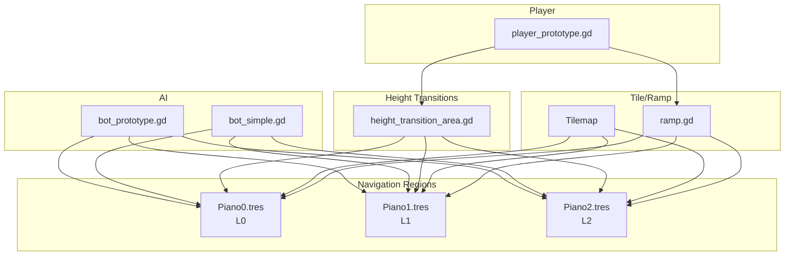
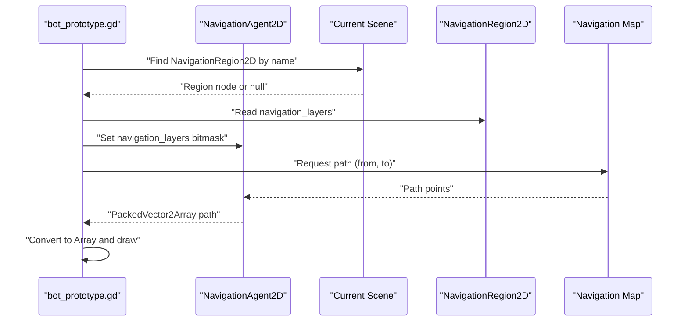
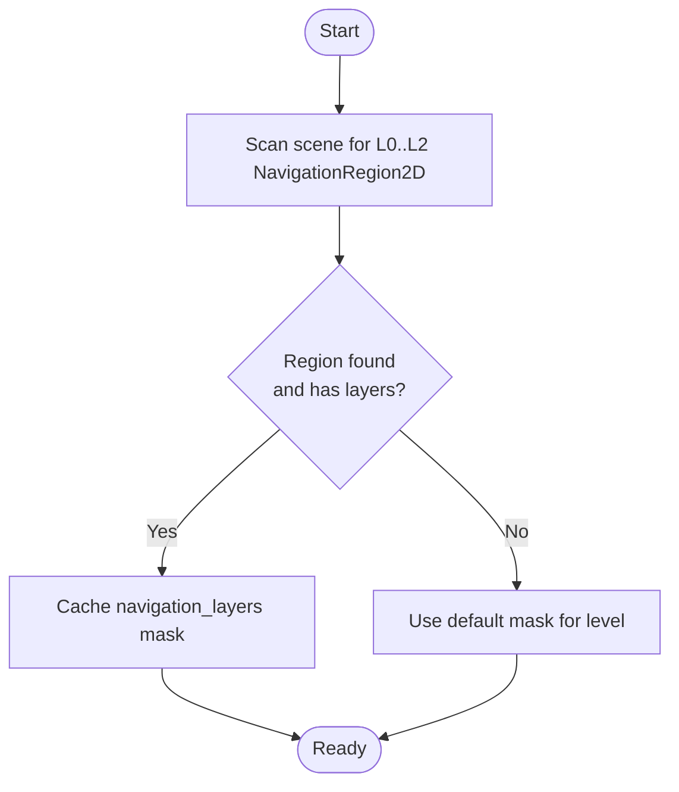
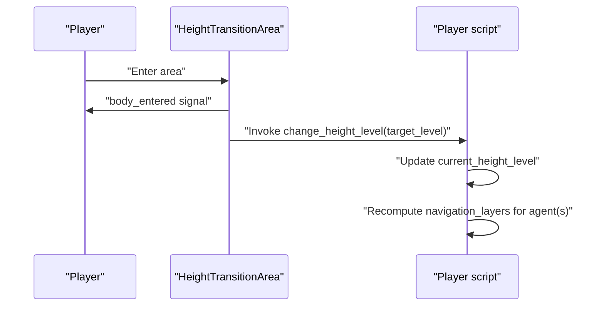
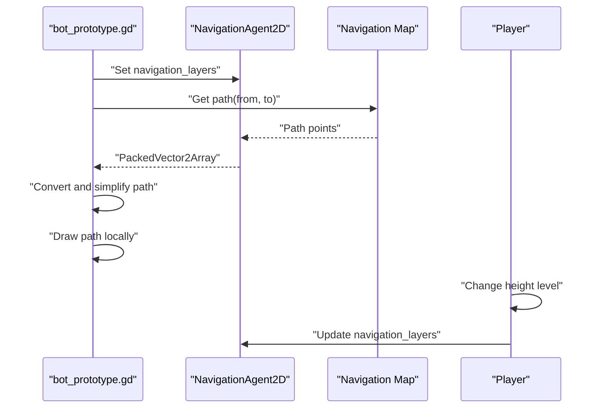
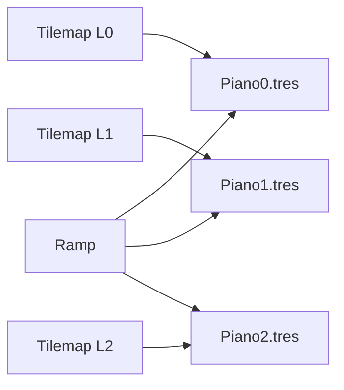
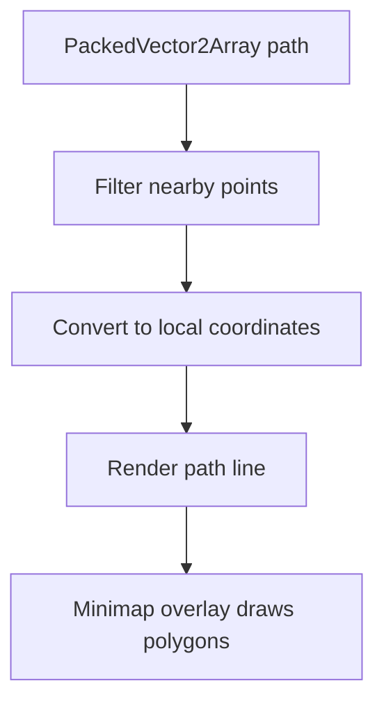
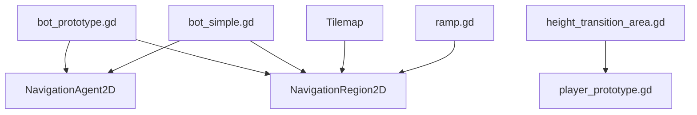

# Navigation and Pathfinding

<cite>
**Referenced Files in This Document**
- [bot_prototype.gd](file://Scripts/bot_prototype.gd)
- [bot_simple.gd](file://Scripts/bot_simple.gd)
- [height_transition_area.gd](file://Scripts/height_transition_area.gd)
- [Piano0.tres](file://Maps/Nav1/Piano0.tres)
- [Piano1.tres](file://Maps/Nav1/Piano1.tres)
- [Piano2.tres](file://Maps/Nav1/Piano2.tres)
- [player_prototype.gd](file://Scripts/player_prototype.gd)
- [ramp.gd](file://Scripts/ramp.gd)
- [pvp_map.gd](file://Scripts/pvp_map.gd)
- [minimap.gd](file://Menu/HUD/minimap.gd)
</cite>

## Table of Contents
1. [Introduction](#introduction)
2. [Project Structure](#project-structure)
3. [Core Components](#core-components)
4. [Architecture Overview](#architecture-overview)
5. [Detailed Component Analysis](#detailed-component-analysis)
6. [Dependency Analysis](#dependency-analysis)
7. [Performance Considerations](#performance-considerations)
8. [Troubleshooting Guide](#troubleshooting-guide)
9. [Conclusion](#conclusion)

## Introduction
This document explains the navigation mesh system and pathfinding implementation used by TFA Agents. It focuses on the multi-layered navigation architecture with three levels (L0, L1, L2), how navigation polygons are generated and optimized, and how tilemap layers relate to navigation regions. It also documents the integration with player movement, AI pathfinding, and height transition mechanics, including configuration tips and troubleshooting for common pathfinding issues.

## Project Structure
The navigation system spans several scenes and scripts:
- Navigation regions are defined as Godot NavigationRegion2D resources and named after levels (e.g., L0_NavigationRegion2D).
- AI bots (bot_prototype.gd and bot_simple.gd) use NavigationAgent2D to compute paths and restrict visibility to the current height level.
- Height transitions are handled via HeightTransitionArea nodes that switch agents to different navigation layers.
- Tilemaps and ramps contribute to walkable surfaces and height changes.

**Diagram sources**
- [Piano0.tres](file://Maps/Nav1/Piano0.tres)
- [Piano1.tres](file://Maps/Nav1/Piano1.tres)
- [Piano2.tres](file://Maps/Nav1/Piano2.tres)
- [bot_prototype.gd](file://Scripts/bot_prototype.gd)
- [bot_simple.gd](file://Scripts/bot_simple.gd)
- [height_transition_area.gd](file://Scripts/height_transition_area.gd)
- [player_prototype.gd](file://Scripts/player_prototype.gd)
- [ramp.gd](file://Scripts/ramp.gd)

**Section sources**
- [Piano0.tres](file://Maps/Nav1/Piano0.tres)
- [Piano1.tres](file://Maps/Nav1/Piano1.tres)
- [Piano2.tres](file://Maps/Nav1/Piano2.tres)
- [bot_prototype.gd](file://Scripts/bot_prototype.gd)
- [bot_simple.gd](file://Scripts/bot_simple.gd)
- [height_transition_area.gd](file://Scripts/height_transition_area.gd)
- [player_prototype.gd](file://Scripts/player_prototype.gd)
- [ramp.gd](file://Scripts/ramp.gd)

## Core Components
- NavigationRegion2D resources define walkable areas per level. The project includes L0, L1, and L2 regions loaded from the Nav1 folder.
- NavigationAgent2D instances in AI scripts compute paths and filter by navigation_layers to match the current height level.
- HeightTransitionArea nodes route players between levels by invoking a method on the colliding body to switch height level.
- Tilemaps and ramps provide geometry that contributes to navigation meshes and height transitions.

Key responsibilities:
- Layer resolution: bots resolve the navigation layer mask for the current height level and apply it to their NavigationAgent2D.
- Region discovery: bots scan the scene for named NavigationRegion2D nodes and cache their navigation_layers masks.
- Height-aware path drawing: bots draw the computed path in local coordinates relative to their own position.

**Section sources**
- [bot_prototype.gd](file://Scripts/bot_prototype.gd)
- [bot_simple.gd](file://Scripts/bot_simple.gd)
- [height_transition_area.gd](file://Scripts/height_transition_area.gd)
- [Piano0.tres](file://Maps/Nav1/Piano0.tres)
- [Piano1.tres](file://Maps/Nav1/Piano1.tres)
- [Piano2.tres](file://Maps/Nav1/Piano2.tres)

## Architecture Overview
The navigation architecture is layered and height-aware:
- Three distinct navigation maps correspond to L0, L1, and L2.
- AI pathfinding queries are constrained to the current level’s navigation_layers bitmask.
- Players trigger height transitions via HeightTransitionArea, which calls a method on the player to update current height level.
- Tilemaps and ramps define the geometry that populates each level’s navigation mesh.

**Diagram sources**
- [bot_prototype.gd](file://Scripts/bot_prototype.gd)
- [Piano0.tres](file://Maps/Nav1/Piano0.tres)
- [Piano1.tres](file://Maps/Nav1/Piano1.tres)
- [Piano2.tres](file://Maps/Nav1/Piano2.tres)

## Detailed Component Analysis

### Multi-Layered Navigation and Level Management
- Level naming convention: bots expect NavigationRegion2D nodes named after levels (e.g., L0_NavigationRegion2D).
- Layer mask caching: bots discover regions at startup and cache navigation_layers bitmasks per level, falling back to a default mask derived from the level index if a region is missing or has zero layers.
- Current level enforcement: bots set navigation_agent.navigation_layers to the mask for the current height level before requesting paths.

**Diagram sources**
- [bot_prototype.gd](file://Scripts/bot_prototype.gd)
- [bot_simple.gd](file://Scripts/bot_simple.gd)

**Section sources**
- [bot_prototype.gd](file://Scripts/bot_prototype.gd)
- [bot_simple.gd](file://Scripts/bot_simple.gd)

### Navigation Polygon Generation and Optimization
- Navigation meshes are generated from tilemaps and collision shapes present in each level’s scene.
- Optimization strategies observed in scripts:
  - Reduce path point density by filtering consecutive points closer than a small threshold during path visualization.
  - Clamp target height level to valid bounds when computing paths to avoid cross-level requests.
  - Use acceptance distance checks to detect when a path does not reach the requested destination within tolerance.

These behaviors imply that:
- The underlying navigation system builds convex polygons from tile collisions and ramps.
- Post-processing reduces visual clutter by simplifying the raw path polyline.

**Section sources**
- [bot_simple.gd](file://Scripts/bot_simple.gd)
- [bot_prototype.gd](file://Scripts/bot_prototype.gd)

### Height Transition Mechanics
- HeightTransitionArea defines a target level and triggers a height change on bodies that implement a specific method.
- Player movement scripts coordinate with transitions to update current height level, ensuring pathfinding remains consistent with the new level.

**Diagram sources**
- [height_transition_area.gd](file://Scripts/height_transition_area.gd)
- [player_prototype.gd](file://Scripts/player_prototype.gd)

**Section sources**
- [height_transition_area.gd](file://Scripts/height_transition_area.gd)
- [player_prototype.gd](file://Scripts/player_prototype.gd)

### Integration with Player Movement and AI Pathfinding
- AI bots:
  - Compute paths using NavigationAgent2D and convert the resulting PackedVector2Array to an Array for visualization.
  - Draw the path locally relative to the bot’s position to render a smooth line on screen.
  - Respect current height level by setting navigation_layers before querying paths.
- Player:
  - Coordinates with height transitions to remain aligned with the navigation map for the current level.

**Diagram sources**
- [bot_prototype.gd](file://Scripts/bot_prototype.gd)
- [player_prototype.gd](file://Scripts/player_prototype.gd)

**Section sources**
- [bot_prototype.gd](file://Scripts/bot_prototype.gd)
- [player_prototype.gd](file://Scripts/player_prototype.gd)

### Relationship Between Tilemap Layers and Navigation Regions
- Each level’s tilemap contributes walkable geometry to its corresponding NavigationRegion2D.
- Ramps (ramp.gd) introduce height changes and influence navigation connectivity between levels.
- The Nav1 resources (Piano0.tres, Piano1.tres, Piano2.tres) represent the navigation meshes for each level.

**Diagram sources**
- [Piano0.tres](file://Maps/Nav1/Piano0.tres)
- [Piano1.tres](file://Maps/Nav1/Piano1.tres)
- [Piano2.tres](file://Maps/Nav1/Piano2.tres)
- [ramp.gd](file://Scripts/ramp.gd)

**Section sources**
- [Piano0.tres](file://Maps/Nav1/Piano0.tres)
- [Piano1.tres](file://Maps/Nav1/Piano1.tres)
- [Piano2.tres](file://Maps/Nav1/Piano2.tres)
- [ramp.gd](file://Scripts/ramp.gd)

### Path Visualization and Minimap Integration
- Bots simplify and draw the computed path locally for visual feedback.
- The minimap draws colored polygons for debug overlays, complementing path visualization.

**Diagram sources**
- [bot_simple.gd](file://Scripts/bot_simple.gd)
- [minimap.gd](file://Menu/HUD/minimap.gd)

**Section sources**
- [bot_simple.gd](file://Scripts/bot_simple.gd)
- [minimap.gd](file://Menu/HUD/minimap.gd)

## Dependency Analysis
- bot_prototype.gd and bot_simple.gd both depend on:
  - NavigationRegion2D discovery and caching of navigation_layers bitmasks.
  - NavigationAgent2D for path computation.
  - Height-aware path drawing and simplification.
- HeightTransitionArea depends on player scripts implementing a height change method.
- Tilemaps and ramps feed geometry into the navigation meshes for each level.

**Diagram sources**
- [bot_prototype.gd](file://Scripts/bot_prototype.gd)
- [bot_simple.gd](file://Scripts/bot_simple.gd)
- [height_transition_area.gd](file://Scripts/height_transition_area.gd)
- [player_prototype.gd](file://Scripts/player_prototype.gd)
- [ramp.gd](file://Scripts/ramp.gd)

**Section sources**
- [bot_prototype.gd](file://Scripts/bot_prototype.gd)
- [bot_simple.gd](file://Scripts/bot_simple.gd)
- [height_transition_area.gd](file://Scripts/height_transition_area.gd)
- [player_prototype.gd](file://Scripts/player_prototype.gd)
- [ramp.gd](file://Scripts/ramp.gd)

## Performance Considerations
- Layer filtering: Set navigation_agent.navigation_layers to the current level’s mask to avoid cross-level path queries and reduce unnecessary computations.
- Path simplification: Filter nearby points during visualization to minimize rendering overhead and improve readability.
- Region caching: Discover and cache navigation_layers once per level at startup to avoid repeated scene traversal.
- Large maps: Keep tilemaps and ramps well-aligned to reduce fragmentation in navigation meshes. Prefer fewer, larger collision shapes over many small ones where possible.

## Troubleshooting Guide
Common issues and resolutions:
- No path returned or long paths:
  - Verify that the target is within the same level’s navigation region.
  - Confirm navigation_layers is set to the current level before requesting paths.
  - Check that NavigationRegion2D nodes exist and have non-zero navigation_layers.
- Path does not reach destination:
  - Adjust acceptance distance thresholds for the bot or ramp to ensure the final segment meets the target.
  - Validate that ramps and tile edges align properly to maintain connectivity.
- Cross-level pathfinding:
  - Ensure HeightTransitionArea invokes the player’s height change method and that navigation_layers updates accordingly.
  - Confirm that bots clamp target height levels to valid indices before path requests.
- Debugging aids:
  - Enable debug_pathfinding flags in bot scripts to log navigation region discovery and layer assignments.
  - Visualize paths locally and overlay colored polygons on the minimap for quick verification.

**Section sources**
- [bot_prototype.gd](file://Scripts/bot_prototype.gd)
- [bot_simple.gd](file://Scripts/bot_simple.gd)
- [height_transition_area.gd](file://Scripts/height_transition_area.gd)

## Conclusion
TFA Agents employs a layered navigation system with explicit L0, L1, and L2 regions, integrated tightly with AI pathfinding and height transitions. By constraining pathfinding to the current level’s navigation_layers, simplifying paths for visualization, and coordinating height changes via dedicated transition areas, the system supports scalable and maintainable movement mechanics across complex, multi-level environments.