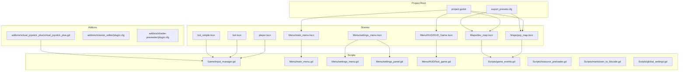
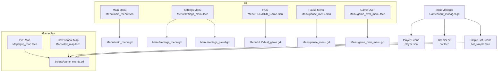
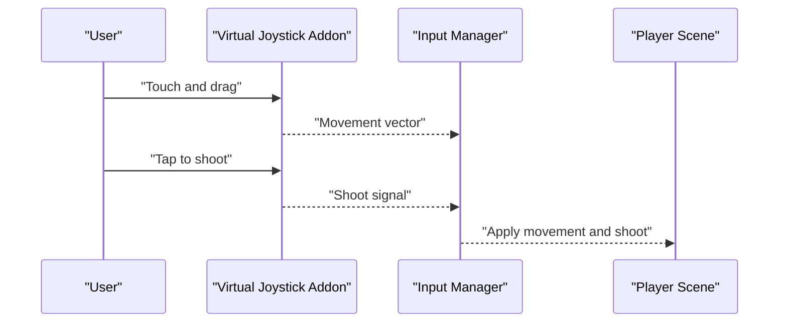
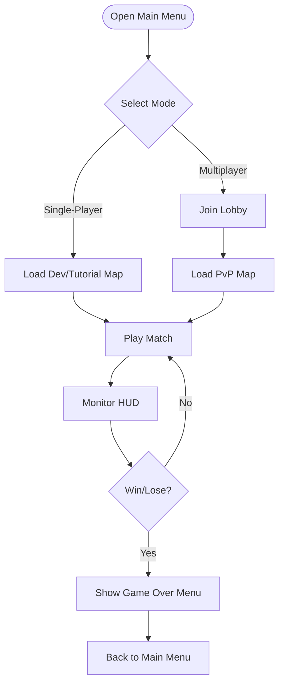

# Getting Started

<cite>
**Referenced Files in This Document**
- [project.godot](file://project.godot)
- [export_presets.cfg](file://export_presets.cfg)
- [InputManager.tscn](file://Game/InputManager.tscn)
- [input_manager.gd](file://Game/input_manager.gd)
- [main_menu.tscn](file://Menu/main_menu.tscn)
- [main_menu.gd](file://Menu/main_menu.gd)
- [settings_menu.tscn](file://Menu/settings_menu.tscn)
- [settings_menu.gd](file://Menu/settings_menu.gd)
- [settings_panel.tscn](file://Menu/settings_panel.tscn)
- [settings_panel.gd](file://Menu/settings_panel.gd)
- [HUD_Game.tscn](file://Menu/HUD/HUD_Game.tscn)
- [hud_game.gd](file://Menu/HUD/hud_game.gd)
- [pause_menu.tscn](file://Menu/pause_menu.tscn)
- [pause_menu.gd](file://Menu/pause_menu.gd)
- [game_over_menu.tscn](file://Menu/game_over_menu.tscn)
- [game_over_menu.gd](file://Menu/game_over_menu.gd)
- [multiplayer_menu.tscn](file://Menu/multiplayer_menu.tscn)
- [multiplayer_menu.gd](file://Menu/multiplayer_menu.gd)
- [lobby.tscn](file://Menu/lobby.tscn)
- [lobby.gd](file://Menu/lobby.gd)
- [pvp_map.tscn](file://Maps/pvp_map.tscn)
- [dev_map.tscn](file://Maps/dev_map.tscn)
- [player.tscn](file://player.tscn)
- [bot.tscn](file://bot.tscn)
- [bot_simple.tscn](file://bot_simple.tscn)
- [virtual_joystick_plus.gd](file://addons/virtual_joystick_plus/virtual_joystick_plus.gd)
- [plugin.cfg](file://addons/virtual_joystick_plus/plugin.cfg)
- [global_settings.gd](file://Scripts/global_settings.gd)
- [game_events.gd](file://Scripts/game_events.gd)
- [resource_preloader.gd](file://Scripts/resource_preloader.gd)
- [markdown_to_bbcode.gd](file://Scripts/markdown_to_bbcode.gd)
- [mission_editor/plugin.cfg](file://addons/mission_editor/plugin.cfg)
- [shader-previewer/plugin.cfg](file://addons/shader-previewer/plugin.cfg)
</cite>

## Table of Contents
1. [Introduction](#introduction)
2. [Project Structure](#project-structure)
3. [Core Components](#core-components)
4. [Architecture Overview](#architecture-overview)
5. [Installation and Setup](#installation-and-setup)
6. [Initial Project Configuration](#initial-project-configuration)
7. [First Launch Procedures](#first-launch-procedures)
8. [Basic Controls Tutorial](#basic-controls-tutorial)
9. [Main Menu Navigation](#main-menu-navigation)
10. [Basic Gameplay Loop](#basic-gameplay-loop)
11. [Essential Settings Configuration](#essential-settings-configuration)
12. [Troubleshooting Guide](#troubleshooting-guide)
13. [System Requirements Verification](#system-requirements-verification)
14. [Conclusion](#conclusion)

## Introduction
TFA Agents is a 2D action game built with the Godot Engine. This guide helps you install, configure, and play the game across Windows desktop and mobile devices. It covers prerequisites, platform-specific setup, initial configuration, first launch, controls, menus, gameplay basics, settings, and troubleshooting.

## Project Structure
The project follows a modular Godot layout:
- Scenes define gameplay areas and UI (e.g., main menus, HUD, maps)
- Scripts implement behaviors for players, bots, events, and settings
- Assets include animations, audio, tilesets, weapons, and UI themes
- Addons provide reusable tools (e.g., virtual joystick for mobile, mission editor, shader previewer)
- Export presets define build targets and versions

**Diagram sources**
- [project.godot](file://project.godot)
- [export_presets.cfg](file://export_presets.cfg)
- [main_menu.tscn](file://Menu/main_menu.tscn)
- [settings_menu.tscn](file://Menu/settings_menu.tscn)
- [HUD_Game.tscn](file://Menu/HUD/HUD_Game.tscn)
- [pvp_map.tscn](file://Maps/pvp_map.tscn)
- [dev_map.tscn](file://Maps/dev_map.tscn)
- [player.tscn](file://player.tscn)
- [bot.tscn](file://bot.tscn)
- [bot_simple.tscn](file://bot_simple.tscn)
- [input_manager.gd](file://Game/input_manager.gd)
- [main_menu.gd](file://Menu/main_menu.gd)
- [settings_menu.gd](file://Menu/settings_menu.gd)
- [settings_panel.gd](file://Menu/settings_panel.gd)
- [hud_game.gd](file://Menu/HUD/hud_game.gd)
- [game_events.gd](file://Scripts/game_events.gd)
- [resource_preloader.gd](file://Scripts/resource_preloader.gd)
- [markdown_to_bbcode.gd](file://Scripts/markdown_to_bbcode.gd)
- [global_settings.gd](file://Scripts/global_settings.gd)
- [virtual_joystick_plus.gd](file://addons/virtual_joystick_plus/virtual_joystick_plus.gd)
- [plugin.cfg](file://addons/virtual_joystick_plus/plugin.cfg)
- [mission_editor/plugin.cfg](file://addons/mission_editor/plugin.cfg)
- [shader-previewer/plugin.cfg](file://addons/shader-previewer/plugin.cfg)

**Section sources**
- [project.godot](file://project.godot)
- [export_presets.cfg](file://export_presets.cfg)

## Core Components
- Input Manager: Centralizes input handling for keyboard/mouse and mobile touch
- Menus: Main menu, settings, pause, game over, multiplayer, and lobby
- HUD: Health bar, minimap, and mission panel overlays
- Maps: PvP arena and development/tutorial map
- Player/Bots: Character scenes with movement and AI behaviors
- Global Systems: Settings, event handling, resource preloading, and localization helpers

**Section sources**
- [input_manager.gd](file://Game/input_manager.gd)
- [main_menu.gd](file://Menu/main_menu.gd)
- [settings_menu.gd](file://Menu/settings_menu.gd)
- [hud_game.gd](file://Menu/HUD/hud_game.gd)
- [game_events.gd](file://Scripts/game_events.gd)
- [global_settings.gd](file://Scripts/global_settings.gd)

## Architecture Overview
The game uses a scene-graph architecture typical of Godot projects:
- Scenes instantiate scripts to manage behavior
- Input flows through a central manager script
- Settings and global state are managed via dedicated scripts
- UI scenes are separate from gameplay scenes and communicate via signals/events

**Diagram sources**
- [input_manager.gd](file://Game/input_manager.gd)
- [player.tscn](file://player.tscn)
- [bot.tscn](file://bot.tscn)
- [bot_simple.tscn](file://bot_simple.tscn)
- [main_menu.tscn](file://Menu/main_menu.tscn)
- [main_menu.gd](file://Menu/main_menu.gd)
- [settings_menu.tscn](file://Menu/settings_menu.tscn)
- [settings_menu.gd](file://Menu/settings_menu.gd)
- [settings_panel.tscn](file://Menu/settings_panel.tscn)
- [settings_panel.gd](file://Menu/settings_panel.gd)
- [HUD_Game.tscn](file://Menu/HUD/HUD_Game.tscn)
- [hud_game.gd](file://Menu/HUD/hud_game.gd)
- [pause_menu.tscn](file://Menu/pause_menu.tscn)
- [pause_menu.gd](file://Menu/pause_menu.gd)
- [game_over_menu.tscn](file://Menu/game_over_menu.tscn)
- [game_over_menu.gd](file://Menu/game_over_menu.gd)
- [pvp_map.tscn](file://Maps/pvp_map.tscn)
- [dev_map.tscn](file://Maps/dev_map.tscn)
- [game_events.gd](file://Scripts/game_events.gd)

## Installation and Setup
Follow these steps to install and run TFA Agents on supported platforms.

### Prerequisites
- Godot Engine: The project is configured for a specific engine version. Verify the engine version in the project settings.
- Operating systems: Windows desktop and Android mobile are supported via export presets.

**Section sources**
- [project.godot](file://project.godot)
- [export_presets.cfg](file://export_presets.cfg)

### Windows Desktop Setup
1. Open the project in the Godot Editor using the project file.
2. Ensure the editor version matches the project’s engine requirement.
3. Press the "Run" button to launch the game in the editor.

### Mobile (Android) Setup
1. Install the Android export template in the Godot Editor if not present.
2. Configure Android signing keys in the export presets.
3. Export the project for Android using the export presets.
4. Install the generated APK on your device and launch the app.

**Section sources**
- [export_presets.cfg](file://export_presets.cfg)

## Initial Project Configuration
Configure the project to match your environment and preferences.

### Project Settings
- Engine version: Confirm compatibility with the project’s engine requirement.
- Application version: Matches the export preset version.
- Scenes: Set the main scene to the intended entry point (e.g., main menu).

**Section sources**
- [project.godot](file://project.godot)
- [export_presets.cfg](file://export_presets.cfg)

### Input Remapping (Optional)
- Adjust input actions for keyboard and mouse in the Input Map.
- For mobile, ensure the virtual joystick addon is enabled and configured.

**Section sources**
- [InputManager.tscn](file://Game/InputManager.tscn)
- [input_manager.gd](file://Game/input_manager.gd)
- [plugin.cfg](file://addons/virtual_joystick_plus/plugin.cfg)

## First Launch Procedures
After setting up the project, launch the game and navigate the menus.

### Launch in Editor
- Select the main scene in the FileSystem dock.
- Click "Play" to start the game.

### First-Time Launch Notes
- On first launch, the settings menu initializes defaults.
- The HUD appears during gameplay; pause and game over menus appear during matches.

**Section sources**
- [main_menu.tscn](file://Menu/main_menu.tscn)
- [main_menu.gd](file://Menu/main_menu.gd)
- [HUD_Game.tscn](file://Menu/HUD/HUD_Game.tscn)
- [hud_game.gd](file://Menu/HUD/hud_game.gd)

## Basic Controls Tutorial
Learn the core controls for movement, aiming, and shooting.

### Keyboard and Mouse (Desktop)
- Movement: WASD keys to move your character.
- Aiming: Move the mouse to aim.
- Shooting: Left-click to fire.
- Pause/Resume: Press the pause key to open/close the pause menu.

**Section sources**
- [input_manager.gd](file://Game/input_manager.gd)
- [HUD_Game.tscn](file://Menu/HUD/HUD_Game.tscn)

### Touch Controls (Mobile)
- Movement: Use the virtual joystick to move.
- Aiming: Move the joystick to aim.
- Shooting: Tap the screen to fire.
- Pause/Resume: Tap the pause button in the HUD.

**Diagram sources**
- [virtual_joystick_plus.gd](file://addons/virtual_joystick_plus/virtual_joystick_plus.gd)
- [input_manager.gd](file://Game/input_manager.gd)
- [player.tscn](file://player.tscn)

## Main Menu Navigation
Navigate the main menus to start playing or adjust settings.

### Main Menu
- Access the main menu scene and script.
- Options include starting single-player, multiplayer, and accessing settings.

### Settings Menu
- Open the settings menu to adjust graphics, audio, and input options.
- The settings panel script manages individual toggles and sliders.

### Pause and Game Over Menus
- Pause menu appears during gameplay to resume or exit.
- Game over menu displays after match completion.

**Section sources**
- [main_menu.tscn](file://Menu/main_menu.tscn)
- [main_menu.gd](file://Menu/main_menu.gd)
- [settings_menu.tscn](file://Menu/settings_menu.tscn)
- [settings_menu.gd](file://Menu/settings_menu.gd)
- [settings_panel.tscn](file://Menu/settings_panel.tscn)
- [settings_panel.gd](file://Menu/settings_panel.gd)
- [pause_menu.tscn](file://Menu/pause_menu.tscn)
- [pause_menu.gd](file://Menu/pause_menu.gd)
- [game_over_menu.tscn](file://Menu/game_over_menu.tscn)
- [game_over_menu.gd](file://Menu/game_over_menu.gd)

## Basic Gameplay Loop
Understand the core gameplay flow.

### Starting a Match
- From the main menu, select a mode (single-player or multiplayer).
- Join a lobby if applicable, then start the match.

### During Play
- Move and aim with WASD or the virtual joystick.
- Use mouse or touch to aim and shoot.
- Monitor your HUD for health, minimap, and mission progress.

### Ending a Match
- Win or lose conditions trigger the game over menu.
- Return to the main menu to start another match.

**Diagram sources**
- [main_menu.tscn](file://Menu/main_menu.tscn)
- [lobby.tscn](file://Menu/lobby.tscn)
- [lobby.gd](file://Menu/lobby.gd)
- [pvp_map.tscn](file://Maps/pvp_map.tscn)
- [dev_map.tscn](file://Maps/dev_map.tscn)
- [HUD_Game.tscn](file://Menu/HUD/HUD_Game.tscn)
- [hud_game.gd](file://Menu/HUD/hud_game.gd)
- [game_events.gd](file://Scripts/game_events.gd)
- [game_over_menu.tscn](file://Menu/game_over_menu.tscn)
- [game_over_menu.gd](file://Menu/game_over_menu.gd)

## Essential Settings Configuration
Adjust settings to optimize your experience.

### Graphics and Audio
- Toggle fullscreen, resolution, and quality settings in the settings menu.
- Adjust volume sliders for music and effects.

### Input Settings
- Rebind keyboard actions if needed.
- Enable or configure the virtual joystick for mobile.

### Localization
- The project includes translation support; select your preferred language in settings.

**Section sources**
- [settings_menu.gd](file://Menu/settings_menu.gd)
- [settings_panel.gd](file://Menu/settings_panel.gd)
- [global_settings.gd](file://Scripts/global_settings.gd)
- [markdown_to_bbcode.gd](file://Scripts/markdown_to_bbcode.gd)

## Troubleshooting Guide
Common issues and resolutions.

### Engine Version Mismatch
- Symptom: Project fails to open or runs unstable.
- Resolution: Use the engine version indicated in the project settings.

### Missing Export Template (Android)
- Symptom: Cannot export for Android.
- Resolution: Install the Android export template in the Godot Editor.

### Mobile Controls Not Responding
- Symptom: Virtual joystick does not move or shoot.
- Resolution: Ensure the virtual joystick addon is enabled and re-import assets if necessary.

### Audio or Graphics Issues
- Symptom: No sound or low-quality visuals.
- Resolution: Adjust settings in the settings menu and restart the game.

**Section sources**
- [project.godot](file://project.godot)
- [export_presets.cfg](file://export_presets.cfg)
- [plugin.cfg](file://addons/virtual_joystick_plus/plugin.cfg)

## System Requirements Verification
Verify your system meets the minimum requirements for smooth gameplay.

- CPU: Modern x86/x64 processor
- GPU: Integrated or dedicated graphics with OpenGL/WebGL support
- RAM: At least 4 GB
- Storage: Sufficient space for the game and assets
- OS: Windows 10/11, Android 7.0+

For mobile, ensure adequate free storage and battery life for extended sessions.

## Conclusion
You are now ready to play TFA Agents. Use this guide to install the game, configure settings, learn controls, and troubleshoot common issues. Enjoy the action-packed gameplay and explore the menus and maps to become a TFA Agent!