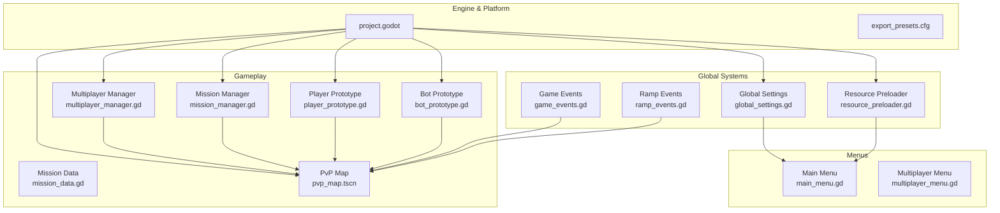
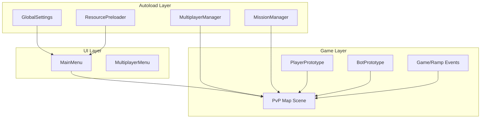
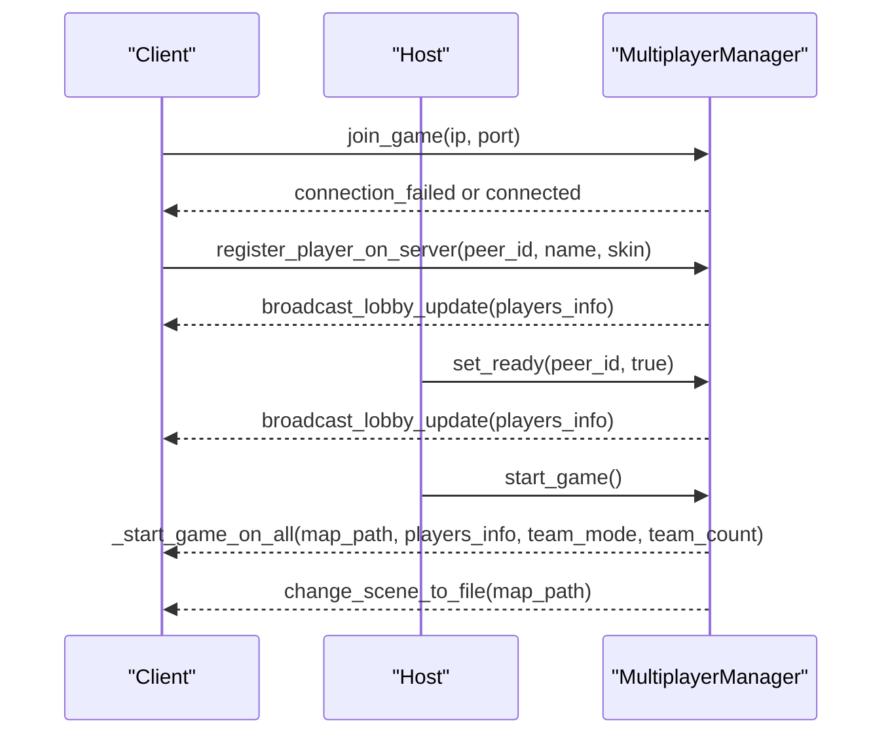
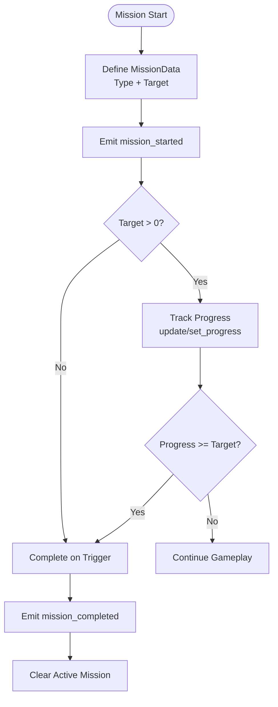
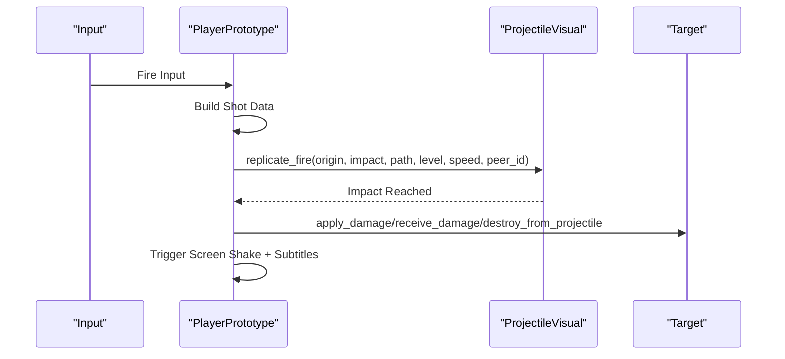
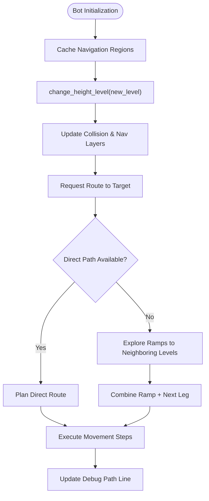
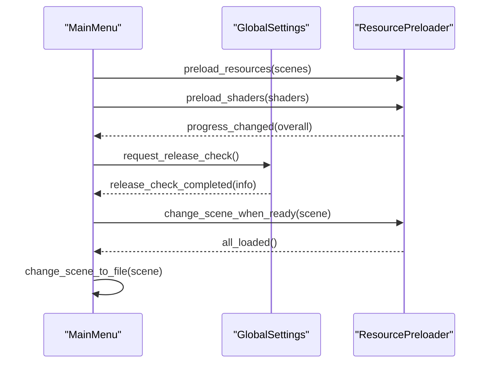
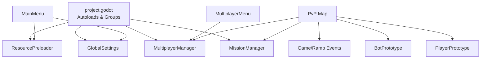

# Project Overview

<cite>
**Referenced Files in This Document**
- [project.godot](file://project.godot)
- [export_presets.cfg](file://export_presets.cfg)
- [Global.tscn](file://Global.tscn)
- [global_settings.gd](file://Scripts/global_settings.gd)
- [resource_preloader.gd](file://Scripts/resource_preloader.gd)
- [main_menu.gd](file://Menu/main_menu.gd)
- [multiplayer_menu.gd](file://Menu/multiplayer_menu.gd)
- [multiplayer_manager.gd](file://Scripts/multiplayer_manager.gd)
- [mission_manager.gd](file://Scripts/mission_manager.gd)
- [mission_data.gd](file://Scripts/mission_data.gd)
- [player_prototype.gd](file://Scripts/player_prototype.gd)
- [bot_prototype.gd](file://Scripts/bot_prototype.gd)
- [pvp_map.tscn](file://Maps/pvp_map.tscn)
- [game_events.gd](file://Scripts/game_events.gd)
- [ramp_events.gd](file://Scripts/ramp_events.gd)
</cite>

## Table of Contents
1. [Introduction](#introduction)
2. [Project Structure](#project-structure)
3. [Core Components](#core-components)
4. [Architecture Overview](#architecture-overview)
5. [Detailed Component Analysis](#detailed-component-analysis)
6. [Dependency Analysis](#dependency-analysis)
7. [Performance Considerations](#performance-considerations)
8. [Troubleshooting Guide](#troubleshooting-guide)
9. [Conclusion](#conclusion)

## Introduction
TFA Agents is a 2D multiplayer tactical shooter featuring mission-based gameplay, dynamic objectives, and layered height-based environments. The project emphasizes competitive multiplayer modes with team-based and FFA configurations, while also supporting single-player development and tutorial scenarios. Built on Godot Engine 4.x, it leverages modern rendering, robust networking, and modular systems to deliver a scalable, cross-platform experience for Windows and Android.

The game’s vision centers on precise, fast-paced combat with strategic depth through height-level traversal, dynamic objectives, and responsive weapon systems. Its positioning in the competitive gaming space is defined by tight controls, clear visual feedback, and a mission-driven progression model that encourages both tactical planning and quick reflexes.

## Project Structure
The project follows a layered, feature-based organization within Godot’s scene and script architecture:
- Core engine configuration and platform exports define runtime behavior and build targets.
- Global systems (settings, resource preloading, events) are exposed via autoload singletons for centralized access.
- Gameplay scenes (menus, maps, HUD) encapsulate UI and environment logic.
- Scripts implement reusable systems for missions, multiplayer, AI, and player mechanics.

**Diagram sources**
- [project.godot](file://project.godot)
- [export_presets.cfg](file://export_presets.cfg)
- [global_settings.gd](file://Scripts/global_settings.gd)
- [resource_preloader.gd](file://Scripts/resource_preloader.gd)
- [main_menu.gd](file://Menu/main_menu.gd)
- [multiplayer_menu.gd](file://Menu/multiplayer_menu.gd)
- [multiplayer_manager.gd](file://Scripts/multiplayer_manager.gd)
- [mission_manager.gd](file://Scripts/mission_manager.gd)
- [mission_data.gd](file://Scripts/mission_data.gd)
- [player_prototype.gd](file://Scripts/player_prototype.gd)
- [bot_prototype.gd](file://Scripts/bot_prototype.gd)
- [pvp_map.tscn](file://Maps/pvp_map.tscn)
- [game_events.gd](file://Scripts/game_events.gd)
- [ramp_events.gd](file://Scripts/ramp_events.gd)

**Section sources**
- [project.godot](file://project.godot)
- [export_presets.cfg](file://export_presets.cfg)

## Core Components
- Global Settings: Centralized configuration, graphics presets, audio volume, language, and FPS overlay management. Provides persistent storage and runtime updates for UI scaling, window modes, and subtitles.
- Resource Preloader: Background loading of scenes and shader warm-up to minimize startup stalls and ensure smooth transitions.
- Multiplayer Manager: Host/join sessions, lobby synchronization, team assignment, readiness checks, and synchronized scene changes for competitive matches.
- Mission Manager: Mission lifecycle orchestration with typed objectives (eliminations, collection, reach, activate, survive), progress tracking, and HUD signaling.
- Player Prototype: First-person 2D movement, height-level traversal, weapon mechanics, damage application, and multiplayer synchronization.
- Bot Prototype: AI pathfinding across height levels, ramp traversal, target acquisition, and visual debugging aids.
- PvP Map: Multi-layered tilemaps, navigation regions per level, ramps, spawn points, power-ups, and interactive objects.

**Section sources**
- [global_settings.gd](file://Scripts/global_settings.gd)
- [resource_preloader.gd](file://Scripts/resource_preloader.gd)
- [multiplayer_manager.gd](file://Scripts/multiplayer_manager.gd)
- [mission_manager.gd](file://Scripts/mission_manager.gd)
- [mission_data.gd](file://Scripts/mission_data.gd)
- [player_prototype.gd](file://Scripts/player_prototype.gd)
- [bot_prototype.gd](file://Scripts/bot_prototype.gd)
- [pvp_map.tscn](file://Maps/pvp_map.tscn)

## Architecture Overview
The architecture is built around autoload singletons and modular scripts:
- Autoloads expose shared services globally (settings, mission manager, multiplayer manager, resource preloader).
- Menus coordinate scene transitions and preloading workflows.
- Gameplay scenes encapsulate environment-specific logic (navigation, spawns, ramps).
- Networking is abstracted behind RPC calls for authoritative state updates and synchronized actions.

**Diagram sources**
- [project.godot](file://project.godot)
- [main_menu.gd](file://Menu/main_menu.gd)
- [multiplayer_menu.gd](file://Menu/multiplayer_menu.gd)
- [global_settings.gd](file://Scripts/global_settings.gd)
- [mission_manager.gd](file://Scripts/mission_manager.gd)
- [multiplayer_manager.gd](file://Scripts/multiplayer_manager.gd)
- [resource_preloader.gd](file://Scripts/resource_preloader.gd)
- [player_prototype.gd](file://Scripts/player_prototype.gd)
- [bot_prototype.gd](file://Scripts/bot_prototype.gd)
- [pvp_map.tscn](file://Maps/pvp_map.tscn)
- [game_events.gd](file://Scripts/game_events.gd)
- [ramp_events.gd](file://Scripts/ramp_events.gd)

## Detailed Component Analysis

### Multiplayer System
The multiplayer subsystem handles hosting, joining, lobby state, and synchronized gameplay:
- Host/join lifecycle with ENet peer creation and error handling.
- Lobby synchronization across clients, readiness flags, and team assignment.
- Match start triggers synchronized scene changes and player spawning.

**Diagram sources**
- [multiplayer_manager.gd](file://Scripts/multiplayer_manager.gd)
- [multiplayer_menu.gd](file://Menu/multiplayer_menu.gd)

**Section sources**
- [multiplayer_manager.gd](file://Scripts/multiplayer_manager.gd)
- [multiplayer_menu.gd](file://Menu/multiplayer_menu.gd)

### Mission System
Mission management defines objectives, tracks progress, and communicates with the HUD:
- Typed objectives (eliminate, collect, reach, activate, survive).
- Factory helpers to construct missions programmatically.
- Signals for start, progress, completion, failure, and clearing.

**Diagram sources**
- [mission_manager.gd](file://Scripts/mission_manager.gd)
- [mission_data.gd](file://Scripts/mission_data.gd)

**Section sources**
- [mission_manager.gd](file://Scripts/mission_manager.gd)
- [mission_data.gd](file://Scripts/mission_data.gd)

### Player and Weapon Mechanics
Player prototype integrates movement, height-level traversal, shooting, and feedback:
- Movement with keyboard/joystick, camera rotation, and interpolation for multiplayer.
- Height-level changes affect collision masks, navigation layers, and visibility shaders.
- Shooting pipeline builds shot data, replicates projectiles via RPC, applies impacts, and triggers screen shake.

**Diagram sources**
- [player_prototype.gd](file://Scripts/player_prototype.gd)
- [pvp_map.tscn](file://Maps/pvp_map.tscn)

**Section sources**
- [player_prototype.gd](file://Scripts/player_prototype.gd)
- [pvp_map.tscn](file://Maps/pvp_map.tscn)

### AI Pathfinding Across Levels
Bot prototype demonstrates height-aware pathfinding and ramp traversal:
- Navigation agent configured per level, with cached layer masks.
- Route calculation considers direct paths and ramp transitions with cost penalties.
- Debug visualization of planned routes and smoothed movement.

**Diagram sources**
- [bot_prototype.gd](file://Scripts/bot_prototype.gd)
- [pvp_map.tscn](file://Maps/pvp_map.tscn)

**Section sources**
- [bot_prototype.gd](file://Scripts/bot_prototype.gd)
- [pvp_map.tscn](file://Maps/pvp_map.tscn)

### Global Systems and Menus
- Global Settings manages persistent settings, graphics presets, language, and FPS overlay.
- Resource Preloader performs asynchronous scene loading and shader warm-up to avoid stalls.
- Main menu coordinates preloading, release checks, and scene transitions.
- Multiplayer menu configures host/join parameters and persists player name.

**Diagram sources**
- [main_menu.gd](file://Menu/main_menu.gd)
- [global_settings.gd](file://Scripts/global_settings.gd)
- [resource_preloader.gd](file://Scripts/resource_preloader.gd)

**Section sources**
- [main_menu.gd](file://Menu/main_menu.gd)
- [global_settings.gd](file://Scripts/global_settings.gd)
- [resource_preloader.gd](file://Scripts/resource_preloader.gd)

## Dependency Analysis
Key dependencies and relationships:
- Autoload singletons are declared in the engine configuration and consumed across scenes.
- Menus depend on global settings and resource preloader for seamless transitions.
- Gameplay relies on mission manager, multiplayer manager, and map-specific nodes.
- Player and bot prototypes depend on navigation, collision layers, and shader materials.

**Diagram sources**
- [project.godot](file://project.godot)
- [main_menu.gd](file://Menu/main_menu.gd)
- [multiplayer_menu.gd](file://Menu/multiplayer_menu.gd)
- [global_settings.gd](file://Scripts/global_settings.gd)
- [mission_manager.gd](file://Scripts/mission_manager.gd)
- [multiplayer_manager.gd](file://Scripts/multiplayer_manager.gd)
- [resource_preloader.gd](file://Scripts/resource_preloader.gd)
- [player_prototype.gd](file://Scripts/player_prototype.gd)
- [bot_prototype.gd](file://Scripts/bot_prototype.gd)
- [pvp_map.tscn](file://Maps/pvp_map.tscn)
- [game_events.gd](file://Scripts/game_events.gd)
- [ramp_events.gd](file://Scripts/ramp_events.gd)

**Section sources**
- [project.godot](file://project.godot)

## Performance Considerations
- Asynchronous resource preloading prevents frame drops during scene transitions.
- Graphics presets dynamically adjust lighting energy, shadows, and glow effects for varied hardware.
- Multiplayer synchronization uses targeted RPCs and interpolation to balance accuracy and bandwidth.
- Height-level shaders and navigation layers reduce unnecessary rendering and pathfinding costs.
- Mobile export settings enable optimized rendering and input emulation for touch devices.

[No sources needed since this section provides general guidance]

## Troubleshooting Guide
Common issues and resolutions:
- Connection failures during hosting/joining are surfaced via connection_failed signals; verify port availability and network connectivity.
- If lobby updates stall, ensure RPC normalization and authority checks are functioning.
- For mission progress not updating, confirm mission manager signals are emitted and HUD listens to progress_changed.
- If players appear invisible across levels, check height-level group membership and shader material assignments.
- Release checks failing may indicate network restrictions; verify HTTPS access and API endpoints.

**Section sources**
- [multiplayer_manager.gd](file://Scripts/multiplayer_manager.gd)
- [mission_manager.gd](file://Scripts/mission_manager.gd)
- [player_prototype.gd](file://Scripts/player_prototype.gd)
- [global_settings.gd](file://Scripts/global_settings.gd)

## Conclusion
TFA Agents combines competitive multiplayer design with mission-driven content and layered height mechanics. Its architecture leverages Godot 4.x strengths—autoload singletons, robust networking, modular scripts, and efficient resource management—to deliver a polished, cross-platform experience. The project’s emphasis on responsive controls, dynamic objectives, and scalable systems positions it as a focused tactical shooter suitable for both casual and competitive play.