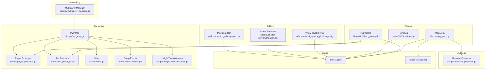
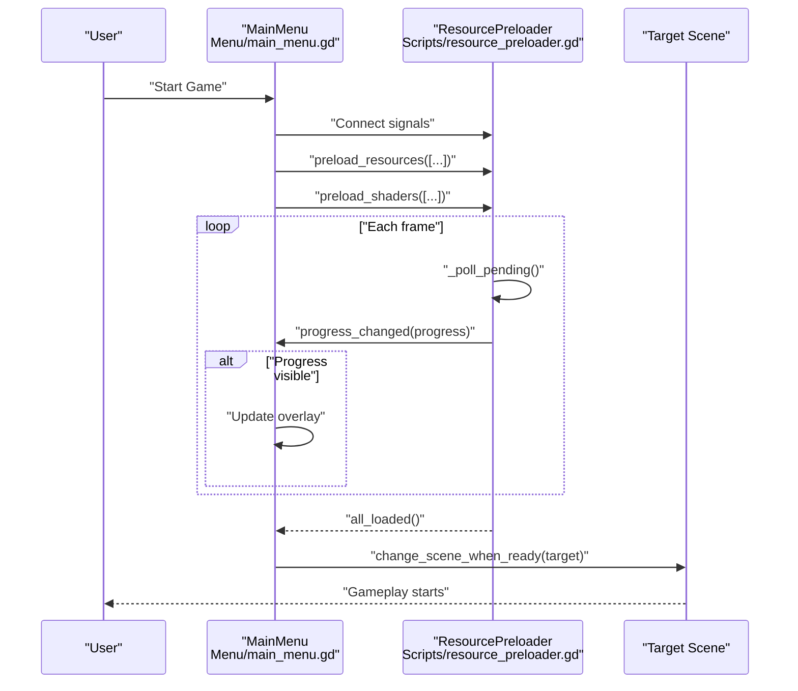
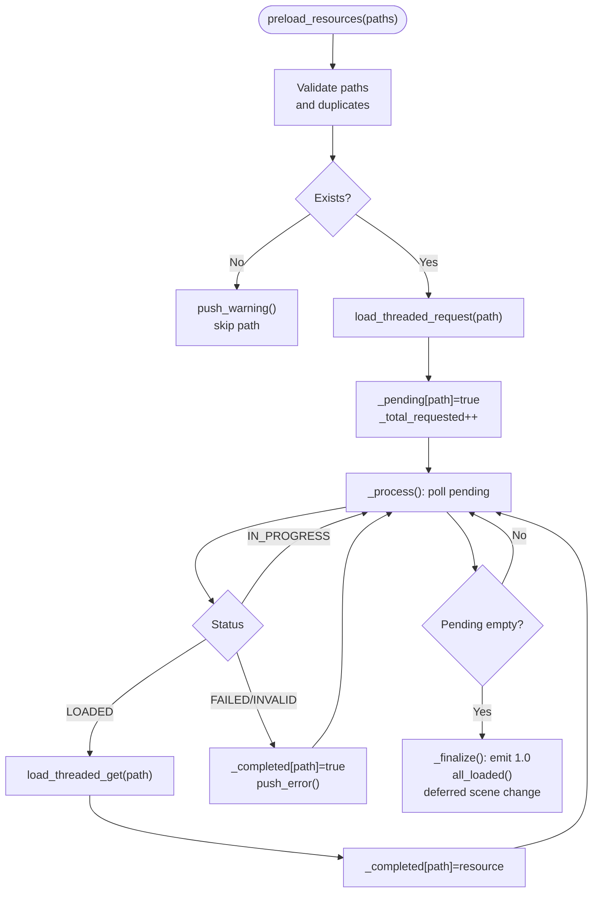
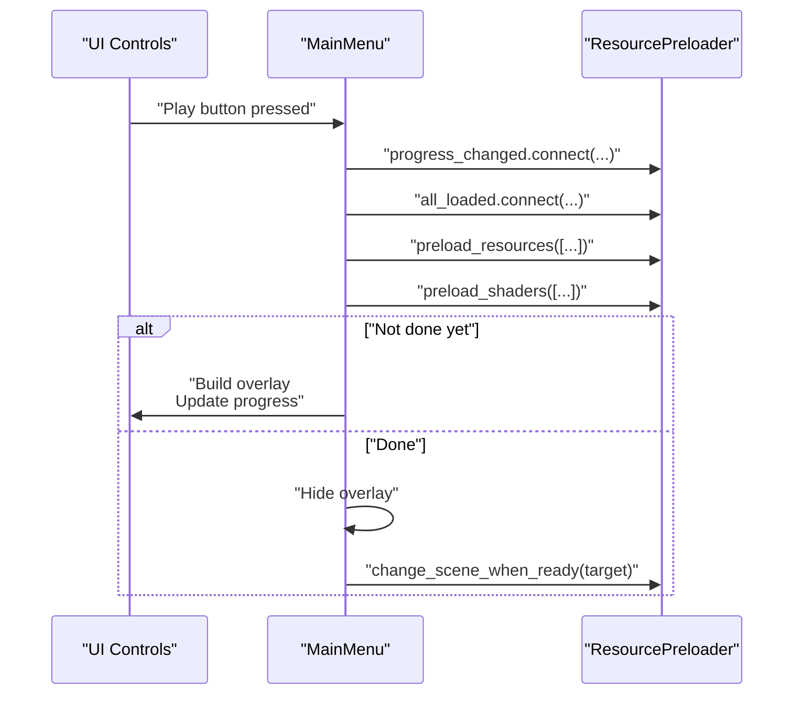
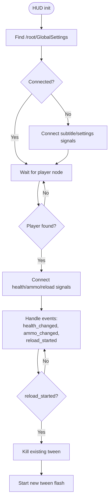
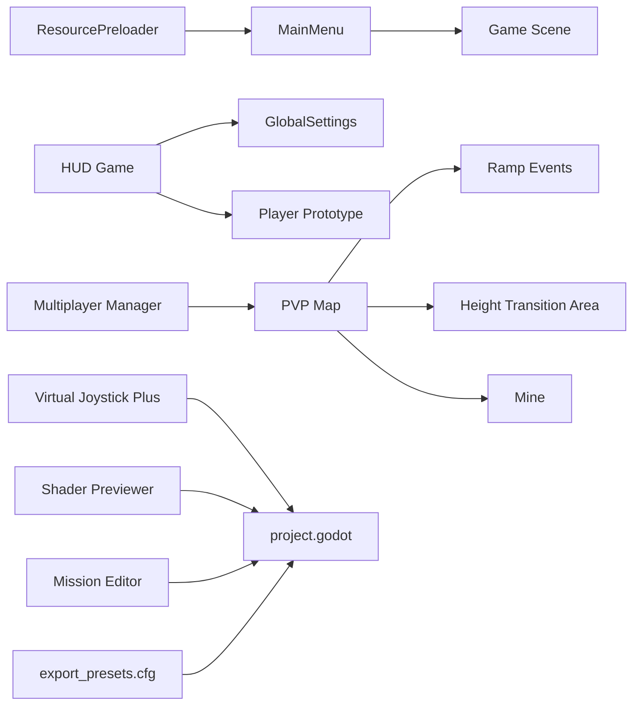

# Troubleshooting

<cite>
**Referenced Files in This Document**
- [resource_preloader.gd](file://Scripts/resource_preloader.gd)
- [main_menu.gd](file://Menu/main_menu.gd)
- [hud_game.gd](file://Menu/HUD/hud_game.gd)
- [minimap.gd](file://Menu/HUD/minimap.gd)
- [multiplayer_manager.gd](file://Scripts/multiplayer_manager.gd)
- [pvp_map.gd](file://Scripts/pvp_map.gd)
- [player_prototype.gd](file://Scripts/player_prototype.gd)
- [bot_prototype.gd](file://Scripts/bot_prototype.gd)
- [mina.gd](file://Scripts/mina.gd)
- [ramp_events.gd](file://Scripts/ramp_events.gd)
- [height_transition_area.gd](file://Scripts/height_transition_area.gd)
- [project.godot](file://project.godot)
- [export_presets.cfg](file://export_presets.cfg)
- [plugin.cfg](file://addons/virtual_joystick_plus/plugin.cfg)
- [plugin.cfg (shader-previewer)](file://addons/shader-previewer/plugin.cfg)
- [plugin.cfg (mission_editor)](file://addons/mission_editor/plugin.cfg)
</cite>

## Table of Contents
1. [Introduction](#introduction)
2. [Project Structure](#project-structure)
3. [Core Components](#core-components)
4. [Architecture Overview](#architecture-overview)
5. [Detailed Component Analysis](#detailed-component-analysis)
6. [Dependency Analysis](#dependency-analysis)
7. [Performance Considerations](#performance-considerations)
8. [Troubleshooting Guide](#troubleshooting-guide)
9. [Conclusion](#conclusion)
10. [Appendices](#appendices)

## Introduction
This document provides a comprehensive troubleshooting guide for TFA Agents, focusing on asset loading issues, networking problems, performance bottlenecks, and platform-specific challenges. It consolidates debugging strategies, error diagnosis methods, and practical solutions derived from the project’s codebase. The guide emphasizes practical checks and reproducible steps to resolve common issues during development and runtime.

## Project Structure
TFA Agents is a Godot project organized around autoload singletons, menus, HUD systems, gameplay scripts, and addon integrations. The most relevant areas for troubleshooting include:
- Asset loading and preloading via an autoload singleton
- Menu and HUD lifecycle and signal connections
- Multiplayer and map-related scripts
- Platform export configuration and addon plugins

**Diagram sources**
- [resource_preloader.gd](file://Scripts/resource_preloader.gd)
- [main_menu.gd](file://Menu/main_menu.gd)
- [hud_game.gd](file://Menu/HUD/hud_game.gd)
- [minimap.gd](file://Menu/HUD/minimap.gd)
- [multiplayer_manager.gd](file://Scripts/multiplayer_manager.gd)
- [pvp_map.gd](file://Scripts/pvp_map.gd)
- [player_prototype.gd](file://Scripts/player_prototype.gd)
- [bot_prototype.gd](file://Scripts/bot_prototype.gd)
- [mina.gd](file://Scripts/mina.gd)
- [ramp_events.gd](file://Scripts/ramp_events.gd)
- [height_transition_area.gd](file://Scripts/height_transition_area.gd)
- [project.godot](file://project.godot)
- [export_presets.cfg](file://export_presets.cfg)
- [plugin.cfg](file://addons/virtual_joystick_plus/plugin.cfg)
- [plugin.cfg (shader-previewer)](file://addons/shader-previewer/plugin.cfg)
- [plugin.cfg (mission_editor)](file://addons/mission_editor/plugin.cfg)

**Section sources**
- [resource_preloader.gd](file://Scripts/resource_preloader.gd)
- [main_menu.gd](file://Menu/main_menu.gd)
- [hud_game.gd](file://Menu/HUD/hud_game.gd)
- [minimap.gd](file://Menu/HUD/minimap.gd)
- [multiplayer_manager.gd](file://Scripts/multiplayer_manager.gd)
- [pvp_map.gd](file://Scripts/pvp_map.gd)
- [player_prototype.gd](file://Scripts/player_prototype.gd)
- [bot_prototype.gd](file://Scripts/bot_prototype.gd)
- [mina.gd](file://Scripts/mina.gd)
- [ramp_events.gd](file://Scripts/ramp_events.gd)
- [height_transition_area.gd](file://Scripts/height_transition_area.gd)
- [project.godot](file://project.godot)
- [export_presets.cfg](file://export_presets.cfg)
- [plugin.cfg](file://addons/virtual_joystick_plus/plugin.cfg)
- [plugin.cfg (shader-previewer)](file://addons/shader-previewer/plugin.cfg)
- [plugin.cfg (mission_editor)](file://addons/mission_editor/plugin.cfg)

## Core Components
- ResourcePreloader: Asynchronous resource and shader preloading with progress signals and deferred scene transitions.
- MainMenu: Integrates ResourcePreloader, sets up preload lists, and manages UI overlays.
- HUD Game: Manages player UI updates, connects to player signals, and handles reload animations.
- Minimap: Provides minimap rendering and related UI behaviors.
- Multiplayer Manager: Centralized networking logic for match lifecycle and client-server interactions.
- PVP Map: Gameplay map initialization and event wiring for ramps, height transitions, and mines.
- Player/Bot Prototypes: Core character behaviors and interactions.
- Export and Addons: Project configuration and third-party plugin enablement.

Key troubleshooting anchors:
- Preload completion and progress emission
- Signal connection order and node availability
- Deferred scene changes and overlay visibility
- Network initialization and error propagation

**Section sources**
- [resource_preloader.gd](file://Scripts/resource_preloader.gd)
- [main_menu.gd](file://Menu/main_menu.gd)
- [hud_game.gd](file://Menu/HUD/hud_game.gd)
- [minimap.gd](file://Menu/HUD/minimap.gd)
- [multiplayer_manager.gd](file://Scripts/multiplayer_manager.gd)
- [pvp_map.gd](file://Scripts/pvp_map.gd)
- [player_prototype.gd](file://Scripts/player_prototype.gd)
- [bot_prototype.gd](file://Scripts/bot_prototype.gd)

## Architecture Overview
The runtime flow begins at the main menu, which triggers asynchronous resource preloading. Once ready, the main menu defers to a scene change. During gameplay, HUD and map scripts coordinate events, while multiplayer manager orchestrates networked sessions.

**Diagram sources**
- [main_menu.gd](file://Menu/main_menu.gd)
- [resource_preloader.gd](file://Scripts/resource_preloader.gd)

**Section sources**
- [main_menu.gd](file://Menu/main_menu.gd)
- [resource_preloader.gd](file://Scripts/resource_preloader.gd)

## Detailed Component Analysis

### ResourcePreloader: Asynchronous Loading and Scene Transitions
Common issues:
- Missing or invalid resource paths cause warnings and failed loads.
- Polling during process can block if not designed carefully; the implementation avoids blocking by deferring retrieval.
- Scene transitions rely on completion; ensure deferred execution to avoid race conditions.

Diagnostic checklist:
- Verify resource existence before requesting threaded load.
- Confirm signal subscriptions occur before preload invocation.
- Check progress threshold emissions to avoid UI spam.
- Ensure deferred scene change is used after completion.

**Diagram sources**
- [resource_preloader.gd](file://Scripts/resource_preloader.gd)

**Section sources**
- [resource_preloader.gd](file://Scripts/resource_preloader.gd)

### MainMenu: Preload Integration and Overlay Management
Common issues:
- UI overlay stuck at 100% if signals are not connected before preload.
- Incorrect preload resource lists causing missing assets at runtime.
- Scene path not set or empty leading to no transition.

Diagnostic checklist:
- Connect progress_changed and all_loaded before calling preload_resources.
- Ensure preload resources include top-level scenes; sub-dependencies are auto-included.
- Verify shader paths exist and are included in preload_shaders.
- Confirm change_scene_when_ready is called after all_loaded.

**Diagram sources**
- [main_menu.gd](file://Menu/main_menu.gd)
- [resource_preloader.gd](file://Scripts/resource_preloader.gd)

**Section sources**
- [main_menu.gd](file://Menu/main_menu.gd)

### HUD Game: Signal Connections and Reload Animations
Common issues:
- Missing signal connections lead to stale UI (health, ammo).
- Node-added/disconnected events require robust reconnection logic.
- Reload animation conflicts if tweens are not properly killed.

Diagnostic checklist:
- Ensure GlobalSettings and player nodes are present before connecting signals.
- Disconnect and reconnect handlers when nodes change groups or are reparented.
- Kill existing tweens before starting new reload flashes to prevent overlap.

**Diagram sources**
- [hud_game.gd](file://Menu/HUD/hud_game.gd)

**Section sources**
- [hud_game.gd](file://Menu/HUD/hud_game.gd)

### Minimap: Rendering and UI Behavior
Common issues:
- Minimap not updating due to missing camera or layer configuration.
- UI scaling or theme overrides affecting visibility.

Diagnostic checklist:
- Verify minimap camera assignment and layer masks.
- Check theme overrides and visibility toggles.
- Confirm update frequency and render target settings.

**Section sources**
- [minimap.gd](file://Menu/HUD/minimap.gd)

### Multiplayer Manager: Networking Lifecycle
Common issues:
- Initialization order errors causing mismatched states.
- Event delivery failures due to missing handlers or node lifecycles.
- Scene synchronization gaps between clients.

Diagnostic checklist:
- Initialize manager before scene transitions.
- Subscribe to server/client callbacks early.
- Validate room/session creation and join flows.
- Log connection states and error codes.

**Section sources**
- [multiplayer_manager.gd](file://Scripts/multiplayer_manager.gd)

### PVP Map: Gameplay Wiring and Events
Common issues:
- Missing event handlers for ramps or height transitions.
- Mine placement or activation not triggering visuals/sounds.
- Player/bot spawn points misconfigured.

Diagnostic checklist:
- Ensure ramp_events and height_transition_area are attached to relevant nodes.
- Verify mine scripts are instantiated and connected to map events.
- Confirm spawn points are registered and used by player/bot prototypes.

**Section sources**
- [pvp_map.gd](file://Scripts/pvp_map.gd)
- [ramp_events.gd](file://Scripts/ramp_events.gd)
- [height_transition_area.gd](file://Scripts/height_transition_area.gd)
- [mina.gd](file://Scripts/mina.gd)
- [player_prototype.gd](file://Scripts/player_prototype.gd)
- [bot_prototype.gd](file://Scripts/bot_prototype.gd)

## Dependency Analysis
- Autoload dependency: MainMenu depends on ResourcePreloader for seamless transitions.
- Signal dependency: HUD relies on GlobalSettings and player signals; incorrect connection order can break UI.
- Addon dependency: Virtual Joystick Plus, Shader Previewer, and Mission Editor require enabled plugins in project settings.
- Export dependency: export_presets.cfg controls build targets and platform-specific packaging.

**Diagram sources**
- [resource_preloader.gd](file://Scripts/resource_preloader.gd)
- [main_menu.gd](file://Menu/main_menu.gd)
- [hud_game.gd](file://Menu/HUD/hud_game.gd)
- [multiplayer_manager.gd](file://Scripts/multiplayer_manager.gd)
- [pvp_map.gd](file://Scripts/pvp_map.gd)
- [ramp_events.gd](file://Scripts/ramp_events.gd)
- [height_transition_area.gd](file://Scripts/height_transition_area.gd)
- [mina.gd](file://Scripts/mina.gd)
- [project.godot](file://project.godot)
- [export_presets.cfg](file://export_presets.cfg)
- [plugin.cfg](file://addons/virtual_joystick_plus/plugin.cfg)
- [plugin.cfg (shader-previewer)](file://addons/shader-previewer/plugin.cfg)
- [plugin.cfg (mission_editor)](file://addons/mission_editor/plugin.cfg)

**Section sources**
- [resource_preloader.gd](file://Scripts/resource_preloader.gd)
- [main_menu.gd](file://Menu/main_menu.gd)
- [hud_game.gd](file://Menu/HUD/hud_game.gd)
- [multiplayer_manager.gd](file://Scripts/multiplayer_manager.gd)
- [pvp_map.gd](file://Scripts/pvp_map.gd)
- [ramp_events.gd](file://Scripts/ramp_events.gd)
- [height_transition_area.gd](file://Scripts/height_transition_area.gd)
- [mina.gd](file://Scripts/mina.gd)
- [project.godot](file://project.godot)
- [export_presets.cfg](file://export_presets.cfg)
- [plugin.cfg](file://addons/virtual_joystick_plus/plugin.cfg)
- [plugin.cfg (shader-previewer)](file://addons/shader-previewer/plugin.cfg)
- [plugin.cfg (mission_editor)](file://addons/mission_editor/plugin.cfg)

## Performance Considerations
- Asynchronous resource preloading prevents main-thread stalls; ensure preload lists are minimal and targeted.
- Shader warm-up via dummy materials reduces first-use compilation overhead; keep shader lists concise.
- Avoid emitting progress signals too frequently; the current implementation clamps updates to reduce churn.
- Deferred scene changes prevent immediate heavy work on main thread; use them consistently after preload completion.
- Minimap and HUD updates should be throttled; avoid unnecessary redraws on every frame.

[No sources needed since this section provides general guidance]

## Troubleshooting Guide

### Asset Loading Issues
Symptoms:
- Missing textures, shaders, or scenes at runtime.
- UI overlay stuck at 100% or never appearing.
- Errors indicating failed or invalid resources.

Root causes and fixes:
- Verify resource paths exist and are included in preload lists.
- Ensure signal subscriptions occur before preload invocation to avoid missed progress updates.
- Confirm threaded requests succeed; handle warnings and errors gracefully.
- Use deferred scene changes after all_loaded to avoid race conditions.

Diagnostic steps:
- Check ResourcePreloader logs for warnings and errors.
- Confirm preload resources include only top-level scenes.
- Validate shader paths and ensure dummy materials are created.

**Section sources**
- [resource_preloader.gd](file://Scripts/resource_preloader.gd)
- [main_menu.gd](file://Menu/main_menu.gd)

### HUD and UI Problems
Symptoms:
- Health/ammo labels not updating.
- Reload animations not flashing or overlapping.
- Settings or subtitles not applied.

Root causes and fixes:
- Ensure GlobalSettings and player nodes are present before connecting signals.
- Reconnect handlers on node-added/disconnected events.
- Kill existing tweens before starting new reload animations.

Diagnostic steps:
- Verify signal connections in HUD initialization.
- Test reload_started signal emission and tween lifecycle.
- Check theme overrides and visibility toggles.

**Section sources**
- [hud_game.gd](file://Menu/HUD/hud_game.gd)

### Networking and Multiplayer
Symptoms:
- Players cannot connect or session fails.
- Events not synchronized across clients.
- UI remains in lobby or loading state.

Root causes and fixes:
- Initialize multiplayer manager before scene transitions.
- Subscribe to callbacks early and handle disconnections.
- Validate room/session creation and join flows.

Diagnostic steps:
- Log connection states and error codes.
- Verify server/client callbacks are registered.
- Test basic send/receive flows.

**Section sources**
- [multiplayer_manager.gd](file://Scripts/multiplayer_manager.gd)

### Gameplay Map and Events
Symptoms:
- Ramp effects not triggering.
- Mines not exploding or visualizing.
- Height transitions not working.

Root causes and fixes:
- Attach ramp_events and height_transition_area to relevant nodes.
- Instantiate mine scripts and wire them to map events.
- Register spawn points and ensure player/bot prototypes use them.

Diagnostic steps:
- Confirm event nodes are part of the scene tree.
- Verify mine scripts are loaded and initialized.
- Check spawn point registration and usage.

**Section sources**
- [pvp_map.gd](file://Scripts/pvp_map.gd)
- [ramp_events.gd](file://Scripts/ramp_events.gd)
- [height_transition_area.gd](file://Scripts/height_transition_area.gd)
- [mina.gd](file://Scripts/mina.gd)

### Platform and Export Issues
Symptoms:
- Build fails or exports incorrectly.
- Plugins not recognized in editor.

Root causes and fixes:
- Enable required addons in project settings.
- Configure export presets for target platforms.
- Ensure plugin configs are present and valid.

Diagnostic steps:
- Verify plugin.cfg entries for enabled addons.
- Check export_presets.cfg for platform-specific settings.
- Rebuild project after enabling/disabling addons.

**Section sources**
- [project.godot](file://project.godot)
- [export_presets.cfg](file://export_presets.cfg)
- [plugin.cfg](file://addons/virtual_joystick_plus/plugin.cfg)
- [plugin.cfg (shader-previewer)](file://addons/shader-previewer/plugin.cfg)
- [plugin.cfg (mission_editor)](file://addons/mission_editor/plugin.cfg)

### Logging and Debugging Strategies
Recommended practices:
- Use ResourcePreloader’s built-in warnings and errors for resource issues.
- Emit structured logs around preload completion and scene transitions.
- Add debug prints for signal connections and node lifecycle events.
- Capture multiplayer connection states and error codes.

Tools:
- Godot Editor Debugger for breakpoints and variable inspection.
- Console output for progress and completion messages.
- Export builds to reproduce platform-specific issues.

**Section sources**
- [resource_preloader.gd](file://Scripts/resource_preloader.gd)
- [main_menu.gd](file://Menu/main_menu.gd)
- [hud_game.gd](file://Menu/HUD/hud_game.gd)
- [multiplayer_manager.gd](file://Scripts/multiplayer_manager.gd)

## Conclusion
By following the diagnostic steps and applying the fixes outlined above, most development and runtime issues in TFA Agents can be resolved efficiently. Focus on proper preload sequencing, robust signal connections, and platform configuration to minimize friction during development and deployment.

[No sources needed since this section summarizes without analyzing specific files]

## Appendices

### Quick Checklist
- Preload
  - Paths validated, signals subscribed before preload
  - Deferred scene change after completion
- HUD/UI
  - Signals connected to GlobalSettings and player
  - Reload animations properly managed
- Networking
  - Manager initialized before scene transitions
  - Callbacks registered early
- Gameplay
  - Event nodes attached and wired
  - Spawn points and mines configured
- Platform
  - Addons enabled, export presets configured

[No sources needed since this section provides general guidance]