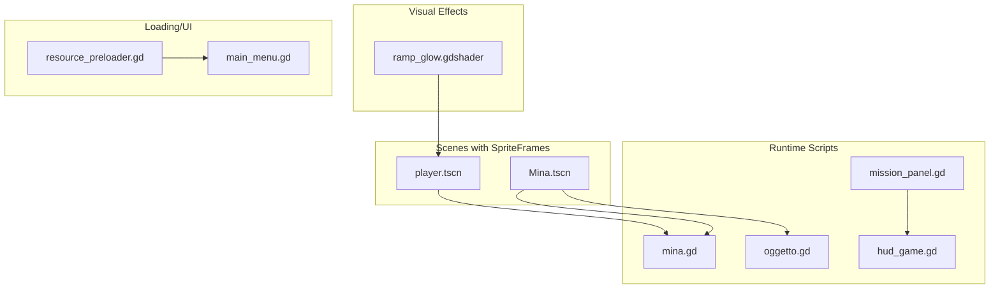
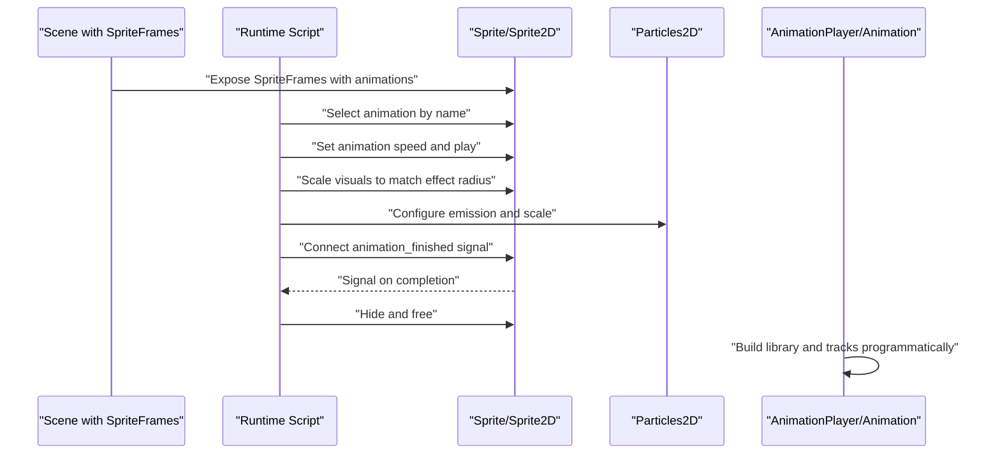
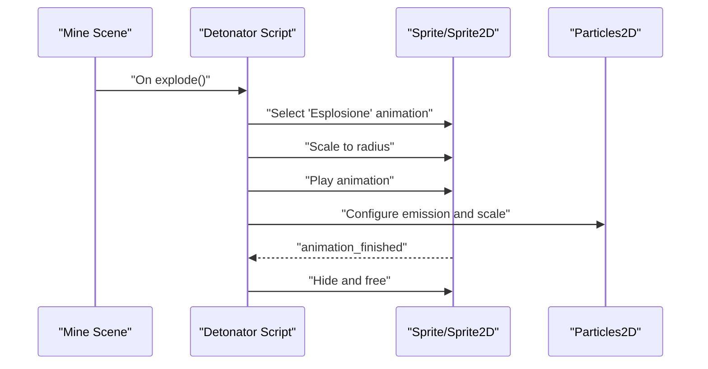
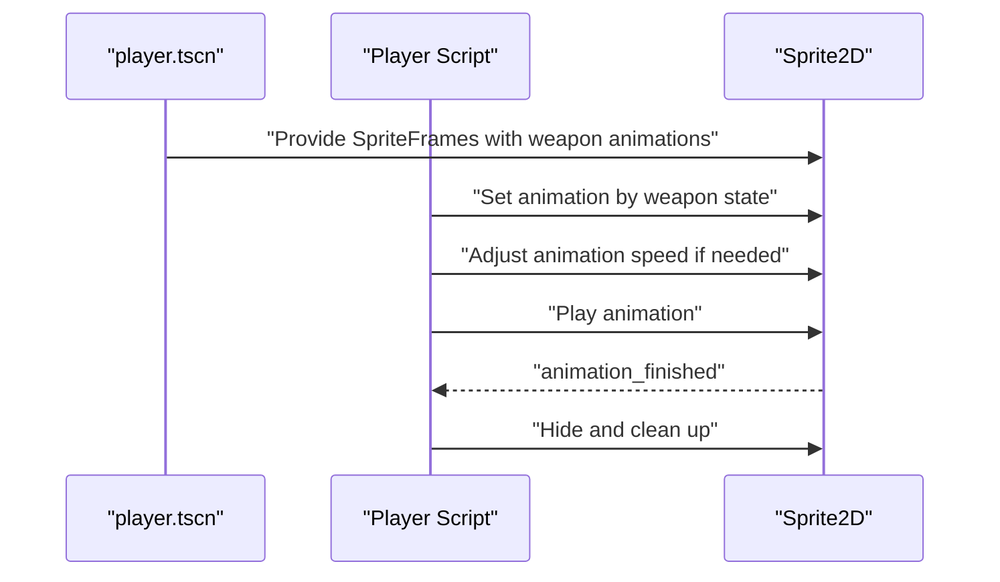
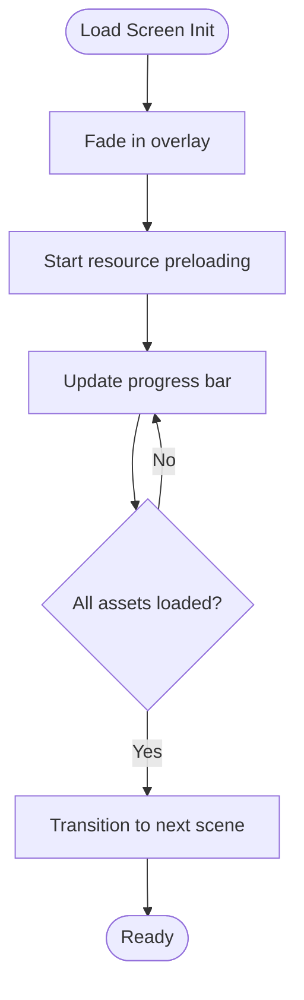
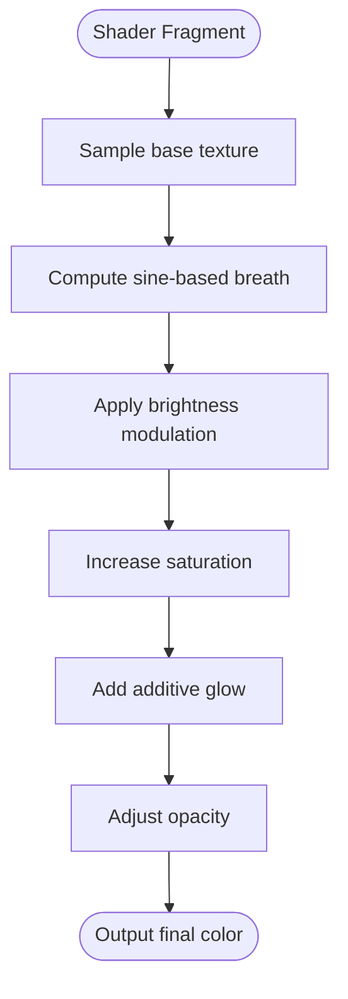
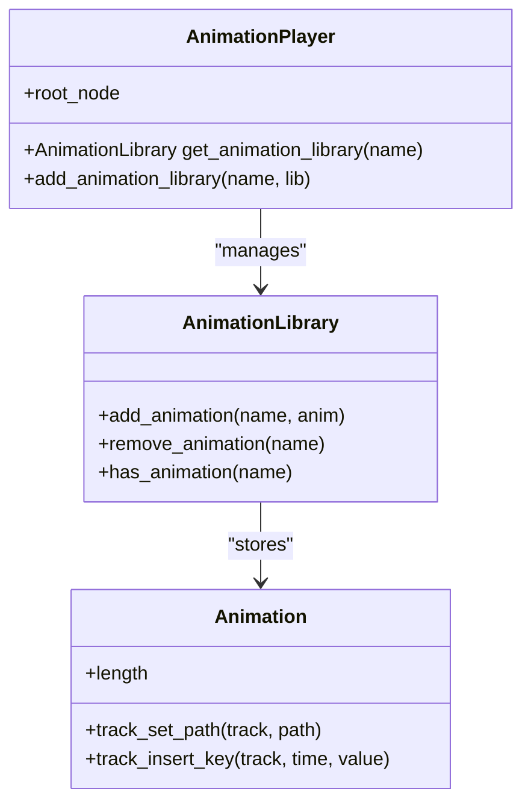
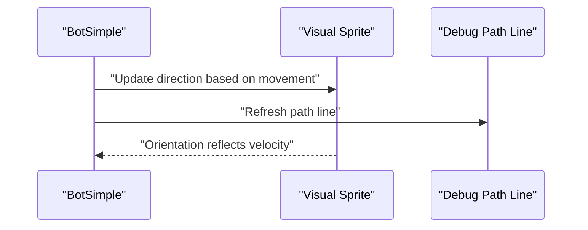
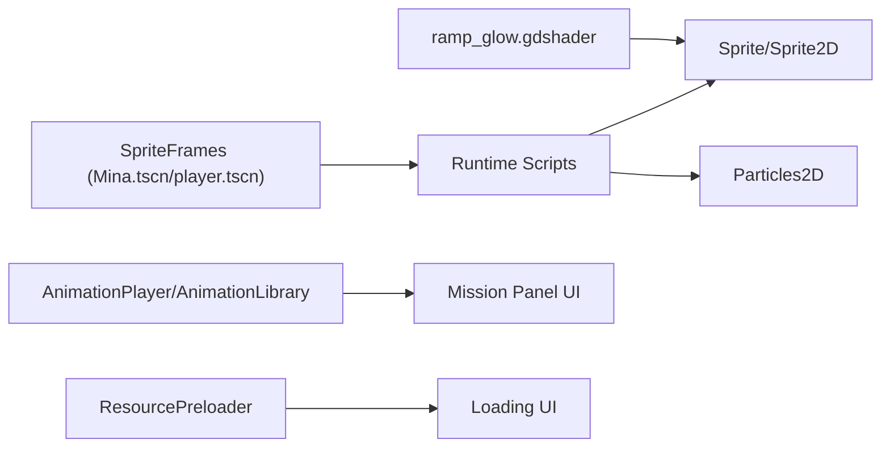

# Animation Systems

<cite>
**Referenced Files in This Document**
- [Mina.tscn](file://Game/Oggetti/Mina.tscn)
- [mina.gd](file://Scripts/mina.gd)
- [oggetto.gd](file://Scripts/oggetto.gd)
- [player.tscn](file://player.tscn)
- [mission_panel.gd](file://Scripts/mission_panel.gd)
- [ramp_glow.gdshader](file://Shaders/ramp_glow.gdshader)
- [resource_preloader.gd](file://Scripts/resource_preloader.gd)
- [main_menu.gd](file://Menu/main_menu.gd)
- [hud_game.gd](file://Menu/HUD/hud_game.gd)
</cite>

## Table of Contents
1. [Introduction](#introduction)
2. [Project Structure](#project-structure)
3. [Core Components](#core-components)
4. [Architecture Overview](#architecture-overview)
5. [Detailed Component Analysis](#detailed-component-analysis)
6. [Dependency Analysis](#dependency-analysis)
7. [Performance Considerations](#performance-considerations)
8. [Troubleshooting Guide](#troubleshooting-guide)
9. [Conclusion](#conclusion)
10. [Appendices](#appendices)

## Introduction
This document explains TFA Agents’ animation systems with a focus on sprite sheet animation setup, frame-by-frame sequences, playback controls, loading animations, explosion effects, and character movement visuals. It also covers state management, timing controls, performance optimization for animated assets, and practical guidelines for creating and integrating new animations into the game logic.

## Project Structure
The animation system spans several areas:
- Sprite-based animations defined in scene files using SpriteFrames and AtlasTexture
- Runtime scripts controlling animation playback and state transitions
- Shader-driven visual effects that animate sprites passively
- UI and loading screens with programmatic animations
- Resource preloading to optimize asset delivery and reduce runtime stalls

**Diagram sources**
- [Mina.tscn:53-187](file://Game/Oggetti/Mina.tscn#L53-L187)
- [player.tscn:34-78](file://player.tscn#L34-L78)
- [mina.gd:211-257](file://Scripts/mina.gd#L211-L257)
- [oggetto.gd:220-248](file://Scripts/oggetto.gd#L220-L248)
- [mission_panel.gd:177-308](file://Scripts/mission_panel.gd#L177-L308)
- [ramp_glow.gdshader:1-48](file://Shaders/ramp_glow.gdshader#L1-L48)
- [resource_preloader.gd:80-166](file://Scripts/resource_preloader.gd#L80-L166)
- [main_menu.gd:321-360](file://Menu/main_menu.gd#L321-L360)
- [hud_game.gd:69-82](file://Menu/HUD/hud_game.gd#L69-L82)

**Section sources**
- [Mina.tscn:53-187](file://Game/Oggetti/Mina.tscn#L53-L187)
- [player.tscn:34-78](file://player.tscn#L34-L78)
- [mina.gd:211-257](file://Scripts/mina.gd#L211-L257)
- [oggetto.gd:220-248](file://Scripts/oggetto.gd#L220-L248)
- [mission_panel.gd:177-308](file://Scripts/mission_panel.gd#L177-L308)
- [ramp_glow.gdshader:1-48](file://Shaders/ramp_glow.gdshader#L1-L48)
- [resource_preloader.gd:80-166](file://Scripts/resource_preloader.gd#L80-L166)
- [main_menu.gd:321-360](file://Menu/main_menu.gd#L321-L360)
- [hud_game.gd:69-82](file://Menu/HUD/hud_game.gd#L69-L82)

## Core Components
- SpriteFrames-based animations in scenes define frame sequences, durations, looping, and speeds. Explosions and weapon idle/idle-with-weapon variants are configured here.
- Runtime scripts control animation playback, visibility, scaling, and cleanup after completion.
- Shader effects animate sprites passively (e.g., pulsating glow) without manual scripting.
- Programmatic UI animations build reusable animation libraries and tracks for panel transitions and feedback.
- Resource preloading and loading UI provide smooth startup and asset readiness cues.

Key implementation anchors:
- Explosion animations and playback: [Mina.tscn:53-187], [mina.gd:211-257], [oggetto.gd:220-248]
- Weapon and idle animations: [player.tscn:34-78]
- Shader-driven glow: [ramp_glow.gdshader:1-48]
- Programmatic UI animations: [mission_panel.gd:177-308]
- Loading overlay and progress: [main_menu.gd:321-360], [resource_preloader.gd:80-166]
- HUD integration points: [hud_game.gd:69-82]

**Section sources**
- [Mina.tscn:53-187](file://Game/Oggetti/Mina.tscn#L53-L187)
- [mina.gd:211-257](file://Scripts/mina.gd#L211-L257)
- [oggetto.gd:220-248](file://Scripts/oggetto.gd#L220-L248)
- [player.tscn:34-78](file://player.tscn#L34-L78)
- [ramp_glow.gdshader:1-48](file://Shaders/ramp_glow.gdshader#L1-L48)
- [mission_panel.gd:177-308](file://Scripts/mission_panel.gd#L177-L308)
- [main_menu.gd:321-360](file://Menu/main_menu.gd#L321-L360)
- [resource_preloader.gd:80-166](file://Scripts/resource_preloader.gd#L80-L166)
- [hud_game.gd:69-82](file://Menu/HUD/hud_game.gd#L69-L82)

## Architecture Overview
The animation pipeline combines authored scene assets with runtime control and passive shader effects:

**Diagram sources**
- [Mina.tscn:53-187](file://Game/Oggetti/Mina.tscn#L53-L187)
- [mina.gd:211-257](file://Scripts/mina.gd#L211-L257)
- [oggetto.gd:220-248](file://Scripts/oggetto.gd#L220-L248)
- [mission_panel.gd:177-308](file://Scripts/mission_panel.gd#L177-L308)

## Detailed Component Analysis

### Explosion Animation Sequences
Explosion animations are defined in the mine scene’s SpriteFrames and driven by scripts upon detonation. The sequence includes:
- A short non-looping animation for initial boom
- A continuous looping animation for sustained blast frames
- Optional secondary animations for different variants

Playback control:
- Scripts detect explosion state, disable collisions, remove shader materials, and start the appropriate animation
- Scale is adjusted to visually match the explosion radius
- Particles are configured to complement the explosion size and intensity
- After animation completes, the object is hidden and freed

**Diagram sources**
- [Mina.tscn:53-187](file://Game/Oggetti/Mina.tscn#L53-L187)
- [mina.gd:211-257](file://Scripts/mina.gd#L211-L257)
- [oggetto.gd:220-248](file://Scripts/oggetto.gd#L220-L248)

**Section sources**
- [Mina.tscn:53-187](file://Game/Oggetti/Mina.tscn#L53-L187)
- [mina.gd:211-257](file://Scripts/mina.gd#L211-L257)
- [oggetto.gd:220-248](file://Scripts/oggetto.gd#L220-L248)

### Sprite Sheet Animation Setup and Playback Controls
Weapon and idle animations are defined in the player scene using SpriteFrames and AtlasTexture. The setup includes:
- Multiple animations for different weapon states (idle, pistol, machine gun, grenade launcher)
- Looping and non-looping variants
- Consistent speed and duration parameters

Playback control:
- Scripts select animations by name and manage playback lifecycle
- Animation speed can be adjusted dynamically based on game conditions
- Cleanup ensures sprites hide after animation completion

**Diagram sources**
- [player.tscn:34-78](file://player.tscn#L34-L78)
- [mina.gd:335-342](file://Scripts/mina.gd#L335-L342)
- [oggetto.gd:335-342](file://Scripts/oggetto.gd#L335-L342)

**Section sources**
- [player.tscn:34-78](file://player.tscn#L34-L78)
- [mina.gd:335-342](file://Scripts/mina.gd#L335-L342)
- [oggetto.gd:335-342](file://Scripts/oggetto.gd#L335-L342)

### Loading Animation System
The loading screen uses a fade-in overlay and a progress bar. The progress updates are driven by the resource preloader, which loads assets asynchronously and reports completion ratios.

**Diagram sources**
- [main_menu.gd:321-360](file://Menu/main_menu.gd#L321-L360)
- [resource_preloader.gd:80-166](file://Scripts/resource_preloader.gd#L80-L166)

**Section sources**
- [main_menu.gd:321-360](file://Menu/main_menu.gd#L321-L360)
- [resource_preloader.gd:80-166](file://Scripts/resource_preloader.gd#L80-L166)

### Shader-Based Animation (Passive)
The ramp glow shader animates sprites passively using TIME-based oscillation to simulate breathing and additive glow. It modifies brightness, opacity, and saturation without requiring explicit script control.

**Diagram sources**
- [ramp_glow.gdshader:15-47](file://Shaders/ramp_glow.gdshader#L15-L47)

**Section sources**
- [ramp_glow.gdshader:1-48](file://Shaders/ramp_glow.gdshader#L1-L48)

### UI Animation Library (Programmatic)
The mission panel builds reusable animation libraries and tracks programmatically. It defines:
- Slide-in/slide-out transitions with optional bounce and scale
- Completion/failure flash effects
- Quality-dependent animation complexity

**Diagram sources**
- [mission_panel.gd:177-308](file://Scripts/mission_panel.gd#L177-L308)

**Section sources**
- [mission_panel.gd:177-308](file://Scripts/mission_panel.gd#L177-L308)

### Character Movement Animations
While dedicated movement cycles are not explicitly defined in the analyzed files, movement state influences visual direction and path visualization. Scripts update visual orientation and debug overlays during movement.

**Diagram sources**
- [bot_simple.gd:79-89](file://Scripts/bot_simple.gd#L79-L89)

**Section sources**
- [bot_simple.gd:1-122](file://Scripts/bot_simple.gd#L1-L122)

## Dependency Analysis
- Scene assets (SpriteFrames) define animation metadata and textures
- Scripts depend on scene-defined animations to drive playback and state
- Particles complement explosion animations and are sized according to blast radius
- Shader materials enhance visuals passively
- UI animations rely on AnimationPlayer and AnimationLibrary for reusable tracks
- Resource preloader coordinates loading and UI progress updates

**Diagram sources**
- [Mina.tscn:53-187](file://Game/Oggetti/Mina.tscn#L53-L187)
- [player.tscn:34-78](file://player.tscn#L34-L78)
- [mina.gd:211-257](file://Scripts/mina.gd#L211-L257)
- [oggetto.gd:220-248](file://Scripts/oggetto.gd#L220-L248)
- [ramp_glow.gdshader:1-48](file://Shaders/ramp_glow.gdshader#L1-L48)
- [mission_panel.gd:177-308](file://Scripts/mission_panel.gd#L177-L308)
- [resource_preloader.gd:80-166](file://Scripts/resource_preloader.gd#L80-L166)
- [main_menu.gd:321-360](file://Menu/main_menu.gd#L321-L360)

**Section sources**
- [Mina.tscn:53-187](file://Game/Oggetti/Mina.tscn#L53-L187)
- [player.tscn:34-78](file://player.tscn#L34-L78)
- [mina.gd:211-257](file://Scripts/mina.gd#L211-L257)
- [oggetto.gd:220-248](file://Scripts/oggetto.gd#L220-L248)
- [ramp_glow.gdshader:1-48](file://Shaders/ramp_glow.gdshader#L1-L48)
- [mission_panel.gd:177-308](file://Scripts/mission_panel.gd#L177-L308)
- [resource_preloader.gd:80-166](file://Scripts/resource_preloader.gd#L80-L166)
- [main_menu.gd:321-360](file://Menu/main_menu.gd#L321-L360)

## Performance Considerations
- Prefer SpriteFrames with AtlasTexture to minimize draw calls and leverage texture atlases efficiently.
- Use asynchronous resource preloading to avoid runtime stalls; monitor progress and defer scene transitions until ready.
- Adjust animation speed and loop behavior to balance visual fidelity and CPU/GPU cost.
- For explosions and effects, scale sprites and particles proportionally to radius to maintain perceived performance while preserving impact.
- Use shader-based animations (e.g., pulsing glow) to offload CPU work to GPU without manual scripting.
- Keep animation lengths reasonable and reuse AnimationLibrary entries to reduce memory overhead.

[No sources needed since this section provides general guidance]

## Troubleshooting Guide
Common issues and resolutions:
- Animation not playing: Verify the animation name exists in SpriteFrames and that the script selects the correct name.
- Incorrect timing or speed: Confirm speed and duration values in SpriteFrames and adjust runtime speed if needed.
- Visual artifacts with atlas textures: Ensure shader sampling uses native UVs and avoid misaligned atlas regions.
- Loading UI not updating: Check resource preloader progress reporting and ensure the loading screen receives updates.
- HUD signals not firing: Confirm the HUD connects to the player’s signals and that the player belongs to the expected group.

**Section sources**
- [mina.gd:211-257](file://Scripts/mina.gd#L211-L257)
- [oggetto.gd:220-248](file://Scripts/oggetto.gd#L220-L248)
- [ramp_glow.gdshader:15-47](file://Shaders/ramp_glow.gdshader#L15-L47)
- [resource_preloader.gd:80-166](file://Scripts/resource_preloader.gd#L80-L166)
- [hud_game.gd:69-82](file://Menu/HUD/hud_game.gd#L69-L82)

## Conclusion
TFA Agents employs a hybrid animation system combining authored SpriteFrames, runtime control, passive shader effects, and programmatic UI animations. By structuring animations in scenes, controlling playback in scripts, and leveraging shaders and preloading, the system achieves responsive visuals with optimized performance. Following the guidelines below will help maintain consistency and scalability as new animations are introduced.

[No sources needed since this section summarizes without analyzing specific files]

## Appendices

### Guidelines for Creating New Animations
- Define animations in the scene’s SpriteFrames with clear names and durations.
- Use AtlasTexture for sprite sheets to improve batching.
- Set loop and speed appropriately; keep lengths reasonable.
- Expose animation names in scripts for selection and control.
- Connect animation_finished signals for cleanup and state transitions.

**Section sources**
- [Mina.tscn:53-187](file://Game/Oggetti/Mina.tscn#L53-L187)
- [player.tscn:34-78](file://player.tscn#L34-L78)

### Optimizing Sprite Sheets
- Pack related frames tightly to reduce atlas gaps.
- Align frames to pixel boundaries to prevent sampling artifacts.
- Use consistent frame sizes within an animation to simplify timing.
- Prefer power-of-two atlas sizes for optimal GPU handling.

[No sources needed since this section provides general guidance]

### Integrating Animations with Game Logic
- Select animations by name in scripts and apply scaling/radius adjustments where needed.
- Configure particle systems to complement explosion visuals.
- Use AnimationPlayer/AnimationLibrary for reusable UI transitions.
- Ensure cleanup after animation completion to free resources.

**Section sources**
- [mina.gd:211-257](file://Scripts/mina.gd#L211-L257)
- [oggetto.gd:220-248](file://Scripts/oggetto.gd#L220-L248)
- [mission_panel.gd:177-308](file://Scripts/mission_panel.gd#L177-L308)