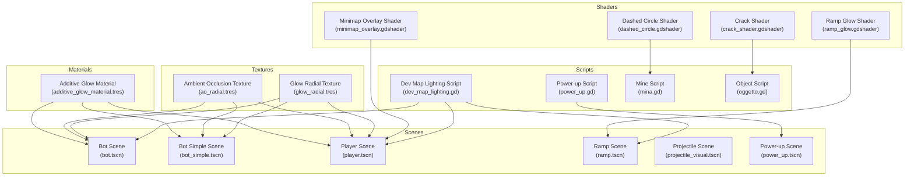
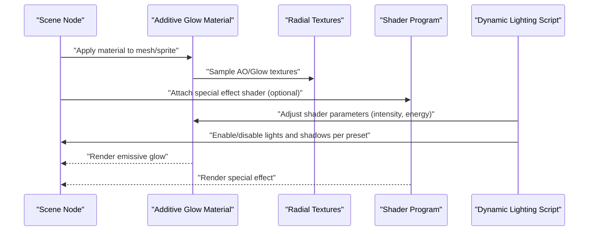
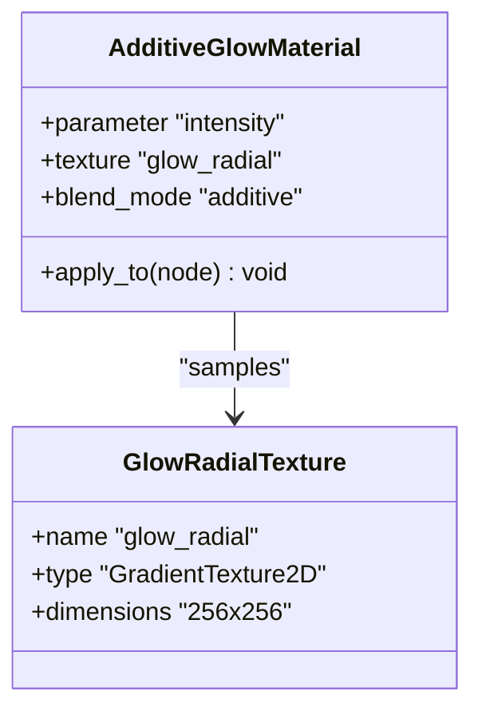
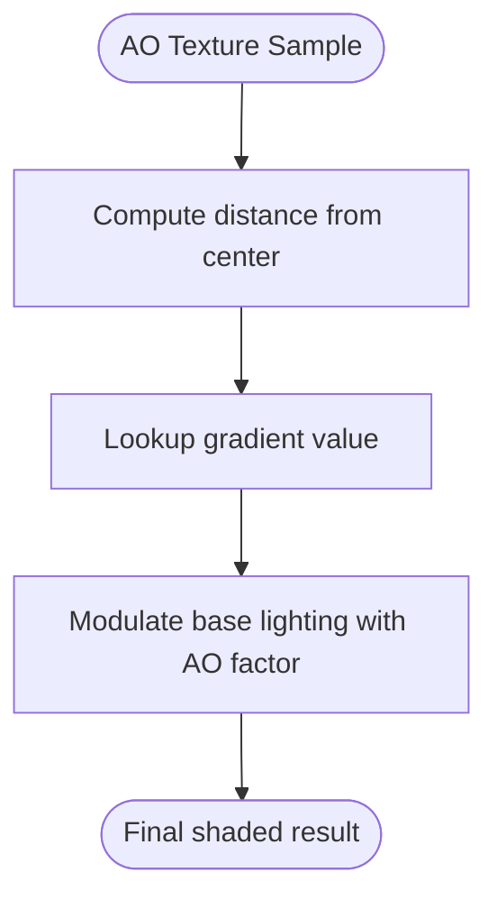
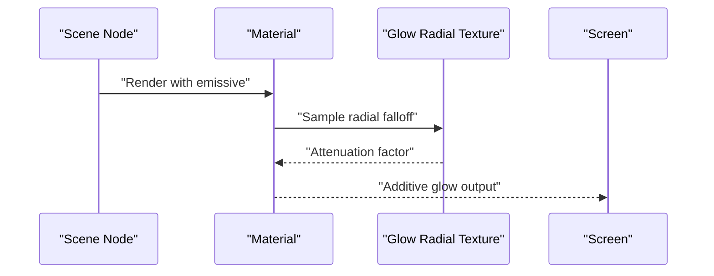
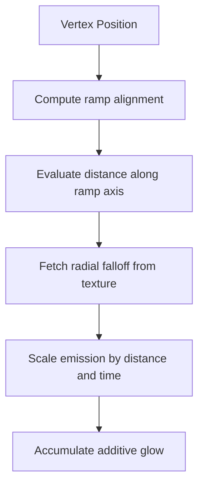
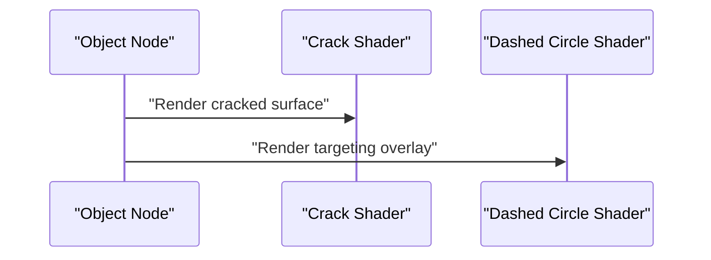
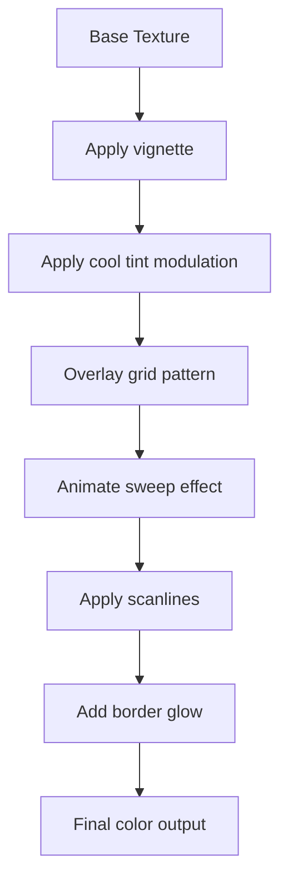
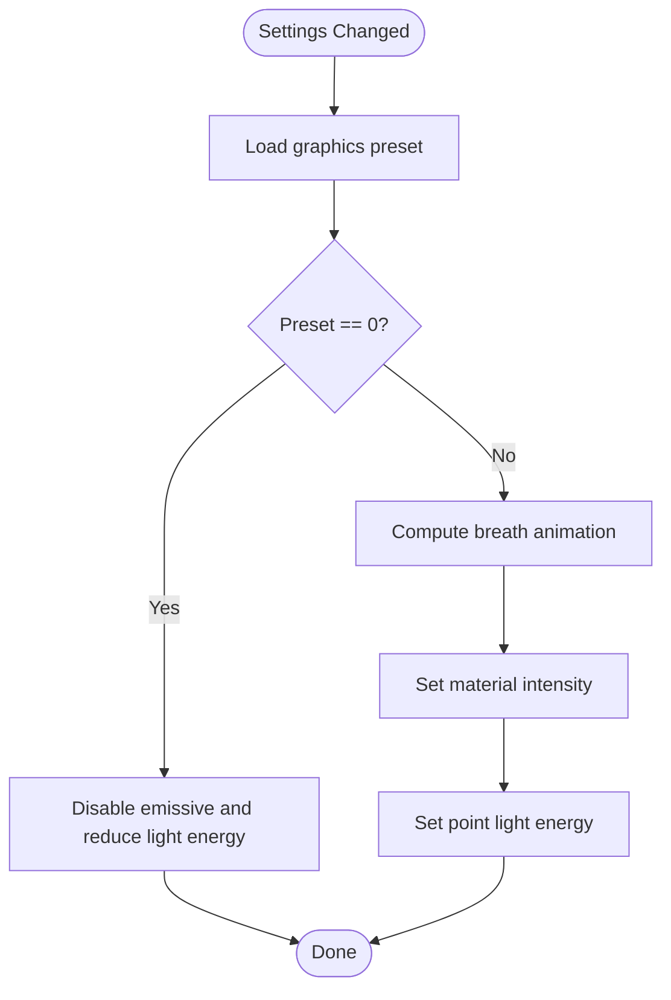
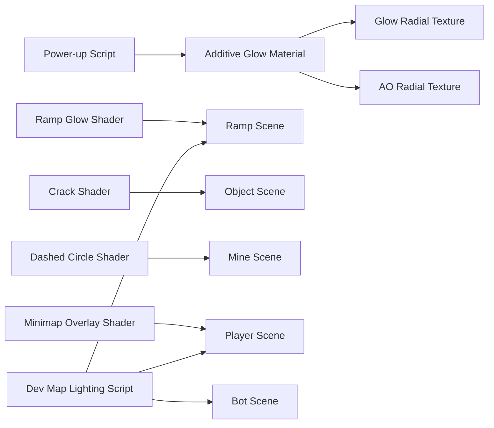

# Lighting and Environment Effects

<cite>
**Referenced Files in This Document**
- [additive_glow_material.tres](file://Assets/Lighting/additive_glow_material.tres)
- [ao_radial.tres](file://Assets/Lighting/ao_radial.tres)
- [glow_radial.tres](file://Assets/Lighting/glow_radial.tres)
- [ramp_glow.gdshader](file://Shaders/ramp_glow.gdshader)
- [crack_shader.gdshader](file://Shaders/crack_shader.gdshader)
- [dashed_circle.gdshader](file://Shaders/dashed_circle.gdshader)
- [minimap_overlay.gdshader](file://Shaders/HUD/minimap_overlay.gdshader)
- [power_up.gd](file://Scripts/power_up.gd)
- [mina.gd](file://Scripts/mina.gd)
- [oggetto.gd](file://Scripts/oggetto.gd)
- [dev_map_lighting.gd](file://Scripts/dev_map_lighting.gd)
- [bot.tscn](file://bot.tscn)
- [bot_simple.tscn](file://bot_simple.tscn)
- [player.tscn](file://player.tscn)
- [ramp.tscn](file://ramp.tscn)
- [projectile_visual.tscn](file://Scenes/projectile_visual.tscn)
- [power_up.tscn](file://Scenes/power_up.tscn)
- [shader_previewer_generator.gd](file://addons/shader-previewer/shader_previewer_generator.gd)
</cite>

## Table of Contents
1. [Introduction](#introduction)
2. [Project Structure](#project-structure)
3. [Core Components](#core-components)
4. [Architecture Overview](#architecture-overview)
5. [Detailed Component Analysis](#detailed-component-analysis)
6. [Dependency Analysis](#dependency-analysis)
7. [Performance Considerations](#performance-considerations)
8. [Troubleshooting Guide](#troubleshooting-guide)
9. [Conclusion](#conclusion)
10. [Appendices](#appendices)

## Introduction
This document describes TFA Agents’ lighting and environment effects system with a focus on additive glow materials, ambient occlusion visuals, and radial lighting implementations. It explains material properties, shader integration, dynamic lighting setup, light culling considerations, environment-specific configurations, and practical guidelines for creating custom lighting effects while maintaining render performance and compositional quality.

## Project Structure
The lighting system spans materials, textures, shaders, and scene integrations:
- Materials: Additive glow material for emissive highlights
- Textures: Radial gradients for ambient occlusion and glow falloff
- Shaders: Specialized effects for ramps, cracks, and HUD overlays
- Scenes: Entities that apply materials and textures to visual components
- Scripts: Runtime controls for dynamic lighting and quality-aware rendering

**Diagram sources**
- [additive_glow_material.tres](file://Assets/Lighting/additive_glow_material.tres)
- [ao_radial.tres](file://Assets/Lighting/ao_radial.tres)
- [glow_radial.tres](file://Assets/Lighting/glow_radial.tres)
- [ramp_glow.gdshader](file://Shaders/ramp_glow.gdshader)
- [crack_shader.gdshader](file://Shaders/crack_shader.gdshader)
- [dashed_circle.gdshader](file://Shaders/dashed_circle.gdshader)
- [minimap_overlay.gdshader](file://Shaders/HUD/minimap_overlay.gdshader)
- [bot.tscn](file://bot.tscn)
- [bot_simple.tscn](file://bot_simple.tscn)
- [player.tscn](file://player.tscn)
- [ramp.tscn](file://ramp.tscn)
- [projectile_visual.tscn](file://Scenes/projectile_visual.tscn)
- [power_up.tscn](file://Scenes/power_up.tscn)
- [power_up.gd](file://Scripts/power_up.gd)
- [dev_map_lighting.gd](file://Scripts/dev_map_lighting.gd)
- [mina.gd](file://Scripts/mina.gd)
- [oggetto.gd](file://Scripts/oggetto.gd)

**Section sources**
- [bot.tscn](file://bot.tscn)
- [bot_simple.tscn](file://bot_simple.tscn)
- [player.tscn](file://player.tscn)
- [ramp.tscn](file://ramp.tscn)
- [projectile_visual.tscn](file://Scenes/projectile_visual.tscn)
- [power_up.tscn](file://Scenes/power_up.tscn)
- [power_up.gd](file://Scripts/power_up.gd)
- [dev_map_lighting.gd](file://Scripts/dev_map_lighting.gd)
- [mina.gd](file://Scripts/mina.gd)
- [oggetto.gd](file://Scripts/oggetto.gd)

## Core Components
- Additive Glow Material: Provides emissive, screen-space additive blending for glowing effects on props and units.
- Ambient Occlusion Texture: Radial gradient used to simulate soft shadows in corners and occluded areas.
- Glow Radial Texture: Falloff pattern for radial glow, commonly used with additive materials.
- Ramp Glow Shader: Screen-space effect for environmental ramps and transitions.
- Crack Shader: Surface distortion and damage visualization.
- Dashed Circle Shader: Circular indicator or targeting overlay.
- Minimap Overlay Shader: Post-processing HUD effect with vignette, tint, scanlines, and border glow.
- Dynamic Lighting Script: Adjusts emissive intensity and light energy based on graphics presets.
- Dev Map Lighting Script: Environment-specific lighting configuration for development/testing maps.

**Section sources**
- [additive_glow_material.tres](file://Assets/Lighting/additive_glow_material.tres)
- [ao_radial.tres](file://Assets/Lighting/ao_radial.tres)
- [glow_radial.tres](file://Assets/Lighting/glow_radial.tres)
- [ramp_glow.gdshader](file://Shaders/ramp_glow.gdshader)
- [crack_shader.gdshader](file://Shaders/crack_shader.gdshader)
- [dashed_circle.gdshader](file://Shaders/dashed_circle.gdshader)
- [minimap_overlay.gdshader](file://Shaders/HUD/minimap_overlay.gdshader)
- [power_up.gd](file://Scripts/power_up.gd)
- [dev_map_lighting.gd](file://Scripts/dev_map_lighting.gd)

## Architecture Overview
The lighting pipeline integrates materials and textures with shaders and runtime scripts:
- Materials define surface appearance and blending modes.
- Textures supply radial patterns for AO and glow falloff.
- Shaders implement specialized visual effects (ramps, cracks, HUD overlays).
- Scripts manage dynamic parameters and environment-specific setups.

**Diagram sources**
- [additive_glow_material.tres](file://Assets/Lighting/additive_glow_material.tres)
- [ao_radial.tres](file://Assets/Lighting/ao_radial.tres)
- [glow_radial.tres](file://Assets/Lighting/glow_radial.tres)
- [ramp_glow.gdshader](file://Shaders/ramp_glow.gdshader)
- [power_up.gd](file://Scripts/power_up.gd)

## Detailed Component Analysis

### Additive Glow Material
- Purpose: Emissive, additive blending for glowing props, weapons, and UI elements.
- Integration: Applied via scene resources to sprites/mesh instances.
- Shader Parameters: Controlled at runtime (e.g., intensity) to match quality presets.
- Performance: Additive blending increases overdraw; use judiciously on screen-space effects.

**Diagram sources**
- [additive_glow_material.tres](file://Assets/Lighting/additive_glow_material.tres)
- [glow_radial.tres](file://Assets/Lighting/glow_radial.tres)

**Section sources**
- [additive_glow_material.tres](file://Assets/Lighting/additive_glow_material.tres)
- [glow_radial.tres](file://Assets/Lighting/glow_radial.tres)
- [power_up.gd](file://Scripts/power_up.gd)

### Ambient Occlusion Texture
- Purpose: Simulate soft self-shadowing in corners and tight spaces.
- Implementation: Radial gradient texture mapped to AO slots in materials.
- Usage: Integrated into scene materials for character and environment props.

**Diagram sources**
- [ao_radial.tres](file://Assets/Lighting/ao_radial.tres)

**Section sources**
- [ao_radial.tres](file://Assets/Lighting/ao_radial.tres)
- [bot.tscn](file://bot.tscn)
- [bot_simple.tscn](file://bot_simple.tscn)
- [player.tscn](file://player.tscn)

### Radial Lighting and Glow Falloff
- Glow Radial Texture: Used alongside additive materials to shape glow falloff.
- Scene Integrations: Applied to bots, player, ramp, projectiles, and power-ups.

**Diagram sources**
- [glow_radial.tres](file://Assets/Lighting/glow_radial.tres)
- [additive_glow_material.tres](file://Assets/Lighting/additive_glow_material.tres)
- [bot.tscn](file://bot.tscn)
- [player.tscn](file://player.tscn)
- [ramp.tscn](file://ramp.tscn)
- [projectile_visual.tscn](file://Scenes/projectile_visual.tscn)
- [power_up.tscn](file://Scenes/power_up.tscn)

**Section sources**
- [glow_radial.tres](file://Assets/Lighting/glow_radial.tres)
- [bot.tscn](file://bot.tscn)
- [player.tscn](file://player.tscn)
- [ramp.tscn](file://ramp.tscn)
- [projectile_visual.tscn](file://Scenes/projectile_visual.tscn)
- [power_up.tscn](file://Scenes/power_up.tscn)

### Ramp Glow Shader
- Purpose: Screen-space glow along ramps and transitions for environmental emphasis.
- Integration: Attached to relevant scene nodes via shader resource.

**Diagram sources**
- [ramp_glow.gdshader](file://Shaders/ramp_glow.gdshader)
- [ramp.tscn](file://ramp.tscn)

**Section sources**
- [ramp_glow.gdshader](file://Shaders/ramp_glow.gdshader)
- [ramp.tscn](file://ramp.tscn)

### Crack and Dashed Circle Shaders
- Crack Shader: Surface distortion for damaged or fractured geometry.
- Dashed Circle Shader: Circular indicators or targeting overlays.

**Diagram sources**
- [crack_shader.gdshader](file://Shaders/crack_shader.gdshader)
- [dashed_circle.gdshader](file://Shaders/dashed_circle.gdshader)
- [oggetto.gd](file://Scripts/oggetto.gd)
- [mina.gd](file://Scripts/mina.gd)

**Section sources**
- [crack_shader.gdshader](file://Shaders/crack_shader.gdshader)
- [dashed_circle.gdshader](file://Shaders/dashed_circle.gdshader)
- [oggetto.gd](file://Scripts/oggetto.gd)
- [mina.gd](file://Scripts/mina.gd)

### Minimap Overlay Shader
- Purpose: Post-processing HUD effect with vignette, cool tint, scanlines, and border glow.
- Controls: Uniform parameters for time scale, grid alpha, sweep alpha, and vignette strength.

**Diagram sources**
- [minimap_overlay.gdshader](file://Shaders/HUD/minimap_overlay.gdshader)
- [player.tscn](file://player.tscn)

**Section sources**
- [minimap_overlay.gdshader](file://Shaders/HUD/minimap_overlay.gdshader)
- [player.tscn](file://player.tscn)

### Dynamic Lighting Setup and Quality Presets
- Power-up Script: Adjusts emissive intensity and light energy based on graphics preset.
- Behavior:
  - Off (preset 0): Disable emissive and reduce light energy.
  - Low (preset 1): Minimal emissive and static light.
  - Medium/High (preset 2+): Animated emissive and shadow-enabled lights.

**Diagram sources**
- [power_up.gd](file://Scripts/power_up.gd)

**Section sources**
- [power_up.gd](file://Scripts/power_up.gd)

### Environment-Specific Lighting Configurations
- Dev Map Lighting Script: Environment-specific lighting configuration for development/testing maps.
- Usage: Centralized setup for dynamic lights, shadows, and post-processing adjustments during development.

**Section sources**
- [dev_map_lighting.gd](file://Scripts/dev_map_lighting.gd)

## Dependency Analysis
- Materials depend on textures for AO and glow falloff.
- Shaders depend on scene nodes and uniform parameters.
- Scripts depend on materials and scene nodes to adjust runtime properties.
- Scene resources declare external assets (materials/textures/shaders).

**Diagram sources**
- [additive_glow_material.tres](file://Assets/Lighting/additive_glow_material.tres)
- [ao_radial.tres](file://Assets/Lighting/ao_radial.tres)
- [glow_radial.tres](file://Assets/Lighting/glow_radial.tres)
- [ramp_glow.gdshader](file://Shaders/ramp_glow.gdshader)
- [crack_shader.gdshader](file://Shaders/crack_shader.gdshader)
- [dashed_circle.gdshader](file://Shaders/dashed_circle.gdshader)
- [minimap_overlay.gdshader](file://Shaders/HUD/minimap_overlay.gdshader)
- [power_up.gd](file://Scripts/power_up.gd)
- [dev_map_lighting.gd](file://Scripts/dev_map_lighting.gd)
- [bot.tscn](file://bot.tscn)
- [player.tscn](file://player.tscn)
- [ramp.tscn](file://ramp.tscn)
- [mina.gd](file://Scripts/mina.gd)
- [oggetto.gd](file://Scripts/oggetto.gd)

**Section sources**
- [bot.tscn](file://bot.tscn)
- [player.tscn](file://player.tscn)
- [ramp.tscn](file://ramp.tscn)
- [projectile_visual.tscn](file://Scenes/projectile_visual.tscn)
- [power_up.tscn](file://Scenes/power_up.tscn)
- [power_up.gd](file://Scripts/power_up.gd)
- [dev_map_lighting.gd](file://Scripts/dev_map_lighting.gd)
- [mina.gd](file://Scripts/mina.gd)
- [oggetto.gd](file://Scripts/oggetto.gd)

## Performance Considerations
- Additive Blending Overdraw: Excessive additive glow can increase overdraw and degrade frame rate. Limit emissive coverage and intensity.
- Texture Resolution: Radial textures are small (256x256), minimizing memory bandwidth but ensure mipmapping is enabled if scaled.
- Shader Complexity: Keep fragment shader logic minimal for HUD and screen-space effects; offload heavy computations to vertex shaders when possible.
- Quality Presets: Use runtime toggles to disable emissive and shadows on lower presets to maintain performance.
- Light Culling: Prefer local emissive materials over global lights for mobile-friendly performance. Use directional lights sparingly and enable cascaded shadows only when necessary.
- Post-Processing: HUD overlays add per-pixel cost; reduce alpha and avoid unnecessary animated effects on low-end devices.

[No sources needed since this section provides general guidance]

## Troubleshooting Guide
- Emissive Not Visible:
  - Verify material blend mode is set to additive and shader parameters are non-zero.
  - Confirm scene node applies the material to visible surfaces.
  - Check quality preset settings that may disable emissive.
- AO Looks Flat:
  - Ensure AO texture is assigned to the appropriate AO slot in the material.
  - Validate UV mapping and texture coordinates on target meshes.
- Glow Falloff Incorrect:
  - Confirm glow radial texture is applied and sampling coordinates are correct.
  - Adjust material parameters controlling intensity and falloff.
- Shader Effects Missing:
  - Verify shader resources are loaded and attached to the correct scene nodes.
  - Check script initialization paths that set up special effects.
- HUD Overlay Issues:
  - Inspect uniform parameters for vignette, grid alpha, and sweep alpha.
  - Ensure shader runs in CanvasItem mode and is not overridden by other post-processing steps.

**Section sources**
- [power_up.gd](file://Scripts/power_up.gd)
- [additive_glow_material.tres](file://Assets/Lighting/additive_glow_material.tres)
- [ao_radial.tres](file://Assets/Lighting/ao_radial.tres)
- [glow_radial.tres](file://Assets/Lighting/glow_radial.tres)
- [ramp_glow.gdshader](file://Shaders/ramp_glow.gdshader)
- [crack_shader.gdshader](file://Shaders/crack_shader.gdshader)
- [dashed_circle.gdshader](file://Shaders/dashed_circle.gdshader)
- [minimap_overlay.gdshader](file://Shaders/HUD/minimap_overlay.gdshader)

## Conclusion
TFA Agents employs a layered lighting system combining additive materials, radial textures, and specialized shaders to achieve atmospheric glow, ambient occlusion simulation, and environment-specific effects. By leveraging quality-presets, careful material usage, and targeted shader logic, the system balances visual fidelity with performance. The provided scripts and environment configurations offer flexible, scalable foundations for extending and optimizing lighting across scenes.

[No sources needed since this section summarizes without analyzing specific files]

## Appendices

### Shader Previewer Built-ins Reference
The shader previewer defines built-in uniforms and assignments for spatial and canvas shaders, including AO and related lighting terms. This supports authoring and validating lighting-related shader parameters.

**Section sources**
- [shader_previewer_generator.gd](file://addons/shader-previewer/shader_previewer_generator.gd)