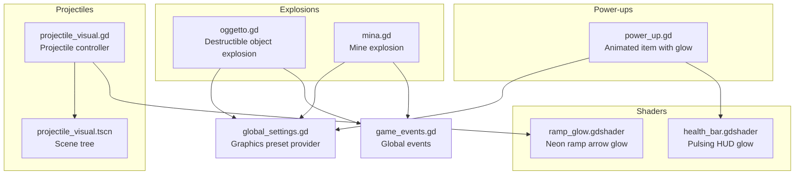
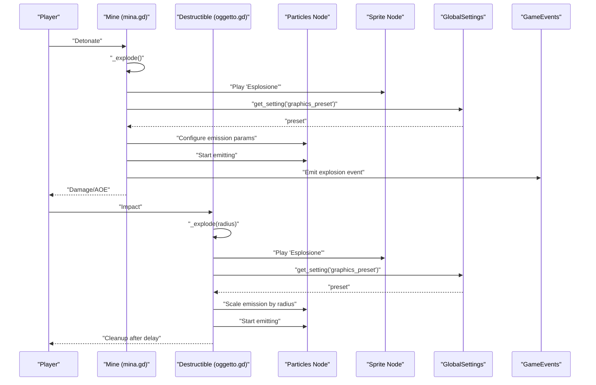
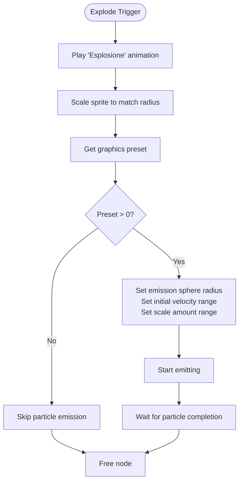
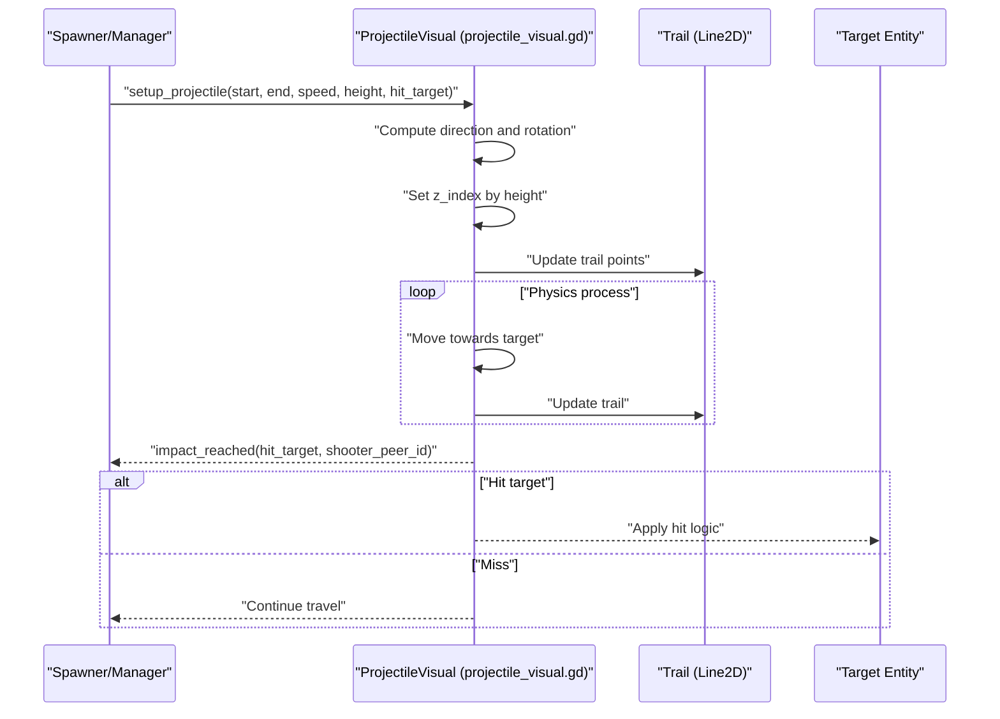
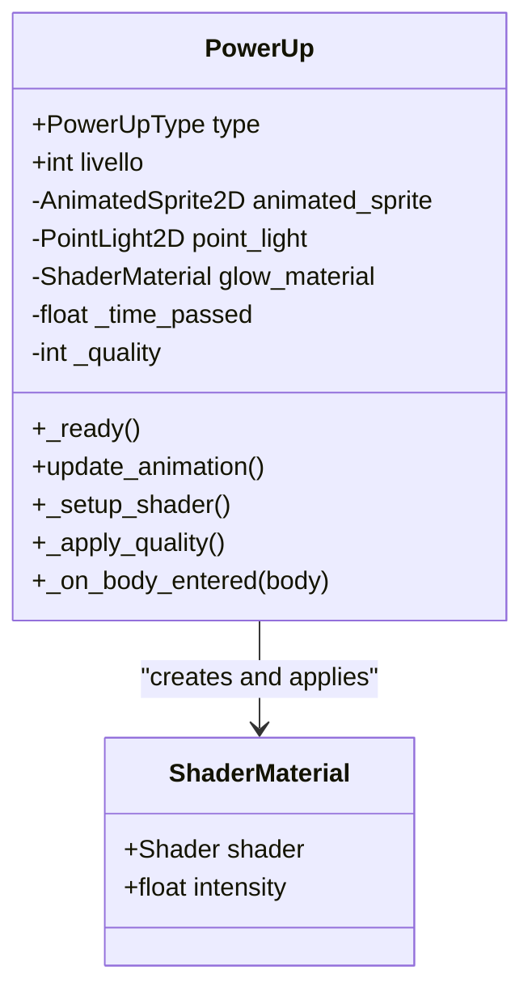
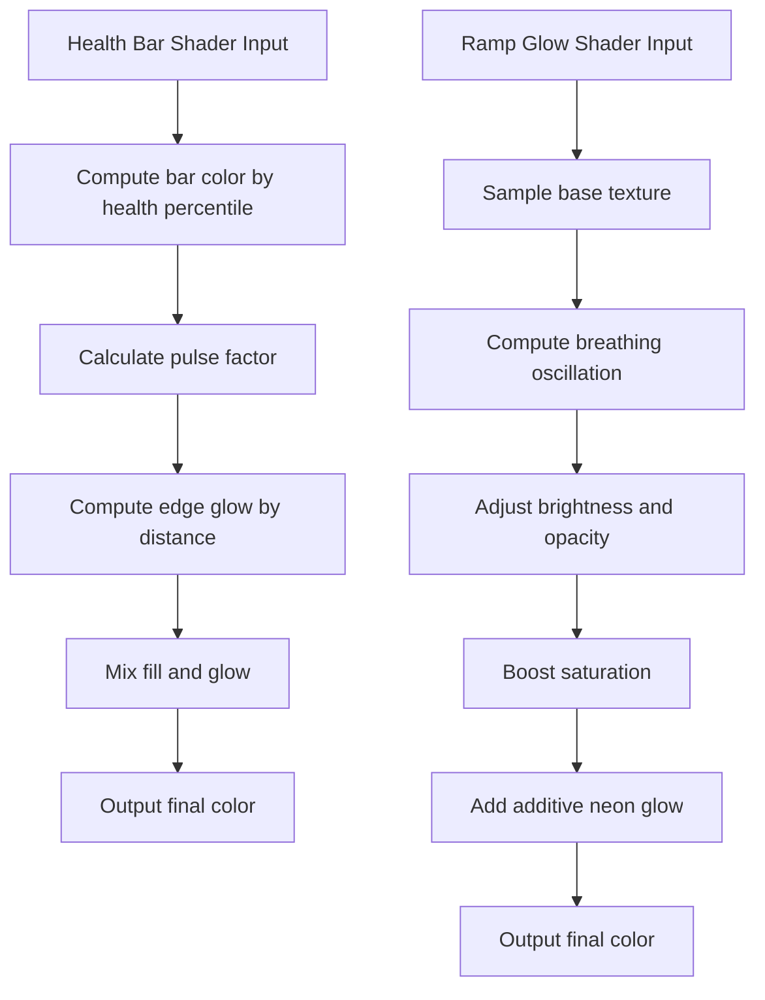
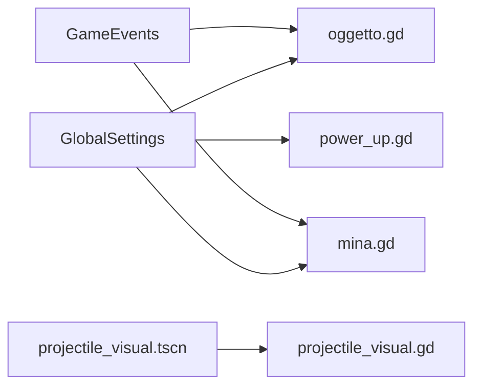

# Particle and Visual Effects

<cite>
**Referenced Files in This Document**
- [oggetto.gd](file://Scripts/oggetto.gd)
- [mina.gd](file://Scripts/mina.gd)
- [projectile_visual.gd](file://Scripts/projectile_visual.gd)
- [projectile_visual.tscn](file://Scenes/projectile_visual.tscn)
- [power_up.gd](file://Scripts/power_up.gd)
- [health_bar.gdshader](file://Shaders/HUD/health_bar.gdshader)
- [ramp_glow.gdshader](file://Shaders/ramp_glow.gdshader)
- [global_settings.gd](file://Scripts/global_settings.gd)
- [game_events.gd](file://Scripts/game_events.gd)
</cite>

## Table of Contents
1. [Introduction](#introduction)
2. [Project Structure](#project-structure)
3. [Core Components](#core-components)
4. [Architecture Overview](#architecture-overview)
5. [Detailed Component Analysis](#detailed-component-analysis)
6. [Dependency Analysis](#dependency-analysis)
7. [Performance Considerations](#performance-considerations)
8. [Troubleshooting Guide](#troubleshooting-guide)
9. [Conclusion](#conclusion)
10. [Appendices](#appendices)

## Introduction
This document explains TFA Agents’ particle systems and visual effects with a focus on explosion particle effects, projectile visual components, and power-up animations. It covers how emission systems are configured, how lifetimes and scales are managed, and how visual effects are composed across scenes. It also provides performance optimization guidelines, memory management advice, and rendering efficiency tips, along with practical guidance for creating custom particle effects and integrating visual assets consistently across different hardware configurations.

## Project Structure
The particle and visual effects in TFA Agents are implemented across several scripts and scenes:
- Explosions: triggered by destructible objects and mines, combining sprite animation and particle emission.
- Projectiles: visual representation with configurable speed and optional trailing effects.
- Power-ups: animated items with dynamic lighting and shader-based glow, reacting to graphics presets.
- HUD and environmental shaders: health bar pulsing glow and ramp arrow neon glow.

**Diagram sources**
- [oggetto.gd:210-248](file://Scripts/oggetto.gd#L210-L248)
- [mina.gd:118-299](file://Scripts/mina.gd#L118-L299)
- [projectile_visual.gd:1-45](file://Scripts/projectile_visual.gd#L1-L45)
- [projectile_visual.tscn](file://Scenes/projectile_visual.tscn)
- [power_up.gd:1-150](file://Scripts/power_up.gd#L1-L150)
- [health_bar.gdshader:1-38](file://Shaders/HUD/health_bar.gdshader#L1-L38)
- [ramp_glow.gdshader:1-48](file://Shaders/ramp_glow.gdshader#L1-L48)
- [global_settings.gd](file://Scripts/global_settings.gd)
- [game_events.gd](file://Scripts/game_events.gd)

**Section sources**
- [oggetto.gd:210-248](file://Scripts/oggetto.gd#L210-L248)
- [mina.gd:118-299](file://Scripts/mina.gd#L118-L299)
- [projectile_visual.gd:1-45](file://Scripts/projectile_visual.gd#L1-L45)
- [power_up.gd:1-150](file://Scripts/power_up.gd#L1-L150)
- [health_bar.gdshader:1-38](file://Shaders/HUD/health_bar.gdshader#L1-L38)
- [ramp_glow.gdshader:1-48](file://Shaders/ramp_glow.gdshader#L1-L48)
- [global_settings.gd](file://Scripts/global_settings.gd)
- [game_events.gd](file://Scripts/game_events.gd)

## Core Components
- Explosion particle effects:
  - Destructible objects and mines trigger explosion visuals by playing a sprite animation named “Esplosione” and emitting particles from a particle node.
  - Particle emission sphere radius, initial velocity range, and scale amount range are tuned based on explosion radius.
  - A graphics preset check disables particle emission on low quality to save performance.
- Projectile visual components:
  - A dedicated scene/controller manages projectile movement, height-level z-indexing, and optional trailing effects.
  - Speed and trail length are exported parameters for tuning.
- Power-up animations:
  - Animated sprites play different animations depending on type.
  - Dynamic shader material adds glow intensity based on a uniform, controlled by the graphics preset.
  - Power-ups react to height-level alignment and emit a global event upon collection.

**Section sources**
- [oggetto.gd:210-248](file://Scripts/oggetto.gd#L210-L248)
- [mina.gd:257-285](file://Scripts/mina.gd#L257-L285)
- [projectile_visual.gd:1-45](file://Scripts/projectile_visual.gd#L1-L45)
- [power_up.gd:105-150](file://Scripts/power_up.gd#L105-L150)

## Architecture Overview
The visual effect pipeline integrates scene nodes, scripts, and shaders:
- Scene nodes encapsulate visual elements (sprites, particle nodes, lights).
- Scripts orchestrate lifecycle, scaling, and emission parameters.
- Shaders enhance visual quality with dynamic glow and breathing effects.
- Global settings provide runtime quality adjustments.

**Diagram sources**
- [mina.gd:257-285](file://Scripts/mina.gd#L257-L285)
- [oggetto.gd:210-248](file://Scripts/oggetto.gd#L210-L248)
- [global_settings.gd](file://Scripts/global_settings.gd)
- [game_events.gd](file://Scripts/game_events.gd)

## Detailed Component Analysis

### Explosion Particle Effects
Explosions combine sprite animation and particle emission:
- Sprite animation:
  - The sprite plays a predefined animation named “Esplosione.”
  - Scale is adjusted to visually match the explosion radius and maintain consistent visual impact.
- Particle emission:
  - Emission sphere radius is set to the explosion radius.
  - Initial velocity minimum and maximum are scaled with the radius to reflect blast force.
  - Scale amount minimum and maximum are computed from the radius to keep visuals proportional.
  - Emission is gated by the graphics preset; on low preset, particles are skipped.
- Lifecycle:
  - After starting emission, the object waits briefly to let particles finish, then frees itself.

**Diagram sources**
- [oggetto.gd:210-248](file://Scripts/oggetto.gd#L210-L248)
- [mina.gd:257-285](file://Scripts/mina.gd#L257-L285)
- [global_settings.gd](file://Scripts/global_settings.gd)

**Section sources**
- [oggetto.gd:210-248](file://Scripts/oggetto.gd#L210-L248)
- [mina.gd:257-285](file://Scripts/mina.gd#L257-L285)

### Projectile Visual Components
Projectile visuals are handled by a dedicated controller that:
- Computes direction and rotation from start to end position.
- Sets speed and z-index based on height level to ensure proper layering.
- Updates a trailing effect (if present) during travel.
- Emits an impact signal when the projectile reaches its destination.

**Diagram sources**
- [projectile_visual.gd:22-45](file://Scripts/projectile_visual.gd#L22-L45)
- [projectile_visual.tscn](file://Scenes/projectile_visual.tscn)

**Section sources**
- [projectile_visual.gd:1-45](file://Scripts/projectile_visual.gd#L1-L45)

### Power-up Animations and Glow
Power-ups use:
- Animated sprites to represent different item types.
- A dynamically created shader material to add glow, controlled by a uniform intensity.
- Quality-aware rendering: shader intensity and animation complexity adapt to the graphics preset.
- Height-level alignment ensures only items on the same level as the player can be collected.
- On collection, a global event is emitted and the item is freed.

**Diagram sources**
- [power_up.gd:1-150](file://Scripts/power_up.gd#L1-L150)

**Section sources**
- [power_up.gd:1-150](file://Scripts/power_up.gd#L1-L150)

### HUD and Environmental Shaders
- Health bar shader:
  - Uses a health percentage input to draw filled color and a border glow.
  - Implements a time-based pulse and smooth edge blending for visual feedback.
- Ramp glow shader:
  - Adds a pulsing neon glow synchronized with a breathing speed.
  - Adjusts opacity and saturation to make directional indicators stand out against backgrounds.

**Diagram sources**
- [health_bar.gdshader:1-38](file://Shaders/HUD/health_bar.gdshader#L1-L38)
- [ramp_glow.gdshader:1-48](file://Shaders/ramp_glow.gdshader#L1-L48)

**Section sources**
- [health_bar.gdshader:1-38](file://Shaders/HUD/health_bar.gdshader#L1-L38)
- [ramp_glow.gdshader:1-48](file://Shaders/ramp_glow.gdshader#L1-L48)

## Dependency Analysis
- Graphics preset provider:
  - Global settings expose a method to fetch the current graphics preset, which controls whether particle emission occurs and how shader intensities behave.
- Event propagation:
  - Explosions emit global events for synchronization across clients or systems.
- Scene-to-script coupling:
  - Projectile visuals rely on a scene tree containing a trail node; scripts assume presence and type of child nodes.

**Diagram sources**
- [global_settings.gd](file://Scripts/global_settings.gd)
- [oggetto.gd:210-248](file://Scripts/oggetto.gd#L210-L248)
- [mina.gd:257-285](file://Scripts/mina.gd#L257-L285)
- [power_up.gd:1-150](file://Scripts/power_up.gd#L1-L150)
- [projectile_visual.tscn](file://Scenes/projectile_visual.tscn)
- [projectile_visual.gd:1-45](file://Scripts/projectile_visual.gd#L1-L45)
- [game_events.gd](file://Scripts/game_events.gd)

**Section sources**
- [global_settings.gd](file://Scripts/global_settings.gd)
- [game_events.gd](file://Scripts/game_events.gd)

## Performance Considerations
- Disable particle emission on low graphics presets:
  - Explosions skip particle emission when the preset indicates low quality, reducing GPU load.
- Tune emission parameters by scale:
  - Emission sphere radius and velocity ranges are proportional to explosion radius, ensuring consistent visuals without unnecessary particle counts.
- Use shader-based glow sparingly:
  - Power-up glow intensity is controlled by a uniform; lower presets can reduce intensity to preserve performance.
- Optimize trail rendering:
  - Keep trail length reasonable; long trails increase vertex updates and GPU bandwidth.
- Layering and culling:
  - Set z-indexes by height level to avoid overdraw and leverage spatial sorting.
- Event-driven cleanup:
  - Free nodes after particle completion to prevent lingering effects from consuming resources.

[No sources needed since this section provides general guidance]

## Troubleshooting Guide
- Particles not appearing:
  - Verify the graphics preset is not set to low.
  - Confirm the particle node exists and is enabled on the exploded object.
  - Ensure the sprite animation “Esplosione” is present and properly assigned.
- Incorrect explosion scale:
  - Check that the emission sphere radius and scale amount ranges are derived from the explosion radius.
- Projectile not reaching target:
  - Validate speed and remaining distance calculations.
  - Confirm the scene tree includes a trail node if trail updates are expected.
- Power-up glow not visible:
  - Ensure the shader material is applied to the animated sprite.
  - Confirm the graphics preset allows sufficient glow intensity.
- HUD glow anomalies:
  - Review shader uniforms and ensure health percentage is within the expected range.

**Section sources**
- [oggetto.gd:210-248](file://Scripts/oggetto.gd#L210-L248)
- [mina.gd:257-285](file://Scripts/mina.gd#L257-L285)
- [projectile_visual.gd:1-45](file://Scripts/projectile_visual.gd#L1-L45)
- [power_up.gd:1-150](file://Scripts/power_up.gd#L1-L150)
- [health_bar.gdshader:1-38](file://Shaders/HUD/health_bar.gdshader#L1-L38)

## Conclusion
TFA Agents’ particle and visual effects are designed around a cohesive system: sprite animations deliver immediate visual feedback, particle emission reinforces scale and intensity, and shader-based enhancements improve perceived quality. By leveraging the graphics preset system, carefully tuning emission parameters, and optimizing trail rendering, the project maintains consistent visual quality while preserving performance across diverse hardware configurations.

[No sources needed since this section summarizes without analyzing specific files]

## Appendices
- Creating custom particle effects:
  - Use a dedicated particle node and configure emission sphere radius, initial velocity ranges, and scale amounts based on the intended effect scale.
  - Gate emission by the graphics preset to disable on low settings.
  - Emit a cleanup signal or timer-based free to manage lifecycle.
- Integrating visual assets:
  - Assign sprite frames and animations to sprite nodes; ensure animation names match the code’s expectations.
  - For glow effects, create shader materials and expose uniforms for intensity control.
- Maintaining consistent visual quality:
  - Provide fallbacks for low presets (disable particles, reduce shader intensity).
  - Test across devices with varying capabilities and adjust defaults accordingly.

[No sources needed since this section provides general guidance]