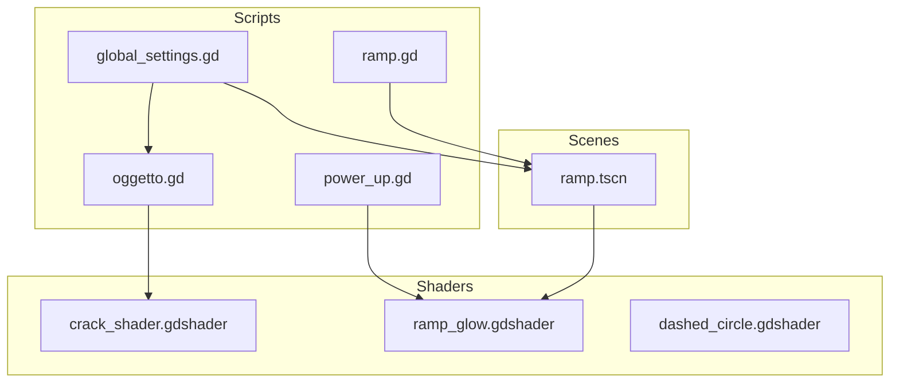
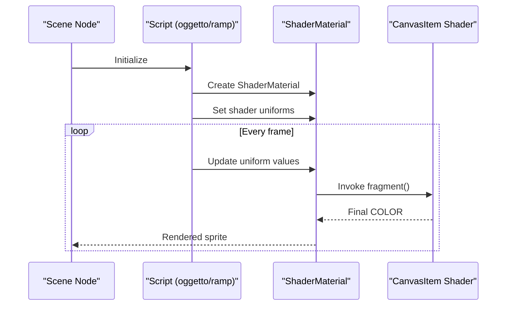
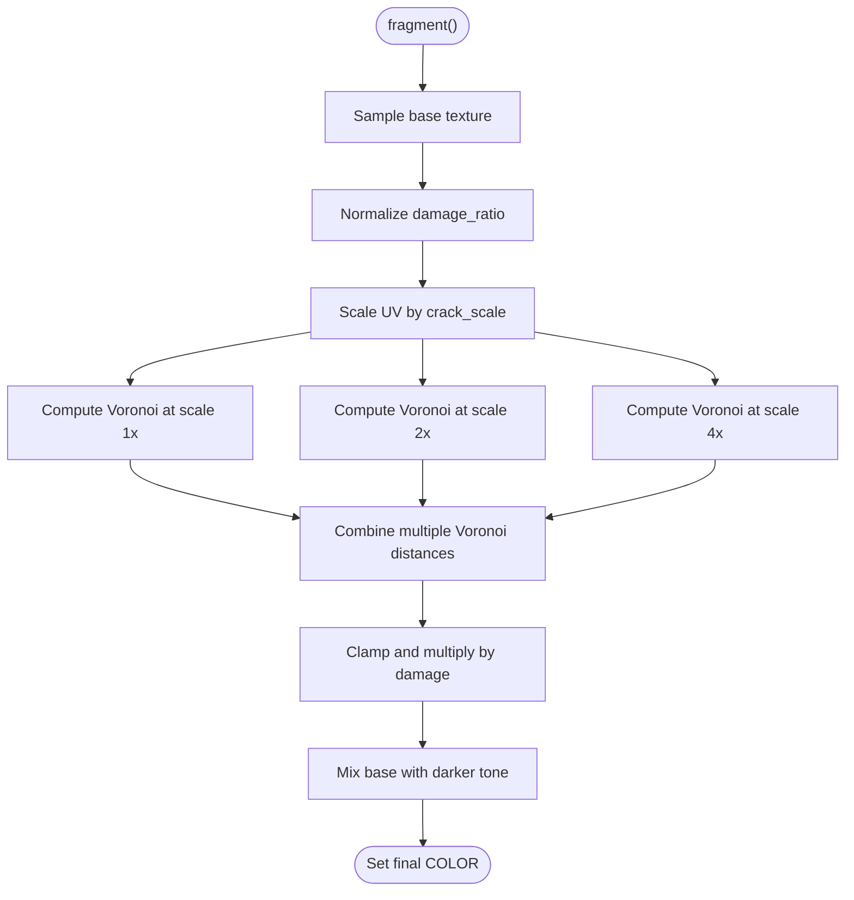
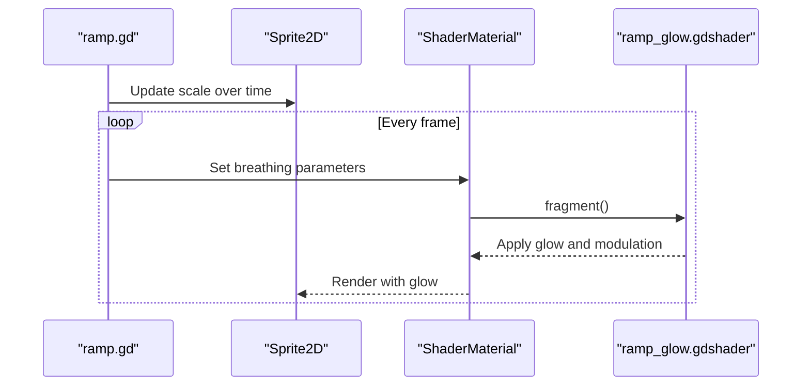
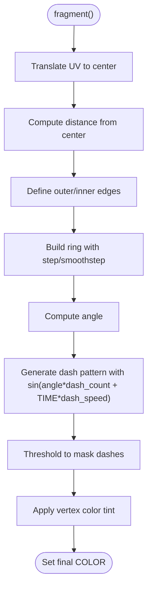
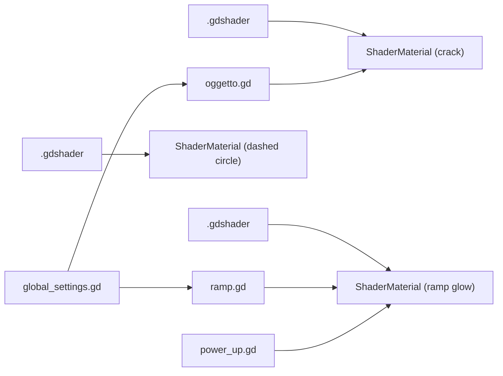

# Environmental Shaders

<cite>
**Referenced Files in This Document**
- [crack_shader.gdshader](file://Shaders/crack_shader.gdshader)
- [ramp_glow.gdshader](file://Shaders/ramp_glow.gdshader)
- [dashed_circle.gdshader](file://Shaders/dashed_circle.gdshader)
- [oggetto.gd](file://Scripts/oggetto.gd)
- [ramp.gd](file://Scripts/ramp.gd)
- [ramp.tscn](file://Scenes/ramp.tscn)
- [global_settings.gd](file://Scripts/global_settings.gd)
- [power_up.gd](file://Scripts/power_up.gd)
</cite>

## Table of Contents
1. [Introduction](#introduction)
2. [Project Structure](#project-structure)
3. [Core Components](#core-components)
4. [Architecture Overview](#architecture-overview)
5. [Detailed Component Analysis](#detailed-component-analysis)
6. [Dependency Analysis](#dependency-analysis)
7. [Performance Considerations](#performance-considerations)
8. [Troubleshooting Guide](#troubleshooting-guide)
9. [Conclusion](#conclusion)

## Introduction
This document explains the environmental effect shaders used in TFA Agents for terrain damage visualization, interactive platform effects, and targeting indicators. It covers:
- Crack shader for destructible terrain/props
- Ramp glow shader for interactive platform effects
- Dashed circle shader for targeting indicators

It also details procedural texture generation, distortion-like effects, time-based animations, parameter tuning, performance considerations, and integration with the game environment systems.

## Project Structure
The shaders are implemented as Godot CanvasItem shaders and integrated via ShaderMaterial nodes attached to scene sprites. The scripts manage runtime parameter updates and visibility based on graphics presets.

**Diagram sources**
- [ramp.tscn](file://Scenes/ramp.tscn)
- [oggetto.gd](file://Scripts/oggetto.gd)
- [ramp.gd](file://Scripts/ramp.gd)
- [global_settings.gd](file://Scripts/global_settings.gd)
- [power_up.gd](file://Scripts/power_up.gd)
- [crack_shader.gdshader](file://Shaders/crack_shader.gdshader)
- [ramp_glow.gdshader](file://Shaders/ramp_glow.gdshader)
- [dashed_circle.gdshader](file://Shaders/dashed_circle.gdshader)

**Section sources**
- [ramp.tscn](file://Scenes/ramp.tscn)
- [oggetto.gd](file://Scripts/oggetto.gd)
- [ramp.gd](file://Scripts/ramp.gd)
- [global_settings.gd](file://Scripts/global_settings.gd)
- [power_up.gd](file://Scripts/power_up.gd)

## Core Components
- Crack shader: Procedural Voronoi-based cracking overlay with damage ratio modulation and configurable scale/width/strength.
- Ramp glow shader: Time-based breathing animation with additive neon glow, opacity modulation, and color enhancement.
- Dashed circle shader: Radial dashed indicator using trigonometric masking and optional antialiased edges.

Key shader parameters and behaviors:
- Crack shader parameters: damage_ratio, crack_scale, crack_width, crack_strength.
- Ramp glow parameters: glow_color, glow_intensity, breathing_speed, base_opacity.
- Dashed circle parameters: radius, thickness, dash_count, dash_speed, quality.

**Section sources**
- [crack_shader.gdshader](file://Shaders/crack_shader.gdshader)
- [ramp_glow.gdshader](file://Shaders/ramp_glow.gdshader)
- [dashed_circle.gdshader](file://Shaders/dashed_circle.gdshader)

## Architecture Overview
The shaders are applied at runtime via ShaderMaterial nodes. Scripts set shader parameters dynamically and handle visibility based on global graphics presets.

**Diagram sources**
- [oggetto.gd](file://Scripts/oggetto.gd)
- [ramp.gd](file://Scripts/ramp.gd)
- [crack_shader.gdshader](file://Shaders/crack_shader.gdshader)
- [ramp_glow.gdshader](file://Shaders/ramp_glow.gdshader)

## Detailed Component Analysis

### Crack Shader (Terrain Damage Visualization)
Purpose:
- Visualize damage on destructible props by overlaying procedural cracks on top of the base texture.

Implementation highlights:
- Uses a hash function and Voronoi noise to generate organic crack patterns.
- Multi-frequency Voronoi samples blend to produce varied crack widths and scales.
- Damage ratio controls the overall strength of the effect.
- Mixes base color with a desaturated darkening factor based on crack density.

Runtime integration:
- Script creates ShaderMaterial, assigns shader, sets type-specific parameters, and updates damage_ratio each frame.

**Diagram sources**
- [crack_shader.gdshader](file://Shaders/crack_shader.gdshader)
- [oggetto.gd](file://Scripts/oggetto.gd)

**Section sources**
- [crack_shader.gdshader](file://Shaders/crack_shader.gdshader)
- [oggetto.gd](file://Scripts/oggetto.gd)

### Ramp Glow Shader (Interactive Platform Effects)
Purpose:
- Enhance ramps with a pulsating neon glow and subtle color boost to highlight interactive platforms.

Implementation highlights:
- Uses TIME for smooth sine-based breathing animation.
- Brightness and opacity vary together to create a synchronized pulse.
- Applies contrast and saturation boosts to emphasize the orange glow.
- Adds an additive neon contribution based on alpha to avoid darkening transparent areas.

Runtime integration:
- Scene defines ShaderMaterial with initial parameters; script adjusts sprite scale over time for additional feedback.

**Diagram sources**
- [ramp.gd](file://Scripts/ramp.gd)
- [ramp.tscn](file://Scenes/ramp.tscn)
- [ramp_glow.gdshader](file://Shaders/ramp_glow.gdshader)

**Section sources**
- [ramp_glow.gdshader](file://Shaders/ramp_glow.gdshader)
- [ramp.gd](file://Scripts/ramp.gd)
- [ramp.tscn](file://Scenes/ramp.tscn)

### Dashed Circle Shader (Targeting Indicators)
Purpose:
- Draw a radial dashed ring around a target position for targeting or range visualization.

Implementation highlights:
- Computes distance from center and builds an annular ring using step/smoothstep.
- Uses angle-based sine modulation to create dashes rotating with time.
- Quality toggle switches between hard-edged and antialiased edges.
- Uses vertex color for dynamic tinting.

**Diagram sources**
- [dashed_circle.gdshader](file://Shaders/dashed_circle.gdshader)

**Section sources**
- [dashed_circle.gdshader](file://Shaders/dashed_circle.gdshader)

## Dependency Analysis
- ShaderMaterial nodes depend on Shader resources defined in .gdshader files.
- Scripts own ShaderMaterial instances and set shader parameters.
- Graphics presets control shader visibility and intensity globally.

**Diagram sources**
- [crack_shader.gdshader](file://Shaders/crack_shader.gdshader)
- [ramp_glow.gdshader](file://Shaders/ramp_glow.gdshader)
- [dashed_circle.gdshader](file://Shaders/dashed_circle.gdshader)
- [oggetto.gd](file://Scripts/oggetto.gd)
- [ramp.gd](file://Scripts/ramp.gd)
- [global_settings.gd](file://Scripts/global_settings.gd)
- [power_up.gd](file://Scripts/power_up.gd)

**Section sources**
- [oggetto.gd](file://Scripts/oggetto.gd)
- [ramp.gd](file://Scripts/ramp.gd)
- [global_settings.gd](file://Scripts/global_settings.gd)
- [power_up.gd](file://Scripts/power_up.gd)

## Performance Considerations
- Voronoi computation cost: The crack shader computes multiple Voronoi samples per fragment; keep crack_scale and crack_width within tuned ranges to balance quality and performance.
- Time-based effects: ramp glow and dashed circle rely on TIME; ensure minimal branching and avoid heavy math when possible.
- Quality toggles: The dashed circle shader’s quality parameter switches between cheap step and smoothstep; prefer hard edges for lower presets.
- Graphics presets: Global settings disable materials or reduce intensities for low presets; leverage this to maintain performance across devices.

[No sources needed since this section provides general guidance]

## Troubleshooting Guide
Common issues and resolutions:
- Shader not visible:
  - Verify ShaderMaterial is assigned to the sprite and not cleared during destruction or preset changes.
  - Check global graphics preset logic that may disable materials for preset 0.
- Incorrect crack appearance:
  - Adjust crack_scale and crack_width for the object type; ensure damage_ratio updates correctly.
- Glow not pulsing:
  - Confirm breathing_speed is set and sprite scale animation is active; verify shader parameters are being updated each frame.
- Dashed ring not visible:
  - Ensure vertex color alpha is sufficient and quality setting matches desired edge softness.
  - Verify dash_count and dash_speed produce visible dashes at intended frequency.

**Section sources**
- [oggetto.gd](file://Scripts/oggetto.gd)
- [ramp.gd](file://Scripts/ramp.gd)
- [global_settings.gd](file://Scripts/global_settings.gd)
- [power_up.gd](file://Scripts/power_up.gd)

## Conclusion
These environmental effect shaders provide immersive, performance-conscious feedback for destructible props, interactive ramps, and targeting indicators. Their procedural nature and time-based animations integrate cleanly with the game’s scripting layer and global graphics settings, enabling scalable visuals across a range of hardware configurations.