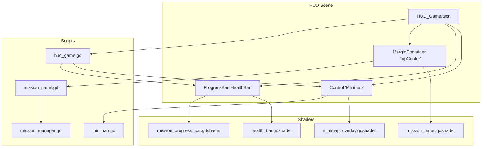
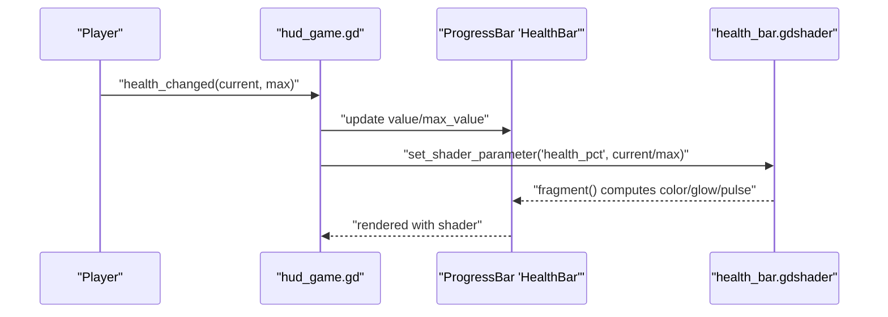
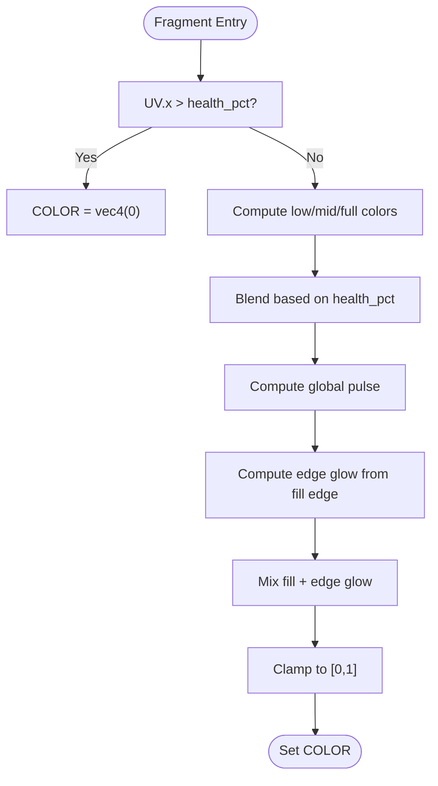
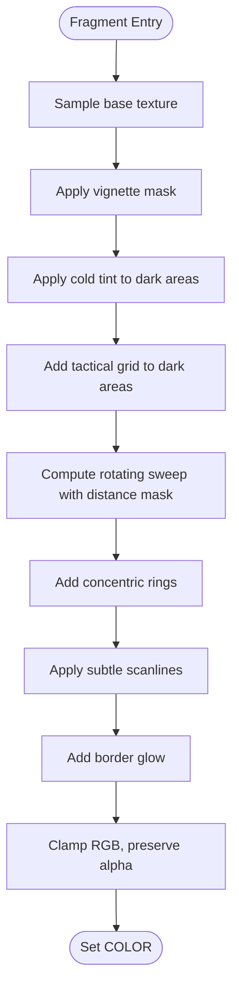
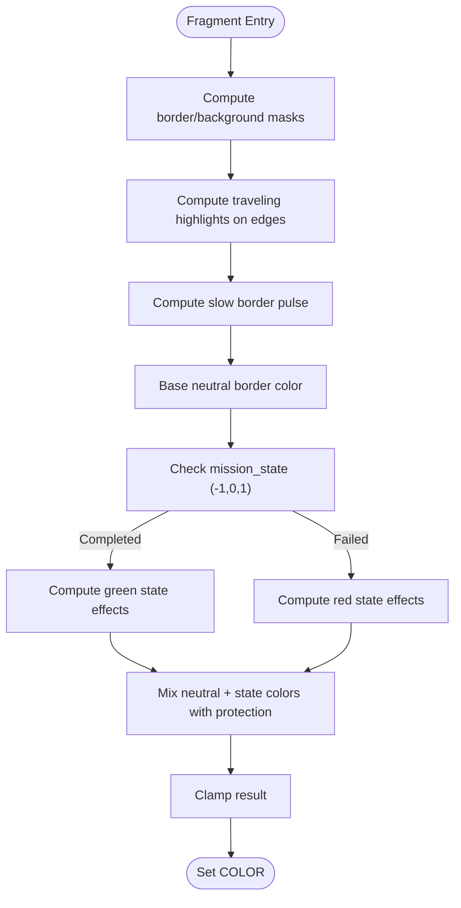
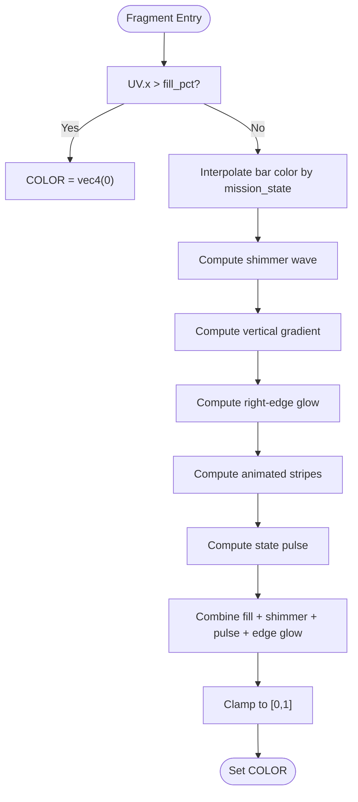
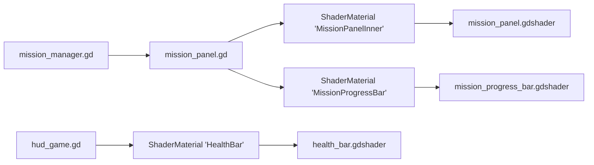

# HUD Shaders

<cite>
**Referenced Files in This Document**
- [health_bar.gdshader](file://Shaders/HUD/health_bar.gdshader)
- [minimap_overlay.gdshader](file://Shaders/HUD/minimap_overlay.gdshader)
- [mission_panel.gdshader](file://Shaders/HUD/mission_panel.gdshader)
- [mission_progress_bar.gdshader](file://Shaders/HUD/mission_progress_bar.gdshader)
- [hud_game.gd](file://Menu/HUD/hud_game.gd)
- [minimap.gd](file://Menu/HUD/minimap.gd)
- [mission_panel.gd](file://Scripts/mission_panel.gd)
- [mission_manager.gd](file://Scripts/mission_manager.gd)
- [HUD_Game.tscn](file://Menu/HUD/HUD_Game.tscn)
- [global_theme.tres](file://Assets/UI/global_theme.tres)
</cite>

## Table of Contents
1. [Introduction](#introduction)
2. [Project Structure](#project-structure)
3. [Core Components](#core-components)
4. [Architecture Overview](#architecture-overview)
5. [Detailed Component Analysis](#detailed-component-analysis)
6. [Dependency Analysis](#dependency-analysis)
7. [Performance Considerations](#performance-considerations)
8. [Troubleshooting Guide](#troubleshooting-guide)
9. [Conclusion](#conclusion)

## Introduction
This document explains the HUD shader implementations in TFA Agents, focusing on health bar rendering, minimap overlay effects, mission panel styling, and progress bar visuals. It covers shader parameterization, uniform usage patterns, fragment processing workflows, customization examples, performance optimization techniques, and integration with the UI system.

## Project Structure
The HUD shaders are located under Shaders/HUD and are integrated into the main HUD scene (HUD_Game.tscn). The UI logic is implemented in GDScript files that update shader parameters dynamically based on game state.

**Diagram sources**
- [HUD_Game.tscn](file://Menu/HUD/HUD_Game.tscn)
- [hud_game.gd](file://Menu/HUD/hud_game.gd)
- [mission_panel.gd](file://Scripts/mission_panel.gd)
- [minimap.gd](file://Menu/HUD/minimap.gd)
- [mission_manager.gd](file://Scripts/mission_manager.gd)
- [health_bar.gdshader](file://Shaders/HUD/health_bar.gdshader)
- [mission_panel.gdshader](file://Shaders/HUD/mission_panel.gdshader)
- [mission_progress_bar.gdshader](file://Shaders/HUD/mission_progress_bar.gdshader)
- [minimap_overlay.gdshader](file://Shaders/HUD/minimap_overlay.gdshader)

**Section sources**
- [HUD_Game.tscn](file://Menu/HUD/HUD_Game.tscn)
- [hud_game.gd](file://Menu/HUD/hud_game.gd)
- [mission_panel.gd](file://Scripts/mission_panel.gd)
- [minimap.gd](file://Menu/HUD/minimap.gd)
- [mission_manager.gd](file://Scripts/mission_manager.gd)

## Core Components
- Health Bar Shader: Dynamic color interpolation based on health percentage, global pulsing effect, and edge glow around the filled area.
- Minimap Overlay Shader: Sci-fi radar-inspired effects including vignetting, cold tint, tactical grid, rotating sweep, concentric rings, scanlines, and border glow.
- Mission Panel Shader: Animated border with traveling highlights, slow border pulse, state-specific coloring (completed/failed), and text protection to avoid washing out UI text.
- Mission Progress Bar Shader: Fill color transitions by mission state, shimmer wave, vertical gradient, right-edge glow, animated stripes, and state pulse.

**Section sources**
- [health_bar.gdshader](file://Shaders/HUD/health_bar.gdshader)
- [minimap_overlay.gdshader](file://Shaders/HUD/minimap_overlay.gdshader)
- [mission_panel.gdshader](file://Shaders/HUD/mission_panel.gdshader)
- [mission_progress_bar.gdshader](file://Shaders/HUD/mission_progress_bar.gdshader)

## Architecture Overview
The HUD integrates shader materials with UI controls and updates parameters from scripts in response to game events. The health bar receives live health percentage, while the mission panel and progress bar receive mission state and progress values.

**Diagram sources**
- [hud_game.gd](file://Menu/HUD/hud_game.gd)
- [health_bar.gdshader](file://Shaders/HUD/health_bar.gdshader)
- [HUD_Game.tscn](file://Menu/HUD/HUD_Game.tscn)

## Detailed Component Analysis

### Health Bar Shader
- Purpose: Renders a dynamic health indicator with color interpolation, global pulsing, and edge glow.
- Key uniforms:
  - health_pct: normalized fill percentage (0–1)
  - time_scale: adjusts animation speed
  - glow_width: controls edge glow falloff distance
- Fragment workflow:
  - Transparent outside fill region
  - Health-dependent color blending between low, medium, and full thresholds
  - Global pulse modulation using sine over time
  - Edge glow calculation based on distance to fill edge with oscillating intensity
  - Final clamping to [0,1]

**Diagram sources**
- [health_bar.gdshader](file://Shaders/HUD/health_bar.gdshader)

**Section sources**
- [health_bar.gdshader](file://Shaders/HUD/health_bar.gdshader)
- [hud_game.gd](file://Menu/HUD/hud_game.gd)

### Minimap Overlay Shader
- Purpose: Applies sci-fi tactical radar aesthetics to the minimap background.
- Key uniforms:
  - time_scale: controls sweep and scanline speeds
  - grid_alpha: tactical grid intensity
  - sweep_alpha: radar sweep visibility
  - vignette_strength: corner darkness
- Effects pipeline:
  - Vignette based on distance from center
  - Cold tint modulation on darker areas
  - Tactical grid on dark regions
  - Rotating sweep with distance masking
  - Concentric rings
  - Subtle scanline modulation
  - Border glow around edges
  - Final clamping and alpha preservation

**Diagram sources**
- [minimap_overlay.gdshader](file://Shaders/HUD/minimap_overlay.gdshader)

**Section sources**
- [minimap_overlay.gdshader](file://Shaders/HUD/minimap_overlay.gdshader)
- [minimap.gd](file://Menu/HUD/minimap.gd)

### Mission Panel Shader
- Purpose: Styles the mission panel with animated borders, state-specific coloring, and text protection.
- Key uniforms:
  - mission_state: -1 (failed), 0 (normal), 1 (completed)
  - state_time: elapsed since state change (reset on transitions)
  - border_strength: intensity of animated border effects
- Fragment workflow:
  - Edge masks for border and background
  - Traveling highlights along all four edges
  - Slow border pulse modulation
  - Completed state: fade-in then pulsing green border and light green background tint
  - Failed state: fade-in with shaking pulse, red border and background tint
  - Text protection: avoid brightening already bright pixels (preserves readability)
  - Final composition and clamping

**Diagram sources**
- [mission_panel.gdshader](file://Shaders/HUD/mission_panel.gdshader)

**Section sources**
- [mission_panel.gdshader](file://Shaders/HUD/mission_panel.gdshader)
- [mission_panel.gd](file://Scripts/mission_panel.gd)

### Mission Progress Bar Shader
- Purpose: Renders the progress bar with state-aware coloring, shimmer, vertical gradient, edge glow, animated stripes, and state pulse.
- Key uniforms:
  - fill_pct: normalized fill percentage (0–1)
  - mission_state: -1 (failed), 0 (normal), 1 (completed)
- Fragment workflow:
  - Transparent outside fill region
  - Interpolated bar color based on mission_state
  - Shimmer wave moving left-to-right inside the fill
  - Vertical gradient (top lighter, bottom darker)
  - Right-edge glow with oscillating intensity
  - Thin animated stripes
  - Additional pulse during completed/failed states
  - Final clamping

**Diagram sources**
- [mission_progress_bar.gdshader](file://Shaders/HUD/mission_progress_bar.gdshader)

**Section sources**
- [mission_progress_bar.gdshader](file://Shaders/HUD/mission_progress_bar.gdshader)
- [mission_panel.gd](file://Scripts/mission_panel.gd)

## Dependency Analysis
- UI Controls and Materials:
  - HealthBar ProgressBar uses health_bar.gdshader via ShaderMaterial
  - MissionProgressBar uses mission_progress_bar.gdshader via ShaderMaterial
  - MissionPanelInner PanelContainer uses mission_panel.gdshader via ShaderMaterial
- Script-to-Shader Parameter Flow:
  - hud_game.gd updates health_pct on the health bar material
  - mission_panel.gd updates mission_state and fill_pct on panel and progress bar materials, and increments state_time each frame
- Mission System Integration:
  - mission_manager.gd emits signals that mission_panel.gd listens to, triggering shader state changes

**Diagram sources**
- [hud_game.gd](file://Menu/HUD/hud_game.gd)
- [mission_panel.gd](file://Scripts/mission_panel.gd)
- [mission_manager.gd](file://Scripts/mission_manager.gd)
- [health_bar.gdshader](file://Shaders/HUD/health_bar.gdshader)
- [mission_panel.gdshader](file://Shaders/HUD/mission_panel.gdshader)
- [mission_progress_bar.gdshader](file://Shaders/HUD/mission_progress_bar.gdshader)

**Section sources**
- [HUD_Game.tscn](file://Menu/HUD/HUD_Game.tscn)
- [hud_game.gd](file://Menu/HUD/hud_game.gd)
- [mission_panel.gd](file://Scripts/mission_panel.gd)
- [mission_manager.gd](file://Scripts/mission_manager.gd)

## Performance Considerations
- Shader Complexity vs. Quality:
  - Minimap overlay shader is present but not currently applied in the HUD scene; enabling it would increase fragment computations.
  - Mission panel and progress bar shaders use simple math and smoothstep operations suitable for real-time performance.
- Parameter Updates:
  - Keep uniform updates minimal; batch updates per frame where possible.
  - Avoid frequent material recreation; reuse ShaderMaterial instances.
- Visual Quality Settings:
  - The HUD supports graphics presets; higher presets enable richer effects. Consider disabling heavy effects on lower presets to maintain performance.
- UI Rendering:
  - ProgressBar and PanelContainer are lightweight; ensure they are not overly nested to reduce draw overhead.

[No sources needed since this section provides general guidance]

## Troubleshooting Guide
- Health bar not updating:
  - Verify health_pct is being set on the health bar material in hud_game.gd.
  - Confirm the ProgressBar has a ShaderMaterial assigned.
- Mission panel not reacting to state changes:
  - Ensure mission_state and state_time are updated in mission_panel.gd.
  - Check that the panel’s material is a ShaderMaterial and supports the required uniforms.
- Progress bar color not changing:
  - mission_state must be set to 1.0 for completed or -1.0 for failed; fill_pct must be synchronized from the ProgressBar’s value and max_value.
- Minimap overlay not visible:
  - The minimap overlay shader exists but is not applied in the current HUD scene; apply it to the minimap control if desired.

**Section sources**
- [hud_game.gd](file://Menu/HUD/hud_game.gd)
- [mission_panel.gd](file://Scripts/mission_panel.gd)
- [HUD_Game.tscn](file://Menu/HUD/HUD_Game.tscn)

## Conclusion
The HUD shaders in TFA Agents provide polished, state-aware visual feedback for health, missions, and progress. They integrate seamlessly with the UI system through ShaderMaterial parameters controlled by GDScript. By understanding the shader workflows, uniforms, and integration points, developers can customize effects, optimize performance, and extend the HUD with additional visual polish.