# Shader Programming

<cite>
**Referenced Files in This Document**
- [health_bar.gdshader](file://Shaders/HUD/health_bar.gdshader)
- [minimap_overlay.gdshader](file://Shaders/HUD/minimap_overlay.gdshader)
- [mission_panel.gdshader](file://Shaders/HUD/mission_panel.gdshader)
- [mission_progress_bar.gdshader](file://Shaders/HUD/mission_progress_bar.gdshader)
- [crack_shader.gdshader](file://Shaders/crack_shader.gdshader)
- [dashed_circle.gdshader](file://Shaders/dashed_circle.gdshader)
- [level_transition.gdshader](file://Shaders/level_transition.gdshader)
- [ramp_glow.gdshader](file://Shaders/ramp_glow.gdshader)
- [hud_game.gd](file://Menu/HUD/hud_game.gd)
- [minimap.gd](file://Menu/HUD/minimap.gd)
- [mission_panel.gd](file://Scripts/mission_panel.gd)
- [project.godot](file://project.godot)
- [global_theme.tres](file://Assets/UI/global_theme.tres)
- [additive_glow_material.tres](file://Assets/Lighting/additive_glow_material.tres)
- [glow_radial.tres](file://Assets/Lighting/glow_radial.tres)
- [ao_radial.tres](file://Assets/Lighting/ao_radial.tres)
</cite>

## Table of Contents
1. [Introduction](#introduction)
2. [Project Structure](#project-structure)
3. [Core Components](#core-components)
4. [Architecture Overview](#architecture-overview)
5. [Detailed Component Analysis](#detailed-component-analysis)
6. [Dependency Analysis](#dependency-analysis)
7. [Performance Considerations](#performance-considerations)
8. [Troubleshooting Guide](#troubleshooting-guide)
9. [Conclusion](#conclusion)

## Introduction
This document explains the shader programming system used by TFA Agents in Godot. It covers the GLSL-based shaders for HUD elements (health bar, minimap overlay, mission panels), environmental effects (crack visuals, ramp glows), and transition effects. It also documents shader compilation, material assignment, performance optimization, debugging approaches, and integration with Godot's rendering pipeline.

## Project Structure
The shader system is organized under the Shaders directory with subfolders for HUD-specific shaders and standalone environmental/transition shaders. Materials for lighting and UI theming reside under Assets.

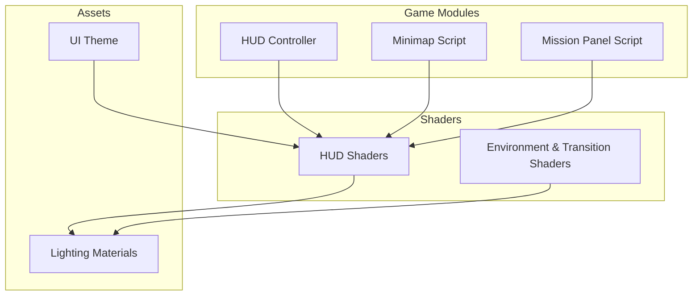

**Section sources**
- [project.godot](file://project.godot)

## Core Components
- HUD Shaders: health_bar, minimap_overlay, mission_panel, mission_progress_bar
- Environmental/Transition Shaders: crack_shader, dashed_circle, level_transition, ramp_glow
- Supporting materials: additive_glow_material, glow_radial, ao_radial
- UI theme: global_theme.tres
- Integration scripts: hud_game.gd, minimap.gd, mission_panel.gd

**Section sources**
- [health_bar.gdshader](file://Shaders/HUD/health_bar.gdshader)
- [minimap_overlay.gdshader](file://Shaders/HUD/minimap_overlay.gdshader)
- [mission_panel.gdshader](file://Shaders/HUD/mission_panel.gdshader)
- [mission_progress_bar.gdshader](file://Shaders/HUD/mission_progress_bar.gdshader)
- [crack_shader.gdshader](file://Shaders/crack_shader.gdshader)
- [dashed_circle.gdshader](file://Shaders/dashed_circle.gdshader)
- [level_transition.gdshader](file://Shaders/level_transition.gdshader)
- [ramp_glow.gdshader](file://Shaders/ramp_glow.gdshader)
- [additive_glow_material.tres](file://Assets/Lighting/additive_glow_material.tres)
- [glow_radial.tres](file://Assets/Lighting/glow_radial.tres)
- [ao_radial.tres](file://Assets/Lighting/ao_radial.tres)
- [global_theme.tres](file://Assets/UI/global_theme.tres)
- [hud_game.gd](file://Menu/HUD/hud_game.gd)
- [minimap.gd](file://Menu/HUD/minimap.gd)
- [mission_panel.gd](file://Scripts/mission_panel.gd)

## Architecture Overview
The shader architecture integrates with Godot's SpatialMaterial and ShaderMaterial nodes. HUD elements are rendered using dedicated shaders and materials, while environmental and transition effects use specialized shaders. Materials define base textures, UV transforms, and blending modes. The HUD controller scripts bind shader parameters at runtime.

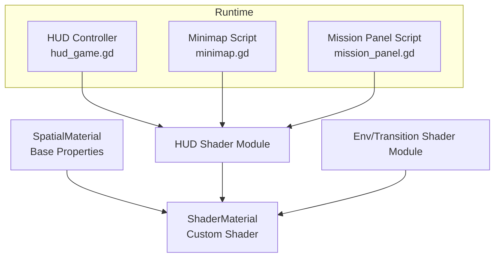

**Diagram sources**
- [hud_game.gd](file://Menu/HUD/hud_game.gd)
- [minimap.gd](file://Menu/HUD/minimap.gd)
- [mission_panel.gd](file://Scripts/mission_panel.gd)
- [health_bar.gdshader](file://Shaders/HUD/health_bar.gdshader)
- [minimap_overlay.gdshader](file://Shaders/HUD/minimap_overlay.gdshader)
- [mission_panel.gdshader](file://Shaders/HUD/mission_panel.gdshader)
- [mission_progress_bar.gdshader](file://Shaders/HUD/mission_progress_bar.gdshader)
- [crack_shader.gdshader](file://Shaders/crack_shader.gdshader)
- [dashed_circle.gdshader](file://Shaders/dashed_circle.gdshader)
- [level_transition.gdshader](file://Shaders/level_transition.gdshader)
- [ramp_glow.gdshader](file://Shaders/ramp_glow.gdshader)

## Detailed Component Analysis

### HUD Shaders

#### Health Bar Shader
Purpose: Renders a dynamic health indicator with configurable color, border, and fill direction.  
Key aspects:
- Vertex processing: passes position and UVs; optional offset for border rendering.
- Fragment processing: computes fill ratio, applies border outline, and blends with base color.
- Uniforms: health_ratio, border_width, color_fill, color_border, uv_offset.
- Textures: optional mask or gradient texture for smooth edges.

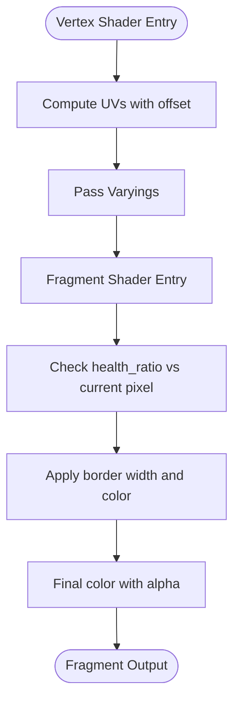

**Diagram sources**
- [health_bar.gdshader](file://Shaders/HUD/health_bar.gdshader)

**Section sources**
- [health_bar.gdshader](file://Shaders/HUD/health_bar.gdshader)

#### Minimap Overlay Shader
Purpose: Blends minimap tiles and player direction indicator with configurable opacity and tint.  
Key aspects:
- Vertex processing: transforms tile coordinates and rotation offsets.
- Fragment processing: samples minimap texture, applies tint and opacity, composes with background.
- Uniforms: minimap_opacity, tint_color, rotation_angle, tile_scale, uv_offset.

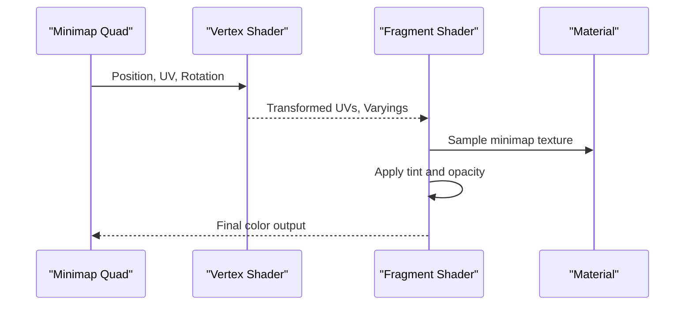

**Diagram sources**
- [minimap_overlay.gdshader](file://Shaders/HUD/minimap_overlay.gdshader)

**Section sources**
- [minimap_overlay.gdshader](file://Shaders/HUD/minimap_overlay.gdshader)

#### Mission Panel Shader
Purpose: Draws mission panel backgrounds, borders, and optional gradients.  
Key aspects:
- Vertex processing: supports panel corner rounding via UV manipulation.
- Fragment processing: mixes background color and gradient; applies border thickness and color.
- Uniforms: panel_color, border_color, border_width, gradient_strength, corner_radius.

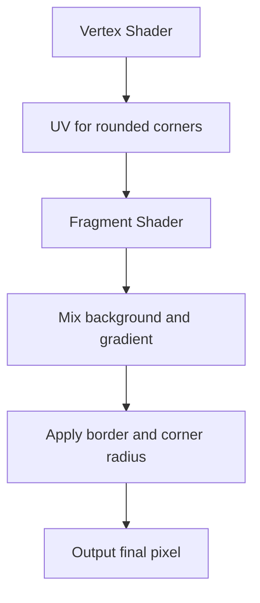

**Diagram sources**
- [mission_panel.gdshader](file://Shaders/HUD/mission_panel.gdshader)

**Section sources**
- [mission_panel.gdshader](file://Shaders/HUD/mission_panel.gdshader)

#### Mission Progress Bar Shader
Purpose: Renders progress indicators with smooth transitions and optional pulse animation.  
Key aspects:
- Vertex processing: scales progress along X axis.
- Fragment processing: clamps progress to visible range; optionally pulses at edges.
- Uniforms: progress_ratio, pulse_enabled, pulse_speed, pulse_amplitude.

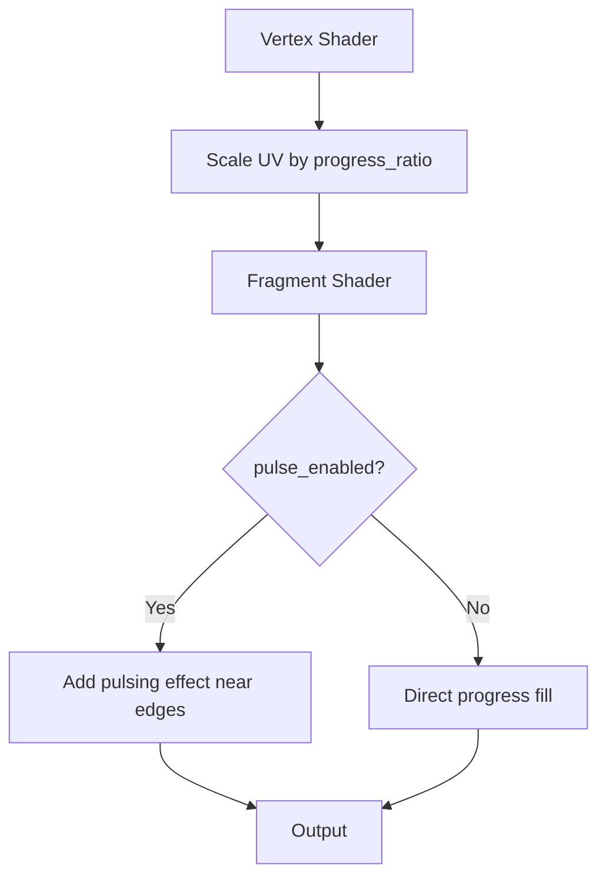

**Diagram sources**
- [mission_progress_bar.gdshader](file://Shaders/HUD/mission_progress_bar.gdshader)

**Section sources**
- [mission_progress_bar.gdshader](file://Shaders/HUD/mission_progress_bar.gdshader)

### Environmental Effect Shaders

#### Crack Shader
Purpose: Simulates crack propagation with animated noise and directional fading.  
Key aspects:
- Vertex processing: passes world-space position for distance-based effects.
- Fragment processing: evaluates noise field, applies time-based animation, fades edges.
- Uniforms: time, crack_width, noise_scale, fade_power.

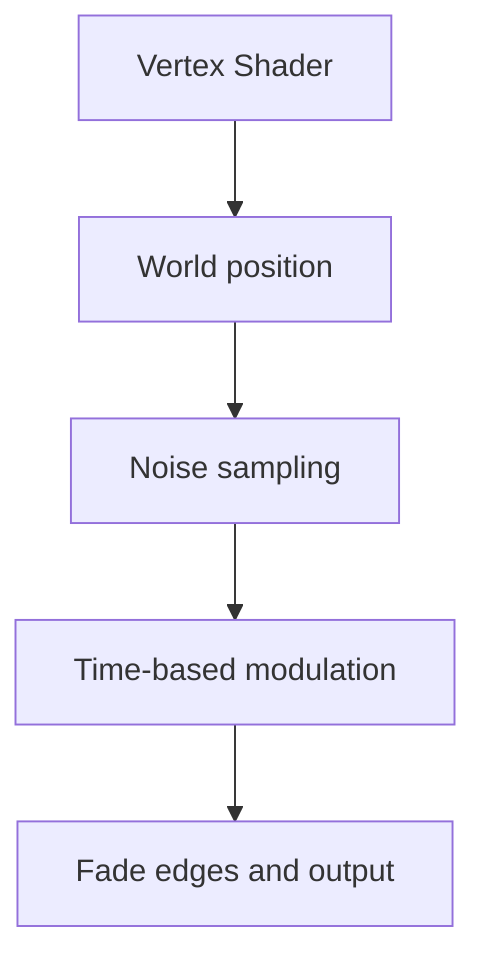

**Diagram sources**
- [crack_shader.gdshader](file://Shaders/crack_shader.gdshader)

**Section sources**
- [crack_shader.gdshader](file://Shaders/crack_shader.gdshader)

#### Dashed Circle Shader
Purpose: Draws animated dashed rings for targeting or warning visuals.  
Key aspects:
- Vertex processing: computes radial distance and angle.
- Fragment processing: creates periodic dashes using trigonometric functions; animates dash length and gap.
- Uniforms: center_uv, radius_inner, radius_outer, dash_count, dash_phase, dash_gap_ratio, time.

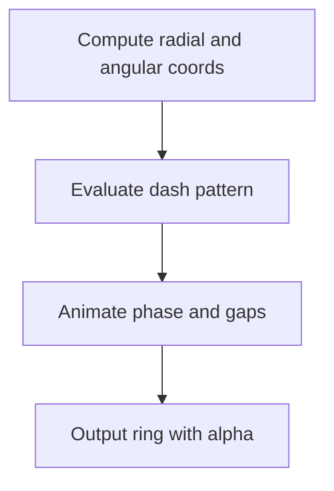

**Diagram sources**
- [dashed_circle.gdshader](file://Shaders/dashed_circle.gdshader)

**Section sources**
- [dashed_circle.gdshader](file://Shaders/dashed_circle.gdshader)

#### Ramp Glow Shader
Purpose: Emits soft radial glow around elevated surfaces.  
Key aspects:
- Vertex processing: uses height or normal for glow intensity.
- Fragment processing: radial falloff with configurable power and color.
- Uniforms: glow_color, glow_power, uv_center, intensity_multiplier.

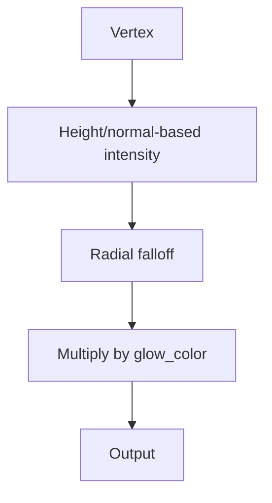

**Diagram sources**
- [ramp_glow.gdshader](file://Shaders/ramp_glow.gdshader)

**Section sources**
- [ramp_glow.gdshader](file://Shaders/ramp_glow.gdshader)

### Transition Shader
Level transition shader provides screen-space wipe or fade effects during scene changes.  
Key aspects:
- Vertex processing: full-screen quad.
- Fragment processing: smoothstep-based transition controlled by a progress uniform; optional color overlay.
- Uniforms: transition_progress, transition_type, overlay_color.

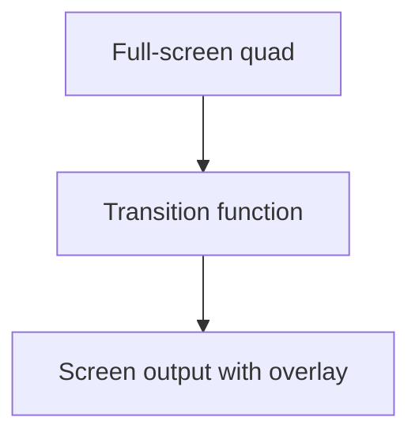

**Diagram sources**
- [level_transition.gdshader](file://Shaders/level_transition.gdshader)

**Section sources**
- [level_transition.gdshader](file://Shaders/level_transition.gdshader)

## Dependency Analysis
- Shader-to-Material: HUD and environment shaders are assigned to ShaderMaterial nodes; materials define base textures and parameters.
- Material-to-Script: HUD controller scripts set shader uniforms dynamically (e.g., health_ratio, progress_ratio).
- Lighting Materials: additive_glow_material, glow_radial, ao_radial integrate with environmental shaders for ambient and rim effects.
- UI Theme: global_theme.tres influences color palettes used by HUD shaders.

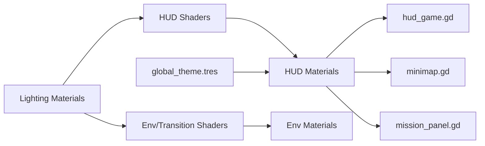

**Diagram sources**
- [hud_game.gd](file://Menu/HUD/hud_game.gd)
- [minimap.gd](file://Menu/HUD/minimap.gd)
- [mission_panel.gd](file://Scripts/mission_panel.gd)
- [health_bar.gdshader](file://Shaders/HUD/health_bar.gdshader)
- [minimap_overlay.gdshader](file://Shaders/HUD/minimap_overlay.gdshader)
- [mission_panel.gdshader](file://Shaders/HUD/mission_panel.gdshader)
- [mission_progress_bar.gdshader](file://Shaders/HUD/mission_progress_bar.gdshader)
- [crack_shader.gdshader](file://Shaders/crack_shader.gdshader)
- [dashed_circle.gdshader](file://Shaders/dashed_circle.gdshader)
- [level_transition.gdshader](file://Shaders/level_transition.gdshader)
- [ramp_glow.gdshader](file://Shaders/ramp_glow.gdshader)
- [additive_glow_material.tres](file://Assets/Lighting/additive_glow_material.tres)
- [glow_radial.tres](file://Assets/Lighting/glow_radial.tres)
- [ao_radial.tres](file://Assets/Lighting/ao_radial.tres)
- [global_theme.tres](file://Assets/UI/global_theme.tres)

**Section sources**
- [hud_game.gd](file://Menu/HUD/hud_game.gd)
- [minimap.gd](file://Menu/HUD/minimap.gd)
- [mission_panel.gd](file://Scripts/mission_panel.gd)
- [additive_glow_material.tres](file://Assets/Lighting/additive_glow_material.tres)
- [glow_radial.tres](file://Assets/Lighting/glow_radial.tres)
- [ao_radial.tres](file://Assets/Lighting/ao_radial.tres)
- [global_theme.tres](file://Assets/UI/global_theme.tres)

## Performance Considerations
- Prefer signed distance fields or cheap math for shape calculations in fragment shaders.
- Use early exits and discard where appropriate to avoid unnecessary work.
- Batch UI quads and minimize draw calls; reuse ShaderMaterial instances where possible.
- Keep uniforms sparse and aligned to reduce state changes.
- Use additive blending judiciously; excessive overdraw can degrade performance.
- Cache computed UV transforms in vertex shaders when geometry repeats (e.g., minimap tiles).
- Avoid expensive texture fetches inside tight loops; pre-scale textures and use sampler parameters.

## Troubleshooting Guide
Common issues and remedies:
- Incorrect colors or missing tint:
  - Verify material tint uniforms and theme overrides.
  - Confirm shader uniforms for color_fill/color_border are set by scripts.
- Minimap not aligning or rotating:
  - Check rotation_angle and tile_scale uniforms.
  - Ensure UV transforms match the intended tiling and orientation.
- Progress bar not updating:
  - Confirm progress_ratio is being passed to the shader.
  - Verify the shader reads the correct uniform name.
- Transition not visible:
  - Ensure transition_progress is animated from 0 to 1.
  - Check transition_type and overlay_color values.
- Glow artifacts:
  - Adjust glow_power and intensity_multiplier.
  - Validate UV center and falloff logic.

Integration tips:
- Use ShaderMaterial nodes for custom shaders; attach materials to Control or MeshInstance nodes as appropriate.
- Bind uniforms from scripts using set_shader_param; update them per frame if animations are involved.
- For debugging, temporarily replace complex fragment logic with solid colors to isolate issues.

**Section sources**
- [hud_game.gd](file://Menu/HUD/hud_game.gd)
- [minimap.gd](file://Menu/HUD/minimap.gd)
- [mission_panel.gd](file://Scripts/mission_panel.gd)
- [health_bar.gdshader](file://Shaders/HUD/health_bar.gdshader)
- [minimap_overlay.gdshader](file://Shaders/HUD/minimap_overlay.gdshader)
- [mission_panel.gdshader](file://Shaders/HUD/mission_panel.gdshader)
- [mission_progress_bar.gdshader](file://Shaders/HUD/mission_progress_bar.gdshader)
- [crack_shader.gdshader](file://Shaders/crack_shader.gdshader)
- [dashed_circle.gdshader](file://Shaders/dashed_circle.gdshader)
- [level_transition.gdshader](file://Shaders/level_transition.gdshader)
- [ramp_glow.gdshader](file://Shaders/ramp_glow.gdshader)

## Conclusion
TFA Agents employs a modular shader architecture leveraging Godot’s ShaderMaterial system. HUD shaders provide interactive UI elements with dynamic parameters, while environmental and transition shaders deliver polished visual feedback. By structuring materials and uniforms consistently and following performance best practices, the system remains maintainable and efficient. Use the provided integration points and debugging techniques to extend and refine the shader pipeline.