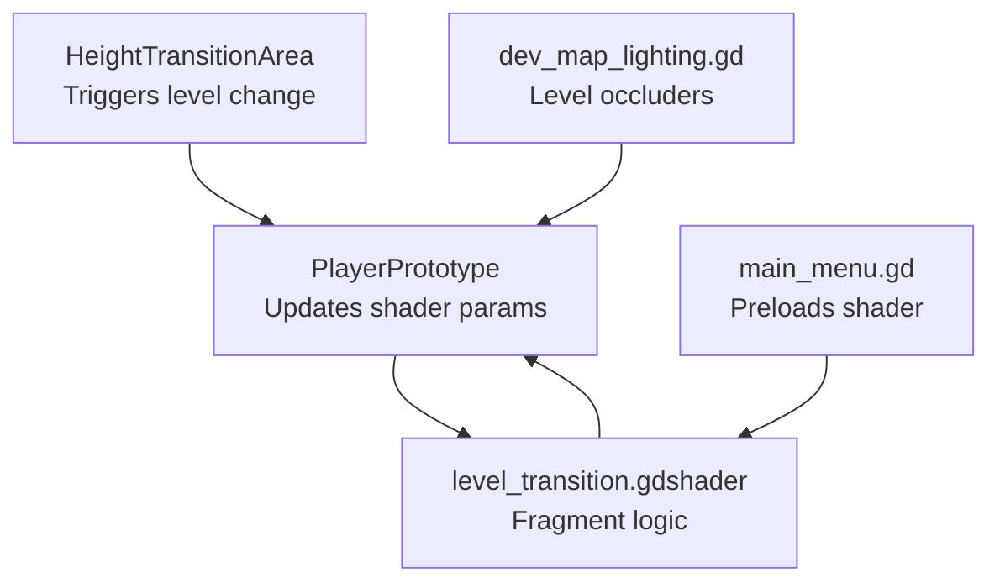
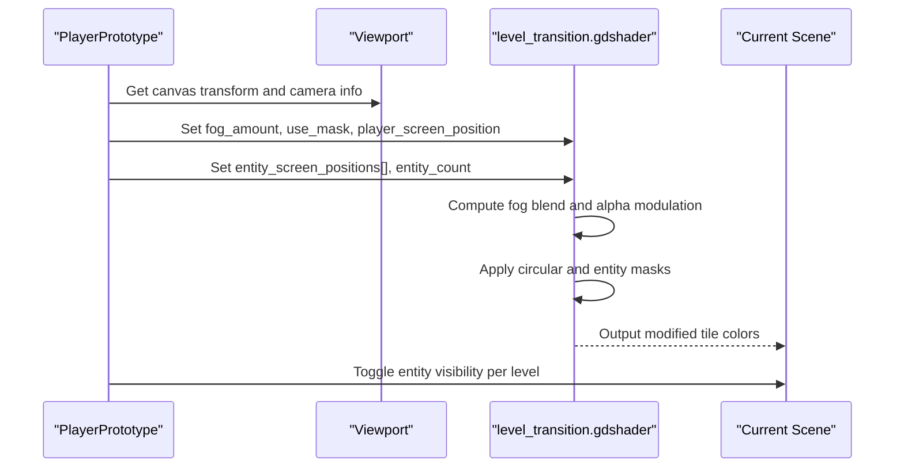
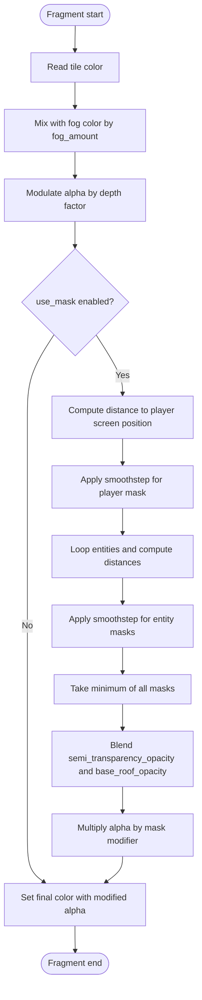
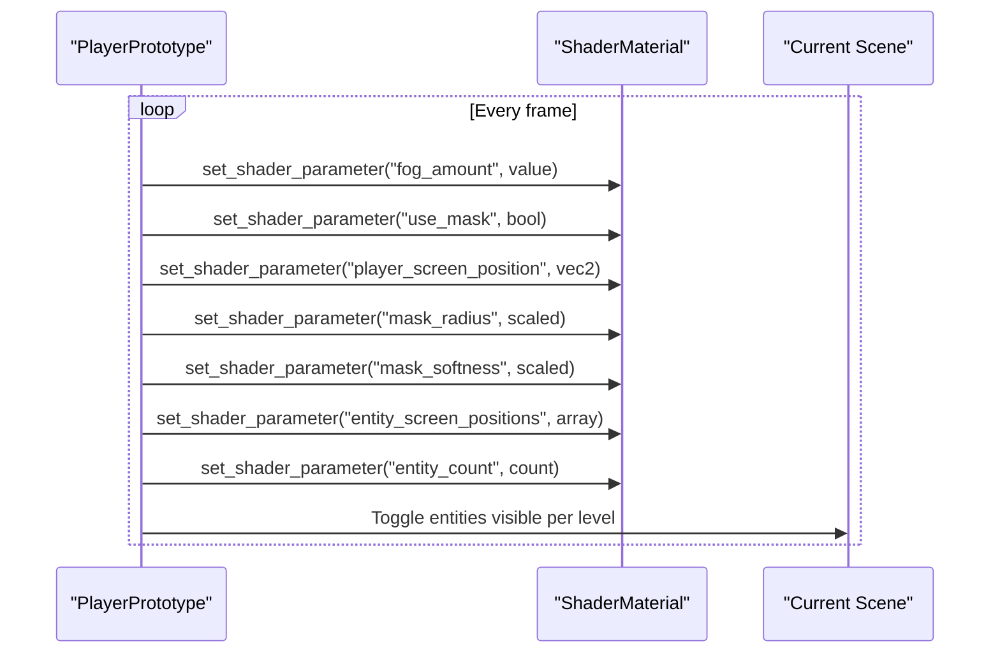
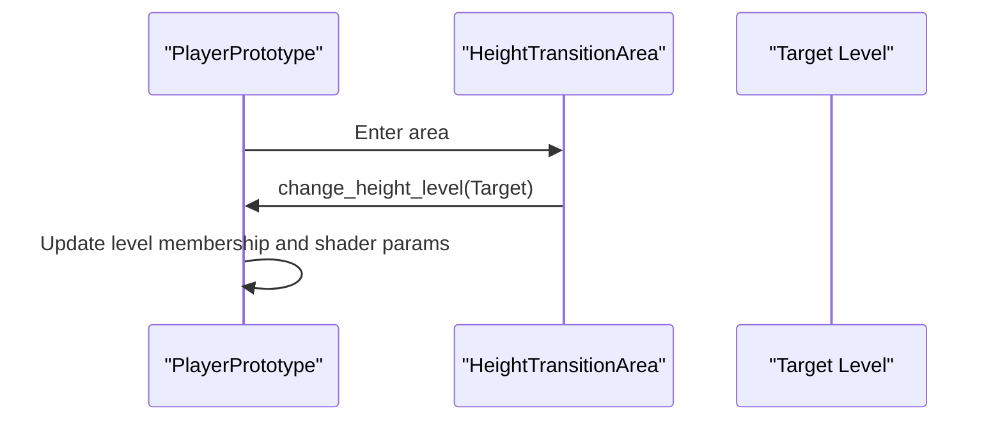
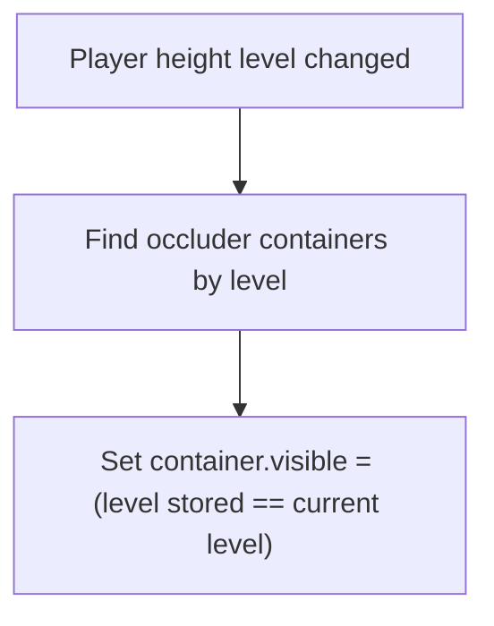
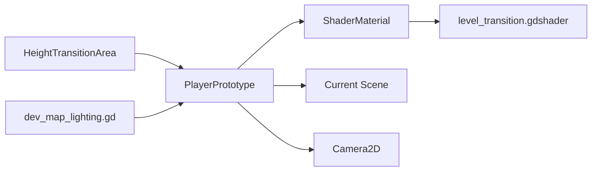

# Transition Shaders

<cite>
**Referenced Files in This Document**
- [level_transition.gdshader](file://Shaders/level_transition.gdshader)
- [player_prototype.gd](file://Scripts/player_prototype.gd)
- [height_transition_area.gd](file://Scripts/height_transition_area.gd)
- [main_menu.gd](file://Menu/main_menu.gd)
- [dev_map_lighting.gd](file://Scripts/dev_map_lighting.gd)
</cite>

## Table of Contents
1. [Introduction](#introduction)
2. [Project Structure](#project-structure)
3. [Core Components](#core-components)
4. [Architecture Overview](#architecture-overview)
5. [Detailed Component Analysis](#detailed-component-analysis)
6. [Dependency Analysis](#dependency-analysis)
7. [Performance Considerations](#performance-considerations)
8. [Troubleshooting Guide](#troubleshooting-guide)
9. [Conclusion](#conclusion)

## Introduction
This document explains the level transition shader system used for seamless scene changes in TFA Agents. It focuses on:
- Transition effect algorithms for depth-based visibility blending
- Animation timing and visual masking techniques
- Shader parameter configuration for fade effects, entity masking, and screen wipes
- Implementation examples and integration with the game’s height-level loading system

The system blends multiple levels in 2D space using a shader that reacts to the player’s height level, applying fog-like fading and localized masking around the player and nearby entities.

## Project Structure
The transition system spans a shader and several scripts:
- Shader: defines fragment-time logic for fog blending and masking
- Player controller: updates shader parameters per frame and manages level membership
- Height transition area: triggers level changes
- Dev lighting: toggles occluders per level
- Main menu: preloads the transition shader for UI usage

**Diagram sources**
- [player_prototype.gd:330-339](file://Scripts/player_prototype.gd#L330-L339)
- [height_transition_area.gd:11-14](file://Scripts/height_transition_area.gd#L11-L14)
- [dev_map_lighting.gd:125-126](file://Scripts/dev_map_lighting.gd#L125-L126)
- [main_menu.gd:16](file://Menu/main_menu.gd#L16)
- [level_transition.gdshader:23-63](file://Shaders/level_transition.gdshader#L23-L63)

**Section sources**
- [level_transition.gdshader:1-64](file://Shaders/level_transition.gdshader#L1-L64)
- [player_prototype.gd:330-339](file://Scripts/player_prototype.gd#L330-L339)
- [height_transition_area.gd:1-15](file://Scripts/height_transition_area.gd#L1-L15)
- [dev_map_lighting.gd:125-126](file://Scripts/dev_map_lighting.gd#L125-L126)
- [main_menu.gd:16](file://Menu/main_menu.gd#L16)

## Core Components
- Level transition shader
  - Fog blending controlled by a uniform amount and color
  - Depth-based alpha modulation for lower/higher levels
  - Optional circular masking around the player and nearby entities
  - Entity array-based masking for nearby interactive objects
- Player controller
  - Sets shader uniforms per level: fog amount, use mask flag, player screen position, entity positions, counts
  - Manages visibility of entities per level
- Height transition area
  - Triggers level changes when the player enters
- Dev lighting
  - Toggles occluders visibility per level

Key shader parameters:
- fog_amount: controls depth-based fade intensity
- fog_color: color used for fog blending
- use_mask: enables masking around player and entities
- player_screen_position: player position in screen coordinates
- mask_radius: radius of the masking circle
- mask_softness: soft edge falloff for the mask
- ellipse_y_scale: vertical scaling for the mask shape
- semi_transparency_opacity: opacity inside the mask region
- base_roof_opacity: opacity outside the mask region
- entity_screen_positions: array of entity positions in screen space
- entity_radius: radius for entity masking
- entity_softness: soft edge falloff for entity masks
- entity_count: number of valid entities in the array

**Section sources**
- [level_transition.gdshader:3-23](file://Shaders/level_transition.gdshader#L3-L23)
- [level_transition.gdshader:23-63](file://Shaders/level_transition.gdshader#L23-L63)
- [player_prototype.gd:678-742](file://Scripts/player_prototype.gd#L678-L742)
- [height_transition_area.gd:4-5](file://Scripts/height_transition_area.gd#L4-L5)
- [dev_map_lighting.gd:129-133](file://Scripts/dev_map_lighting.gd#L129-L133)

## Architecture Overview
The transition system operates on a per-frame basis:
- Player updates shader parameters each frame
- Shader computes final color with fog blending and masking
- Entities are filtered per level and visibility is toggled accordingly

**Diagram sources**
- [player_prototype.gd:678-742](file://Scripts/player_prototype.gd#L678-L742)
- [level_transition.gdshader:23-63](file://Shaders/level_transition.gdshader#L23-L63)
- [dev_map_lighting.gd:129-133](file://Scripts/dev_map_lighting.gd#L129-L133)

## Detailed Component Analysis

### Level Transition Shader
The shader modifies tile colors and alpha based on:
- Fog blending: mixes tile color with a configurable fog color using a uniform amount
- Depth-based alpha: reduces tile alpha when the tile belongs to a lower level relative to the player
- Masking: optionally applies a circular mask around the player and nearby entities, with soft edges and elliptical scaling
- Entity masking: supports up to a fixed number of entities, each contributing a mask

**Diagram sources**
- [level_transition.gdshader:23-63](file://Shaders/level_transition.gdshader#L23-L63)

**Section sources**
- [level_transition.gdshader:3-23](file://Shaders/level_transition.gdshader#L3-L23)
- [level_transition.gdshader:23-63](file://Shaders/level_transition.gdshader#L23-L63)

### Player Controller Integration
The player updates shader parameters every frame:
- Computes fog amounts for above/below levels
- Sets use_mask flag depending on whether the player is above the current level
- Updates player screen position and scales mask radius/softness with camera zoom
- Gathers entity positions in screen space and sets entity arrays and count
- Controls entity visibility per level

**Diagram sources**
- [player_prototype.gd:678-742](file://Scripts/player_prototype.gd#L678-L742)
- [player_prototype.gd:745-750](file://Scripts/player_prototype.gd#L745-L750)

**Section sources**
- [player_prototype.gd:678-742](file://Scripts/player_prototype.gd#L678-L742)
- [player_prototype.gd:745-750](file://Scripts/player_prototype.gd#L745-L750)

### Height Transition Areas
Trigger level changes when the player enters the area, invoking a method on the player to switch levels.

**Diagram sources**
- [height_transition_area.gd:11-14](file://Scripts/height_transition_area.gd#L11-L14)
- [player_prototype.gd:330-339](file://Scripts/player_prototype.gd#L330-L339)

**Section sources**
- [height_transition_area.gd:4-5](file://Scripts/height_transition_area.gd#L4-L5)
- [height_transition_area.gd:11-14](file://Scripts/height_transition_area.gd#L11-L14)
- [player_prototype.gd:330-339](file://Scripts/player_prototype.gd#L330-L339)

### Dev Lighting Occluders
Toggles occluders visibility per level to keep the scene coherent during transitions.

**Diagram sources**
- [dev_map_lighting.gd:125-133](file://Scripts/dev_map_lighting.gd#L125-L133)

**Section sources**
- [dev_map_lighting.gd:125-126](file://Scripts/dev_map_lighting.gd#L125-L126)
- [dev_map_lighting.gd:129-133](file://Scripts/dev_map_lighting.gd#L129-L133)

## Dependency Analysis
- Shader depends on:
  - ShaderMaterial uniforms set by the player controller
  - Viewport canvas transform for screen-space computations
- Player controller depends on:
  - Current scene hierarchy to collect canvas items and entities
  - Camera zoom for mask scaling
- Height transition areas depend on:
  - Player’s level-change method
- Dev lighting depends on:
  - Player’s level-change signal

**Diagram sources**
- [player_prototype.gd:678-742](file://Scripts/player_prototype.gd#L678-L742)
- [level_transition.gdshader:23-63](file://Shaders/level_transition.gdshader#L23-L63)
- [height_transition_area.gd:11-14](file://Scripts/height_transition_area.gd#L11-L14)
- [dev_map_lighting.gd:125-126](file://Scripts/dev_map_lighting.gd#L125-L126)

**Section sources**
- [player_prototype.gd:678-742](file://Scripts/player_prototype.gd#L678-L742)
- [height_transition_area.gd:11-14](file://Scripts/height_transition_area.gd#L11-L14)
- [dev_map_lighting.gd:125-126](file://Scripts/dev_map_lighting.gd#L125-L126)

## Performance Considerations
- Parameter updates
  - Update shader parameters only when necessary (e.g., on level changes or camera zoom changes) to avoid redundant work
- Entity masking
  - Limit the number of masked entities by capping the array size and early-breaking when the limit is reached
- Alpha computation
  - Keep masking calculations vectorized; avoid branching-heavy loops when possible
- Visibility toggling
  - Toggle entity visibility per level to reduce draw calls for off-level objects
- Camera zoom scaling
  - Scale mask radius and softness with camera zoom to maintain consistent visual impact across zoom levels

[No sources needed since this section provides general guidance]

## Troubleshooting Guide
- Shader does not respond to level changes
  - Verify that the player controller sets fog_amount and use_mask for all levels
  - Confirm that ShaderMaterial instances are attached to level canvases
- Mask appears too large or small
  - Adjust mask_radius and mask_softness; scale with camera zoom
- Entities still visible when off-level
  - Ensure entity visibility is toggled per level after changing levels
- Fog blending looks incorrect
  - Check fog_amount and fog_color values; confirm they match intended depth relationship

**Section sources**
- [player_prototype.gd:678-742](file://Scripts/player_prototype.gd#L678-L742)
- [player_prototype.gd:745-750](file://Scripts/player_prototype.gd#L745-L750)
- [level_transition.gdshader:23-63](file://Shaders/level_transition.gdshader#L23-L63)

## Conclusion
The level transition shader system in TFA Agents combines depth-aware fog blending with localized masking to create seamless transitions between overlapping height levels. By updating shader parameters per frame and controlling entity visibility per level, the system achieves smooth, visually coherent scene changes. Proper tuning of shader parameters and careful management of entity arrays ensures optimal performance and visual fidelity.