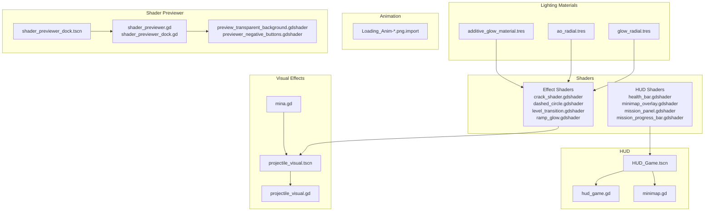
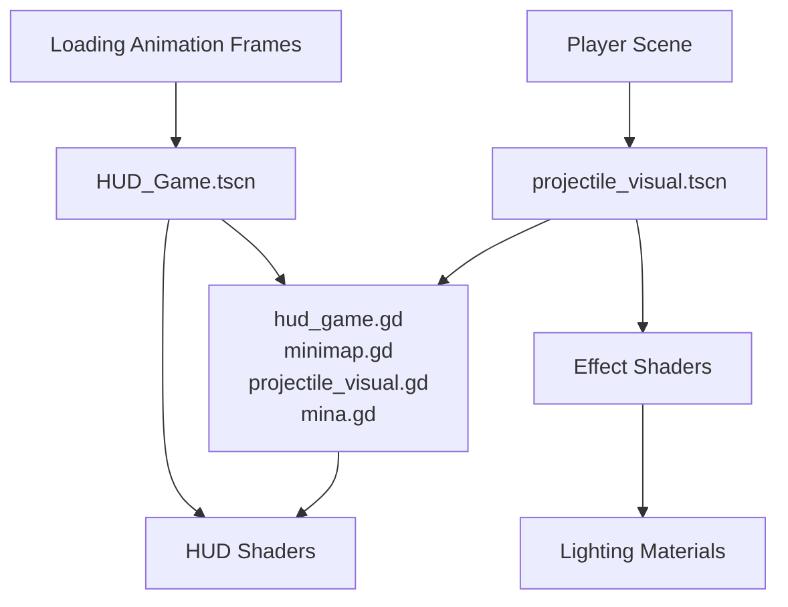
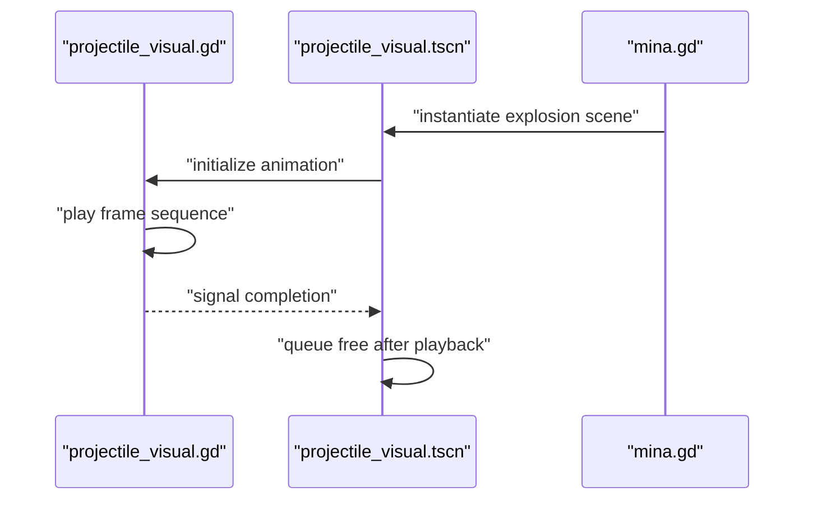
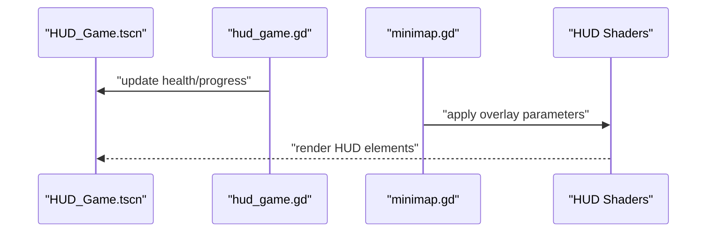
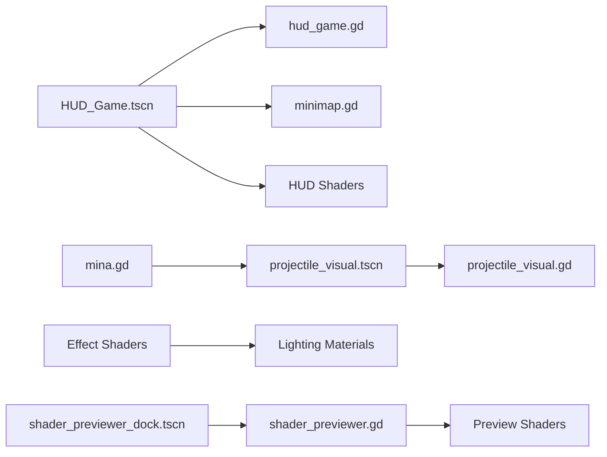

# Visual Effects and Graphics

<cite>
**Referenced Files in This Document**
- [health_bar.gdshader](file://Shaders/HUD/health_bar.gdshader)
- [minimap_overlay.gdshader](file://Shaders/HUD/minimap_overlay.gdshader)
- [mission_panel.gdshader](file://Shaders/HUD/mission_panel.gdshader)
- [mission_progress_bar.gdshader](file://Shaders/HUD/mission_progress_bar.gdshader)
- [crack_shader.gdshader](file://Shaders/crack_shader.gdshader)
- [dashed_circle.gdshader](file://Shaders/dashed_circle.gdshader)
- [level_transition.gdshader](file://Shaders/level_transition.gdshader)
- [ramp_glow.gdshader](file://Shaders/ramp_glow.gdshader)
- [additive_glow_material.tres](file://Assets/Lighting/additive_glow_material.tres)
- [ao_radial.tres](file://Assets/Lighting/ao_radial.tres)
- [glow_radial.tres](file://Assets/Lighting/glow_radial.tres)
- [HUD_Game.tscn](file://Menu/HUD/HUD_Game.tscn)
- [hud_game.gd](file://Menu/HUD/hud_game.gd)
- [minimap.gd](file://Menu/HUD/minimap.gd)
- [projectile_visual.tscn](file://Scenes/projectile_visual.tscn)
- [projectile_visual.gd](file://Scripts/projectile_visual.gd)
- [mina.gd](file://Scripts/mina.gd)
- [Loading_Anim-0.png.import](file://Assets/Animation/Loading/Loading_Anim-0.png.import)
- [Loading_Anim-19.png.import](file://Assets/Animation/Loading/Loading_Anim-19.png.import)
- [global_theme.tres](file://Assets/UI/global_theme.tres)
- [shader_previewer.gd](file://addons/shader-previewer/shader_previewer.gd)
- [shader_previewer_dock.gd](file://addons/shader-previewer/shader_previewer_dock.gd)
- [shader_previewer_dock.tscn](file://addons/shader-previewer/shader_previewer_dock.tscn)
- [preview_transparent_background.gdshader](file://addons/shader-previewer/preview_transparent_background.gdshader)
- [previewer_negative_buttons.gdshader](file://addons/shader-previewer/previewer_negative_buttons.gdshader)
</cite>

## Table of Contents
1. [Introduction](#introduction)
2. [Project Structure](#project-structure)
3. [Core Components](#core-components)
4. [Architecture Overview](#architecture-overview)
5. [Detailed Component Analysis](#detailed-component-analysis)
6. [Dependency Analysis](#dependency-analysis)
7. [Performance Considerations](#performance-considerations)
8. [Troubleshooting Guide](#troubleshooting-guide)
9. [Conclusion](#conclusion)
10. [Appendices](#appendices)

## Introduction
This document explains TFA Agents’ visual effects and graphics systems with a focus on shader programming, explosion animations, lighting effects, and particle systems. It also covers HUD elements, environmental effects, post-processing, texture management, animation systems, and performance optimization techniques. Guidance is provided for creating custom shaders, setting up animations, and integrating visual assets into the rendering pipeline.

## Project Structure
The graphics-related assets and scripts are organized under dedicated folders:
- Shaders: Shader programs for HUD, environmental, and transition effects
- Assets/Lighting: Preconfigured materials for glow and ambient occlusion
- Assets/Animation: Sprite sequences for loading animations
- Menu/HUD: Scene and scripts for HUD elements and minimap
- Scenes and Scripts: Projectile visuals, mine explosion, and supporting logic
- Addons: Shader previewer for testing and iterating shaders efficiently

**Diagram sources**
- [health_bar.gdshader](file://Shaders/HUD/health_bar.gdshader)
- [minimap_overlay.gdshader](file://Shaders/HUD/minimap_overlay.gdshader)
- [mission_panel.gdshader](file://Shaders/HUD/mission_panel.gdshader)
- [mission_progress_bar.gdshader](file://Shaders/HUD/mission_progress_bar.gdshader)
- [crack_shader.gdshader](file://Shaders/crack_shader.gdshader)
- [dashed_circle.gdshader](file://Shaders/dashed_circle.gdshader)
- [level_transition.gdshader](file://Shaders/level_transition.gdshader)
- [ramp_glow.gdshader](file://Shaders/ramp_glow.gdshader)
- [additive_glow_material.tres](file://Assets/Lighting/additive_glow_material.tres)
- [ao_radial.tres](file://Assets/Lighting/ao_radial.tres)
- [glow_radial.tres](file://Assets/Lighting/glow_radial.tres)
- [HUD_Game.tscn](file://Menu/HUD/HUD_Game.tscn)
- [hud_game.gd](file://Menu/HUD/hud_game.gd)
- [minimap.gd](file://Menu/HUD/minimap.gd)
- [projectile_visual.tscn](file://Scenes/projectile_visual.tscn)
- [projectile_visual.gd](file://Scripts/projectile_visual.gd)
- [mina.gd](file://Scripts/mina.gd)
- [Loading_Anim-0.png.import](file://Assets/Animation/Loading/Loading_Anim-0.png.import)
- [Loading_Anim-19.png.import](file://Assets/Animation/Loading/Loading_Anim-19.png.import)
- [shader_previewer_dock.tscn](file://addons/shader-previewer/shader_previewer_dock.tscn)
- [shader_previewer.gd](file://addons/shader-previewer/shader_previewer.gd)
- [shader_previewer_dock.gd](file://addons/shader-previewer/shader_previewer_dock.gd)
- [preview_transparent_background.gdshader](file://addons/shader-previewer/preview_transparent_background.gdshader)
- [previewer_negative_buttons.gdshader](file://addons/shader-previewer/previewer_negative_buttons.gdshader)

**Section sources**
- [HUD_Game.tscn](file://Menu/HUD/HUD_Game.tscn)
- [projectile_visual.tscn](file://Scenes/projectile_visual.tscn)
- [mina.gd](file://Scripts/mina.gd)

## Core Components
- Shader-based HUD elements: Health bar, minimap overlay, mission panel, and progress bar
- Environmental and transition shaders: Crack, dashed circle, level transition, ramp glow
- Lighting materials: Additive glow, ambient occlusion radial, and radial glow
- Projectile and explosion visuals: Scene-driven sprite animation and scripted logic
- Animation system: Frame-based sprite sequences for loading screens
- Shader previewer: Editor addon for rapid shader iteration and material testing

**Section sources**
- [health_bar.gdshader](file://Shaders/HUD/health_bar.gdshader)
- [minimap_overlay.gdshader](file://Shaders/HUD/minimap_overlay.gdshader)
- [mission_panel.gdshader](file://Shaders/HUD/mission_panel.gdshader)
- [mission_progress_bar.gdshader](file://Shaders/HUD/mission_progress_bar.gdshader)
- [crack_shader.gdshader](file://Shaders/crack_shader.gdshader)
- [dashed_circle.gdshader](file://Shaders/dashed_circle.gdshader)
- [level_transition.gdshader](file://Shaders/level_transition.gdshader)
- [ramp_glow.gdshader](file://Shaders/ramp_glow.gdshader)
- [additive_glow_material.tres](file://Assets/Lighting/additive_glow_material.tres)
- [ao_radial.tres](file://Assets/Lighting/ao_radial.tres)
- [glow_radial.tres](file://Assets/Lighting/glow_radial.tres)
- [projectile_visual.tscn](file://Scenes/projectile_visual.tscn)
- [projectile_visual.gd](file://Scripts/projectile_visual.gd)
- [mina.gd](file://Scripts/mina.gd)
- [Loading_Anim-0.png.import](file://Assets/Animation/Loading/Loading_Anim-0.png.import)
- [Loading_Anim-19.png.import](file://Assets/Animation/Loading/Loading_Anim-19.png.import)
- [shader_previewer.gd](file://addons/shader-previewer/shader_previewer.gd)
- [shader_previewer_dock.gd](file://addons/shader-previewer/shader_previewer_dock.gd)

## Architecture Overview
The visual architecture combines scene-driven sprites for projectiles/explosions with shader-based overlays and materials for lighting and HUD. The HUD integrates with scripts for runtime updates, while the shader previewer supports iterative development of new effects.

**Diagram sources**
- [projectile_visual.tscn](file://Scenes/projectile_visual.tscn)
- [hud_game.gd](file://Menu/HUD/hud_game.gd)
- [minimap.gd](file://Menu/HUD/minimap.gd)
- [projectile_visual.gd](file://Scripts/projectile_visual.gd)
- [mina.gd](file://Scripts/mina.gd)
- [health_bar.gdshader](file://Shaders/HUD/health_bar.gdshader)
- [minimap_overlay.gdshader](file://Shaders/HUD/minimap_overlay.gdshader)
- [mission_panel.gdshader](file://Shaders/HUD/mission_panel.gdshader)
- [mission_progress_bar.gdshader](file://Shaders/HUD/mission_progress_bar.gdshader)
- [crack_shader.gdshader](file://Shaders/crack_shader.gdshader)
- [dashed_circle.gdshader](file://Shaders/dashed_circle.gdshader)
- [level_transition.gdshader](file://Shaders/level_transition.gdshader)
- [ramp_glow.gdshader](file://Shaders/ramp_glow.gdshader)
- [additive_glow_material.tres](file://Assets/Lighting/additive_glow_material.tres)
- [ao_radial.tres](file://Assets/Lighting/ao_radial.tres)
- [glow_radial.tres](file://Assets/Lighting/glow_radial.tres)
- [Loading_Anim-0.png.import](file://Assets/Animation/Loading/Loading_Anim-0.png.import)
- [Loading_Anim-19.png.import](file://Assets/Animation/Loading/Loading_Anim-19.png.import)

## Detailed Component Analysis

### Shader Programming Approach
- HUD shaders: Implement health bar, minimap overlay, mission panel, and progress bar visuals using shader parameters and uniforms for dynamic updates.
- Effect shaders: Provide crack, dashed circle, level transition, and ramp glow effects leveraging UV manipulation and time-based transitions.
- Lighting materials: Additive glow, ambient occlusion radial, and radial glow materials integrate with shaders for environmental and post-processing-like effects.

Implementation patterns observed:
- Parameterized uniforms for color, alpha, thresholds, and time
- UV-space math for procedural shapes and transitions
- Blend modes aligned with additive and overlay compositing

Guidelines for creating custom shaders:
- Define uniforms for runtime control (e.g., progress, intensity, color)
- Use UV coordinates for procedural effects and masking
- Keep fragment computations minimal; offload heavy work to precomputed textures
- Test iteratively with the shader previewer dock

**Section sources**
- [health_bar.gdshader](file://Shaders/HUD/health_bar.gdshader)
- [minimap_overlay.gdshader](file://Shaders/HUD/minimap_overlay.gdshader)
- [mission_panel.gdshader](file://Shaders/HUD/mission_panel.gdshader)
- [mission_progress_bar.gdshader](file://Shaders/HUD/mission_progress_bar.gdshader)
- [crack_shader.gdshader](file://Shaders/crack_shader.gdshader)
- [dashed_circle.gdshader](file://Shaders/dashed_circle.gdshader)
- [level_transition.gdshader](file://Shaders/level_transition.gdshader)
- [ramp_glow.gdshader](file://Shaders/ramp_glow.gdshader)
- [additive_glow_material.tres](file://Assets/Lighting/additive_glow_material.tres)
- [ao_radial.tres](file://Assets/Lighting/ao_radial.tres)
- [glow_radial.tres](file://Assets/Lighting/glow_radial.tres)
- [shader_previewer.gd](file://addons/shader-previewer/shader_previewer.gd)
- [shader_previewer_dock.gd](file://addons/shader-previewer/shader_previewer_dock.gd)

### Explosion Animation Systems
Explosion visuals are driven by a scene with sprite frames and scripted logic:
- Scene: projectile_visual.tscn holds the animated sprite nodes
- Script: projectile_visual.gd controls playback, lifecycle, and cleanup
- Detonation: Scripts like mina.gd trigger explosion scenes at impact positions

**Diagram sources**
- [projectile_visual.tscn](file://Scenes/projectile_visual.tscn)
- [projectile_visual.gd](file://Scripts/projectile_visual.gd)
- [mina.gd](file://Scripts/mina.gd)

**Section sources**
- [projectile_visual.tscn](file://Scenes/projectile_visual.tscn)
- [projectile_visual.gd](file://Scripts/projectile_visual.gd)
- [mina.gd](file://Scripts/mina.gd)

### Lighting Effects
Lighting materials provide reusable base effects:
- Additive glow material: Supports emissive, screen-space, or overlay compositing
- Ambient occlusion radial: Soft edge blending for occluded areas
- Radial glow: Directional or volumetric glow with falloff

Integration pattern:
- Assign materials to shader parameters or as separate material slots
- Control intensity and color via uniforms exposed by effect shaders

**Section sources**
- [additive_glow_material.tres](file://Assets/Lighting/additive_glow_material.tres)
- [ao_radial.tres](file://Assets/Lighting/ao_radial.tres)
- [glow_radial.tres](file://Assets/Lighting/glow_radial.tres)
- [crack_shader.gdshader](file://Shaders/crack_shader.gdshader)
- [ramp_glow.gdshader](file://Shaders/ramp_glow.gdshader)

### Particle Systems
There is no explicit particle system asset in the repository. Effects rely on:
- Sprite-based animations for explosions
- Shader-based procedural effects for transitions and overlays
- Lighting materials for glow and ambient contributions

Recommendation:
- For complex effects, consider a particle manager scene with a pool of lightweight nodes and per-particle shaders
- Reuse existing lighting materials as base for particle emission and soft edges

[No sources needed since this section synthesizes current state and provides recommendations]

### Texture Management
Texture usage patterns:
- Sprite sheets and individual frames for animations (e.g., loading animation frames)
- Material resources for lighting effects
- Shader previews use transparent backgrounds and negative button styles for contrast

Best practices:
- Use atlas textures for UI and HUD to reduce draw calls
- Compress textures appropriately and enable filtering based on target resolution
- Reuse materials and textures across similar effects to minimize memory footprint

**Section sources**
- [Loading_Anim-0.png.import](file://Assets/Animation/Loading/Loading_Anim-0.png.import)
- [Loading_Anim-19.png.import](file://Assets/Animation/Loading/Loading_Anim-19.png.import)
- [additive_glow_material.tres](file://Assets/Lighting/additive_glow_material.tres)
- [preview_transparent_background.gdshader](file://addons/shader-previewer/preview_transparent_background.gdshader)
- [previewer_negative_buttons.gdshader](file://addons/shader-previewer/previewer_negative_buttons.gdshader)

### Animation Systems
Frame-based animation for loading screens:
- Multiple PNG frames imported with import metadata
- Consistent naming convention for ordered playback
- Use a single animation player or script-driven sequence

Integration tips:
- Group frames into a single sprite sheet for performance
- Expose playback speed and looping via script parameters
- Trigger animations on UI visibility changes

**Section sources**
- [Loading_Anim-0.png.import](file://Assets/Animation/Loading/Loading_Anim-0.png.import)
- [Loading_Anim-19.png.import](file://Assets/Animation/Loading/Loading_Anim-19.png.import)

### Post-Processing Pipeline
There is no dedicated post-processing stack in the repository. Effects are achieved through:
- Shader overlays for HUD and transitions
- Material blending for glow and ambient contributions
- Scene-level compositing of sprites and overlays

Recommendation:
- Introduce a post-processing stage with configurable passes (bloom, vignette, color grading)
- Expose toggles and quality settings to balance fidelity and performance

[No sources needed since this section synthesizes current state and provides recommendations]

### HUD Elements and Rendering Integration
HUD composition:
- HUD_Game.tscn defines layout and child nodes
- hud_game.gd updates health bars and mission info dynamically
- minimap.gd renders minimap overlay using shader parameters

Rendering integration:
- HUD shaders receive uniforms for progress, color, and alpha
- Minimap overlay uses UV transforms to align with world camera

**Diagram sources**
- [HUD_Game.tscn](file://Menu/HUD/HUD_Game.tscn)
- [hud_game.gd](file://Menu/HUD/hud_game.gd)
- [minimap.gd](file://Menu/HUD/minimap.gd)
- [health_bar.gdshader](file://Shaders/HUD/health_bar.gdshader)
- [minimap_overlay.gdshader](file://Shaders/HUD/minimap_overlay.gdshader)
- [mission_panel.gdshader](file://Shaders/HUD/mission_panel.gdshader)
- [mission_progress_bar.gdshader](file://Shaders/HUD/mission_progress_bar.gdshader)

**Section sources**
- [HUD_Game.tscn](file://Menu/HUD/HUD_Game.tscn)
- [hud_game.gd](file://Menu/HUD/hud_game.gd)
- [minimap.gd](file://Menu/HUD/minimap.gd)

### Shader Previewer Integration
The shader previewer addon enables rapid iteration:
- Dock scene hosts preview controls
- Scripts manage shader selection and parameter updates
- Preview shaders demonstrate transparent backgrounds and negative button styling

Workflow:
- Open the previewer dock
- Select a shader from the list
- Adjust parameters in real-time
- Observe changes composited over a test geometry

**Section sources**
- [shader_previewer_dock.tscn](file://addons/shader-previewer/shader_previewer_dock.tscn)
- [shader_previewer.gd](file://addons/shader-previewer/shader_previewer.gd)
- [shader_previewer_dock.gd](file://addons/shader-previewer/shader_previewer_dock.gd)
- [preview_transparent_background.gdshader](file://addons/shader-previewer/preview_transparent_background.gdshader)
- [previewer_negative_buttons.gdshader](file://addons/shader-previewer/previewer_negative_buttons.gdshader)

## Dependency Analysis
Key dependencies and relationships:
- HUD scene depends on scripts for runtime updates
- Projectile visuals depend on scripted logic for instantiation and lifecycle
- Effect shaders depend on lighting materials for consistent look and feel
- Shader previewer depends on dock and preview shaders for interactive testing

**Diagram sources**
- [HUD_Game.tscn](file://Menu/HUD/HUD_Game.tscn)
- [hud_game.gd](file://Menu/HUD/hud_game.gd)
- [minimap.gd](file://Menu/HUD/minimap.gd)
- [projectile_visual.tscn](file://Scenes/projectile_visual.tscn)
- [projectile_visual.gd](file://Scripts/projectile_visual.gd)
- [mina.gd](file://Scripts/mina.gd)
- [crack_shader.gdshader](file://Shaders/crack_shader.gdshader)
- [ramp_glow.gdshader](file://Shaders/ramp_glow.gdshader)
- [additive_glow_material.tres](file://Assets/Lighting/additive_glow_material.tres)
- [ao_radial.tres](file://Assets/Lighting/ao_radial.tres)
- [glow_radial.tres](file://Assets/Lighting/glow_radial.tres)
- [health_bar.gdshader](file://Shaders/HUD/health_bar.gdshader)
- [minimap_overlay.gdshader](file://Shaders/HUD/minimap_overlay.gdshader)
- [mission_panel.gdshader](file://Shaders/HUD/mission_panel.gdshader)
- [mission_progress_bar.gdshader](file://Shaders/HUD/mission_progress_bar.gdshader)
- [shader_previewer_dock.tscn](file://addons/shader-previewer/shader_previewer_dock.tscn)
- [shader_previewer.gd](file://addons/shader-previewer/shader_previewer.gd)
- [preview_transparent_background.gdshader](file://addons/shader-previewer/preview_transparent_background.gdshader)
- [previewer_negative_buttons.gdshader](file://addons/shader-previewer/previewer_negative_buttons.gdshader)

**Section sources**
- [HUD_Game.tscn](file://Menu/HUD/HUD_Game.tscn)
- [hud_game.gd](file://Menu/HUD/hud_game.gd)
- [minimap.gd](file://Menu/HUD/minimap.gd)
- [projectile_visual.tscn](file://Scenes/projectile_visual.tscn)
- [projectile_visual.gd](file://Scripts/projectile_visual.gd)
- [mina.gd](file://Scripts/mina.gd)
- [crack_shader.gdshader](file://Shaders/crack_shader.gdshader)
- [ramp_glow.gdshader](file://Shaders/ramp_glow.gdshader)
- [additive_glow_material.tres](file://Assets/Lighting/additive_glow_material.tres)
- [ao_radial.tres](file://Assets/Lighting/ao_radial.tres)
- [glow_radial.tres](file://Assets/Lighting/glow_radial.tres)
- [health_bar.gdshader](file://Shaders/HUD/health_bar.gdshader)
- [minimap_overlay.gdshader](file://Shaders/HUD/minimap_overlay.gdshader)
- [mission_panel.gdshader](file://Shaders/HUD/mission_panel.gdshader)
- [mission_progress_bar.gdshader](file://Shaders/HUD/mission_progress_bar.gdshader)
- [shader_previewer_dock.tscn](file://addons/shader-previewer/shader_previewer_dock.tscn)
- [shader_previewer.gd](file://addons/shader-previewer/shader_previewer.gd)
- [preview_transparent_background.gdshader](file://addons/shader-previewer/preview_transparent_background.gdshader)
- [previewer_negative_buttons.gdshader](file://addons/shader-previewer/previewer_negative_buttons.gdshader)

## Performance Considerations
- Prefer shader-based effects over CPU-intensive per-pixel calculations
- Use atlases and shared materials to reduce state changes and draw calls
- Limit simultaneous active HUD overlays and particle emitters
- Cache shader parameters and avoid frequent rebinds
- Use lower-resolution textures for distant or small HUD elements
- Batch animations and reuse sprite nodes where possible

[No sources needed since this section provides general guidance]

## Troubleshooting Guide
Common issues and resolutions:
- HUD elements not updating: Verify script bindings and uniform updates in HUD shaders
- Minimap overlay misalignment: Check UV transforms and camera-to-minimap scaling
- Explosion not playing: Confirm instantiation position and animation lifecycle in projectile logic
- Shader previewer not responding: Ensure dock is open and shader selection is valid
- Lighting artifacts: Validate material assignments and blend modes

**Section sources**
- [hud_game.gd](file://Menu/HUD/hud_game.gd)
- [minimap.gd](file://Menu/HUD/minimap.gd)
- [projectile_visual.gd](file://Scripts/projectile_visual.gd)
- [mina.gd](file://Scripts/mina.gd)
- [shader_previewer_dock.gd](file://addons/shader-previewer/shader_previewer_dock.gd)
- [shader_previewer.gd](file://addons/shader-previewer/shader_previewer.gd)

## Conclusion
TFA Agents employs a hybrid visual pipeline: scene-driven sprite animations for explosions and a robust shader-based system for HUD, environmental effects, and lighting. The shader previewer accelerates iteration, while shared materials and parameterized shaders support maintainable and performant visuals. Extending the system involves adding new shaders with controlled uniforms, integrating animations via scripted lifecycles, and leveraging lighting materials for consistent glow and ambient contributions.

[No sources needed since this section summarizes without analyzing specific files]

## Appendices
- Custom shader creation checklist:
  - Define uniforms for runtime control
  - Implement minimal fragment logic
  - Test with shader previewer dock
  - Integrate with HUD or effect scene
- Animation setup checklist:
  - Organize frames in a consistent naming scheme
  - Use a single animation player or script-driven sequence
  - Expose playback speed and looping controls
- Visual asset integration checklist:
  - Reuse materials and textures across effects
  - Use atlases for UI and HUD
  - Validate alignment and scaling for overlays

[No sources needed since this section provides general guidance]