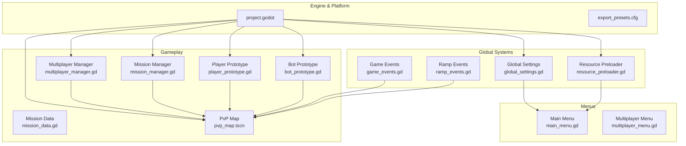

# Panoramica Progetto

<cite>
**File Referenziati in Questo Documento**
- [project.godot](file://project.godot)
- [export_presets.cfg](file://export_presets.cfg)
- [Global.tscn](file://Global.tscn)
- [global_settings.gd](file://Scripts/global_settings.gd)
- [resource_preloader.gd](file://Scripts/resource_preloader.gd)
- [main_menu.gd](file://Menu/main_menu.gd)
- [multiplayer_menu.gd](file://Menu/multiplayer_menu.gd)
- [multiplayer_manager.gd](file://Scripts/multiplayer_manager.gd)
- [mission_manager.gd](file://Scripts/mission_manager.gd)
- [mission_data.gd](file://Scripts/mission_data.gd)
- [player_prototype.gd](file://Scripts/player_prototype.gd)
- [bot_prototype.gd](file://Scripts/bot_prototype.gd)
- [pvp_map.tscn](file://Maps/pvp_map.tscn)
- [game_events.gd](file://Scripts/game_events.gd)
- [ramp_events.gd](file://Scripts/ramp_events.gd)
</cite>

## Sommario
1. [Introduzione](#introduzione)
2. [Struttura Progetto](#struttura-progetto)
3. [Componenti Principali](#componenti-principali)
4. [Panoramica Architettura](#panoramica-architettura)
5. [Analisi Componenti Dettagliata](#analisi-componenti-dettagliata)
6. [Analisi Dipendenze](#analisi-dipendenze)
7. [Considerazioni Prestazioni](#considerazioni-prestazioni)
8. [Guida Risoluzione Problemi](#guida-risoluzione-problemi)
9. [Conclusione](#conclusione)

## Introduzione
TFA Agents è uno sparatutto tattico multiplayer 2D che presenta gameplay basato su missioni, obiettivi dinamici e ambienti stratificati con altezze diverse. Il progetto enfatizza le modalità multiplayer competitive con configurazioni basate su squadre e FFA (Free For All), pur supportando anche lo sviluppo single-player e scenari tutorial. Costruito su Godot Engine 4.x, sfrutta rendering moderno, networking robusto e sistemi modulari per fornire un'esperienza scalabile e multi-piattaforma per Windows e Android.

La visione del gioco si concentra su combattimento preciso e veloce con profondità strategica attraverso la traversata tra livelli di altezza, obiettivi dinamici e sistemi di armi reattivi. La sua posizione nello spazio dei giochi competitivi è definita da comandi precisi, feedback visivo chiaro e un modello di progressione guidato dalle missioni che incoraggia sia la pianificazione tattica che i riflessi veloci.

## Struttura Progetto
Il progetto segue un'organizzazione stratificata e basata su features all'interno dell'architettura di scene e script di Godot:
- La configurazione del motore core e gli export della piattaforma definiscono il comportamento runtime e i target di build.
- I sistemi globali (impostazioni, precaricamento risorse, eventi) sono esposti tramite singleton autoload per accesso centralizzato.
- Le scene di gameplay (menu, mappe, HUD) incapsulano la logica dell'interfaccia utente e dell'ambiente.
- Gli script implementano sistemi riutilizzabili per missioni, multiplayer, AI e meccaniche di gioco.

**Diagramma fonti**
- [project.godot](file://project.godot)
- [export_presets.cfg](file://export_presets.cfg)
- [global_settings.gd](file://Scripts/global_settings.gd)
- [resource_preloader.gd](file://Scripts/resource_preloader.gd)
- [main_menu.gd](file://Menu/main_menu.gd)
- [multiplayer_menu.gd](file://Menu/multiplayer_menu.gd)
- [multiplayer_manager.gd](file://Scripts/multiplayer_manager.gd)
- [mission_manager.gd](file://Scripts/mission_manager.gd)
- [mission_data.gd](file://Scripts/mission_data.gd)
- [player_prototype.gd](file://Scripts/player_prototype.gd)
- [bot_prototype.gd](file://Scripts/bot_prototype.gd)
- [pvp_map.tscn](file://Maps/pvp_map.tscn)
- [game_events.gd](file://Scripts/game_events.gd)
- [ramp_events.gd](file://Scripts/ramp_events.gd)
